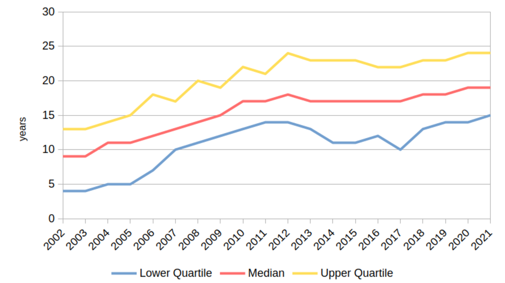
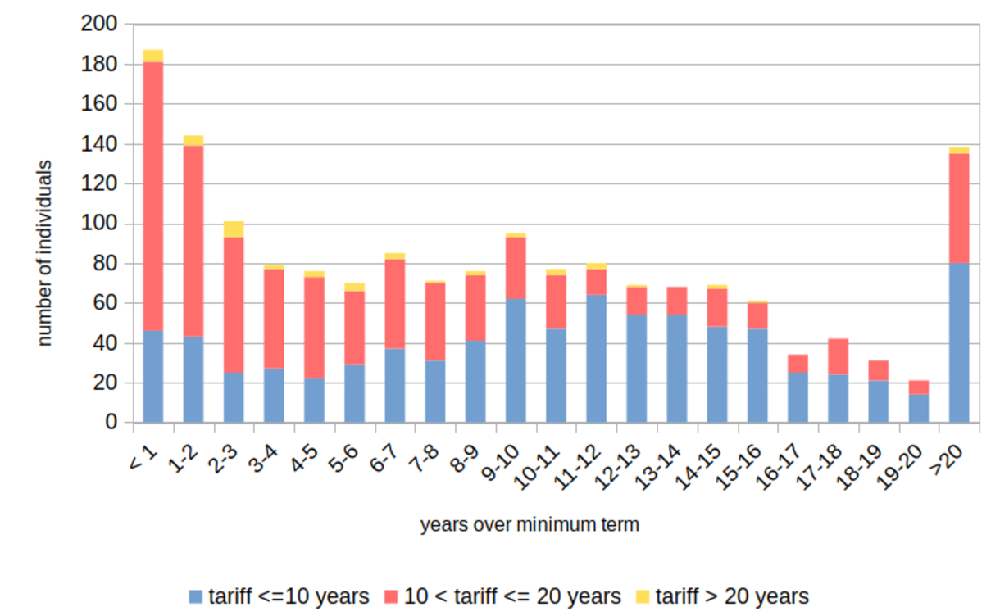

In February 2020, Ian Simms, a life-sentenced prisoner at HMP Leyhill, was preparing for release. His conviction in 1988, for abducting and murdering Helen McCourt, was one of the first in the UK secured without the victim's body having been found. DNA fingerprinting, and Simms's lies about his whereabouts when Helen disappeared, had convinced the jury of his guilt. Simms maintained his innocence throughout [@macurMcCourtApplicationParole2020], and a parole panel decided he could be safely released [@calvert-smithSecretaryStateApplication2020].

His release had a high public profile because Helen's mother, Marie McCourt, had campaigned against it for many years. Her key demand was that Simms reveal the whereabouts of Helen's body. In July 2019, Justice Secretary David Gauke had indicated support for the general principle behind this demand, and 'Helen's Law' [@ukparliamentPrisonersDisclosureInformation2020] was passed in 2020 with government support. It required the Parole Board to factor in any failure to disclose the whereabouts of victims' remains into convicted murderers' release decisions [@macurMcCourtApplicationParole2020, para. 29].

'Helen's Law' passed after Simms's release. Victims' groups called it "toothless" [@tannerNoBodyNo2020] and legal commentators castigated an "empty gesture" [@rozenbergHelenLawEmpty2020]. Mrs McCourt had established the *general* principle, but her wish was *specific*: that *Simms* should not be released without disclosing Helen's location. But even politicians could not block Simms's release. Litigation in the 1990s had established that release decisions were, in effect, sentencing decisions, and hence a judicial power strictly protected from executive interference [@padfieldTariffHumanRights2002]. The Board's release test was clear, and focused on risk; any retributive aims of the sentence were held to have been satisfied by the life sentence's 'tariff', or 'minimum term', and any moral obligations Simms might owe his victims were not the Board's concern, except insofar as they related to risk.

Although Helen's Law was not in effect, the Board *had already* carefully considered the risks posed by Simms's non-disclosure [@macurMcCourtApplicationParole2020], and both the Board's new Reconsideration Mechanism [@bbcnewsHelenMcCourtMurderer2020], and Mrs McCourt's judicial review application to the High Court were rejected, for this reason. They could have succeeded only if the Board had broken the law, acted unreasonably, or exceeded its powers: Mrs McCourt's litigation was doomed to fail from the start, as predictably as the outraged headlines which followed when, in a bitter irony, she was ordered to pay Simms's legal costs from crowdfunding she had raised [@maxwellOutrageMumForced2020]. Simms died in 2022. He had neither admitted the murder, been recalled to prison, nor disclosed the whereabouts of Helen's body [@bbcnewsHelenMcCourtMum2022]. While his name was in the headlines, it was also on the grapevine at Leyhill, where I was, at the time, interviewing lifers like him for this PhD.[^1.1]

## Prison release and moral obligation {#sec-1-prison-release-moral-obligation}

If prison release is a sentencing decision, then it is also morally communicative. By restoring liberty and citizenship (albeit in qualified forms) it confers a form of symbolic restoration, going beyond mere psychological change. Fergus @mcneillFourFormsOffender2012 [p. 32] has commented that what he calls 'moral rehabilitation' must recognise that “redemption needs to be earned”: “an offender needs to pay back before s/he can trade up to a restored social position”.

Simms, having served far more than the minimum prison term, and being highly compliant with risk management measures, *had* 'paid back', in the limited, formal sense required by the system. He presumably heard, and complied with, moral messages about the kind of person he was and ought to become, efforts recognised, symbolically, through prison release. Mrs McCourt, however, saw things differently. Only Simms could enable her to lay her daughter to rest. His formal guilt obligated him to do so, and the state, having interposed itself in her conflict with him [@christieIdealVictim1986], ought to have enforced the obligation, by imprisoning Simms pending a disclosure. From her perspective, the following assessment of Simms by the Parole Board must have seemed quite beside the point:

  > [Y]ou are now heavily invested in presenting yourself as someone […] innocent of the index offence and in avoiding any behaviour which would be inconsistent with this presentation of yourself […] we consider that there is no prospect of you disclosing the whereabouts of your victim even if we kept you in prison until you died. That view is supported by the evidence of the psychologists and is really the only sensible inference that can be drawn.
  >
  > Parole Board decision letter, quoted in @macurMcCourtApplicationParole2020 [para. 21]

To Mrs McCourt, then, Simms's release ought to have been impossible: 32 years of compliance had still not induced him to do the right thing. The state's priority (risk management) trumped her indignation over a renewed wrong.

The case encapsulates core themes which this PhD addresses empirically, and which can be summarised as follows. How is it that prisoners like Simms can insist, apparently without contradiction, *both* that their punishment is wrongful, *and* that they have taken responsibility in every sense salient to their moral rehabilitation through release? Granted, Simms's incoherent position---that he was not a murderer, and yet was responsible for managing the risks associated with his being a murderer---is not universal among lifers. But nor was it unique, as the following chapters show. A few participants in this research occupied the same position; others opted to take responsibility for their crimes and their risk, but in ways sometimes diverging quite far from the ideals of meek contrition which so dominate lay opinion.

Most fundamentally, this PhD describes and explains how these varying styles of moral responsibility are produced by a penal system in which moral communication about the offence of murder (and the obligations arising from it) can appear inconsistent, incoherent, and unmoored from public sentiment. Its empirical argument, concisely, is that lifers in the fieldwork prisons who wished to represent themselves as morally accountable faced two major demands:

  1. to reconcile themselves to the official view of them as residually dangerous; and
  2. to comply with measures aiming to manage this risk.

Yet to Mrs McCourt's chagrin, compliance with these expectations was not incompatible with a public claim of actual innocence, nor with ducking some of the responsibilities attendant on formal guilt.

## The UK and life imprisonment {#sec-1-uk-life-imprisonment}

The impressive scale of UK life imprisonment, and its centrality to criminal punishment here, mean these are important questions. Research by @vanzylsmitLifeImprisonmentGlobal2019 [pp. 340-7] shows that the UK imprisons by far the largest number of lifers in Western Europe: around a third of the continental total.

Throughout the UK, life sentences (especially those imposed for murder) increasingly involve periods in custody approaching or surpassing Simms's 32 years. @fig-1.1 plots data describing this shift. In [-@fig-1.1a] we see the inflating minimum terms deemed necessary to punish murder in England & Wales: the median grew from nine to nineteen years between 2002 and 2021. Such 'life-trashing' [@simonDignityRiskLong2012] sentences have not registered with the public, who continue to believe in an opposite shift, towards greater leniency [@mitchellExploringMandatoryLife2012; @mitchellSentencingMurderExploring2012; @robertsPublicKnowledgeSentencing2022]. Sentences are not only inflating at the front end, but also at the back. This can be seen in the number of 'post-tariff' lifers ([-@fig-1.1b]), a decent measure of how steep is the path to release. The 1,674 prisoners held over-tariff in England & Wales in late 2020 constituted 24% of the lifer population (6,954) around that time. 690 (41% of the over-tariff group) were imprisoned ten or more years after tariff expiry [@ministryofjusticePrisonSentencesQuestion2020; @ministryofjusticeOffenderManagementStatistics2021]. Excepting recalled prisoners, post-tariff lifers imprisoned in 2021 were a median of 96 months (eight years) over the minimum term [@ministryofjusticePrisonSentencesQuestion2021]. Fully 50% of the entire over-tariff population (841) originally received tariffs of ten years or less, including more than half of those still imprisoned twenty years post-tariff. On this evidence, proportionality---which links the seriousness of the offence to the severity of the sentence, a key indicator of penal legitimacy in retributive sentencing theory---is weak. Life sentences are increasingly severe *at both ends*, creating a class of extremely, even permanently, excluded citizens.

Existing research hints at the reasons. @lieblingExplorationStaffPrisoner2011, among others, raised concerns that the institutional underpinnings of sentence progression are not functioning as they should, with attitudes towards long-sentenced prisoners marked by a pervasive, dehumanising distrust. Others, such as @armstrongRiskRightsRehabilitation2020, have argued that rehabilitative practices originally intended to safeguard prisoners' rights are now increasingly rationed: under fiscal austerity, progression and intervention are available only to those who merit them. The focus has shifted, subtly: rather than upholding a right to be rehabilitated following punishment, states now 'responsibilise' rehabilitation. Prisoners' rights are not inalienable, but earned; and the impossibility of repaying the 'debt' incurred by a murder [see @ievinsFalseAccountingWhy2021] makes it particularly difficult for mandatory lifers to 'earn' rehabilitation.

:::: {#fig-1.1 .column-body-outset layout-align="center"}

::: {#fig-1.1a layout-align="center"}

Tariff inflation for murder sentences, 2002-2021

:::

::: {#fig-1.1b layout-align="center"}

Post-tariff lifers, subdivided by original tariff length

:::

The increasing 'front-door' and 'back-door' severity of life sentences in England & Wales[^1.2]

::::

As an empirical question, however, it remains unclear how lifers approach these questions as individuals. What happens to them in prison, ethically speaking? How do they hold themselves accountable? Do prisons promote accountability, and if so in what form? These are under-researched questions. Recent studies have broached the topic, but often without systematic attention to the nature of the offence or the obligations which prisoners perceive in it. The Simms case demonstrates that even a formal, compliant form of accountability can fail in other moral registers. When it comes to the release debate and the ethical worlds inhabited by lifers, 'getting the description right' [@lieblingDescriptionEdgeIIt2015] can generate a better conversation about their fitness for release. This PhD aims for such a description.

The remainder of this dissertation characterises existing research, and sets out the basis on which I contribute to it.

## Outline of the dissertation {#sec-1-outline-dissertation}

[Chapter 2](./2_literature-review.qmd) reviews existing research literature. It asks: what are 'ethical lives' and why might we consider convicted murderers to have them? It also considers what the criminology and law of murder reveal about its moral and cultural status, and what research on long-term imprisonment can already tell us about how life and long sentences affect ethical life. In reviewing existing research, it identifies sources of moral communication during a long prison sentence, and asks how life imprisonment and the life course might be related. Finally, the chapter turns to anthropological texts from which its core concept of 'ethical life' is borrowed, identifying conceptual resources to be deployed subsequently in the empirical chapters.

[Chapter 3](./3_methodology.qmd) reports on the research design and methods, the two fieldwork sites, the research questions, the sampling strategy, and the sample itself. It describes the interview and documentary data used later in the dissertation. It then discusses how the research was affected by the murder of a friend during fieldwork, at an event where I was present. This experience cast a long shadow over the project, but also sensitised me to facets of the topic I had not been keenly aware of before.

Three empirical chapters follow, each with its own theme. Chapters [4](./4_becoming-a-murderer.qmd) and [5](./5_life-and-the-life-sentence.qmd) operate in tandem. Each examines one half of the 'offence-time nexus' which @creweLifeImprisonmentYoung2020 [p. 22] theorised as the principal driver of personality change among people serving life sentences for murder. [Chapter 4](./4_becoming-a-murderer.qmd) addresses the first half (“the nature of the offence of murder”), and [Chapter 5](./5_life-and-the-life-sentence.qmd) the other (“the sheer amount of time that they have to serve”). Both use interview and documentary data to question whether the same sentence imposed for the same offence necessarily exerts the same adaptive pressures on any two given lifers. The approach used has a long history in prison sociology: it is to describe systematically prisoners' 'imported' characteristics, using the description to add texture and nuance (or sometimes, contradiction) to an earlier theorisation in which imprisonment 'flattens' difference and exerts consistent effects. For the present sample, both 'the nature of the offence of murder' and 'the sheer amount of time they had to serve' were quite variable, experientially speaking. This, I show, affected how they perceived the conviction and the sentence.

[Chapter 6](./6_risk-and-self-governance.qmd) considers how the prison classified lifers: not as individuals with lives, ethical commitments, and biographies, but instead into categories of 'lower', 'middling' and 'high' risk. This had consequences for the intensity, style, and character of penal intervention (and of moral communication). I begin by describing how documents reviewed in the two fieldwork prisons constructed prisoners as 'risk subjects' [@hannah-moffatMoralAgentActuarial1999; @hannah-moffatCriminogenicNeedsTransformative2005], and communicated with them about risk. From there, I construct accounts of the distinctive moral climates evident in the two fieldwork prisons, and show that these represented distinctive styles of governance. I then develop a typology of ethical responses to risk governance.

Finally, the threads are drawn together in [Chapter 7](./7_conclusions.qmd). It revisits the questions raised by the Simms case, examines the limitations of the study, and considers what the research findings might mean for future academic research in this area, and public penological discourse more generally.

## References {.unnumbered .sectionbibliography}

::: {.sectionrefs}
:::

[^1.1]: Throughout this thesis, I refer to life-sentenced prisoners as 'lifers', for brevity, and because this is the term participants in this research most commonly used to identify themselves as a group. Simms did not participate in this research.

[^1.2]: Data from parliamentary questions [@ministryofjusticePrisonSentencesQuestion2020; @ministryofjusticeLifeImprisonmentQuestion2022j].
