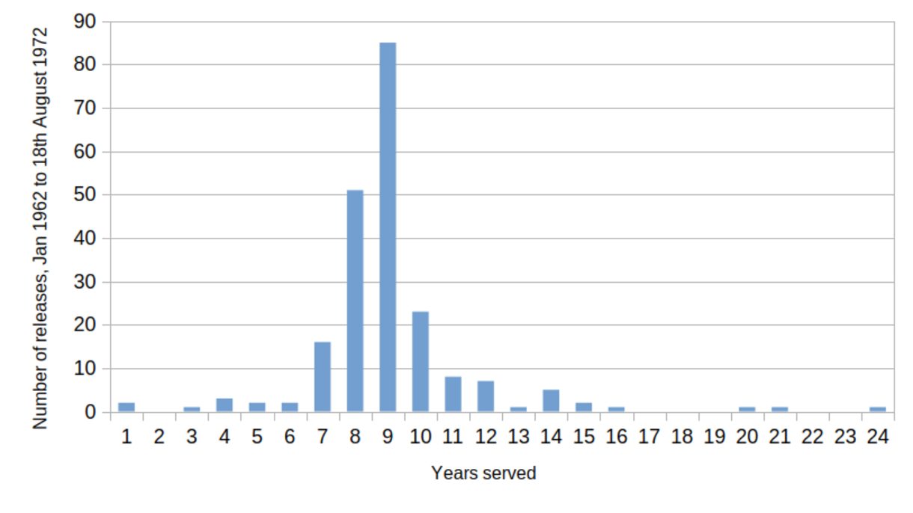
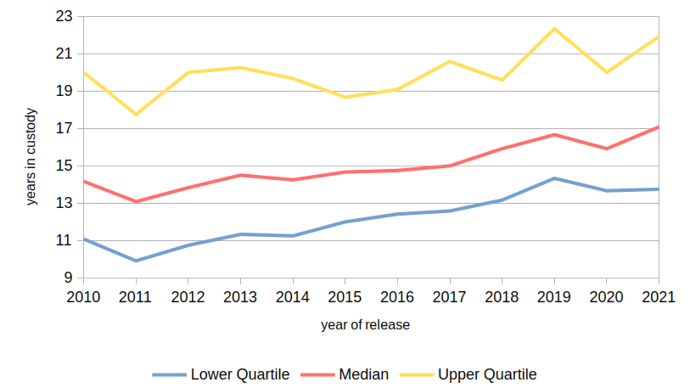
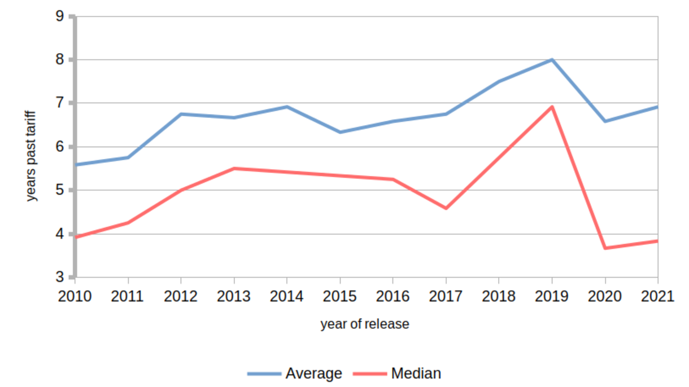

[Chapter 1](./1_introduction.qmd) suggested that the moral communication prisons engage in with prisoners diverges from that which members of the public and survivors of serious crimes *expect*. The Simms case can be understood as an example of penal policy becoming detached from the moral values it purports to enforce. It raises an overarching question: how and why did this come about? This chapter seeks answers in existing literatures, guided by three further enquiry questions:

  1. What are the moral meanings of 'murder'?
  2. Are they communicated to prisoners by life imprisonment, and if so how?
  3. What part does this communication play in their ethical lives?

@sec-2-murder-law-society reviews evidence about the legal and sociological categories of murder and homicide.[^2.9] It describes how a morally variable---though invariably serious---offence receives a single penalty which flattens out its variability. Then, @sec-2-evolving-character-life-long-term-imprisonment-england-wales asks how the penalty---a life sentence---has evolved since it became mandatory in the 1960s, seeking answers in the *form* (as distinct from the *content*) of the sanction. Third, @sec-2-lti-literature steps into the long-term prison as a setting for human life. Past and present research on long-term and life imprisonment are reviewed, drawing out how these sanctions might influence prisoners' ethical lives, generally or in relation to a specific offence.

These materials are then synthesised in @sec-2-concepts-practices-ethics, which brings them into dialogue with the anthropology of ethics---which, I argue, can help us understand how the messages 'spoken' by imprisonment and those 'heard' by prisoners can be made sense of.

Since moral reflexivity has only recently become an explicit topic of investigation, the first task is to introduce the concept of 'ethical life'.

## What is 'ethical life'? {#sec-2-ethical-life}

According to James @laidlawFaultLinesAnthropology2017 [p. 188], a significant figure in anthropology's “ethical turn” over recent decades,[^2.2] 'ethics' arises from the human capacity for self-interpretation, and “the fact that the self-descriptions this process gives rise to are necessarily evaluative”. Ethical life involves reflexivity, self-representation, and self-evaluation, and forms of 'work on the self' which connect self-representation with desired patterns of selfhood.

In *Ethical Life*, Webb @keaneEthicalLifeIts2016 examines psychological and anthropological research on the origins of ethics. Psychology shows us that the capacity for ethical thinking arises in early childhood: in the capacity to intuit other people's evaluations of oneself by comparing first- and third-person representations of particular behaviours [-@keaneEthicalLifeIts2016, chap. 3]. For example, a child who refuses to share a toy might encounter disapprobation, inferring thereby that sharing is 'good' or desirable. Crucially, though, ethics is *not only* innate and developmental; were it so, representations of 'the good' would be cultural universals. Anthropological research shows that while the *capacity* for ethics may be innate, its *expressions* are embedded in culture, and thus spatially and temporally contingent [-@keaneEthicalLifeIts2016, chap. 5]. Social identity and cultural belonging affect how we *apply* the sense of ethical obligation, shaping (for example) whether obligations are felt to self, kin, co-religionists, nation, species, or sentient life [to name but a few----@keaneEthicalLifeIts2016, 177-180].

Put simply, most people have some notion of what would be 'good' in themselves and the world, and feel obligations towards at least some others. These ideas will consistently influence their conduct; but the groups and obligations will be contingent. Ethical life is therefore also open to change. Encounters with new representations of 'the good', or with people beyond an in-group who solicit moral attention, might bring existing commitments and relationships into question. Altered ethical beliefs might be difficult to translate into practice, if doing so means relinquishing commitments which have been constitutive of identity, or have provided material or ontological security. Conversely, enacting ethical change might be easier, if a moral or personal crisis has already revealed an earlier mode of ethical thinking to have been mistaken, inadequate, or outmoded [@zigonMoralBreakdownEthical2007].

An ethical lens has two consequences for how material in the rest of this chapter is treated. First, it focuses attention on the moral messages prisoners encounter about *who they are* and *whom they ought to become*. Partly, these consist in formal censure: the labelling and sanctioning of offences and people as 'bad' or 'wrong'. But other messages are also implicated. Imprisonment communicates *intentionally* and *vertically* via incentives, via rehabilitative intervention, and via the allocation of outcomes such as progression and release. But it also communicates *unintentionally* and *horizontally*, via the norms of prisoner culture, and via expectations communicated by staff not formally tasked with delivering censure or addressing offending behaviour. Though the sentence derives from a specific offence, not all (or much) of this communication necessarily centres on it; much of it is informal and indirect. A cultural lens, derived from moral anthropology, helps grasp this complexity.

Second, an ethical lens entails a focus on human particularity. Long-term imprisonment (hereinafter, LTI) does not create selfhood, but distorts and remoulds it; long-term prisoners' (hereinafter, LTPs) biographies, including those parts they are sundered from, provide the materials. Previous biography shapes a person's susceptibility, both to censure and to incentives. Not only the offence, but also the life course, will affect how moral messages are received.

Thus, two types of evidence will be particularly examined in this literature review: evidence about intended and unintended moral communication; and evidence about how this might be mediated by the life course.

## Murder in law and society {#sec-2-murder-law-society}

This section appraises the moral meanings of murder in legal and sociological texts. It develops the point that what is understood as a uniquely and consistently serious offence, is in fact morally quite variable, and (crucially) highly likely to be perceived differently by different observers.

### Murder as a legal and moral category {#sec-2-murder-legal-moral-category}

  > [Murder is] when a person of sound mind and discretion, unlawfully killeth any reasonable creature in being, and under the king's peace, with malice aforethought either express or implied.
  >
  > Edward Coke (1648), quoted in @modernisingjusticeCaseReviewLaw2018 [para. 5.1]

Murder in England is still defined by reference to Coke's seventeenth-century commentary on uncodified common law. Definitionally, it is broad and imprecise: the *actus reus* can be either an act or an omission; the *mens rea* is satisfied by an "express or implied" intention *either* to kill *or* to cause serious harm. Neither ill-will towards the victim nor premeditation are necessary to convict. These points and others are poorly understood among the general public, leading to the suggestion that "[t]he law of murder is […] enveloped in confusion, myth and misunderstanding"; it is "a contentious area […] that politicians are scared to approach" [@modernisingjusticeCaseReviewLaw2018, para. 21.3].

#### Varied wrongs, uniform penalties {#sec-2-varied-wrongs-uniform-penalties}

Since 1965, when capital punishment was suspended pending abolition [@ukparliamentMurderAbolitionDeath1965], the penalty for murder has been a mandatory life sentence. Judicial discretion to adjust it by varying the minimum prison term (or 'penalty phase', or 'tariff') has been constrained by statute since 2003. The 'starting points' [see @ukparliamentSentencingAct2020, sch. 21] sentencers must now use, and the examples of aggravation and mitigation cited in statute, make important distinctions between more and less 'serious' murders. For current purposes,[^2.16] we can simply note the grey areas: 'seriousness' is not always determined by observable facts, nor by the actions of the accused, and the law permits people to be blamed for factors not under their direct control.

Amendments to the sentencing provisions since 2003 have consistently inflated tariffs,[^2.12] under pressure from campaigners who follow a well-established pattern of argumentation via selective comparison: between the lighter tariffs allocated to murders they wish to see more severely penalised, and the heavier tariffs allocated to murders they perceive to be equally harmful.

These comparisons are predicated on the *harmfulness* of murder, not its *wrongfulness*, an important distinction in retributive penal theory. At its simplest, it identifies the difference between a setback to one's interests (a harm), and a particular kind of setback *experienced as an attack*: for example, against one's property, or one's person, or one's rights. Wrongs may be perceived whether a setback was inflicted intentionally or carelessly, though this affects the appropriate degree of blame:

  > …a victim of criminal homicide or wounding suffers essentially the same harm as does someone who dies or is injured in an accident, or from natural causes […] [If] I have been injured [or] my property has been destroyed, I see this as a harm. If I later discover that this was the effect, not of natural causes or a wholly non-culpable accident, but of another's reckless or negligent conduct, I realise that I have been wrongfully harmed […] [though] the harm remains the same. The difference is that I can now attribute that harm to the agent who caused it, as being "her fault" and something for which I can hold her responsible.
  >
  > @duffHarmsWrongs2001 [p. 21]

Most importantly, wrongs produce demands for accountability: *some other person ought to answer* for the harm.

Set against the harms of murder---massive, irreparable, permanent, and uniform between cases---these distinctions might appear beside the point. To the family of a murder victim, harm might be the major (or only) salient dimension of the event, leaving no obvious reason to care about wrongs. Homicide does not merely infringe rights or damage interests: it *physically negates* human beings, forcing grief and trauma through their networks. This may be why murder so often attracts the ultimate penalties a given society permits: the expectation not to be killed violently is surely a minimal precondition of civilised life in any well-functioning political community. It follows, both, that not to kill others is a fundamental obligation of citizens, and that its enforcement is a fundamental duty of good government.

So the hefty abstract category 'murder' describes real acts which *are* all truly harmful, but *are not* all equally wrongful; yet this may matter little to those most affected. This more or less guarantees specious comparisons, exacerbated where (as in England) there is a single definition of murder, and an undifferentiated punishment.

#### The victim-offender dyad {#sec-2-victim-offender-dyad}

Understandings of how and why murder is wrongful also depend on context, motive, and the relationship between those involved [@wilsonWhatWrongMurder2007, p. 160]. Disparities of power and vulnerability between offender and victim independently alter perceptions of 'wrongfulness': where (for example) the victim was a child, or elderly, or female, public attitudes research shows that the crime is often perceived as considerably 'worse' than if both victim and offender were young men fighting [@mitchellExploringMandatoryLife2012, pp. 93-103]. Imputed motive can also affect things similarly. This matters because, again, not everything which makes a murder 'serious' relates to factors under the control of the accused.

#### Summary {#sec-2-murder-legal-moral-category-summary}

In practice, then, the English law of murder is "a mess" [@thelawcommissionPartialDefencesMurder2004, para. 2.74] because it fails to separate more and less wrongful killings. By lumping them into a single broad category, and mandating a life sentence as the punishment, it guarantees specious comparisons between unlike killings, based on the false equivalence of equal harmfulness.

Two points follow. First, the single penalty for murder elides meaningful distinctions between less and more serious offences. Second, this makes it probable that people convicted of murder might find their own evaluations of 'seriousness' diverging from how the law sees matters. They might identify morally salient features which (they believe) ought to recalibrate blame. Differences of outlook probably reflect what seems normative in the subject's life. @sec-2-homicide-murder-empirical-categories develops this idea, arguing that murders, as well as being more or less 'serious', can also be more or less 'ordinary', with consequences for their meaning.

### Homicide and murder as empirical categories {#sec-2-homicide-murder-empirical-categories}

Homicide "is incredibly diverse and it is not possible to explain its many manifestations with one theory or theoretical discipline” [@brookmanUnderstandingHomicide2021, p. 53]; thus, social-scientific theory on this topic is as poorly integrated as the law. In this section, patterns in the *incidence* of murder are the topic. There are four interrelated patterns to unpack.

#### Gender {#sec-4-homicide-murder-empirical-categories-gender}

First, perpetration and victimisation patterns are strongly gendered. In the eleven years to March 2021, an annual average of 93% of convicted murderers were men, and 7% women. 69% of murder victims over the same time period were men, and 31% were women [calculated from @officefornationalstatisticsHomicideEnglandWales2021, data worksheets 17 and 25]. Around 60% of homicides in England & Wales are male-on-male, and around a third male-on-female; female-on-female offences are rare. The rate of female victimisation has been in steady decline since about 1980, when male-on-male and male-on-female murders were in rough parity [@morganTrendsDriversHomicide2020, fig. 4].

#### Age and ethnicity {#sec-4-homicide-murder-empirical-categories-age-ethnicity}

Second, homicides are patterned by age and ethnicity. Fully 82% of homicides have a principal suspect aged 16-44, with nearly half of these (37%) aged 16-24 [@officefornationalstatisticsHomicideEnglandWales2021, worksheet 28]; those by older offenders are, as with most crimes, unusual. Most murders are intra-ethnic crimes. As @tbl-2.1 shows, Black people are over-represented amongst both offenders and victims, while White people are under-represented (less starkly).

::: {#tbl-2.1}

+-----------+---------------------+--------+----------------------------+
| Ethnicity | % of convicted      | % of   | % of general population    |
|           | principal suspects  | victims| (mid-2016 estimate)        |
+:=========:+:===================:+:======:+:==========================:+
| White     | 68                  | 67     | 85                         |
|           |                     |        |                            |
+-----------+---------------------+--------+----------------------------+
| Black     | 18                  | 16     | 3                          |
|           |                     |        |                            |
+-----------+---------------------+--------+----------------------------+
| Other     | 13                  | 13     | 11                         |
|           |                     |        |                            |
+-----------+---------------------+--------+----------------------------+
| Unknown   | 1                   | 4      | not reported               |
|           |                     |        |                            |
+-----------+---------------------+--------+----------------------------+

Homicides by ethnicity in England & Wales, 2019-2021[^2.1]

:::

#### Socio-economic circumstances {#sec-4-homicide-murder-empirical-categories-socio-economic-circumstances}

Third, homicide is strongly patterned on victims' and offenders' socio-economic circumstances.  Between 2008 and 2019, over half of both groups were unemployed. Manual work predominated among those who worked; only around a fifth of offenders and victims were in non-manual jobs [@brookmanUnderstandingHomicide2021, p. 31]. However, this patterning is less pronounced with gender-based violence: men who kill women are less likely to have histories of adversity and social exclusion than men who kill men, and are more likely to be employed/highly educated [@dobashOutBlueMen2009; @dobashWhenMenMurder2015, chap. 4].

#### Substance misuse and the illicit economy {#sec-4-homicide-murder-empirical-categories-substance-misuse}

Finally, there are strong links between homicide and substance misuse, whether directly through intoxication, or indirectly (and increasingly) through behaviours associated with the illicit economy. Around a third of homicide victims and offenders in England & Wales in 2020/21 were under the influence of drugs or alcohol. Add in homicides associated with drug *markets*, and more than half (52%) of all homicides during the year to March 2021 had some connection with substance misuse, up from 36% in 2009 [@officefornationalstatisticsHomicideEnglandWales2020, section 8; @officefornationalstatisticsHomicideEnglandWales2021, section 7]

#### Summary---'ordinary', 'extraordinary', 'fathomable', and 'unfathomable' homicides {#sec-4-homicide-murder-empirical-categories-summary}

'Ordinary' homicides, then, occur between young, socio-economically marginal, often unemployed, and often non-white men. 'Ordinary' victims are men similarly situated, and known to the offender at least as an acquaintance. Both parties are more likely than not to either be intoxicated, or to trade in drugs. They may use violence to solve problems, often in public settings, and hence will sometimes be known (and know themselves) for doing so. Less frequent, but still common, are killings of women by men. A domestic setting often conceals these patterns, perhaps facilitating a certain denial or refusal to identify with the violence involved.

'Ordinariness' is important in that it influences how and when violence can appear *morally intelligible* to third parties, even if it in no way appears *right*. 'Ordinary' homicides are rooted in patterns of interpersonal conflict which fit with established cultural scripts. By contrast, 'extraordinary' homicides are not merely less common, but also fit these scripts poorly. Offender and victim might be socioeconomically and/or ethnically distant, or so mismatched in power and vulnerability that the offence does not 'read' as interpersonal conflict. Such offences are more likely to appear 'random', 'predatory', 'inexplicable', or 'unprovoked'. Motive can also render a homicide 'extraordinary'. For example, prejudice, or sexual, financial, and sadistic motives, appear to break the moral imperative, most associated with Immanuel @kantGroundworkMetaphysicsMorals2018, not to *use* other people as the means to an end [see @kersteinTreatingPersonsMeans2023].

The suggestion taken forward here is that the empirical 'ordinariness' of homicides might be linked to their perceived 'moral seriousness', in ways the law might not reflect. Their seriousness is in the eye of the beholder (e.g. judges, journalists, victims, members of the public), and will depend on the degree to they find the violence involved 'fathomable': that is, attributable to some intelligible (if unwarranted) motive. 'Fathomable' homicides, on this view, signal *ethical* deficiency; 'unfathomable' homicides signal *ontological* deficiency, bringing stronger and more 'staining' [@ievinsStainsImprisonmentMoral2023] sentiments and labels into play. 'Unfathomable' offences might particularly signal risk, since if actions appear unreasonable, they are also more likely to seem *caused* by dangerous forces within the actor, beyond their control or understanding.

### Summary {#sec-2-murder-law-society-summary}

Four interconnected insights emerge from this discussion. First, as a legal category, murder is incoherent, and its moral meanings are nuanced. Second, the perception that it is a consistently 'serious' crime derives more from its harmfulness than its wrongfulness. Third, the criminal law flattens and homogenises murders, partly because enforcing a strict general proscription against killing legitimates its very existence. Fourth, wrongs exist in the eye of the beholder, and intensify if unintelligible. How 'fathomable' a murder might be will vary according to who makes the evaluation, due to the flattening tendencies outlined in @sec-2-murder-legal-moral-category.

## The evolving character of life and long-term imprisonment {#sec-2-evolving-character-life-long-term-imprisonment-england-wales}

Having noted the variable meanings of murder, this section examines the penalty in more depth. What does the UK's use of the mandatory life sentence reveal about its relationship with those it convicts of the crime? What moral communication inheres in the form of the sentence? As the sentence has evolved since it became mandatory, an overview of its development is the first step.

### From the 1960s to the 1990s {#sec-2-evolving-character-1960s-1990s}

In the UK, the creation of the mandatory life sentence [@ukparliamentMurderAbolitionDeath1965, sec. 1(3)] aimed to ensure that a justice system no longer prepared to execute murderers held public confidence. But at first, the sentence was not yet the profoundly exclusionary sanction it later became.

#### The norm of a decade in prison {#sec-2-evolving-character-decade-prison}

By today's standards, the normative life sentence involved relatively short periods, with, in most cases, an expectation of release after about a decade. As @fig-2.1 shows, lifers released between 1962 and 1972 had served an average of 9.1 years, and only three of 212 had served more than twenty.

The readiness to release was not prompted by rehabilitative optimism, which was by then in steady if not terminal decline [@baileyRiseFallRehabilitative2019]. Rather, it reflected pragmatism, and what might loosely be termed a liberal understanding of citizenship. The @acpsRegimeLongtermPrisoners1968 [para. 157], in an influential report, recognised that many lifers were not recidivists, that most would commit no further serious offences, and that few required high-security imprisonment. Just two subgroups were expected to serve extremely long and explicitly incapacitative custodial terms: serial violent recidivists, and a small minority of lifers—chiefly the "very abnormal killers of small children or women" and “some sexual offenders”—whose safe release could not be assured [-@acpsRegimeLongtermPrisoners1968, paras. 6, 16, 158]. Questions of risk were balanced against rights and individual autonomy.

#### Pragmatic, liberal implementation {#sec-2-evolving-character-pragmatic-liberal-implementation}

The life sentence at this stage was certainly retributive, in that it imposed deprivations to punish wrongdoing. But it also did something to rehabilitate most lifers, in the *judicial* and *legal* sense of restoring them to former status, rather than the *psychological* sense of imposing demanding forms of treatment [for more on these distinctions, see @burkeReimaginingRehabilitationIndividual2019; @mcneillFourFormsOffender2012]. Prisons aspired to provide options, trusting that prisoners would see the sense in taking these up [see @acpsRegimeLongtermPrisoners1968, paras. 81-82].

::: {#fig-2.1 layout-align="center"}

Time served by life-sentenced murderers at release, 1962-72[^2.10]

:::

Situational obedience and 'orderliness' were the demands, not psychological performance. Long-term custody was neither permanently exclusionary, nor 'tightly' interventionist and 'neo-paternal' [see @crewePrisonerSocietyPower2009, table 4.1; @creweDepthWeightTightness2011], but flexible, pragmatic, and inclined to appeal to prisoners' better natures. This situation persisted until the 1990s.

#### Stimuli for change {#sec-2-evolving-character-stimuli-change}

Matters changed under two influences. First, a series of politically humiliating incidents in long-term prisons catalysed new approaches to prison management [@learmontReviewPrisonService1995; @lewisHiddenAgendasPolitics1997; @lieblingPrisonsTheirMoral2005; @woodcockReportEnquiryEscape1994; @woolfPrisonDisturbancesApril1991]. Second, sentencing changes exerted an increasing influence. 'Penal bifurcation' was well-established by the 1990s, whereby the UK began to deal more severely with violent and 'dangerous' offenders, while favouring more diversionary and supportive interventions with others [@bottomsReflectionsRenaissanceDangerousness1977; @bottomsDangerousnessDebateFloud1982; @bottomsDangerousnessRights1983a; @guineyMarginalGainsDiminishing2019]. Public attitudes towards crime and criminality also hardened, demanding that governments *control* these social ills [@garlandCultureControlCrime2002]. These factors tended towards incapacitation, but went along with a political trend, 'populist punitiveness' [@bottomsPhilosophyPoliticsPunishment1995], which was more retributive: politicians fought elections by promising to 'crack down' on offenders.

The result was an unrelenting and illiberal drive for security and control, which often used retributive language, but which, in its parallel commitment to incapacitation, undermined retributivist principles of parsimony and proportionality. Under these influences, life and LTI in England & Wales underwent both qualitative and quantitative changes, becoming quite distinctive in form.

### Since the 1990s {#sec-2-evolving-character-since-1990s}

#### Quantitative evidence---front- and back-door severity {#sec-2-evolving-character-quantitative-evidence}

Quantitatively, the change plainly relates to severity. @fig-2.1 noted the early norm of release within ten years. As Chapter [-@sec-1-uk-life-imprisonment] showed, the median tariff for a life sentence still stood at 9 years in 2002, but had reached 21 years by 2021 [@mitchellExploringMandatoryLife2012; @prisonreformtrustLongtermPrisonersFacts2021]. @fig-2.2 shows how drastically this translated into time actually served: a median of 17.0 years by 2021 ([-@fig-2.2a]) and an increasing average of time served *after* the tariff ([-@fig-2.2b]). Two points emerge. First, life and long sentences have become far more destructive of prisoners' lives, simply through temporal weight. Sentence inflation is operative at front and back doors, with lifer releases often highly controversial [@annisonPopulismConservatismPolitics2022; @guineyParoleParoleBoards2023]. Second, the terms on which freedom is restored after release are more complicated, qualified, and conditional. The logic of incapacitation makes prison release politically awkward---why take chances?---with risk management and public safety seeming to overwhelm objections based on proportionality and individual rights.[^2.8] Parole is derided in some quarters, as the remnant of a naïve, incautious, and elitist past.

:::: {#fig-2.2 .column-body-outset}

::: {#fig-2.2a layout-align="center"}

Average time served at release

:::

::: {#fig-2.2b layout-align="center"}

Average time served after tariff

:::

Time served by lifers released between 2010 and 2021[^2.11]

::::

#### Qualitative evidence---risk and the 'new penology' {#sec-2-evolving-character-qualitative-evidence}

Shifts in the form of life and LTI can also be read from qualitative evidence, specifically on the key concept of risk. By the early 1990s, @feeleyNewPenologyNotes1992 [p. 470] suggested that a 'new penology' was “shift[ing] away from trying to normalise offenders and toward trying to manage them”; it was incapacitative, not rehabilitative. @robinsonLatemodernRehabilitationEvolution2008 later argued that in the UK, this development marked not *the end* of rehabilitation, but rather its *mutation*, into a distinctive 'late-modern' form. It was utilitarian and managerial, in that it justified rehabilitation as a means to an end (reduced reoffending), and valued efficacy ('what works?') over justice ['what's fair?'---see @mcneillWhatWorksWhat2009]. It treated rehabilitation *not* as an entitlement of rights-bearing citizens, but as an earned privilege, and it rationed or withheld intervention under austere rubrics emphasising offenders' lesser eligibility [@benthamPanopticonInspectionHouseContaining2011; @sparksPenalAusterityDoctrine1996] and the retributive necessity of 'hard treatment' [@duffPunishmentCommunicationCommunity2003; @matraversDuffHardTreatment2011]. This deflected objections that prisoners are owed recognisance of their dignity or their civil rights. The onus shifted: from whether the state was compliant with its rights duties, to whether prisoners deserve rights protections [@armstrongRiskRightsRehabilitation2020]. Significantly, the *non-criminogenic* needs of prisoners become an irrelevance: there were no public benefits, only costs, to addressing them.

The censure enacted here was not 'spoken' by the material conditions of long-term prisons, which are now generally far better than when the life sentence became mandatory. Rather, it 'speaks' through a *permanent reduction of status*: social exclusion fully backed by state power, so damaging as to represent an ending of prisoners' former lives. In its permanent civil demotion, the life sentence resembles an imposed disability. Its *form*---rather than simply its *content*---is communicative. It suspends and removes rights, breaks relationships, constrains and polices autonomy, and proclaims reduced status. Yet as described thus far, its communication is also blunt and generic: we have no sense of how communication with specific individuals about their specific offences occurs. [Chapter 6](./6_risk-and-self-governance.qmd) considers this empirically. Here, @sec-2-evolving-character-moral-communicators considers the penal contexts for moral communication, who engages in it, and what that suggests about its likely content.

### Moral communicators {#sec-2-evolving-character-moral-communicators}

English prisons are often, as @mjalandAbsencePresenceOffencePrisons2022 have suggested, strangely coy in their handling of the offence itself. It is a kind of “absence-presence”: criminal convictions are universal among sentenced prisoners, and yet are directly addressed only in selected settings. Which ones?

Moral communication is most explicit and direct when the sentence is pronounced. Judges are required to deliver remarks with the technical function of simply explaining the sentence. Although they approach the task differently, sentencing remarks are sometimes moralistic and condemnatory [@hawker-dawsonPenalCommunicationCrown2022], and at other times technical and bureaucratic. The sentencing hearing also ritualises condemnation: it entitles victims to a voice (though not a choice about the sentence). There is a good deal of evidence that sentencing hearings fail in their aim of communicating censure, since many prisoners simply do not remember what was said about them [@creweLifeImprisonmentYoung2020; @schinkelPunishmentMoralCommunication2014], and do not routinely receive a copy of the remarks [@houseofcommonsjusticecommitteePublicOpinionUnderstanding2023].

Afterwards, while punishment is *delivered*, moral communication about the offence becomes "oblique" [@garlandPunishmentModernSociety1991, p. 186]. Some is unspoken: prison staff who feel strongly typically prefer not to deal in open condemnation, for practical and professional reasons [@ievinsStainsImprisonmentMoral2023]. Some is unintended, deriving either from official treatment which carries implicit or thoughtless indifference [@crawleyHiddenInjuriesResearching2005], or explicit disregard [@seedsDeathPrisonEmergence2022]. Some comes from unofficial sources, most obviously prisoners, who often consider certain kinds of offence beyond the pale. Space is short for a full review, but two points are particularly noteworthy: a very strong general tendency among prisoners (as in mainstream culture) to abhor sexual offences, offences against children and vulnerable people, and (less consistently) violence against women [e.g. @cohenPsychologicalSurvivalExperience1972; @faccioDiscursiveChainsHow2020; @kotovaNavigatingMoralDimensions2022; @sparksPrisonsProblemOrder1996]; and second, a tendency for these patterns to be less pronounced, and more subtly expressed, in areas where people with dishonoured offences are numerically concentrated [since sociologically, it is not generally majorities who face ostracism---see @blagdenTheyTreatUs2016; @ievinsStainsImprisonmentMoral2023; @mathiesenDefencesWeakSociological2012; @perrinItSortReaffirmed2018]

*Official* and *intentional* moral communication which addresses specific offences and the obligations arising from them, and which directly articulates *the reasons for punishment*, is therefore largely the preserve of specialists. It is mediated through the central concept of risk, which is assessed and managed via a range of practical interventions.

#### Offending behaviour programmes {#sec-2-risk-offending-behaviour-programmes}

Broadly, there are two major styles of accredited offending behaviour programmes [henceforth, 'OBPs', see @csaapCurrentlyAccreditedProgrammes2019; @OffendingBehaviourProgrammes2022]: lower-intensity courses with a cognitive-behavioural approach, and more intensive therapeutic interventions, generally focused on higher-risk offenders. The latter take a deeper and more holistic approach, often focused on early childhood, to inquire into how participants developed a predisposition to violence. Both forms of intervention examine the offence, but to differing degrees of psychological 'depth'.

OBPs are scarce (and rationed), and not all prisoners experience them identically (or at all). The 'responsivity' principle [@bontaPsychologyCriminalConduct2017] means that only those believed likely to 'respond to' an intervention—that is, to experience a reduction in their risk—will be referred for one [@hminspectorateofprobationRiskNeedResponsivityModel2020; @lesterRiskNeedResponsivityEnoughExamining2020]. Two prisoners with similar histories, experiences and offences thus might not be equally intervened with if for some other reason (e.g. age) they are not assessed as being of equivalent risk. Similarly, the 'need' principle means that only 'criminogenic' needs—those associated with risk, rather than merely those which occasion suffering, or guilt, or shame—are certain to attract intervention and support.

#### Forensic psychologists {#sec-2-risk-psychologists}

Forensic psychologists exert power over prisoners because they are gatekeepers and arbiters, with substantial influence over progression and release decisions [@shinglerTheirLifeYour2020]. Based on their assessments, intervention can be intensified or withheld; sentence progression and release can be recommended or denied; situational controls on relationships can be implemented or lifted; and so on.

Many are deeply aware of this kind of power, and uncomfortable about wielding it.  @warrForensicPsychologistsPrisons2021 has described the 'dual relationship' between psychologists and prisoners: psychologists are required to control and assess risk, and sometimes to impose restrictions, but this works best through strong relationships and trust. This can feel to prisoners like trust is used to solicit information, which is then used in a way that feels like betrayal. Warr's 'duality' goes beyond a mere tension between care and control: it can be ethically compromising for both sides [@shinglerTheirLifeYour2020; @shinglerPsychologistsQuietOnes2020; @warrAlwaysGottaBe2020], with incentives towards performativity pushing against prisoners' sense of personal integrity, and psychologists pushed into behaviour that feels to them like double-dealing.

Less obviously, the power to allocate or withhold OBP participation---the means by which risk is reduced---communicates moral recognition, in the form of an implicit message that a person's risk (or needs) are *worth bothering with*. @creweTightnessRecognitionPenal2021 have shown that risk assessments leading (or not) to treatment can bring about different reactions. Some prisoners feel objectified, controlled, or manipulated; others long to be brought under the prison's disciplinary control; others operate in different moral registers and seek to bypass or replace, rather than confronting or complying with, the prison's moral standards [see @ievinsStainsImprisonmentMoral2023, 62, on 'the redeemed'].

#### Day-to-day communication---risk practice in practice {#sec-2-day-day-communication}

In theory [e.g. @ministryofjusticeManageCustodialSentence2018; @ministryofjusticeSecurityCategorisationPolicy2021; @nationaloffendermanagementservicePSI1920142015a], risk practice coordinates the roles of several professionals. Psychologists formulate and assess risk; Prison Offender Managers (POMs) design and implement individualised sentence plans; OBP staff challenge prisoners' attitudes, thinking, and behaviour, and impart the 'skills' of self-management; prison officers carry out one-to-one keywork sessions, monitor compliance, and ensure that prisoners understand and work towards agreed objectives.

In practice, though many of these expectations go unmet. A recent inspectorate report [@hminspectorateofprobationOffenderManagementCustody2022] found risk provision to be compromised by staffing problems, causing concern over the accuracy, relevance, and utility of assessments [see also @shinglerTheirLifeYour2020]. Sentence planning was neglected, because POMs were required to service the urgent demands of the parole process (which takes place on a statutory cycle), not the less pressing requirements of earlier-stage prisoners. Keywork was often disconnected from offender management, involving little more than "basic welfare checks" [@hminspectorateofprobationOffenderManagementCustody2022, p. 7]. There was long-standing concern over the lack of diversity among offender management staff; a preponderance of young white women, particularly among psychologists, has been identified as a factor leading prisoners to feel morally judged by people lacking insight into the circumstances of their lives, and hence (as prisoners see it) moral standing to make the judgement.

For prisoners, risk assessments using inaccurate, out-of-date information, and lacking face-to-face contact, can appear capricious and performative. There are also inherently and unavoidably high rates of 'false positives' in individual violence risk assessments. This, combined with the weight of responsibility involved—high-profile failures can have terrible consequences including for the assessor—means that assessors face powerful anti-ethical incentives to be overcautious, at prisoners' expense [@roychowdhuryViolenceRiskAssessment2014].

#### Moral communication through risk {#sec-2-moral-communicators-summary}

Risk practice has been described, based on empirical evidence, as being *painful*, in a distinctively 'tight' way [because it entangles and harnesses the self in demands and expectations, see @creweDepthWeightTightness2011]. This characterisation, however, was developed before interventions came to be so tightly rationed, to manage/suppress demand. Subsequent work has begun to suggest that as 'firefighting' and on-the-fly adjustment [@shinglerRiskAssessmentInterviews2018] have taken hold, just as much may be communicated by the *failure* to intervene, as by the opposite [@creweTightnessRecognitionPenal2021]. Both 'tightness' and 'looseness' are painful.

As a result, the moral communication occurring through risk is hard to describe clearly. Despite the Inspectorate's concerns summarised in @sec-2-day-day-communication, there are examples of excellent practice, in which risk practitioners form powerful and highly constructive relationships with prisoners, who in turn appraise intervention as legitimate [@lieblingAreHopePossibility2019]. This may be more likely in spaces of intensive intervention (such as PIPE units or high-security) where risk and resources concentrate, and hence demand is met, but we lack structured empirical evidence on this front.

With risk specialists as with 'ordinary' prison officers, there may also be a basic level of professional competence required for prisoners to perceive 'bureaucratic legitimacy': to feel justly handled, and able to take their own futures and selfhoods in hand [@autyExploringRelationshipPrison2020; @creweStaffPrisonerRelationshipsStaff2015; @fitzalanhowardPeoplePrisonsPerceptions2020]. Where this is lacking, hopelessness and feelings of injustice or alienation may follow [@creweReconfiguringPenalPower2017; @lieblingLegitimacyPressureHigh2013; @williamsPrisonsCauseRadicalization2023], and may even perhaps appear to *be the message*.

### Summary---what does the form of the life sentence communicate? {#sec-2-evolving-character-summary}

Life and long sentences in England & Wales are now 'life-wrecking' [@simonDignityRiskLong2012] both at the 'front door' and at the 'back door' [@padfieldBackDoorSentencing2005; @padfieldFrontDoorBackdoor2014, 1850-54]. Their sheer length, administrative complexity, and confusing demands [@lieblingExplorationStaffPrisoner2011] complicate, and even thwart, attempts to reconstruct a life to replace what the sentence takes away. Evidence on the 'tightness' of risk intervention suggests that to escape this bind, prisoners must engage in a sustained identity performance, demonstrating 'insight' into their offending, and acquiring 'skills' [@andrewsClassificationEffectiveRehabilitation1990] to manage associated risks. All the while, they must maintain a formal record of positive behaviour, which means not falling foul of the prison environment. They must earn the lifting of security restrictions; but must do so in a context of 'managerialism minus' [@lieblingPrisonsNewPenology2012], in which their (non-criminogenic) needs are a low priority.

Put simply, the bar is high. There is a high degree of 'responsibilisation'. Because the sentence is so long, 'tight' forms of management may be intermittent, with 'crunch points' (see [Chapter 6](./6_risk-and-self-governance.qmd)) of intense assessment and scrutiny, but also periods of 'nothing time' [@jarmanMakingProgressWhat2022] in which prisoners are left to their own devices. Some dread these transitions, and deliberately plan their future lives within the constraints they envisage [e.g. @rennieTightnessAutonomyRelease2022; @wrightTrajectoriesHopeLessness2023]. Risk management and supervision can communicate messages with different valences: their presence (or absence) can communicate to prisoners that they are (or are not) worthy of attention. How these pains affect them has been an increasing focus of research (see @sec-2-recent-lti-research-subjectivity), but the degree to which recent theoretical work [e.g. @creweTightnessRecognitionPenal2021; @ievinsAuthoritarianExclusionLaissezfaire2021] holds empirically requires further investigation.

## The literature on long-term imprisonment {#sec-2-lti-literature}

The effects of LTI are not easy to summarise, for the same reason that they are difficult to research. Reviews [e.g. @bukstelPsychologicalEffectsImprisonment1980; @kazemianImperativeInclusionLong2015; @lieblingIntroductionEffectsImprisonment2005; @mckayEffectsLongtermIncarceration1979; @porporinoCopingImprisonment1984] have always commented on the methodological shortcomings of existing research, but there are significant challenges in remedying them. Longitudinal studies have been lacking [@kazemianImperativeInclusionLong2015] and there are numerous conceptual and theoretical difficulties. The topic is daunting, and likely to remain so.

### Early studies {#sec-2-early-sociological-studies}

Early prison sociologists were often intensely interested in the consequences of imprisonment for prisoners' normative outlooks. But they treated the prison, not the individual, as their primary unit of analysis, meaning that granular insights were lacking. The paradigm-setter was @clemmerPrisonCommunity1958, who found that inmates became 'prisonised' through exposure to the "mores, custom folkways and group behavior patterns" of other prisoners [@clemmerObservationsImprisonmentSource1950, 315]. Others introduced nuance to this picture, for instance @schragLeadershipPrisonInmates1954, who suggested that some groups (e.g. first-time prisoners and those convicted of non-violent crimes) resisted 'prisonisation', implying that more exposure to imprisonment---and lengthier sentences---might entrench criminal norms.

However, early sociologists can tell us little about ethical life. For one thing, they did not always make clear who was serving long sentences, making it hard to tease apart the effects of sentence length. More fundamentally, they theorised prisons as self-contained structures in which particular adaptations ['roles'—see @sykesSocietyCaptivesStudy2007] were imprinted by a more or less generic set of challenges or 'pains'. The individuality of ethical thinking, the moral meaning of offences, and the moral communication engaged in by the prison, were only dimly visible. They yielded the important (but general) insight that prisons communicated demotion and dishonour by removing the trappings of adult citizenship [@sykesSocietyCaptivesStudy2007]. They also showed that any moral communication occurring in prisons was not merely expressed by the authorities: prisons are morally plural places, in which the defects of power [@sykesSocietyCaptivesStudy2007] obstruct sustained and concerted efforts at moral communication.

### Adaptation and adjustment in psychological research {#sec-2-deterioration-adaptation}

By the 1970s, more careful research designs were being used to investigate the effects of LTI, though by today's standards, many 'long-term' prisoners spent short periods in custody. From pioneering studies using very small samples [e.g. @taylorSocialIsolationImprisonment1961] to later examples with larger samples and more elaborate designs [@banisterPsychologicalCorrelatesLongterm1973; @heskinPsychologicalCorrelatesLongterm1973; @heskinPsychologicalCorrelatesLongterm1974; @raschEffectsIndeterminateDetention1981; @sapsfordLifeSentencePrisoners1978; @sapsfordLifesentencePrisonersDeterioration1979; @sapsfordLifeSentencePrisoners1983], the underlying method was similar: psychometric measurements, taken from groups of prisoners who had served different quantities of time, and were sometimes [e.g. @boltonPsychologicalCorrelatesLongterm1976] followed up after an interval. Such studies rejected the notion that LTI caused 'deterioration' (in the sense of irreversible cognitive decline),[^2.7] but found some evidence of 'institutionalisation' [a learned dependency on the routines and structures of prison life---see @sapsfordLifeSentencePrisoners1978].

#### Importation {#sec-2-importation}

There were echoes here of the earlier sociological finding that prisoners 'adapted' or 'adjusted' to LTI. 'Importation' sociologists, beginning with @irwinThievesConvictsInmate1962, had critiqued the theory that prisons were monolithic social systems producing predictable effects, arguing instead for adaptive styles dependent on pre-prison biography.

John @irwinFelon1987 made a key contrast, based on sentence length. Unlike shorter-sentenced prisoners, those serving longer sentences often began with few family or personal connections outside prison, and lost those they had during the sentence. They preferred 'jailing', a conscious decision to "cut [themselves] off from the outside world" [-@irwinFelon1987, 68]. This finding remains significant for at least three reasons. First, it drew attention to how *individual* responses to imprisonment can be. Second, it showed that sentence length was important not because 'prisonisation' followed a dose-response effect, but because of subjective calculation; sustaining a commitment to existing family life and identity is less easy, and more painful, where the sentence is long. Third, they emphasised the circumscribed freedoms prisoners retained. 'Jailing', though often forced on the individual, still appears agentic and deliberate, for all that its long-term effects may be harmful.

#### Problems, coping, and adaptation {#sec-2-problems-coping-adaptation}

Subsequent psychological research shed further light on adaptation. Barry @richardsExperienceLongTermImprisonment1978 pioneered a systematic approach to the subjective patterns of thinking involved, by inviting two matched groups of eleven long- and life-sentenced prisoners to rank the problems they experienced by frequency and difficulty, and to describe coping strategies. Richards found few differences *between* the two groups (indicating relatively quick adaptation and no evidence of progressive effects).[^2.15] Timothy Flanagan [-@flanaganPainsLongtermImprisonment1980; -@flanaganDealingLongTermConfinement1981] used a similar approach with 49 maximum-security US prisoners who had served more than 5 years, and replicated a key finding of Richards: that the most severe problems related not to the prison, but to the outside world.

To emphasise this: 'inside' and 'outside' problems were separate, analytically distinct, and subject to different adaptive responses. 'Inside' problems related to the mistrust, ontological insecurity, and powerlessness of prison life. Coping involved treating friendships and staff relationships guardedly, selectively, and with emotional distance as the rule of thumb [see @cohenPsychologicalSurvivalExperience1972; @flanaganDealingLongTermConfinement1981; @richardsExperienceLongtermImprisonment1979]. This mitigated emotional and physical vulnerability, and increased the degree of control, an important outcome for people who have none.

'Outside' problems, by contrast, were harder to cope with. The relationships involved (e.g. with a career, a spouse, ambitions, friendships, feelings of blocked obligation) were inaccessible from the off, atrophying over time unless both parties made considerable sacrifices to sustain them. The preferred response described by many prisoners precisely resembled Irwin's [-@irwinFelon1987] 'jailing', but was a direct consequence of sentence length, not of the prior loss of family relationships among 'state-raised' youth.

LTPs, this research suggested, made conscious choices to exist in the here-and-now of prison life, not in the fading there-and-then of 'real' life. Psychometricians, similarly, found that lifers held later in the sentence scored higher for introversion, and took less interest in social activities, preferring instead to keep themselves to themselves [@heskinPsychologicalCorrelatesLongterm1973; @sapsfordLifesentencePrisonersDeterioration1979]. One of them, Roger Sapsford [-@sapsfordLifesentencePrisonersDeterioration1979; -@sapsfordLifeSentencePrisoners1978; -@sapsfordLifeSentencePrisoners1983], commented as follows on his version of this finding, based on a sample of 50 British lifers subdivided into three sentence-stage comparison groups:

  > The greater tendency to talk and think about the past rather than the future among men who have served longer […] probably indicates that men come increasingly to see their *real life as having ended* when they entered prison, and *themselves as in limbo*.
  >
  > @sapsfordLifeSentencePrisoners1978 [142, emphasis added]

The idea of 'real' life is significant, drawing attention to the temporal, cultural, and spatial embeddedness of ethical life. Sapsford was pointing to what @creweLifeImprisonmentYoung2020 later termed a social and relational 'rupture': long-term prisons, a domain of different challenges and distinctive adaptations, were so separate from 'ordinary' social circumstances that they were, simply, a different world; one in which different patterns of selfhood became desirable than would otherwise have been the case. Ethically, LTI was, in some sense, a paradigm shift---or a form of "limbo".[^2.4] 

@sapsfordLifeSentencePrisoners1978 [130] also pushed a clear analytical distinction, between indeterminate and merely long sentences. Both might involve similar periods in custody, but "in many other ways [they] are utterly different". Life sentences, because they are indeterminate, add *disciplinary* pressure to ethical dislocation  [@foucaultDisciplinePunishBirth1979]. One possible result, adding to those described in @sec-2-problems-coping-adaptation, is that 'coping' might entail sharpening one's reflexivity to a point: continual self-watchfulness.

  > [T]he lifer, though he may know the average sentence, can never count on release […] This uncertainty weighs heavily on lifers [who] *can never know that they have not condemned themselves to a vastly extended term in prison because of one momentary aberration*.
  >
  > @sapsfordLifeSentencePrisoners1978 [p. 130], emphasis added[^2.5]

Indeterminate sentences, on this account, produce intensive self-monitoring *beyond* mere 'hypervigilance' [which is common among LTPs, and can become maladaptive after release---e.g. @groundsUnderstandingEffectsWrongful2005; @haneyPrisonEffectsEra2012; @haneyPsychologicalImpactIncarceration2002; @liemThereRecognizablePostincarceration2013]. Hypervigilance is an important, well-replicated finding, consistent with the characterisation of 'inside' and 'outside' problems in @sec-2-problems-coping-adaptation. But it relates to mistrust *of others*. Analytically, it does not fully register the mistrust *of oneself* evident among those who moderate their behaviour and limit their interactions lest these attract negative write-ups in prison files. Indeterminacy summons a *coerced reflexivity* not captured by the term 'hypervigilance', and this is a significant conduit for moral communication. Where intervention and surveillance are intensive and 'tight' [@creweDepthWeightTightness2011] and progression depends on them, we might expect deliberate projects of self-formation by lifers, though these may equally be performative forms of 'narrative labour' [@warrAlwaysGottaBe2020] just as much as authentic or 'deep' forms of repentance [@bottomsPenalCensureRepentance2019].

Summing up, psychological studies of adaptation during the 1970s and 1980s clarified something about the effects of *long-term* imprisonment, as distinct from those of imprisonment generally. What @irwinFelon1987 called 'jailing' became more likely as the 'reality' of outside life receded. LTI was destructive, not merely interruptive, of relationships stretched near or past breaking point by the sentence.

LTI also appeared to have a kind of 'flattening' effect, and produced a distinctive form of subjectivity: inward, self-contained, strategic about relationality, guarded, and vigilant. This appeared *regardless of individual background*. Where sentences were indeterminate, intensive self-monitoring was also probable. Together, these changes help explain the commonplace finding [reported, for example, by @mackenzieLongtermIncarcerationImpacts1985, pp. 408-411] that LTPs (and particularly lifers) typically become calm and compliant, following a period of crisis and volatility on admission [@tochActingOutMaladaptive2002; @zambleCopingBehaviorAdaptation2013].

Despite these theoretical advances, two specific influences remained implicit in these earlier studies. One was the offence; the other age at conviction. They are taken up in @sec-2-coping-guilt and @sec-2-coping-prior-experience.

#### 'Coping' and guilt {#sec-2-coping-guilt}

Until recently, research on LTI did not usually consider the offence in any depth; puzzling, considering that some researchers clearly expected it to be a noteworthy influence on adaptation. @flanaganCorrectionalPolicyLongTerm1982 [p. 82] perceived significant differences between 'traditional' lifers convicted of murder, and the 'habitual' offenders who were by the early 1980s increasingly receiving lengthy sentences in the US. Seeing the first group as "essentially non-criminal" [-@flanaganCorrectionalPolicyLongTerm1982, 83], he expected them to respond in different ways, and to require different conditions and interventions. Similarly, @sapsfordLifeSentencePrisoners1978 [132] (whose participants were all serving time for murder) deliberately sampled participants who had killed different kinds of victim, believing this a likely factor affecting their response to the sentence. Yet he did not explore its influence further. @sapsfordLifesentencePrisonersDeterioration1979 [p. 7] also replicated the very widespread finding that men with sexual offence convictions, mostly ostracised in prison, experienced a different kind of moral communication. He reported them scoring higher for social isolation, and likelier to express morally valenced emotions such as shame and the feeling that there “must be something wrong with me" [-@sapsfordLifesentencePrisonersDeterioration1979, 18-19; cf. @cohenPsychologicalSurvivalExperience1972 on the same point]. For all that these researchers noted the *potential* significance of the offence in adaptation, though, none investigated it systematically.

Research on the effects of wrongful conviction added important, though still unintegrated, insights. Adrian Grounds [-@groundsPsychologicalConsequencesWrongful2004; -@groundsUnderstandingEffectsWrongful2005; @jamiesonReleaseAdjustmentPerspectives2005], a clinician working with exonerated former LTPs, described post-release effects similar to those observed among released lifers generally (e.g. problems adjusting, hypervigilance, etc.). What distinguished the wrongfully convicted, though, was a sense of purposelessness and meaninglessness, caused by experiencing a drastic loss of selfhood in such an unjust manner. They also faced distinctive difficulties relating to indeterminacy: official demands for accountability and personal change could not be fulfilled authentically, and seeking to progress threatened a loss of personal integrity. 

Taken together, there is enough here to note that the offence is, potentially at least, a significant factor in adaptation, and that the reasons relate to an inverse relationship between guilt, and the perceived legitimacy of censure. These findings should sensitise us to varied 'penal subjectivities' [@sextonPenalSubjectivitiesDeveloping2015] among people convicted of different offences, a topic returned to in @sec-2-recent-lti-research.

#### 'Coping' and prior experience {#sec-2-coping-prior-experience}

How do other aspects of prior experience (besides the offence) affect ethical life? Again, psychological research conducted during the 1970s and 1980s is insightful, through its investigation of the variable effects of prison environments. Hans Toch's [-@tochLivingPrisonEcology1992, chap. 10] concept of the 'niche' is particularly useful. 'Niches' were spaces within the prison having several characteristics:

  1. they were created *by prisoners*, who made selective use of certain environments;
  2. they were small and not usually open to prisoner movements, affording situational control and sometimes privacy; and
  3. they were congruent with the needs of their occupants, so that not every niche suited every prisoner.

Toch's discussion of prison workshops can explicate the concept. To prisoners convicted older, with histories of working before prison, workshops were spaces in which 'outside' identity could find expression. To younger and more subculturally-oriented prisoners, workshops felt like spaces of humiliation, offering only a pittance and closer staff supervision. The key point is that prisoners "use what is familiar" [-@tochLivingPrisonEcology1992, 240-241] to survive prison. Thus, although LTI disrupted prior relationships, aspects of earlier identity might well survive in the form of behavioural repertoires established by habit, and norms of 'good' behaviour in a certain role. Hence the older prisoners, while not still working in their old jobs or for their old bosses, still gravitated towards spaces in which they could perform as if they were.

'Niches' suggest that age at conviction will be an important moderator of adaptation, since many patterns of family and economic activity (and hence of habitual behaviour) are patterned on chronological age [@mayerNewDirectionsLife2009]. We should expect to see ethical variation among LTPs, based on this variable.

The typology of responses to authority in *Psychological Survival* offers another seminal treatment of this issue. @cohenPsychologicalSurvivalExperience1972 [chap. 7] insisted that earlier biography drove adaptation, and used 'ideology' as the mediating concept, drawing parallels between how men in HMP Durham's E-wing responded to authority before and during imprisonment. Two examples (from their original five) help to explicate the point.

First, former armed robbers, whose crimes involved daring and challenge and a 'devil-may-care' attitude to the law, 'fought back' in prison through confrontation: escape attempts and concerted, collective resistance. This was "obviously a carry-over from their outside authority relations" [-@cohenPsychologicalSurvivalExperience1972, 154], and they also resisted 'adjustment' by refusing to accommodate themselves to prison conditions and demands. Resistant conduct attracted intensified controls, which grated and made prison life very frustrating. By contrast, former organised crime figures in the wing had operated in legal, semi-legal, and illegal economies, evading rather than confronting the law. Seeing themselves as respectable businesspeople, and maintaining close links with family outside, they were less oppressed by prison discipline and more willing to 'adjust'; but found their lines crossed by restrictions on contact with loved ones outside prison, because of the link with former identity.

In each case, pre-prison repertoires of behaviour and moral norms were magnified or modified by several aspects of the prison regime. Ethical outcomes were patterned but unpredictable, because they are individual and subject to change: "ideologies may be partially or totally abandoned when they fail to help adaptation, or when they become unacceptable for other reasons" [-@cohenPsychologicalSurvivalExperience1972, 179.]

With moral communication in mind, a secondary analysis by @fieldingResistanceAdaptationCriminal2008, based on archived letters between Cohen and Taylor and the Durham men, made intriguing additions. The Fieldings suggested that expressions of guilt, regret, and contrition from the prisoners had been underplayed in *Psychological Survival*, as had expressions of a readiness to change. Expressions of guilt were not (as Cohen and Taylor had implied) confined only to socially ostracised prisoners convicted of sexual offences. The Fieldings also showed that some prisoners attributed changes in their self-evaluation to reflection on their offending. This occurred in a specific 'niche': the education classroom, where Cohen and Taylor held their classes, which the men experienced as a more generative space for reflection than was available in what was otherwise an extremely impoverished regime. It afforded them a "chance to explore their […] experience without worrying about being evaluated" by prison authorities [@fieldingResistanceAdaptationCriminal2008, 90].

This is significant: it indicates tensions between the forms of subjectivity required to solve 'inside problems' and survive the sentence, and those implicated in further-reaching ethical change. Reserve, vigilance, introspection, and guardedness are certainly adaptive in the prison setting, but they are not necessarily compatible with undertaking a deeper questioning of one's own reflexive self-image.

#### Summary---deterioration and adaptation {#sec-2-deterioration-adaptation-summary}

We can note several points to summarise the discussion in this section. First, the considerable variability in prison environments. Second, the same among prisoners. Third, the many possible styles of adaptation to imprisonment, with pre-prison biography an important influence on the 'niches' sought and the ethical practices they are used for. Fourth, that adaptive styles and meanings assigned to prison life will not necessarily be observable from outside; prisoners have many reasons to keep their thoughts to oneself. As with ethical life, adaptation is labile, and open to new representations taking root in the right circumstances.

All of this recommends an individual, *internal*, perspective on researching the life sentence. The following section explains how, following a lengthy pause during which the topic lay in abeyance, this perspective has become influential.

### Recent research {#sec-2-recent-lti-research}

Between the mid-1980s and around the turn of the current century, research specifically focusing on LTI tailed off, in part because it appeared that the most troubling moral question animating these investigations---broadly, whether LTI produced lasting harm---appeared to have been settled [@wormithControversyEffectsLongTerm1984]. A consensus had developed that it did not, and that at best, it acted as a behavioural and developmental "deep freeze" [@zambleCopingBehaviorAdaptation2013, 149-155]. Longitudinal findings [@zambleBehaviorAdaptationLongTerm1992, 421-2] suggested that most LTPs found ways to "live in a world of their own" using niches and routines. As Zamble acknowledged, this finding could only be generalised to those serving sentences of up to ten years, but he suggested that this group might in some ways be *better off* than shorter-sentenced counterparts, because the incentives of progression and release stimulated reflexivity and problem-solving. Under this consensus, research specifically on LTP populations largely ceased.

Research since around the early 2000s has challenged the 'deep freeze' consensus as flawed [for an overview of reasons, see @lieblingIntroductionEffectsImprisonment2005; for a subsequent restatement of key issues, see @haneyPrisonEffectsEra2012]. More recent studies have tended to *subdivide* the long-term population (and prisoners generally), not seeking findings about prisoners as a homogeneous whole, but instead asking how specifically-situated people with particular backgrounds, aptitudes, and needs adapt. Since the present population of interest is male lifers, a full review of this wider literature is not the aim here, but key insights from some of these research subdivisions are worth summarising.

#### Gender {#sec-2-subdividing-gender}

One relates to work on women lifers. @creweGenderedPainsLife2017 showed that they found the pains of imprisonment more severe and more difficult to cope with than men. Among the reasons are the different aetiology of female violence, and the high likelihood that women who receive long sentences have experienced serial traumas and abuses before prison [@creweGenderedPainsLife2017; @dyeWomenLifersLives2019, chap. 6; @leigeyWomanLifeServing2010]. Rehabilitative interventions for women appear particularly difficult to access, and are poorly operationalised in gender-sensitive contexts. @gendersLongSentencedWomen2022, for example, noted how women in a therapeutic programme had been directly questioned about why they had 'tolerated' violence and sexual abuse from former partners. Moreover, their 'failures' to control and manage emotions drawn out by therapy were associated by staff with elevated risk.

The insight here relates to male LTPs who have similar histories of trauma and serial victimisation. Such experiences are widespread among women, but present among some men, raising the possibility that similar patterns of emotionality and distress among male lifers might also be associated with risk. Simply put, attempts to communicate morally about the offence and its background might, indirectly, summon distress and then punish it; but we lack empirical data which would say much about this question.

#### Trauma and mental illness {#sec-2-subdividing-trauma-mental-illness}

Another significant strand in recent research relates to mental illness and more specifically trauma. Chronic trauma and other mental illnesses can result in enduring personality changes, including mistrust, hypervigilance, and a predisposition to violence [@groundsUnderstandingEffectsWrongful2005; @haneyContextualRevolutionPsychology2005; @maschiAgeCumulativeTrauma2011; @maschiTraumaLifeEvent2011].

This has made trauma a prominent topic of practitioner discussion [of which @bennettEditorialComment2021 gives an overview], but the matter is complicated because to diagnose and treat trauma in the penal setting is not a morally neutral act, given its labelling and blaming functions. As the medical and moral anthropologists Didier Fassin and Richard Rechtman [-@fassinEmpireTraumaInquiry2009 pp. xi-xii, 15-23, 87-94] have shown, trauma can moderate and dilute moral responsibility, where harmful actions were done under its influence. Trauma in an offender's history can undermine the case for moral condemnation, and (like mental illness diagnoses in general) can mitigate sentences for even major offences like murder [@ukparliamentSentencingAct2020, sec. 321(10(c))].

The most crucial points to take from this discussion relate to the *moral* implications of trauma discourse. For an individual to have a trauma history recognised, acknowledged, and treated might be an extremely, even life-changingly positive experience: relieving shame or guilt, facilitating growth, building healing and generative relationships with staff, and serving as the foundation for later desistance [@kazemianPositiveGrowthRedemption2019; @hearnPosttraumaticGrowthPrisoners2021; @petrilloWeVeAll2021]. On the other hand, if the same history goes unnoticed, untreated, is dismissed, or if intervention is slow or lacking, the message may be one of worthlessness or indifference. And either of these, if it softens blame and attracts sympathetic intervention, might dilute the censure delivered by the sentence.

#### Age and health {#sec-2-recent-lti-research-age}

A good deal of recent research has also considered the specific effects of imprisonment on older people.[^2.3] One key insight is that prisons can be 'institutionally thoughtless' towards them. Coined by Elaine Crawley and Richard Sparks [-@crawleyInstitutionalThoughtlessnessPrisons2005; -@crawleyHiddenInjuriesResearching2005; -@crawleyOlderMenPrison2005], the term captured the criticism---now supported by a substantial body of research---that prisons fall short in supporting the physical health, associated care needs, and psychological and emotional distress experienced by older prisoners [e.g. @ahaltPayingPricePressing2013; @baidawiPsychologicalDistressOlder2016; @barrySocialSupportMental2015; @barryHealthcareNeedsOlder2020; @caieImpactCustodialSetting2012; @harrisHealthNeedsPrisoners2007; @hayesHealthSocialNeeds2012; @oharaLinksDepressiveSymptoms2016; @williamsFiftyNewSixty2010].

For current purposes, though, the key questions relate to the impact of LTI as an existential problem, varying according to age at conviction. Evidence from phenomenological and ethnographic studies is mixed. @crawleyOlderMenPrison2005 [349] noted that for people convicted for the first time late in life, imprisonment could be 'catastrophic': survival, never mind adaptation, was nearly impossible, since the "loss of status and respectability […], privacy, loss of identity and loss of autonomy" were devastating, with further uncertainties and fears awaiting after release [@crawleyReleaseResettlementPerspectives2004; @crawleyThereLifeImprisonment2006; @oharaSocialServicesWill2015; @oharaLinksDepressiveSymptoms2016; @tuckerNatureExtentPrisoners2019].

Set against this are studies finding that older prisoners sometimes adapt comparatively well. Emotional moderation, maturity, a disinclination to involvement with prisoner subcultures, and positive and warm relationships with prison staff have all been noted by scholars including @avieliSensePurposeOlder2021, who also showed older prisoners occupying roles associated with wisdom or mentorship. Significantly, @mannDoingHarderTime2011 [pp. 33-36], in a section discussing relationships with prison staff, attributes such adaptations to 'imported' characteristics.

Given this mixed evidence, it is likely again that the problems of imprisonment for the elderly are distinctive, but that, again, their responses will be quite individual. A key issue is how the temporal burden of a lengthy sentence interacts with the life course. Ian @odonnellPrisonersSolitudeTime2014 uses the helpful concept of a 'pain quotient' (PQ): the proportion of life remaining which is expected to be lived in prison. But other factors are in play too. Research on older prisoners [e.g. @reedAgingTotalInstitution1979] has sometimes usefully distinguished between those who were *convicted when already older*, and those convicted younger who have *aged in place*. We saw above that @crawleyOlderMenPrison2005 identified the 'catastrophic' impact of a massive sentence on the first group. But it is significant that some of the examples they describe were people convicted of *historical* offences, who felt they had done nothing wrong [cf. @groundsUnderstandingEffectsWrongful2005]. Thus sentence length, age, health, questions of deservedness, and the hope or otherwise of an acceptable quality of life after prison, might all push individual prisoners into hope or despair. It is not *merely* age at conviction and prison time, but also attitudes towards the self and towards the legitimacy of one's predicament which are at issue:

  > Any prisoner's PQ can be ascertained objectively […] [but while] the PQ indicates the scale of the challenge, it says little about how likely it is to be overcome. The second step requires the integration of this measurement with individual perceptions and preconceptions, the most important of which revolve around assessments of legitimacy […] [C]onsider two prisoners of equal age and health status, who have arrived at the same point in sentences of identical length; the PQ will be the same […] However, if one believes that the sentence received was comparatively light for the crime committed, and the other feels that their treatment was excessively harsh, the burden will be heavier for the latter.
  >
  > @odonnellPrisonersSolitudeTime2014 [202]

On this evidence, age at conviction might influence adaptation and ethical life several separate ways. Prisoners convicted young might have more reason to hope for and work towards a post-prison future; there is evidence that this might motivate projects of work on the self [@creweSwimmingTideAdapting2017; @creweLifeImprisonmentYoung2020]. Conversely, for those given long sentences when very old, the sentence may herald an ending with no new beginning. The key issue will not be whether life after prison feels 'real', but whether life in prison feels 'real enough' to be worth sustaining. Neither prison conditions nor sentence length, then, but the imagined futures which stretch before the subject, are the operative factor in adaptation. However, ethical life is not *conditional* on the prospect of release; prisoners serving life-without-parole sentences, who will not be released, demonstrate this by appearing to undergo many of the same changes as LTPs generally [@cunninghamNothingLoseComparative2006; @sorensenNoHopeParole1996; @sorensenNothingLoseExamination2019; @leigeyForgottenMenServing2015; @johnsonLifeParoleAmerica2008]. Put simply, LWOP prisoners are *coerced* into finding life *within prison* worthwhile, since the alternative is despair.

Perhaps the critical point here is that ethical action---in the sense of projects of self-change or self-care based on moral reflexivity---implies an imagined *telos*. It might be temporally and spatially distant, or near-at-hand, and within or without the prison, depending on circumstances. Either way, working with an idea of 'the good' implies a goal, and it is the temporal and spatial location of the goal that might be the significant factor. Yet again, systematically produced empirical evidence facilitating comparisons within the LTP population on this basis is lacking.

#### Subjectivity, interiority, and reflection {#sec-2-recent-lti-research-subjectivity}

A final feature of recent research on LTI---not, this time, work subdividing the long-term population for evidence of effects on particular groups, but simply a distinctive strand---has been something of an 'ethical turn'. There is a new focus on reflexivity and ethical thinking, and a recognition that prisons can be morally communicative environments. 

##### Resistance through interior freedom {#sec-2-resistance-interiority}

Some of this work has grown out of investigations of the intrusive, demanding forms of psychological intervention which characterise LTI in the UK in particular [@crewePrisonerSocietyPower2009]. An interest in reflexivity and interiority within this topic can illuminate long-standing questions of interest to prison researchers, such as the location, nature, and meaning of prisoner resistance. For Crewe's [-@crewePrisonerSocietyPower2009, pp. 179-191] 'stoics'---lifers later in the sentence, highly adapted and concerned to avoid what @sapsfordLifesentencePrisonersDeterioration1979 described as 'aberrations' which might delay their release---resistance was no longer enacted through physical confrontation, but inwardly, through a kind of knowing, ironised response to the prison's demands. Suspicious that psychological power was setting them up to fail against impossibly high expectations, and aware that expressions of impatience, frustration or resistance could knock them back, they therefore (like adherents of the philosophy whose name they shared) "practise[d] repression of emotion, indifference to pleasure or pain, and patient endurance" [@oedStoicAdj1989], moulding their wills to their situation and not *vice versa*. 'Stoics' longed to be released, but not at the price of their personal integrity. Here we see the value-defensiveness and backstage behaviours implicit in earlier accounts of institutional subcultures [@goffmanAsylumsEssaysSocial1961; @sykesSocietyCaptivesStudy2007], but expressed through private projects, rather than collective---and political---demands for recognition.

Similarly, @creweLifeImprisonmentYoung2020 [183-188] reported that lifers who were well-adapted and past the troubled early sentence stages demonstrated a conformity "oriented to the future more often than the present" [@creweLifeImprisonmentYoung2020, 185]. Concerned to "limit conflict and suppress frustration" (lest these show up later, damagingly, in prison files), they sought practices and outlets which helped soothe and manage troubling emotions, or which helped them disengage from provocative people and situations. Significantly, the non-compliance evident in Crewe *et al.'s* sample' *also* took future outcomes as its object: for instance, some participants took judicious, future-oriented risks by using illicit mobile phones to sustain a depth and intimacy of family contact which would otherwise have been impossible. They expected this to yield benefits after release, which in turn they expected to be worth the risk. Others, meanwhile, reported complying in prison because they thought it was, simply, the right way to behave, even though they were often frustrated and annoyed by how the prison treated them in response.

##### Interiority and solitude {#sec-2-interiority-solitude}

Research on segregation and solitary confinement offers an uncluttered perspective on subjectivity and reflexivity. The effects of such environments are always controversial and can be extremely harmful [e.g. @haneyPsychologicalEffectsSolitary2018]; but some prisoners nevertheless *choose* segregation and solitude [@lawsSegregationSeekersAlternative2021], and even some upon whom it is forced experience unforeseen benefits, along with inevitable pains and difficulties. As @odonnellPrisonersSolitudeTime2014 [pp. 60-64] points out, outcomes such as the loss of self can be terrifying, but have also been the explicit aim of spiritual practitioners for centuries.

The importance of this work to the wider study of life and LTI relates to the dislocations enacted by imprisonment. Though not all prisoners face extended periods of solitary confinement, the fact that some do, and find in it a form of release, should sensitise us to the potential for even extremely difficult prison experiences to produce positive ethical change. One reason might be that they disclose the individual's capacity to survive *in extremis*. Another might be that they push people into a more elaborated and 'reinterpretative' set of personal practices, affording the practitioner "a bearable psychological environment where […] tight confines […] can be perceived and felt differently" [@odonnellPrisonersSolitudeTime2014, 255].

To take an interest in interiority as a form of 'freedom', then, is not to suggest that LTPs are at liberty to do as they wish, nor that prisons are any less dehumanising or painful than they are, nor to imply that the freedom they do stake out is always about resistance. However, it does indicate that private, and sometimes quite sophisticated, ethical projects can carve out zones of control and autonomy, within what would otherwise appear quite domineering environments.

##### Interiority and moral communication {#sec-2-interiority-moral-communication}

Finally, in relation to reflexivity, there has been something of an increased focus in recent years on moral evaluations relating to the index offence, with a particularly strong emphasis (given its importance in the specific context of life sentences) on the moral weight of a conviction for murder.

Until recently, we had very little insight into these matters. Empirical penologists have tended not to consider participants' offences in detail, and penal theorists have tended to repeat the legal fiction that courts allocate censure and prisons deliver it. It is implausible to claim that the experience of punishment does not independently communicate censure, and hence it has been challenged by an increasing penological interest in reconceptualising and retheorising the experience of censure and moral communication during punishment [@hayesExperiencingPenalSupervision2018; @hayesPenalImpactMore2016; @schinkelBeingImprisonedPunishment2014; @schinkelPunishmentMoralCommunication2014; @sextonPenalSubjectivitiesDeveloping2015].

Murder and homicide feature prominently in studies taking this approach. What emerges is a strong picture of contrition and moral self-reform. For example, @creweLifeImprisonmentYoung2020 [chap. 5] reported that many prisoners find the offence "unambiguously shameful" (p. 137), though in their work the variability of the offence of murder (see @sec-2-murder-law-society) is handled in passing, not as a structuring variable for the analysis. @irwinLifersSeekingRedemption2009, meanwhile, offers a fuller account of murder's variability. His interview data are used to challenge the idea that murder is *always* an event of equally "frighten[ing] and revolt[ing]" implications, and he makes contrasts similar to those made between "ordinary" and "extraordinary" murders in @sec-2-murder-legal-moral-category-summary. He then sets out [-@irwinLifersSeekingRedemption2009, chap. 3] an analysis of lifers' adaptive styles, and develops a widespread and fairly invariant theory of "awakening", whereby lifers' contemplation *of the offence itself*---something which @creweLifeImprisonmentYoung2020 concur is extremely difficult to face up to, and may be resisted for years---eventually leads them to "fully appreciate that there has been something fundamentally wrong with their former behaviour" [@irwinLifersSeekingRedemption2009, 43]. 

Meanwhile, Steve Herbert [-@herbertTooEasyKeep2019, p. 15; see also -@herbertOutsideExpandingNarratives2018] states that his goal is not to *explain* the 'transformations' his sample underwent in prison---hence he does not draw contrasts between offences as Irwin did. But Herbert, too, posits a broad process of development whereby his sample of life-sentenced prisoners reflect on their offences (usually murder), and come to "see themselves as existing within a web of interdependent relations" [-@herbertTooEasyKeep2019, 15], and as being obligated to take care of others.

Taken together, and allowing for variations they acknowledge among prisoners who partially or fully maintain innocence, these studies and others [e.g. @robinson-edwardsFaithIdentityHomicide2022; @ferritoMakingSenseDark2020; @liemLifeImprisonmentReentry2016; @appletonLifeLifeImprisonment2010] tend to emphasise expressions of moral responsibility and remorse in their samples, while doing so in a way that is rather undifferentiated. This seems at odds with other findings (reviewed in more detail in [Chapter 4](./4_becoming-a-murderer.qmd)) to the effect that prisoners convicted of homicide often *dispute* and *deny* guilt.

There are exceptions to this general characterisation of offence-related reflexivity as an undifferentiated process. Martín Hernán Di Marco, for instance [-@dimarcoHomicideTurningPoint2022; -@dimarcoSocietyHerMe2021; -@dimarcoWhyHowPerpetrators2023], in a string of papers based on interviews with men imprisoned for homicide and femicide in Argentina,[^2.6] found that they did *not* find universal meaning in the offence, but instead expressed responsibility (and denied it) in a range of different styles, some shaped by official discourses about their violence, and some by wider discourses of masculinity and femininity.

This kind of variability is not always visible in the main strands of recent LTI research. @irwinLifersSeekingRedemption2009 and (to a lesser extent) @liemLifeImprisonmentReentry2016 each present broad inductive typologies of their samples' offences; but in most of the other English and US research, the main variability in offence thinking which unambiguously appears to affect adaptation relates to prisoners in two groups: those who maintain innocence [who describe difficulties with progression and parole---see @burttProgressionParolePerceived2024], and those convicted of murder using dubious doctrines of guilt such as 'joint enterprise' or felony murder [whose circumstances are diverse, but who usually describe difficulties adapting to serving a drastic sentence for offences in which they often played secondary parts---see @hulleyDefendingCooffendingWomen2021; @hulleyBodyMapStorytelling2022].

In short, recent efforts to focus on the offence fall into two groups. One group describes responses to punishment, often brings these into dialogue with penal theory, and takes an explicit interest in the offence *in relation to wider moral communication occurring within the prison* [e.g. @ievinsStainsImprisonmentMoral2023; @schinkelBeingImprisonedPunishment2014]. These authors describe the *form* and *content* of moral communication, and the messages that prisoners receive, which are often confused, or divergent from those delivered by courts or intended by the law, but they are nevertheless meaningful. Second, there are descriptive accounts of adaptation to imprisonment and of concepts like 'transformation', which consider the offence as a factor within this process (and often accord it considerable importance), but without making structured links to moral communication, or necessarily subdividing it to produce systematic comparisons. The research described in [Chapter 3](./3_methodology.qmd) sets out to push this situation forward.

## Discussion: concepts and practices of ethics and their contribution to the field {#sec-2-concepts-practices-ethics}

In opening this chapter, I set out a brief sensitising definition of the term 'ethical life', noting several key features:

  * Ethics arises from reflexivity and self-description concerning who one is and whom one ought to be;
  * Ethics draws on:
    * innate capacities, exercised in encounter with others, and relating to the ability to see oneself through others' eyes;
    * cultural representations about patterns of conduct and selfhood which are desirable or 'good';
  * Ethics is culturally specific, and learned, but also open to change, particularly via personal crisis or shifts of perspective;
  * Ethics sometimes discloses personal faults, producing projects of 'work on the self'.

This discussion, in closing the chapter, attempts to synthesise key issues from the various literatures reviewed in earlier sections, and to show how conceptual and theoretical resources from the anthropology of ethics can help with understanding them.

### Key issues in the literatures reviewed {#sec-2-key-issues}

Three key issues emerge from the review of literature on LTI and moral communication. In relation to *the offence of murder*, we saw how moral variability, arising from the different wrongs involved in murder, is collapsed into a single sanction by the law. This suggests that we should expect to see a wide range of self-evaluations among people convicted of homicide, regarding the obligations arising from the crime. These will be patterned on their prior attitudes to and experiences of violence, but, in their diversity, not always well-reflected in the permanently disabling nature of the life sentence.

In relation to *the form of the life sentence*, we noted patchy and uneven forms of moral communication, occurring most explicitly, directly, and intentionally in relation to risk management practices, but also unevenly and inconsistently at other times and through other channels. Messages about the moral status of murder may come from a range of sources, in ways currently only partially illuminated by empirical evidence. 

In relation to *the effects of LTI*, we noted a recent resurgence of interest in the topic, a growing interest in interiority, subjectivity, and reflection, and several key effects of the sentence: *first*, a broad tendency for crisis early in the sentence to segue into a reserved, self-controlling subjectivity; *second*, within this broad tendency, evidence of variability based on individual factors such as age at conviction, innocence, offence type, and pre-prison biography, not all of it fully explored; *third*, strong indications that within lifers' compliance may often be found a substantial exercise of freedom, occurring mostly privately and within the self; and *fourth*, a varied set of recent findings, some of which accord the offence a hitherto unacknowledged role as a  major driver of adaptation, while others posit a more complex and variegated role.

Bringing the three together, we might suggest that people convicted of murder in England & Wales are all subjected to a very strong moral label, are likely to react to it in varied ways contingent on their personal histories, and may then have their attitudes challenged to varying degrees, with some receiving very intense intervention and others not, according to assessed risk. What we lack is: a) systematic empirical data from which the trajectories of ethical development could be sketched; and b) conceptual tools with which to make the sketch.

### Borrowings from the anthropology of ethics {#sec-2-borrowings-anthropology-ethics}

The anthropology of ethics helps to explore these questions for several reasons. This section outlines four key conceptual borrowings.

#### The immanence or 'ordinariness' of ethics {#sec-2-discussion-immanence-ethics}

One lies in what Michael @lambekImmanenceEthics2018 calls the *immanence* of ethics---the idea that, because the capacity for ethics is innate, and relates to interaction, thus it is potentially in play whenever we encounter others' evaluations of us. The claim is that human beings *constantly* think evaluatively:

  > It is important not to confuse [this claim] with the quite different question of how often people meet or disappoint […] expectations or hopes. The claim on which the anthropology of ethics rests is not an evaluative claim that people are good: it is a descriptive claim that they are evaluative.
  >
  > @laidlawSubjectVirtueAnthropology2013 [p. 2]

This has obvious relevance in prisons, which exist partly to deliver evaluations of moral worth, and partly to subject prisoners' actions to evaluative description. We should attend to how they do so. Yet as we saw in @sec-2-lti-literature, moral communication in prison can be uneven, patchy, inconsistent, and haphazard: although evaluation may be constant, painful or unwelcome, interactions with it can be blocked out, and prisoners may make active ethical choices *either* to accept *or* to reject moral norms about their offending, for example those which hold that they ought to a) feel remorse and b) perform reformative work on themselves.

#### A concept of freedom {#sec-2-discussion-concept-freedom}

Thus a second way in which anthropological work can help is with its concept of *freedom*. @laidlawAnthropologyEthicsFreedom2002 argues against understanding freedom as a structure-defying liberation from constraint by power. Instead, drawing on the later Foucault [-@foucaultUsesPleasureHistory1986; -@foucaultHistorySexualityVolume1988], he suggests a conceptualisation closer to Isaiah Berlin's [-@berlinTwoConceptsLiberty2002, p. 178] 'positive liberty': "the desire to be governed by myself, or at any rate to participate in the process by which my life is to be controlled". In these terms, freedom is not achieved by escaping power (which is never more a fact of life than in prison), but by reflecting on oneself in the light of the moral messages it promotes. For @laidlawAnthropologyEthicsFreedom2002 [321-322], freedom is how one responds to "invitations or injunctions to make oneself into a certain kind of person". 

The advantage of this way of thinking is that it frees us from stale questions such as whether censure is delivered clearly and received clearly (as if this were monolithic, or as if perfect transmission of the message would result in perfect reproduction within the individual). It focuses instead on what prisoners *do with the censure they receive*. Ethical life, to the extent that it is free, is not static or rule-bound, but consists in the meaning given to moral principles by individual subjects [@faubionFoucaultGenealogyEthics2012, p. 73]. There is space, at the individual level, to reflexively investigate moral principles and to follow freely chosen 'modes of subjectivation'. For example, a subject might resolve not to follow a moral rule; or to follow it in an ironised or insincere manner;[^2.13] or to develop the capacity to submit to rules without experiencing humiliation. This kind of freedom can operate within even quite overbearing relations of power, and therefore has obvious applicability to prisons.

#### Ground projects {#sec-2-ground-projects}

A third  anthropological concept useful in our consideration of ethical life in prison is that of the *ground project*. Cheryl @mattinglyMoralLaboratoriesFamily2014 [p. 12] uses the term to describe ethical commitments:

  > …so deep […] that [the holder] might not care to go on with their lives without them, or would not know themselves if they no longer had them.
  
In Mattingly's work, they involve care---of the self and/or of intimate others---and they call upon individuals to develop qualities appropriate to the accomplishment of care. Crucially, ground projects are a kind of narrative, a mediation which helps moral principles find their way into 'first-person' ethics.

Ground projects are, potentially, subject to change, under the influence of the reflexivity and subjectivation described above. Ethical life does not simply consist in "inhabiting a fixed category and doing the things that [it] normatively prescribes" [@mattinglyMoralLaboratoriesFamily2014, 20], and people do not experience the pull of ethical obligation simply because the associated principles are 'out there' (though they are). Rather, the force of moral rules is experienced at specific junctures in lived time, when they become relevant to 'ground projects'. Mattingly might suggest, for example, that the moral precept against killing might not strike everyone with full force at the same point in life, or in the same way. If the subject is a parent separated from children by lengthy punishment, for example, then it might be this pain, rather than the knowledge that one has broken an important moral principle, which becomes the focus for remorse and self-reproach. Perhaps the relationships involved can be rebuilt, perhaps not; either way, new personal qualities and new ways of thinking may be required. 

The usefulness of the concept is, therefore, that it highlights the potential role of personal crisis, dislocation, and rupture [cf. @zigonMoralBreakdownEthical2007]. Ethical thinking relating to ground projects might be unreflective much of the time, and even habitual. But habits can become compromising, if they degrade our ability to respond ethically to new circumstances or to fulfil our obligations; such situations call for what philosopher Sylvie @delacroixHabitualSophiaRetaining2018 terms "teleological plasticity". Simply put, dislocations and ruptures are likely to summon reflection and re-evaluation, which may in turn push subjects to develop new qualities in themselves: for example, the ability to care for children from within prison---or the ability to accept estrangement. All this ought to sensitise us (as the study of solitary and segregation can) to pay particular attention to circumstances which generate pressure on the self.

#### Ethics and 'morality systems'{#sec-2-discussion-ethics-morality-systems}

A final resource from anthropology helps to handle the moral communication inherent in risk management practices, and the demands they make of prisoners. The entangling and alienating nature of these demands is a distinctively painful feature of indeterminate sentences, and can cause prisoners to 'narrow down' their aspirations [@creweDepthWeightTightness2011; @creweSoftPowerPrison2011; @rennieTightnessAutonomyRelease2022]. Some scholars have also made the related argument that risk practices attenuate the civil and human rights of 'risky' subjects by undermining their autonomy [@armstrongRiskRightsRehabilitation2020;  @gendersRehabilitationRiskManagement2014; @gendersLongSentencedWomen2022; @harrisExacerbatingRisksDiminishing2018]; these arguments make an implicit claim that to do this is immoral. Risk practice imposes burdensome and painful demands on prisoners, some of which are difficult or impossible to meet. This is crucial to the moral case against them. Yet controls are imposed under an *explicitly ethical* rubric: abstract goods---such as public protection, crime control, or the 'prevention of future victims'---are invoked to make controls appear *eminently reasonable*. Further complication is added by the fact that some prisoners *appreciate* risk management, *willingly submit* to its demands, and *feel pain* when its communication is indistinct or absent [@ievinsAuthoritarianExclusionLaissezfaire2021; @creweTightnessRecognitionPenal2021], suggesting potential legitimacy and illegitimacy in this, as in any other, exercise of power.

How can we best understand the moral demands made by risk practice, and their apprehension by prisoners into ethical life? Some help comes from the philosopher Bernard Williams's distinction between 'ethics' and 'morality' [@williamsMoralityPeculiarInstitution2011; @chappellBernardWilliams2018]. More broadly, the distinction is controversial, and has been approached differently by different anthropologists [for overviews, see @fassinIntroductionCriticalMoral2012; or @laidlawFaultLinesAnthropology2017]; but for Williams (who influences many of them, including Mattingly), ethical considerations relate to human flourishing, and apply to individual lives *contingently*. Norms might be widespread, commanding broad assent and bringing obvious practical benefits, but (as Mattingly notes) individual human beings do not necessarily know they exist, or believe a given norm is relevant *to them*. For Williams, also, norms do not apply all at once. Balancing them, in practice, is a matter for deliberation by persons in particular contexts---an argument for individual autonomy, and potentially for accountability. Since the Enlightenment, however, Williams argues that ethical considerations have increasingly been treated as though, always and everywhere, they produce *moral obligations* of a more universal kind:

  > [T]here is a pressure […] to represent every consideration that goes into a deliberation and yields a particular obligation as being itself a general obligation; so if I am *now* under an obligation to do something that would be for the best, this will be because I have some *general* obligation […] to do what is for the best.
  >
  > @williamsMoralityPeculiarInstitution2011 [p. 175], emphasis original

On this view, *ethics* is "less about decisions and the rules that should govern them" and more about the development of virtue: how individual people reflect on what would enable them to flourish, and seek to develop or maintain the personal characteristics which would support this project [@keaneEthicalLifeIts2016, p. 18]. Ethics, then, relates to how people process the ethical considerations which apply *to them*. *Morality*, however, emerges from a species of ethical consideration: what Webb @keaneEthicalLifeIts2016 [p. 20] describes as "more or less context-free, more or less explicit, systems of obligations", represented and promoted as authoritative by institutions. Elsewhere, @keaneEthicalLifeIts2016 [p. 200] adds:

  > …morality systems are typically easy to see—they announce themselves through their rituals, disciplines, rules, texts, authorities, slogans, laws, and justifications.

*Morality*, then, represents a kind of codification: an attempt to represent considerations in the form of ever-proliferating general rules, which trump and sideline more individual considerations. Williams had in mind the moral codes promulgated by religions, or the systematic ethical theories (e.g. utilitarianism, effective altruism, deontology) promoted by philosophers. But the body of rules and policies by which the state governs 'dangerous' offenders can also be understood as a 'morality system': it codifies norms about personhood and good conduct, treats them as obligatory, and (unlike most religious codes or ethical theories) backs its demands using the state's monopoly over legitimate coercion. This is a vital component of how the life sentence communicates permanent demotion (see @sec-2-evolving-character-life-long-term-imprisonment-england-wales): it treats lifers' *actual* ethical considerations as though they are permanently subordinate to the *potential* ethical considerations associated with their risk, and, as such, constrains the restoration of liberty which might be possible after the sentence.[^2.14]

## Research questions {#sec-2-research-questions}

From this review of research literature on murder, LTI, and moral anthropology, the following research questions were generated to guide the research:

  * How do men respond ethically to being convicted of murder and to serving the mandatory life sentence?
    * How do they respond to the moral messages received, via conviction and punishment, about the offence of murder and their own past conduct?
    * What 'ground projects' and ethical priorities do they adopt as the sentence proceeds?
    * How do their personal ethical priorities interact with the demand to self-govern and 'reduce risk'?
    * What are their experiences of hope and meaning, and how do these alter the experience of punishment?

Methodological and ethical aspects of the research done to answer these questions are described in [Chapter 3](./3_methodology.qmd).

## References {.unnumbered}

[^2.1]: Data from @officefornationalstatisticsHomicideEnglandWales2021 [table 30 and worksheet 5].

[^2.2]: Discussed later in the chapter; for overviews, see @fassinEthicalTurnAnthropology2014 and @laidlawFaultLinesAnthropology2017.

[^2.3]: Research on older prisoners generally does not separate older lifers and LTPs from the broader mass. Some insights from this section are therefore inferred from undifferentiated studies.

[^2.4]: i.e. "any unfavourable place or condition […] esp. [one] of neglect or oblivion to which persons or things are consigned when regarded as outworn, useless, or absurd" [@oedLimbo1989].

[^2.5]: Sapsford here foreshadowed later findings on pains more associated with later forms of life imprisonment [see @crewePrisonerSocietyPower2009; @creweSoftPowerPrison2011], which used indeterminacy to induce self-governance among prisoners.

[^2.6]: Femicide is an aggravated form of homicide in Argentine law.

[^2.7]: @lieblingIntroductionEffectsImprisonment2005 and Haney [-@haneyPrisonEffectsEra2012; -@haneyPsychologicalImpactIncarceration2002] offer overviews of how this consensus was later challenged.

[^2.8]: This is evident from the difficulty successive governments had in reforming the Imprisonment for Public Protection (IPP) sentence, despite growing consensus on its grave harmfulness and injustice [@houseofcommonsjusticecommitteeIPPSentences2022]; it is revealing that even when ministerial intransigence shifted [@ministryofjusticePressReleaseReforms2023], it did so under the pressure of prison overcrowding, not because of the damage done to individuals.

[^2.9]: A note on terminology: the category of central interest here is 'murder'. However, official statistics in England & Wales (mentioned in this chapter) report both on murder and on the broader category of 'homicide', meaning all illegal killings. Other sources use the two with seeming overlap, or interchangeably. Meanwhile, feminist scholars [e.g. @widyonoConceptualisingFemicide2009] have called for the addition of a third category, 'femicide', to reflect the aetiological distinctiveness of gendered violence. While acknowledging the empirical and moral arguments for treating violence against women as distinct, I have favoured fewer, broader terms for simplicity. In the chapter and the thesis, the gendered term 'homicide' is used broadly, to mean all criminal killing; the technical-legal term 'murder' is used to denote those killings seen as most culpable in law. Where I describe or present statistics or data from other sources, these terms are used as per those sources.

[^2.10]: Calculated from @HowLongBritish1973 [214].

[^2.11]: From data placed before Parliament [@ministryofjusticeLifeImprisonmentQuestion2022i; @ministryofjusticeLifeImprisonmentQuestion2022g]. It is not clear in these sources if the figures include all kinds of life sentence, or merely mandatory ones, and hence if the figures quoted reflect murder sentencing or life offences more generally. The sharp dip for 2020 and 2021 in @fig-2.2b reflects releases during the Covid-19 pandemic; the readiness to release lifers sooner abated soon after these figures were published, following direct political intervention [@dawsonParolePlotThickens2023].

[^2.12]: This has not registered with the public, who consistently underestimate the penalties for murder and do not understand the direction of recent change [@robertsPublicKnowledgeSentencing2022].

[^2.13]: This recalls the anthropologist James @scottDominationArtsResistance1990 [p. v], who described 'hidden' practices of resistance well summarised by the Ethiopian proverb he used as an epigraph: "When the great lord passes the wise peasant bows deeply and silently farts".

[^2.14]: This will be relevant to [Chapter 6's](./6_risk-and-self-governance.qmd) treatment of risk.

[^2.15]: One group had served eight years or more; the other eighteen months or less.

[^2.16]: Chapter [-@sec-4-seriousness-sentencing-law] goes into greater depth.
