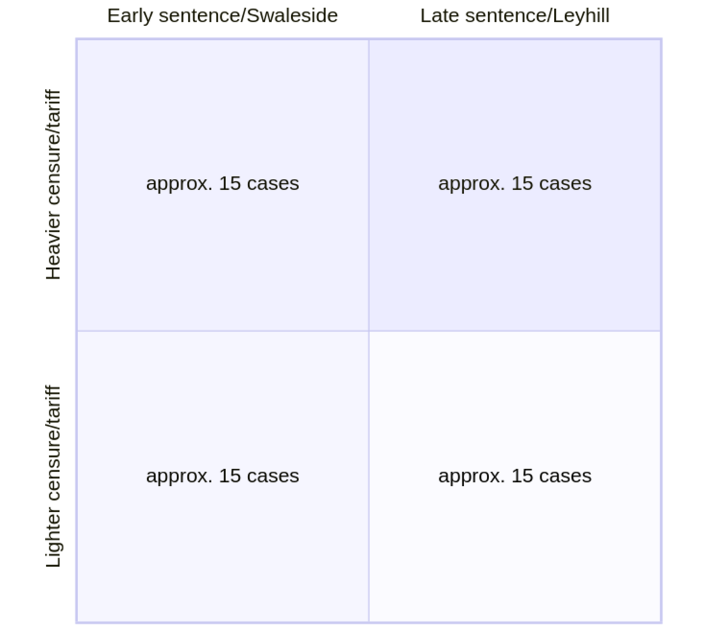
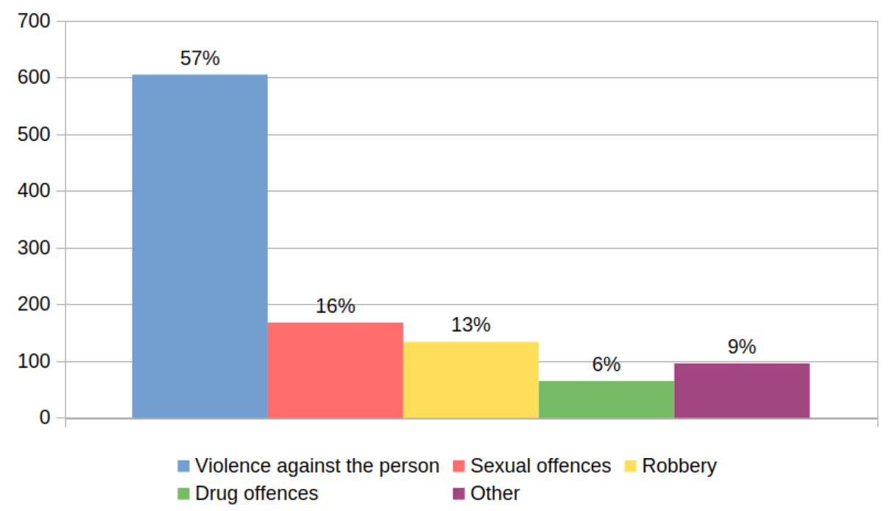
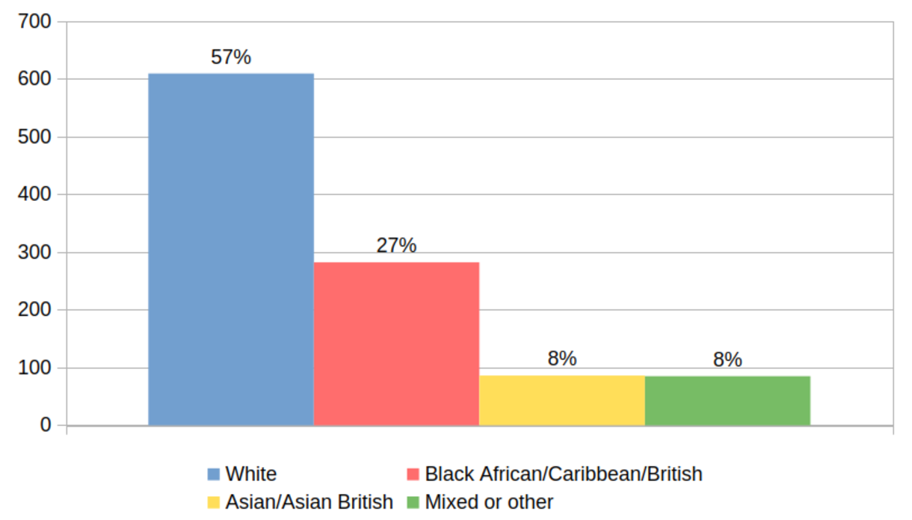
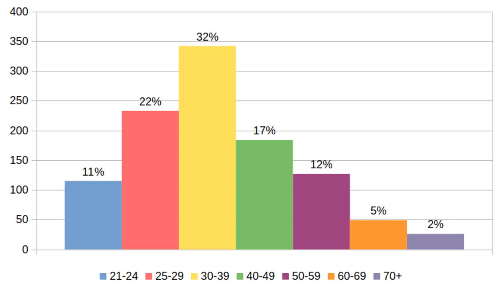
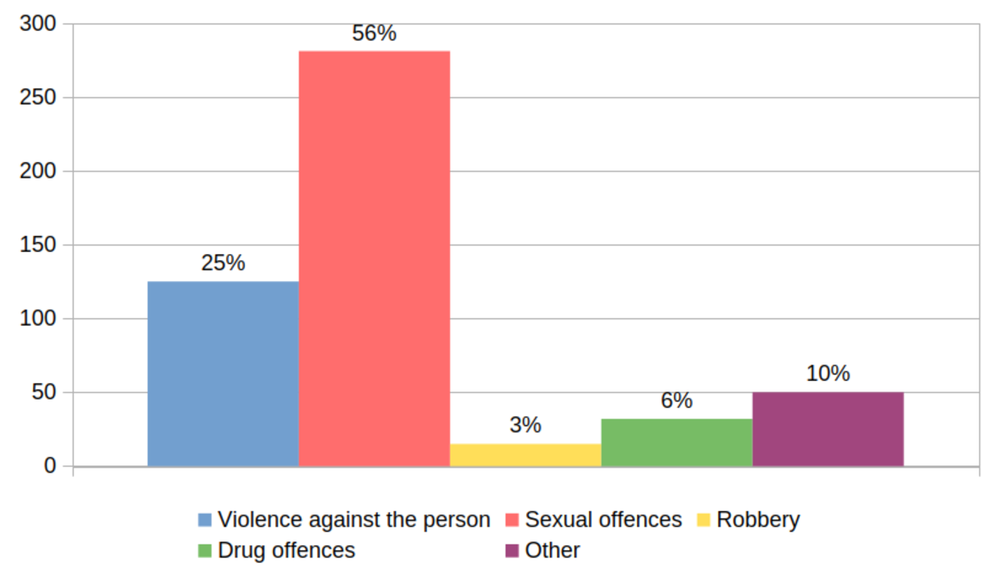
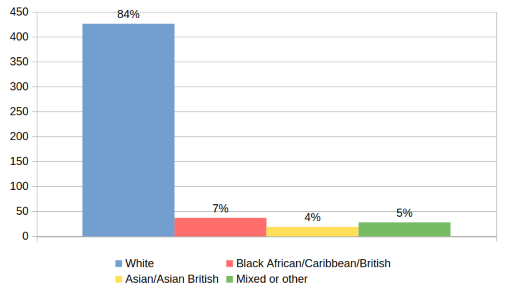
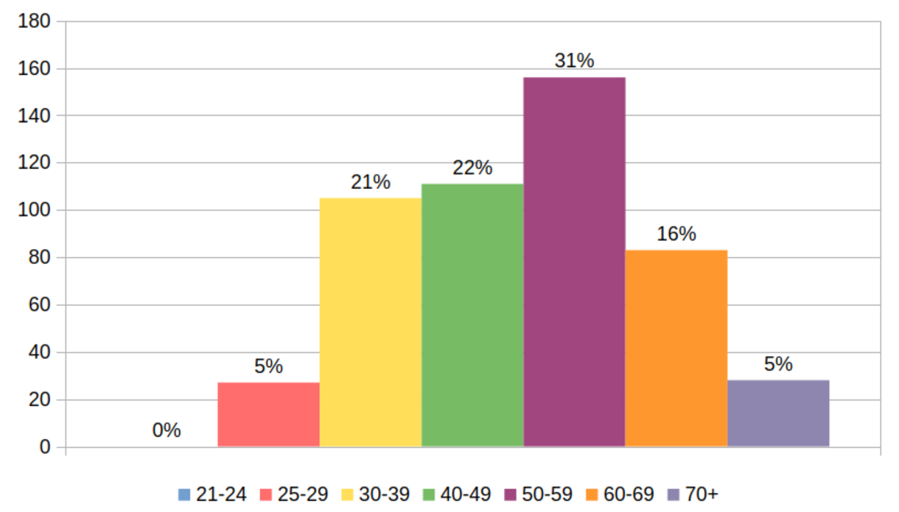
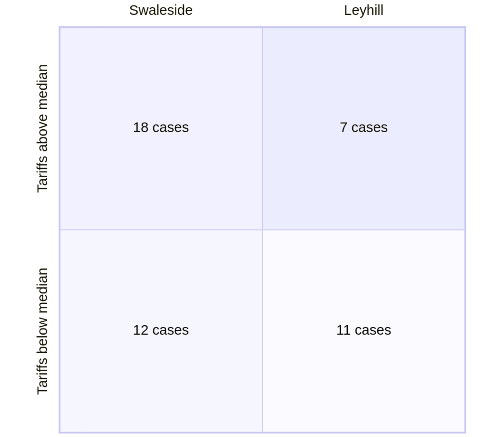

[Chapter 2](./2_literature-review.qmd) argued that the empirical study of long-term imprisonment can be enriched by focusing on prisoners' first-person ethical lives, and developed a set of research questions for the PhD. This chapter elaborates the research choices flowing from those questions (see Chapter [-@sec-2-research-questions]). @sec-3-research-design describes the research design and methods selected, before @sec-3-sites elaborates on the choice of sites. @sec-3-methods-ethics describes the practicalities of carrying out the research. Finally, @sec-3-murder-after-murder summarises key points in the chapter and reflects on the nature of the knowledge produced by the PhD. I describe the shadow cast over the research by the London Bridge attack of 2019, during which I was present while a former prisoner stabbed five people, killing two, before being shot dead by the police.

## Research design {#sec-3-research-design}

I designed a cross-sectional study to be conducted at two contrasting sites. It aimed to produce a rich description of participants' first-person subjectivity, not neglecting the social contexts in which these operated. A cross-sectional design, with a sample varying more broadly and systematically on two variables (age at conviction and offence type), would enable the model of adaptation to long-term imprisonment posited by @creweLifeImprisonmentYoung2020 to be tested against a broader sample.

### Choice of methods {#sec-3-choice-methods}

A focus on subjectivity made ethnographic interviews an obvious primary data collection method. These aimed to establish what @shermanheylEthnographicInterviewing2014 [p. 369] calls "respectful, ongoing relationships with […] interviewees, including enough rapport for there to be a genuine exchange of views and enough time and openness […] to explore purposefully […] the meanings [participants] place[d] on events in their worlds". 

The choice entailed certain assumptions. First, that *personal engagement* between researcher and subject is the key to understanding a particular culture or setting [@hobbsEthnography2006], along with an analytical perspective one or two (but not more) steps removed from research participants. A second assumption is that the researcher must *participate* in some way, at least in the research setting if not in the activities under investigation [@brewerEthnography2003].

This PhD, however, is not 'pure' ethnography: neither principally observational, nor subjecting me to the same social constraints or pressures as participants. In 'pure' ethnography, accounts collected during participant observation are generally understood to be more valid [@hammersleyWhatEthnographyCan2018, p. 8]. But I exited the field daily, not merely at the end of the study, and was not subject to the same pressures or constraints as participants, some of whom will still be in prison when I am in my sixties.

On the other hand, neither was the design *non-observational*: as [Chapter 6](./6_risk-and-self-governance.qmd) perhaps makes most clear, some of the findings rely on a characterisation of the 'feel' of the two fieldwork prisons, and from the start I expected the research process *around* the interviews, as much as the interviews themselves, to render some aspects of the research topics 'intelligible' [@lieblingPostscriptIntegrityEmotion2014]. Hence, I used observational notes and notes on prison documents (see Sections [-@sec-3-informal-observations] and [-@sec-3-documents]) to triangulate and contextualise the interviews. Documents, in particular, helped to perform what Mona @lynchPenalArtifactsMining2015 [p. 277] calls "translational work […] between the institution and its clientele". In this case, the translation related to risk, a topic on which documents offered useful, context for the interviews.[^3.1]

### Approach to sampling {#sec-3-approach-sampling}

I aimed to sample for maximum variability among interviewees, on two variables: sentence stage, and the 'moral seriousness' of the index offence(s). Sentence stage was important because coping and adaptation styles vary over time during a long prison sentence [@crewePrisonerSocietyPower2009; @creweLifeImprisonmentYoung2020; @schinkelAdaptationMeaningImprisonment2015; @zambleBehaviorAdaptationLongTerm1992; @zambleCopingBehaviorAdaptation2013]. The second dimension---'moral seriousness'---was of interest for reasons outlined in [Chapter 2](./2_literature-review.qmd): because I expected the circumstances of the offence, the identity of the victim, and feelings of culpability to influence the experience of censure. Simply put, I expected distinct kinds of murder to produce different ethical ramifications. The sample had to facilitate comparisons on this basis.

@fig-3.3 displays an early sampling frame. The original intention was to obtain a list of eligible prisoners from the prison, stratify it by sentence stage and tariff length as per the two axes of the frame (with tariff length treated as a proxy for seriousness, see @sec-3-approach-sampling), and then to choose individuals at random to approach about interviews. I had used a similar approach with qualified success for the pilot research, believing it could mitigate the selection bias inherent with a convenience or snowball sample.

::: {#fig-3.3 layout-align="center" width="8cm"}

The sampling frame, as originally conceived[^3.2]

:::

The sampling approach necessitated a two-site design, since prison environments vary substantially in their 'depth', or metaphorical distance from the outside world [see @creweDepthImprisonment2021], and (more prosaically) late- and early-stage prisoners tend not to be held in the same prisons. This introduced an additional layer of analytical complexity, in that different sites have different cultures; but it also produced strong contrasts, enabling the refinement of existing theory by testing it against more varied cases [@beckerTricksTradeHow1998].

### Access {#sec-3-access}

Accessing prisons for research can be difficult, particularly where ethnographic methods are used [e.g. @jewkesResearchingPrison2016; @stevensAccessDeniedResearch2020]. However, in this case it was straightforward. My impression was that this was for three reasons: first, the networks and close practitioner links of my department and supervisor; second, that the topic (long-term imprisonment) was of known interest to HM Prison & Probation Service (hereinafter HMPPS); and third, because of my previous experience conducting prison research and working in long-term prisons professionally. All three seemed to open doors.

Expecting the access application process to be slow, I applied to HM Prison & Probation Service's National Research Committee (NRC) in February 2019, as early as practicable during the first year of the PhD. After responding to the NRC's questions in April, I received confirmation in May that I could proceed with the study. I contacted the governors of both prisons soon thereafter. They passed me to other contacts, and from this point planning for fieldwork began.

## The sites {#sec-3-sites}

In this section, I describe the environment, function, population, regime, and climate of the two research sites: HMPs Swaleside (a category-B training prison) and Leyhill (a category-D open prison). Swaleside is the only prison in the Long-Term and High-Security Estate (LTHSE) lying within daily commuting range of my then home in London. Leyhill, meanwhile, was one of a few open prisons specialising in resettling lifers. I had worked briefly at both prisons in a previous job, and was familiar with the sites and a couple of staff contacts. Both, besides their differing functions and atmospheres, were said by prisoners to have distinctive characteristics, as compared to functionally equivalent prisons elsewhere in the estate. Their reputations were well captured by nicknames: 'Stabside' (or 'Stab City'), and 'Delayhill'.

### Swaleside {#sec-3-swaleside}

#### Role, function, and population {#sec-3-swaleside-role-function-population}

Swaleside has been managed in the public sector since opening in 1988, and has always held men in the initial stages of long sentences. Long considered a 'complex and challenging [prison]' [@hmchiefinspectorofprisonsReportIndependentReview2019a, para 1.2], it is "unquestionably a difficult place to run" [@hmchiefinspectorofprisonsReportUnannouncedInspection2019, p. 5]. This is a result of its burgeoning size and complex functions. Abutting two other prisons on a sprawling rural site on the Isle of Sheppey in Kent, for many it is the first port of call following conviction. For others, it represents a step onwards and 'down' from the maximum-security dispersal prisons.[^3.5] Thus it mixes prisoners who are young, disaffected, and emotionally volatile with others old and experienced enough to be capable of concerted and organised resistance.

The four original wings (A to D) date from 1988, are of a cruciform short-spur design, and house 126 cells per wing. A-, C- and D-wings house main population prisoners, and B-wing those who are segregated for their own protection. Part of D-wing is an induction unit. Four more wings, added in 1998-9 (E- and F-wings) and 2009-10 (G- and H-wings), have since more than doubled the original capacity of the site. They are of a different design, with longer L-shaped spurs; E- and F-wings adding 120 cells each, and G- and H-wings 179 cells each. A substance misuse recovery unit operated by the Forward Trust occupied one spur of E-wing, and the whole of F-wing was the 'Pathways Unit', a Psychologically Informed Planned Environment or 'PIPE' managed jointly by prison and NHS mental health staff. G-wing and H-wing completed the residential provision, with G-wing having one lifers-only spur, and H-wing housing exclusively men convicted of sexual offences.[^3.6]

Besides the wings, there was a range of other provision: a 25-cell segregation unit, an inpatient Healthcare unit, a large workshops block, an education department operated by Milton Keynes College, and an Attitudes, Thinking, and Behaviour (ATB) department delivering OBPs. Despite its diverse facilities, Swaleside has experienced persistent difficulties in delivering a full regime, with the prison scoring particularly poorly in recent inspections for placing prisoners in purposeful activity.

:::: {#fig-3.1 .column-body-outset}

::: {#fig-3.1a layout-align="center"}

by main offence (N=1,068)

:::

::: {#fig-3.1b layout-align="center"}

by ethnicity (N=1,062)

:::

::: {#fig-3.1c layout-align="center"}

by age (N=1,076)

:::

Swaleside's population during Q4 of 2019 [@ministryofjusticeOffenderManagementStatistics2020d]

::::

During fieldwork, its population stood at 1,077 [@ministryofjusticeOffenderManagementStatistics2020d]. There were just three releases during this period; almost all prisoner movements were transfers to and from other prisons. @fig-3.1 describes Swaleside's population during fieldwork, subdividing it by offence type (@fig-3.1a), ethnicity (@fig-3.1b), and age (@fig-3.1c). Three main points should be noted. First, that around seven in every ten prisoners there were serving sentences for serious offences involving physical and/or sexual violence. Second, reflecting the prison's proximity to London, that minority ethnic groups are over-represented in the population, especially the 282 Black prisoners who represented just over 25% of the prison's population. Third, Swaleside's population contained a substantial number of younger men: one-third were in their twenties and just under two-thirds were aged under forty.

In 2018, 34% of prisoners at Swaleside were serving indeterminate sentences, with a further 58% serving determinate terms of 10 years or more [@hmchiefinspectorofprisonsReportUnannouncedInspection2019].

#### Culture(s), regime, and climate {#sec-3-swaleside-culture-regime-climate}

Swaleside faced many difficulties during the 2010s. These were driven partly by the growing numbers of young men serving very long sentences, and partly by persistent staffing problems: shortages, high turnover, and retention difficulties, particularly with experienced staff. By 2016, the prison was in a state of 'drift and decline' [@hmchiefinspectorofprisonsReportUnannouncedInspection2016e, p. 5] and was reputed for violence: assaults by prisoners and staff use of force were both high. There was a murder in 2015, and major disturbances in December 2016 and December 2017 largely fuelled by high levels of drug use [@hmchiefinspectorofprisonsReportUnannouncedInspection2019, p. 24]. By the time of the research, the prison had "beg[un] to emerge from years of turmoil" [@lieblingMeasuringQualityPrison2018a]. Its regime was more predictable, partly because of its 2017 reorganisation into the then-new LTHSE group of prisons, which brought a more generous staffing profile. Even so, low employment rates and insufficient purposeful activity remained a persistent criticism by monitoring bodies [@hmchiefinspectorofprisonsReportIndependentReview2019a; @hmchiefinspectorofprisonsReportUnannouncedInspection2019; @independentmonitoringboardAnnualReportIndependent2019a], and there were pockets of instability and disorder, but with staff more in control.

For LTPs, the prison also had its attractions: single cells and in-cell telephony, particularly, and some preferred its less controlled environment over that in dispersal prisons. Lifers at Swaleside, while sometimes criticising its disorderliness, seemed more concerned about *progression* than about *immediate safety*. These attitudes are explored further in [Chapter 6](./6_risk-and-self-governance.qmd).

### Leyhill {#sec-3-leyhill}

#### Role, function, and population {#sec-3-leyhill-role-function-population}

HMP Leyhill is a category-D (or 'open') prison between Bristol and Gloucester, on an orderly, clean, rural site beneath the Cotswold escarpment, surrounded by green space and trees. Opened in 1946, it was completely rebuilt in the 1970s and 1980s, adding new residential blocks (A- or Ash and B- or Beech units) and a dining area and kitchen. New visits, reception, chapel, healthcare, industries, education, and PE facilities were added from 1990; C- or Cedar unit, new accommodation, followed in 2002, as did a palliative care suite adjoining Beech. There are large contracts workshops, employing many prisoners on-site (rather than on day release). Despite the drab, icy weather during fieldwork (in January and February 2020), my first impressions were of a prison far more benign than Swaleside:

  > It's so quiet! Staff and prisoners talk rather than yelling, and there's birdsong everywhere. Though [Ash and Beech] are larger than some wings [at Swaleside], there is a blanket of hush […] It's sleepy. The first thing I saw today was a man sitting on a bench feeding monkey nuts to a squirrel.
  >
  > (Fieldnotes)

During fieldwork, Leyhill housed a population of 510, close to its capacity of 515 [@hmchiefinspectorofprisonsReportScrutinyVisit2021, p. 5]. @fig-3.2 subdivides them by offence type, age, and ethnicity. Three contrasts with Swaleside should be noted. First, the proportion convicted of sexual offences (@fig-3.2a).[^3.27] Second, Leyhill's status as a virtual ethnic and national monoculture (@fig-3.2b).[^3.7] And third, the skew towards older prisoners (@fig-3.2c): the most numerous group at Leyhill were in their fifties.

:::: {#fig-3.2 .column-body-outset}

::: {#fig-3.2a layout-align="center"}

by main offence (N=503)

:::

::: {#fig-3.2b layout-align="center"}

by ethnicity (N=510)

:::

::: {#fig-3.2c layout-align="center"}

by age (N=510)

:::

Leyhill's population during Q1 of 2020 [@ministryofjusticeOffenderManagementStatistics2021]

::::

The prison's @independentmonitoringboardAnnualReportIndependent2020 [p. 7] reported that in late 2019, around two-thirds of Leyhill's population was indeterminately sentenced, with just over a third serving life sentences.

Leyhill's role, then, is to prepare long-term prisoners for release, including some who have been in prison for two, three, or even four decades. This is "a complex and challenging task" [@hmchiefinspectorofprisonsReportUnannouncedInspection2017d, p. 5] and typically not achieved quickly: at the most recent full inspection, 39% of the prison's population had resided there for over a year, and 12% for two or more years. The prison released 263 prisoners during 2020, an average of approximately sixty-five each quarter.[^3.29] Since this figure includes determinately sentenced prisoners, lifers in the prison are likely to be disproportionately represented among long-stayers; indeed, two participants reported stays of over five years.

#### Culture(s), regime and climate {#sec-3-leyhill-culture-regime-climate}

Leyhill's resettlement function and population profile meant that it managed a different portfolio of risk to Swaleside. Prison release generally, and the parole process specifically, have become arguably *the* key source of recent penal controversy [@annisonDangerousPoliticsRisk2015; @annisonReexaminingRiskBlame2020a]. Officials had assessed that around three-quarters of Leyhill's residents posed a 'high' risk of harm to others [@independentmonitoringboardAnnualReportIndependent2020, p. 15]. 

Accordingly, worries about the risks of release saturated Leyhill's regime, culture and climate, as well as prisoners' attitudes towards the jail. As [Chapter 6](./6_risk-and-self-governance.qmd) suggests, many saw the prison's risk management as overcautious. Official sources, however, praised it, attributing delays not to the prison, but to downstream factors beyond its direct control, such as the availability of Approved Premises or work places.[^3.8] The wide range of purposeful activities available on-site was perhaps not coincidental: most prisoners could be and were employed there during the week, waiting lists were short, and teaching and learning was generally "lively and highly effective" [@hmchiefinspectorofprisonsReportUnannouncedInspection2017d, p. 41]. Official evaluations of the prison were therefore split: it managed prisoners well *within* the prison; but, due often to factors beyond its control, did not perform its resettlement tasks quickly.

The following section describes the data collection phase of the research, and explains methodological choices made during it.

## Carrying out the study: methods and ethics in practice {#sec-3-methods-ethics}

At Swaleside, my initial designated point of contact was the head of the forensic psychology department;[^3.4] its offices were my base. At Leyhill, the contact was the Acting Head of Residential, an experienced Custodial Manager. Both points of contact were unfailingly helpful and supportive, though the Leyhill contact was noticeably less interested in the research, and (apparently) far more deeply knowledgeable about the prisoners, and willing to talk. Fieldwork at each site followed three phases:

  1. a week for familiarisation and to obtain an anonymised list of eligible prisoners for sampling;
  2. many weeks to recruit participants, carry out interviews, make observations, and obtain participants' consent to my viewing selected documents from their prison records;
  3. a week to read these documents and take notes.

Fieldwork at Swaleside ran from August to December 2019. On 29 November, with thirtyu interviews and nearly all the documentary research there complete, I attended an event in London at which a former prisoner stabbed five people, killing two, before himself being shot dead by police. As I discuss further in @sec-3-murder-after-murder, the impact of this event was shattering, but in ways that did not play out predictably or immediately. I had at most a day or two's documentary research left to do at Swaleside, and decided to finish my work there, returning three days after the incident. I began interviewing at Leyhill in January 2020, according to my original schedule and following the phases described above. I conducted fewer interviews there than planned, for reasons covered in @sec-3-sampling-adaptations.

### Adapting the sampling frame {#sec-3-sampling-adaptations}

The sampling frame summarised in @fig-3.3 required adaptation before it could be applied. Stratifying a sample by sentence stage was straightforward enough: tariff data were readily available and easily anonymised for sorting. Sampling for offences of varied 'moral seriousness' was less straightforward. The distinctions required are, fundamentally, qualitative, and reliable information with which to code cases proved hard to come by, as I describe shortly. Offence data held by Swaleside's OMU was not available in a format that could readily be queried, and (as Appendix [-@sec-apx-c] shows) were not guaranteed to represent the prisoner's perspective on his offence clearly. Approaching prisoners simply to ask questions about their offences (thus 'filtering' them after a first meeting) would have felt highly insensitive and presumptuous, and could have put some in danger should these approaches---which would necessarily take place in public settings such as wings and workplaces---be overheard. This all pointed to using tariff length as the best available, though still an imperfect, proxy for 'moral seriousness'. It indexed murders that *sentencing judges* had found to involve greater and lesser degrees of culpability. As a continuous variable, it was suitable for stratification, and a 'good enough' heuristic. But it was not a 'pure' theoretical criterion.

On this basis, I obtained an anonymised list of eligible prisoners at each site, and key dates relating to their sentences, and subdivided it by whether the offence occurred before and after Schedule 21 came into effect.[^3.19] Having calculated medians and quartiles for the tariffs on both sub-lists, I then recombined the list and stratified it by tariff length quartiles, aiming then to produce a sample with roughly even numbers from each tariff quartile (low, low-medium, medium-high, high).[^3.20]

The eligibility criteria used to generate the anonymised lists also required some adaptations from what was originally envisaged. The lists were generated from prison records on the first day of fieldwork at each prison. Originally, the criteria applied were to be:

  1. serving a mandatory life sentence;
  2. not an appellant;
  3. not maintaining innocence;
  4. not convicted as a secondary party in a joint enterprise murder;
  5. served at least two years since conviction; and
  6. not on recall.

Criteria 1, 5, and 6 were easy for the prison to apply, and selected individuals who were all convicted of the same crime, would all be settled into the sentence, and were not imprisoned for breaches of the life licence.

The others were less straightforward. I originally wanted interviews not to become bogged down in the merits of the conviction itself, and so Criteria 2, 3, and 4 originally aimed for a sample who 'took responsibility' for the offence. But at Swaleside it quickly became evident that applying them was far from simple. The information required could only have been added to the anonymous list generated from sentence data by laboriously cross-referencing against information from other sources, and then coding the list. I would also have needed unrestricted access to non-anonymised and extremely sensitive prison data over multiple days. A prison psychologist offered to help scope whether the cross-referencing might be feasible with her help. Already seeing the practical difficulties, I was not enthusiastic about the offer, but felt unable to decline. But this exercise also, usefully, made clear that prison staff who wrote the records required were not always clear what was and was not a case of 'joint enterprise', and there was also a hopeless degree of confusion regarding the term 'innocence' in criterion 3.[^3.9] In short, meaningfully identifying prisoners who 'took responsibility' using information from prison data systems was not remotely feasible, and I abandoned eligibility criteria 2, 3 and 4. The eventual sample does, then, include participants who were maintaining what I describe hereinafter as a 'strong claim of innocence'.[^3.26]

At Leyhill, sampling followed the slimmed-down procedure, with further alterations. Compared to Swaleside's, Leyhill's mandatory lifer population was less numerous, whiter, much older when sentenced, and included a different mix of offence types. This all complicated the loose comparisons I had hoped to make between men convicted in similar circumstances but held at different sentence stages. I therefore over-sampled non-white prisoners at Leyhill, and those convicted aged under thirty, approaching them all for interviews while selecting other candidates randomly as before. Where I had a name in mind, I also searched online for press coverage of convictions, aiming to over-sample men *not* convicted of sexual offences. Most searches were fruitless: many of the offences predated the internet, and I lacked access to historical databases. Searching online also undermined my ethical stance of allowing participants to tell me their stories before I encountered them elsewhere (see @sec-3-ethics), and I therefore abandoned this modification without having achieved much by it.

I planned to replace it with a twofold strategy: interviewing fewer than the 30 Leyhill lifers whom I had originally intended to sample, and then re-applying to the NRC for permission to carry out 'top-up' interviews in a third (open) prison with a population more like Swaleside's. However, the Covid-19 pandemic put paid to this idea, leaving me with the sample described in the following section.

### The sample {#sec-3-sample}

The eventual sample comprised forty-eight men: thirty at Swaleside, and eighteen at Leyhill, who were approached about an interview at random. However, it was not a 'true' random sample, but purposively and systematically constructed, with some risk of selection bias: prisoners less willing to speak about life before prison, including the offence, self-deselected.[^3.25]

@tbl-3.1 displays basic information about the sample, showing how cases were distributed by tariff and sentence stage across the two sites ([-@tbl-3.1a] and [-@tbl-3.1b]), and showing data on the sentence and the life course for the sample as a whole ([-@tbl-3.1c]). Overall, it demonstrates that the sample achieved the broad aim of wide variability on sentence stage and offence 'seriousness'.

:::: {#tbl-3.1 .column-body-outset}

::: {#tbl-3.1a layout-align="center"}

Tariff length distribution in the sample, by prison

:::

::: {#tbl-3.1b}

+----------------+-----------+-----------+
| Sentence stage | Swaleside | Leyhill   |
+:===============+:=========:+:=========:+
| Very early     | 5         | 0         |
+----------------+-----------+-----------+
| Early          | 7         | 0         |
+----------------+-----------+-----------+
| Mid            | 9         | 1         |
+----------------+-----------+-----------+
| Late           | 3         | 8         |
+----------------+-----------+-----------+
| Post-tariff    | 6         | 9         |
+----------------+-----------+-----------+

Sentence stage distribution in the sample, by prison[^3.10]

:::

::: {#tbl-3.1c}

+-----------------------------+----------+----------+------------+-----------+
|                             | Average  | s.d.     | Min        | Max       |
+=============================+:========:+:========:+:==========:+:=========:+
| Age when sampled            | 46.4     | 13.6     | 22         | \> 65*    |
+-----------------------------+----------+----------+------------+-----------+
| Age when sentenced          | 33.2     | 13.4     | 16         | \> 65*    |
+-----------------------------+----------+----------+------------+-----------+
| Age at tariff expiry        | 50.3     | 14.5     | 27         | 85        |
+-----------------------------+----------+----------+------------+-----------+
| Tariff in years             | 17.9     | 5.3      | < 10*      | 30        |
+-----------------------------+----------+----------+------------+-----------+
| Age at first conviction     | 22.9     | 13.5     | 12         | \> 65*    |
+-----------------------------+----------+----------+------------+-----------+
| Tariff ÷ age when sentenced | 0.60     | 0.28     | 0.11       | 1.47      |
+-----------------------------+----------+----------+------------+-----------+
| Years served ÷ tariff       | 0.80     | 0.59     | 0.07       | 2.50      |
+-----------------------------+----------+----------+------------+-----------+

The sentence and the life course; asterisked values are obfuscated to protect anonymity.

:::

Descriptive statistics on the sample, their sentences, and their life courses

::::

It is striking that the sample as a whole 'skews late' by sentence stage, and worth noting that this was *not* an artefact of selection effects. @sec-apx-c gives further detail on how the sample was broadly representative of the site populations, but the key point here is that Swaleside held many more individuals in the later and post-tariff stages than expected,[^3.3] while Leyhill held these groups nearly exclusively. Indeed, as Chapter [-@sec-1-uk-life-imprisonment] indicated, this 'late skew' also reflects an important feature of the *national* lifer population: just over a quarter of all lifers in England & Wales were over-tariff in December 2020 [@ministryofjusticePrisonSentencesQuestion2020], and they had (in 2021) exceeded their minimum terms by an average of 110 months [@ministryofjusticePrisonSentencesQuestion2021]. This is a consequence of sentence complexity, risk assessment, and back-door severity.

### Interviews {#sec-3-interviews}

Semi-structured interviews were the principal data collection method. This was appropriate not merely because the study was qualitative and sought to understand prisoners' *experiences*, but also because the subject matter was human interiority: thought processes that are private, internal, and may be tacit and unarticulated. The research aimed to apprehend what participants thought about when they reflected on themselves. Of course, there is a risk of grandiosity in stating this aim: it is impossible to look directly inside another person's head to access thoughts of this kind. Nonetheless, interviews, particularly if well contextualised and attentive to language, come closer to the mark than most other methods.

#### Schedules, structure, and the choice of a two-part interview {#sec-3-schedules-structure}

I wanted the interviews to allow time for rapport, respect, and a measure of trust to develop, and designed interview schedules comprising separate 'life history' and 'prison history' sub-schedules: in reality, more like two interviews. I also designed a 'prison timeline' activity (as a 'way in' to the second interview), and separate sheets to record demographic and consent data.[^3.13] The rationale for a two-part interview was part-practical, part-ethical. I was interested in prisoners' experiences *during the sentence*, but wanted to situate these in a longer temporal context, particularly with respect to the offence and its antecedents. Rather than broaching such a sensitive topic as the opening gambit in a single interview mostly focused on prison life, I preferred to build gently towards it through a narrative first interview, in which I invited participants to tell me their story up to the point of admission to prison. This first sub-schedule was at least as focused on rapport and relationship-building as on answering any of the research questions. The second invited asked participants to bring the story to the present day using the timeline (see Appendix [-@sec-apx-c-prison-timelines]), before going into more thematic questions about ethical life *now*.

The second interview was the core of the inquiry. It was more structured, tending to solicit shorter and less digressive answers. As such, it lacked some of the forward momentum of a narrative; but the jumps from topic to topic felt easier because of the rapport and patience built up during the first. It quickly became clear that time spent on the first interview had not been wasted. Most importantly, it established (for participants) a measure of trust in my willingness to listen without expressing judgement; and (for me) a broad sense of who participants now felt themselves to have been before conviction. One specific question in the first interview ("If a stranger were to ask you to describe yourself at the time of your index offence, what would you say?") was important in this respect, often giving me a strong intuition for the tone and valence of the second interview.

I wrote the schedules before fieldwork, and although I altered the wording of some questions on the fly, I used them largely unamended. Some sections borrowed from schedules used in the pilot research [@jarmanTurningPointsDead2017; @jarmanOnlyOneWay2020]; most were written for this project. With forty-six participants, there was at least an overnight break between the two halves of the interview, but at Leyhill (where employment and Release on Temporary Licence (ROTL) made scheduling more complicated) two men asked to schedule both sessions on the same day, and I agreed. The schedules (see @sec-apx-b) were used flexibly where necessary. For example, I agreed to a few requests to do the second interview first (and in one case, not to do the first interview at all).[^3.15] In the second interview, I played around with sequencing when I could see thematic connections between something just said and later questions. I occasionally dropped questions altogether (for an example, see @sec-3-ethics) and sometimes changed my wording, especially where the participant was not a native English speaker. Transcription and data protection procedures are described further in Sections [-@sec-3-ethics] and [-@sec-3-data-processing-analysis].

#### Recruiting the sample and setting up the interviews {#sec-3-recruiting-sample-setting-up-interview}

Having identified potential interviewees randomly, I usually visited them in their workplace or on their residential wing to introduce myself, answer questions, leave an information sheet about the study, and canvass them about an interview.

My first-year reviewers and supervisor advised me to approach this process with great care, given that it would involve telling people, directly, that I would seek a description of their offences. In practice, their responses varied a great deal. There is a strong norm among reformers and prisoner advocates [e.g. @stevensonJustMercyStory2014] that people are "more than the worst thing they have ever done", and ought to be recognised as such. I agree strongly, in the abstract: it is a worthy and important corrective to some of the worst and most abusive tabloid moralising about prisoners. But I also knew from professional experience that prisoners sometimes *volunteered* information on this topic, including when it reflected poorly on them. Further, for some---including me---trust in another person is reinforced, not undermined, by knowledge. On the other hand, I also believe, strongly, that people should be accountable for their actions, not an easy demand where those actions have demonstrated a gross disregard for the personhood and rights of others.

Though researchers have sometimes analysed prisoners' attitudes to their offending, they have not often reflected explicitly on how they broached the issue. I cannot recall sociological research on prisons which *specifically* and *directly* solicited details about the offence, though in many examples it is obvious that the topic came up, bidden by the researcher or not. The interactional dynamics of an interview---including some of mine with participants who preferred not to describe their offences---can lead to situations in which it becomes increasingly difficult *not* to talk about the offence: it becomes a haunting presence in the room, something live and yet absent. Other criminological researchers, beyond the prisons subfield, have described prisoners' opinions on their offending [e.g. @dobashWhenMenMurder2015; @dobashMaleMaleMurder2020], often with an overtone of disapproval. Beyond criminology, papers in the psychiatric/clinical literature have also addressed the offence directly [e.g. @adsheadThereMurdererHere2018; @ferritoLifeHomicideAccounts2012; @ferritoMakingSenseDark2020; @gilliganShameGuiltViolence2003]. These were generated in interactions not purely driven by research, often explicitly therapeutic. Here, the topic may not be *easier* than in an ethnographic interview, but an offer of ongoing support is certainly more built-in.

My own view, based on professional intuition from past work, and the pilot study, was that many lifers would be accustomed to thinking (and perhaps to a lesser extent, to talking) about the index offence. I never expected it to be an *easy* topic, but the caution with which I was counselled to approach it struck me as unlikely to be warranted in every case. Informed consent seemed a sufficient protection against the ethical problems inherent in asking about it, with two provisos: first, that I informed wing staff about whom I was approaching (and allowed them a veto, since they were better-placed than me to judge if a particular individual was capable);[^3.24] and second, that I backed away from interactions where I sensed cues indicating reluctance or incapacity.[^3.16]

I tried, therefore, to be available for a preliminary conversation with each person I approached. I would ask if they had a few minutes and tried---using the affordance of having keys---to take them aside somewhere quiet. I made three things clear. First, I said the interview would cover "the events that led to you being in prison now", wording I used absolutely consistently. Second, I said they could decline to answer any question in an interview, without an explanation, including about these "events". Finally, I asked them---even the several men who offered verbal consent almost before I had begun my spiel---to mull the decision over for a day or two, saying I would return for a decision at a time and in a place agreed in advance. This was an opportunity to demonstrate interpersonal respect, either by keeping my word, or by failing to before apologising, with an explanation. I hope this afforded participants time to think, and to seek advice if they wanted.[^3.28] Generally, I felt confident after this initial conversation about what the eventual answer would be, and I was rarely wrong.

#### Conducting the interviews {#sec-3-conducting-interviews}

I interviewed in a variety of locations. At Swaleside, most were interview rooms or offices on wings, with one interview each held in an unused education classroom and a storeroom adjoining a workplace. I asked if participants preferred any particular space, requiring only that it be likely to be private and minimally interrupted. Some spaces, even designated interview rooms, were not good for the purpose: that on F-wing, for example, was private but very close to the area where prisoners gathered before movements, and the noise---voluble banter and officers bellowing down the spurs---could be overwhelming. Transcribing interviews recorded in this room was often painful.

At Leyhill, I had near-exclusive access to an office in the Beech unit. It was perfect---quiet, private, large, light, airy, with a desk and a range of easy chairs---barring one detail: a locked cabinet containing nursing supplies for the prison's palliative care unit. Many interviews were interrupted by nurses arriving to collect items. They were always cheery (and gracious in allowing me, for two months, to occupy what was unambiguously their space), and they never intentionally made matters difficult. But they also ignored or forgot my repeated requests to knock and wait before entering, and once or twice, their timing was exquisitely bad. One burst in just as an interviewee, hunched over in shame, speaking in a near-whisper, and having first taken a breather to prepare himself, was describing a post-mortem sexual assault on his victim. Failing to prevent this embarrassed me profoundly, and I apologised profusely after the nurse left; but we both seemed to accept that it was beyond anyone's control, and after composing himself, he carried on.

By and large, however, the interviews worked well, with noise and momentary interruptions the worst of the difficulties. A few, mostly at Leyhill, were marked by interactional dysfluencies. I cut short two of these, with Phil and Harry. The following fieldnote, made just after the conclusion of Harry's first interview, captures something of the struggle for control he had apparently just been engaged in:

  > He's obliging and eager, but overbearing in his keenness to share his story. He wants absolute control of the interview space; is a stickler for the story remaining strictly sequential and chronological; was annoyed when I checked details or anticipated what was coming; and kept slipping [into] speaking as a narrator, with statements like, "as you'll see clearly when we get to X" […] He has strong expectations of me (based, I think, on readings of social class) […] and refers once or twice to how "someone like you must be shocked" by this detail or that […] He gets annoyed when I intervene to move things along; for instance, when he spent thirty seconds trying to remember where [village] was near and listing possible candidates, I suggested [city]. He snapped back, tetchily, "No, it's between [town] and [town]". It's going to be a long interview.
>
> Fieldnotes

As it turned out, Harry did not accept my invitation to withdraw from the research, but made and missed appointments for the second interview, until time ran too short to conclude it before the end of fieldwork. These tussles over control were subtly present, though less explicit, in a few other cases. Phil seemed put out by the transition from the first interview's open-ended, chronological questions to the second's thematic, non-narrative questions. I thought he was experiencing these as a refusal on my part to draw the self-evident conclusions from his narrative, and his annoyance became increasingly obvious. Because we were accomplishing little beyond riling him, we cut the second interview short.

At Swaleside, expressions of emotion mostly did not complicate the interview interaction itself. I recall only one (with Robert) which temporarily rivalled those with Harry or Phil for awkwardness. Robert, a white, former professional in his fifties, who was early in his first prison sentence and with whom I had hitherto had a good rapport, expressed forcefully and repeatedly his view that prisoners who assaulted or verbally disrespected officers should be dragged away to segregation and beaten until they complied: as he put it, "the only language they understand", and how things "used to work in the old days", before prisoners were mollycoddled. The previous week, I had listened to another man on Robert's wing narrate just such a beating, sustained in the segregation unit at HMP Wandsworth in (approximately) the late 1980s. The description he gave of this humiliating experience was nauseatingly precise, and I felt vicarious and useless outrage. Having taken many weeks to recover from his injuries, he said he had learned, "never, ever [to] trust a screw", and appeared still to live by this rule. Whether for this or another reason, I failed to mask my feelings about Robert's tirade, and he seized on this, insisting that people like him (and the officers) had to "put up with these animals" because people like me overcomplicated matters. We agreed to disagree, and the rest of the interview went off without incident, but not without Robert aiming some more jocular (though pointed) digs at my effete, self-indulgent ideas.

I occasionally found myself concealing my own reactions more successfully when participants expressed racist or sexist views, as when Matt (for instance) generalised about "coloured lads" on his wing, or Nasim dismissed various women in his family as "gold-diggers" and "cunts". I felt (and feel) that pushing back against these opinions was neither conducive to a good interview, nor likely to have any positive effect, but was uneasy about my silence when transcribing these exchanges months later. Generally, though, my own mask seldom slipped, in part because I had heard many such opinions before and was used to keeping my thoughts to myself.

I kept handwritten notes during interviews, typing them up as a biographical portrait at the first possible opportunity afterwards, usually during lunch breaks or in the evening.[^3.21] They were very helpful in retaining impressions of body language, posture, vocal inflection, and similar, and I referred to them often during data analysis, since in their brevity they were better at jogging my memory than the transcripts.

#### Participant wellbeing {#sec-3-participant-wellbeing}

No participant in either prison took me up on the routine offer of a referral for further support after the interview (as described in Chapter [-@sec-3-ethics]). However, some situations caused me to pause, and sometimes, to back off in my questions. At Leyhill, Grant became increasingly upset while trying to describe how his marriage had turned very unhappy, culminating in him killing his wife. He referred several times to "cycles" of grief and depression throughout his sentence, and it was plain that he missed his children terribly. He asked for several short breaks, returning each time to find himself, once again, lost for words and choking back tears. Sensing that he felt obliged to help me with the research by describing what resembled an open wound more than a scar, I suggested curtailing the interview: he had already indicated the outline, and found the details so upsetting. His relief and gratitude were palpable, and we completed the first interview on another day, resuming the story after his arrest. I never approached the offence narratives expecting tidiness, a stiff upper lip, or a sense of closure, so it was not Grant's tears that seemed the problem to me; it was that my questions were hurting him. Other expressions of strong emotion could be as intense, but were less obviously a direct result of my questions. Gerald wept about the coldness with which his mother treated him in boyhood, some seventy years earlier. I was witnessing, rather than directly probing, a vulnerable spot, and Gerald declined my offer of a break, composed himself, and continued.

One specific incident raised a much trickier dilemma. Around fifteen minutes into our interview, William spoke about cutting off contact with his family, a consequence of his shame at having fallen back into heroin addiction. He said he owed thousands of pounds to dealers on his wing, felt worthless, asked rhetorically whether it was "worth carrying on" (fieldnotes), and wondered aloud whether his family might not be better off without him. I had switched my voice recorder off by this point, and deleted the recording before I left the room.

As with everyone, I had explained to William beforehand that my pledge of confidentiality had limits, and would not apply if I believed he was at risk (see Appendix [-@sec-apx-b-consent-form]). I reminded him of this, asking if he might be letting go of these feelings because he *wanted* someone to see his desperation. He agreed that he was. We then spoke for around an hour. I understood that (quite apart from any suicidal feelings) his debts made his situation genuinely dangerous, particularly if I made a disclosure. I wanted to understand more about the situation on his spur, one of the most uncontrolled at Swaleside, before acting. William did not trust the prison's possible response, and worried what his creditors might do if, following a disclosure, he were suddenly to be whisked away to another wing. I asked, directly, if he had been thinking of killing himself (yes) and whether he had made plans (no). He wanted me not to do anything; I said that this wasn't really an option. Eventually, we arrived at an idea: earlier, he had mentioned a staff member whom he had previously found supportive, and whom he seemed to trust. I said that if I did pass on my concerns, I could do so by seeking out this person face-to-face. He agreed. I asked what, specifically and precisely, he wanted me to say. I said I would have to consult my PhD supervisor, but that if he agreed, I would pass on William's message, and find a discreet way to inform him when I had. I also said this might take me a few days.

When I did find the staff member William had mentioned, they asked me a couple of questions, to which (at William's request) I gave vague answers short of the specifics I knew about. The staff member seemed to infer, immediately, the nature of the underlying problem and said someone from their team would contact William. William later rescheduled the interview, and we set a date some weeks later. When it came around, William disclosed that he was now under police investigation, having been caught with a large quantity of contraband in a cell search. He said he had been holding this for others on his wing (which, if true, was a plausible imposition for his creditors to foist on him).

I have no idea whether my actions precipitated the search. I hope not, and I balanced my own ethical obligations with respect for William's superior knowledge of the dangers and constraints he was under. But I certainly bypassed officers on his wing, to whom I should probably have passed this information directly. In this respect, my actions might seem collusive, and my commitment to comply with prison rules in bad faith.[^3.17] On the other hand, it seems unlikely that William would have raised the issue at all in the course of his ordinary interactions on the wing, or that every staff member might have taken time to negotiate a form of disclosure he found acceptable. I cannot be sure, but my impression was that he would not have sought help in another way (if indeed this is what he was doing).

The episode underlined the degree to which Swaleside (in particular), and prisons (generally) are ethically confounding environments, in which the way to act appears foggy, and there are often only bad choices.

### Documents {#sec-3-documents}

Prison documents were reviewed relating to all participants, barring the four who did not consent.[^3.12] From documents, I could usually form a clear view about judicial censure,[^3.22] the facts of the offence and the prisoner's current risk profile, as the prison understood both. I deliberately consulted them as the last act of fieldwork at each prison, preferring as far as possible to come to interviews 'sight unseen'. Even so, participants who consented knew that I would eventually encounter the 'official version' of their offences and risk. If I sensed their hesitancy, or was asked directly why I wanted to do this, I explained that I was interested in comparing how they saw themselves and how the prison saw them; and that I was not trying to catch them out on details.

Different documents were reviewed in each prison. At Swaleside, I read and noted the transcript of the sentencing judge's remarks on the case, a printout from the Police National Computer (PNC) listing previous convictions, and the RC1 form, a *pro forma* record of the prisoner's last annual security categorisation review and (as I was told by an OMU manager) the most readily available single-document overview of risk assessments, information from the Offender Assessment System (OASys), and recent data entries in the P-NOMIS database during the review period.

RC1 forms are not produced for category-D prisoners. Thus, at Leyhill, I read and noted the sentencing remarks (where available) and the PNC printout, and Enhanced Behaviour Monitoring (EBM) and ROTL risk assessments. Though the ingredients were similar (i.e. they summarised OASys assessments, recent P-NOMIS entries, etc.), these documents were *vastly* more detailed than the RC1, and much subtler in their description of risk, one reason being that the EBM is written by forensic psychologists, not OMU workers. But the ROTL assessment---also very much more detailed---is an OMU document, and in general, the Leyhill documents offered unambiguous evidence that worries about risk are not *absent* in open prisons, but in fact may *intensify*, in that physical security measures are no longer available to manage them.

Four participants did not consent to my reading their prison records. Three of these declined to answer questions about the offence in the interview, two on the advice of their solicitors (both had case reviews active with the CCRC). I saw offence details as essential to the contextualising analysis undertaken in [Chapter 4](./4_becoming-a-murderer.qmd), and did not feel that it breached my ethical commitments towards these three men to search the public record for details of their cases after leaving the field, something I did by searching online for press coverage. I was able to confirm at least the identity of the victim, the participant's relationship to him or her, and the broad outline of what had happened.

Neither documents nor online searches facilitated the trigonometric precision implied by the term 'triangulation': placing two partisan accounts of past events side-by-side does not tend to confirm one or rebut the other. Nonetheless, interviewees' *attitudes* towards their files---evident in references during the interview---were of great interest.

I noted attitudes of four kinds. First, some participants referred often to the 'official account', identifying points of fact and interpretation within it, and indicating agreement or disagreement, with reasons. In these cases, the offence was present, efforts to define them by it felt assaultive, and the response alternated between defensive crouch and counterattack.

Second, other participants gave a detailed account of the offence going *further* than the prison's records, and often including further discrediting details. One, Daniel, said that though it would always remain "awful" to talk about assaulting a vulnerable, terrified victim in her home, he had made an explicit ethical commitment to himself, early in the sentence, to speak honestly about it to anyone who asked him, however unpalatable or difficult he might find this. In this and similar cases, the offence was present, defining, and close-at-hand. Participants *chose* to 'go there' in describing it, seeing this as a painful and deserved obligation.

A third group mostly did not dispute the official account; some listed interpretive but not usually factual disagreements, while making clear these were not major points. They did not dwell on them for long, and sought neither to communicate the badness nor the not-so-badness of the offence. They simply said, in effect, "you can read all that in my file" (Ron). For them, the offence was present, and defining, but held at a safe distance. Narrating it in the interview was an administrative formality, and my consulting the authorised version offered formal accuracy.

Finally, a few men declined to answer any questions on the offence at all, but completed the rest of the interview obligingly and with interest (including sections on rehabilitative provision, where we skirted the topic carefully). Most consented to my viewing the official record (and hence their attitude resembled Ron's), but it was as though they felt that to describe it themselves would be fruitless. Only one (Jeremiah) said directly that he found his actions upsetting and difficult to talk about; the others offered no reason (as I had made clear they were entitled to do). Here, the offence was present, defining, and (crucially) produced a sense of persistent alienation from self. It struck me later that with *all* of those in this final group, some or all the actions described in prison documents seemed, in some sense, unfathomable: cruelties such as mutilations, torture, or psychological humiliations of the victim, for example. Others had simply been attacks against someone weaker and unable to resist, such as an elderly person or someone with disabilities.[^3.18] Put simply, I could imagine no narrative which would explain away the discredit these actions piled on their author.

In two cases, prison files included details a participant had omitted to mention, which were (to my mind) relevant to his account of himself and the offence. One insisted that he had never previously been a violent person, but made no mention of a previous prison sentence for domestic violence. Another made no mention of a concurrent conviction which was highly relevant to his index offence, and which cast into doubt his claim that the latter had been a one-off. Barring these two examples (and those who preferred silence about the offence), I was not often struck---during fieldwork or afterwards---by the feeling I had been hoodwinked, or misdirected away from details I would subsequently encounter elsewhere. This does not eliminate the risk of factual inaccuracy in the interview data, but reviewing documents still shaped the interviews indirectly as meaning-making events, in two ways. First, it signalled to participants that I intended to 'do my due diligence', and hence that I would make sense of their interview in light of the official record. Second, it indicated that what participants said in interviews sometimes resembled a kind of *public stance* in relation to their punishment.

In other words, what was significant about taking interview and documentary data *together*, was that it focused me squarely on the conviction as a narrative object, contributing (or not) to a social identity. A term participants occasionally used in talking of the offence was whether someone was willing to 'wear it'. The metaphor seems significant. It draws attention to how the offence resembles a *garment*: something put on or taken off to suit different circumstances, but which, unless there is a minimal relationship of proportionality and 'fit' to its wearer, cannot effectively represent the self. That participants decided to 'wear' their offences does not predetermine *how* they did so---as a base layer or a shell, for example. Garments, by virtue of their characteristics, and of the environment (e.g. changing weather) become more or less comfortable. Similarly, the design and materials make some easier, and others harder, to put on and take off. It sometimes appeared that some offences were 'scratchy', 'hot', or otherwise discomfiting to wear; and it certainly seemed that some participants moved fluently in theirs, while others were desperate to cast them off. What was unambiguous, however, was that most of these men *were* 'wearing' the offence described in their documents; this was unsurprising, given the immense labelling and defining powers of punishment. I chiefly used the interview data to understand *how* they did so: assessing the cut, colouring and style into which they fashioned the offence, and evaluating the fit.

### Informal observations {#sec-3-informal-observations}

I used informal observations primarily to contextualise data gathered by other means; they were never the primary method of data collection. I made more fieldnotes at Swaleside, partly because I was there for longer, partly because the complexity of the prison needed more thinking through, and partly because the number of prisoners who declined an interview meant I spent far longer around the prison, engaging in the kinds of preliminary conversations I describe in @sec-3-recruiting-sample-setting-up-interview. These were much less important at Leyhill, where, proportionally, more of my time was spent one-on-one in the interview room. Observational notes were therefore always the result of my fortuitous presence in a particular space.

I also made near-contemporaneous notes of conversations I had with prison staff. Again, I made far more at Swaleside: I was based in the forensic psychology department when not moving around the prison, and the team there were friendly, welcoming, and curious, especially early on. I was reliant on them for information used in sampling, for explanations of jargon, and for help navigating the prison. I also engaged in, and overheard, many conversations there, and could not help forming impressions about how they approached their work. These notes enriched my understanding of the data. Something similar was true during my shorter but more continuous period spent noting documents in Swaleside's OMU, where, again, I noted things said to or around me.

At Leyhill, by contrast, I spent less time in the prison overall, and was more isolated when I did. I had next to no routine, unstructured time around staff members. The psychology team indicated on my first day there that they preferred neither to host me nor interact with me, while the OMU consisted of individual offices in prefabricated buildings, in contrast to Swaleside's larger open-plan office. Consequently, there was simply less to observe, and the fieldwork felt more isolated and isolating.

I have taken care that no one quoted through my fieldnotes is identifiable. They are used chiefly to contextualise information gathered by other means.

### Ethics {#sec-3-ethics}

I used the @britishsocietyofcriminologyStatementEthics2015 Statement of Ethics as a starting point for thinking about the ethical procedures, which received clearance from the Institute of Criminology's Ethics Committee and were also reviewed by HMPPS's National Research Committee.

Three primary concerns shaped the ethical planning for the study: participants' informed consent; their anonymity, confidentiality, and data protection; and their wellbeing.

All participants consented both verbally and in writing, but the degree to which they sought to be 'informed' varied. Some agreed to an interview immediately, in which case (as noted in @sec-3-recruiting-sample-setting-up-interview) I asked them to give me a firm answer later. Others sized me up with great care, for example by negotiating qualified opt-outs from some aspects of the study (e.g. having me review their documents, or recording the interview) during lengthy, iterative conversations leading up to their decision to participate. It was evident that, across the sample, people participated for a variety of reasons; read the information sheets with degrees of attention ranging from cursory to microscopic; and had a wide range of ideas about what 'research' was.

Besides simply securing signatures on a consent form, I tried to make clear what participation would involve. Questions, when not straightforwardly about safeguards and precautions concerning anonymity and confidentiality, often probed my motivations: they presupposed (or sought to establish) that I wanted to "make things better", implicitly evaluating the research on whether it would do this. I tried to make clear that a PhD was primarily a piece of professional training. However, I also spoke freely and sincerely about a strong personal belief: that life in long-term prisons was woefully poorly understood in the outside world, and deserved wider and deeper consideration. I said that research funders, including my own, usually wanted to see real-world impact from the research, and that I would explore opportunities in that direction.[^3.14] Finally, however, I tried not to overclaim: one PhD, and even one research project, does not generally shift the dial on so contested and emotive a topic as life imprisonment.

I believe these measures---particularly my insistence on at least a brief conversation and a pause for thought *before* arranging an interview with even the most eager participant---secured some trust in me. I harbour doubts about the idea of 'informed consent', given that I cannot predict or describe the outcomes of the study and hence could not accurately inform participants about what might come of it. However, I tried to remain available for further interaction after the fieldwork if participants sought it. The participant information sheet stated that participants could withdraw their consent at any time before the 30th June 2020, and gave a correspondence address. I received a letter from Liam during the first pandemic lockdown:

  > I have made the decision to withdraw from the study, I don't like the idea of data regarding me being published on journals or websites.

It struck me on reading this that Liam might have no conception of what such journals looked like. I wrote back, enclosing some examples of anonymised prisoner quotes excerpted in PDF printouts, and saying that if I heard nothing more by the original 30 June deadline, I would delete his interview as requested. I subsequently received another letter in which he outlined how another research experience had prompted him to worry about how his interview with me might be used:

  > I felt she had been half sly […] and my mind then went into overdrive wanting both her and your data I'd given removed. She still has not got back to me even though I've spoken with her twice on the wing and written. Anyway Ben as for your work with me please I'd be happy for you to use it.

I received few other letters and no other requests to withdraw from the study, but the correspondence with Liam reminded me how an interview on topics as sensitive as this could linger, causing later concern.

Consent for those who appear in the research anonymously via observations and quotes in my fieldnotes was less easy to obtain. I was questioned on how I would do so by the NRC, and replied to them saying that I would not formally record written consent, but outlining structured rules of thumb short of it which I would follow to ensure that interlocutors knew who I was, and had an opportunity to tell me if they preferred not to appear in the study. Because all observations were taken 'by chance', rather than deliberately in a particular setting, seeking explicit written consent never became necessary. On this basis, and because those quoted in a smattering of fieldnotes are carefully anonymised and not identifiable, it is ethical to have used these data.

The data, self-evidently, fell into the university's Level 3 data security classification [@chambersGuidelinesUniversityData2019]. Thus, while I safeguarded participants' confidentiality using standard precautions---de-identification, obfuscation, and pseudonymisation---I took *extreme* care with digital copies, mindful of the tendency for murder trials to receive some press coverage and the resulting elevated risk of deductive identification in case of data loss. Unwilling to spend £400 on an encrypted voice recorder, I minimised the risk that I might mislay an unencrypted device containing many hours of interview audio by applying for permission to take my laptop into the prisons with me. It remained locked in my 'base' office, and I transferred interview audio onto it at the first opportunity after each interview. I then backed interviews up to an encrypted external hard disk at the end of each day, placing a further backup into an encrypted container stored on the university's SharePoint cloud storage. The encryption protocols chosen (BitLocker encryption on my personal devices, on-device encryption prior to upload using keyfiles on an external USB storage, and no unencrypted data uploaded at all) ensured that, from the moment the interview audio was transferred to my laptop, it and all other personal and sensitive data were accessible to me alone, even when stored remotely.

I sought to safeguard participants' wellbeing by offering breaks, water and tissues if they became upset, and by asking how they were feeling at the end of the interview. I offered to notify staff that they would like to see a Listener on the wing (or another person they trusted) if they wanted me to. As described in @sec-3-recruiting-sample-setting-up-interview in relation to sampling, NHS staff on the PIPE at Swaleside asked for a veto on participation by prisoners they saw as being 'at risk'; they also asked me to debrief with a member of clinical staff after each completed interview with a PIPE resident there. I made clear to interviewees on F-wing that I had agreed to make these brief reports, and did so, though no interview with any participant on that wing gave me particular cause for concern.

### Data processing and analysis {#sec-3-data-processing-analysis}

Towards the end of the fieldwork my original goal---transcribing and coding both interviews in full---started to look extremely daunting. I transcribed the second (prison history) interviews first, keeping records of audio length and word counts to estimate the size of the task, and it was soon plain that to fully transcribe all 176 hours of interview audio would be impractical. Making and coding transcripts from the second interviews alone took me a year, and these transcripts alone ran to 897,000 words---more than the King James Bible. I therefore coded only my notes of the first interviews, to retain a topic overview which I could search later, and then listened to the life history interview recordings repeatedly during long lockdown walks during the pandemic. I divided the audio files into titled chapters and made brief summaries of each, to facilitate retrieval and spot-transcription of sections that came to mind later, during the write-up.

For the most part, however, interview data presented here come from the second interviews, and notes on prison records were used mostly to contextualise them. The documents themselves are highly structured and hence easy to navigate; I did not code them, and use them mostly in paraphrase or in short verbatim fragments, to reduce the risk of identification through cross-reference (since documents were either held by HMPPS or were court records in the public domain).

I used Atlas.ti software to code the data in three cycles. First and second, I used *descriptive coding* and *concept coding* [@saldanaCodingManualQualitative2016, pp. 102, 119] to mark transcripts, interview notes, and fieldnotes. First, I marked the text with nouns identifying the *topics* of passages of text (i.e. what was being talked or written about rather than the substantive meaning of the longer passage---for example, "prison", "category-A", "family", "offending behaviour course" and so on). Then, I added *concepts*, indicating the broader meaning of larger chunks of text. These were mostly compiled from my reading of the anthropological literature on ethics, and were used to mark *modes of ethical thinking* (e.g. "moralising", "invoking God"), *methods of ethical development* (e.g. "self-care", "subjectivation"), and *narrative tropes* (e.g. "moral tragedy", "not who I used to be") suggesting change or continuity over time. Third, I marked parts of the interview 2 transcripts (those describing life in the fieldwork prisons) using *process coding*, a method suited to noticing "the changing and repetitive forms of action-interaction" associated with "reaching a goal or solving a problem" [@saldanaCodingManualQualitative2016, p. 111]. This involved marking selected passages with short phrases beginning with a gerund (e.g. "going my own way", "learning to cope", "resisting temptation"). I composed these inductively as I read, trying to summarise the *self-work being described* by a given passage of speech. I aimed to re-sensitise myself to the participants' *own* routines and rituals, not the more theoretical language used for the *concept coding*. Since I was not undertaking properly ethnographic research, and since much ethical practice lies in the largely unreflective 'ordinary' or everyday aspects of life [@lambekOrdinaryEthicsAnthropology2010], my aim here was to notice what the speaker was *doing* and *thinking about* when describing daily life. The main benefit of coding in this way was to keep the participants and their lives present in my mind, and to give me a mental map of the interviews. This map---not the codes---has been the main means by which I have navigated the findings.

Of more use in structuring the analysis was the use of demographic and sentence information to filter and sort rows in a spreadsheet. Using a few basic data points (see Appendix [-@sec-apx-b-demography-sheet]), I calculated other figures (e.g. average tariff length, age at tariff expiry), and added columns summarising key details from prison documents (such as risk scores, guilty pleas, and so forth). The ability to filter and sort cases facilitated tasks such as comparing outliers to 'typical' cases. The spreadsheet served as a discovery tool, showing me patterns that were otherwise less than obvious, for example in official assessments of risk (see [Chapter 6](./6_risk-and-self-governance.qmd)). The spreadsheet, combined with the codes, permitted a process of analytical discovery more flexible and malleable than the codes alone. Much analysis consisted of filtering and sorting the spreadsheet until an interesting pattern stood out, then generating code reports in Atlas.ti fitting that structure, to test and refine it. For example,[Chapter 5](./5_life-and-the-life-sentence.qmd) discusses the life course and the sentence; it draws on comparisons between code reports filtered according to whether cases were in the top, middle and bottom terciles for "age when convicted". Those code reports were then read repeatedly. As a whole, the approach was adaptive [@layderSociologicalPracticeLinking1998; @layderDoingExcellentSmallScale2013], in that it used a mixture of deductive and inductive reasoning to develop previous theory.

## Discussion---researching murders after murders {#sec-3-murder-after-murder}

In the middle of fieldwork, I attended an event at which Usman Khan, a former prisoner previously convicted of terrorism offences, stabbed five people, killing two and nearly killing a third. In custody, Khan had studied with the prison-university partnership project I was also deeply involved with. He had been invited to the event, and after carrying out his attack was overpowered by other attendees and shot dead by police outside the venue. One of his victims, Jack Merritt, was a friend. So were several witnesses, some of those who confronted Khan, and most of those who worked most closely with the project. I witnessed the after-effects of this atrocity up close, both on the day and as it rippled through various legal and institutional processes over the following two-and-a-half years. In one sense, its effects on the research were minimal. I had already nearly finished the research at Swaleside (see @sec-3-methods-ethics), and I began work at Leyhill in January 2020, almost exactly to the original plan. There were vigils and funerals in December, but over the Christmas break I had much too much time dwelling on what happened, and did not like the moods that seized hold of me. Continuing with the research felt like a way of shoring up my vague commitments to rehabilitation, education, and prison reform, and so continue I did. But it would be absurd to suggest that because data collection continued mostly to plan, the research was unaffected.

Alison @lieblingDoingResearchPrison1999 [p. 164] has suggested that "[e]motional experiences can be crucial clues" in the research process, and "do not need to be reconciled with our so-called data [but] constitute data". I take this to be as true of experiences *around* the field as it is of those *in* the field. The incident at Fishmongers Hall filtered into my broader orientations and shifted my instincts about some of the human and policy issues around the research. The contradictory feelings and divided loyalties involved remain difficult to write about, and cannot be fully explored in the available space here, but this section, in closing the chapter, picks out a few effects over the shorter and longer terms. They are described with the benefit of hindsight.

### Professionalism and denial {#sec-3-murder-after-murder-professionalism-denial}

What happened at Fishmongers Hall was immediate national news. The divide between public prominence and private grief was stark, persistent, and (I think) led me quickly to compartmentalise my feelings.

In public, it led rapidly to demands for highly illiberal changes in prison release policies, of a kind Jack himself might well have opposed. His family immediately and publicly criticised the government's kneejerk response, as the 2019 general election campaign was in full swing. The moment felt urgent and the sense developed that we were suddenly in an intense fight for what we (and Jack) thought was important. Polarised narratives developed in the media around the desirability, naivety, and legitimacy of prisoner rehabilitation, and I felt embattled and self-righteous. This, I now think, aggrandised the tragedy, displacing crushing feelings of loss and defeat which would otherwise have dominated. 

Continuing the research, in these circumstances, suppressed emotions which nevertheless poked through. Fatigue and demotivation took hold, paradoxically, alongside obstinacy and a determination to continue. I was commuting weekly while living alone in a borrowed house near Leyhill, and experiencing intermittent difficulties with sleep and intrusive recollections. I took up smoking again having quit some time before, ate poorly, drank more alcohol than usual, became very run-down, and (in mid-February) fell ill with what I later realised may well have been Covid-19 (which was then not widely known to have been circulating in the UK). I returned to Leyhill sooner than I should have, still feeling absolutely determined to carry through my plans.

Worn paper-thin by this point, I also began to find the interviews more emotionally affecting than at Swaleside. The attack and related topics came up obliquely in interviews, often in the form of resentment that one ex-prisoner's actions tainted and inconvenienced all ex-prisoners. I had disclosed my own involvement at Fishmongers Hall only to Leyhill's governor (who asked), to my main staff contact there (who was in the room when he asked), and to another worker there from an outside organisation, whom I knew from a previous job and trusted. Beyond this small group, it felt better not to wear any of this on my sleeve, since the research involved holding space for interviewees, and not vice versa. But keeping what was happening to me to myself was not easy, and an impulsive desire for connection crept into my interactions around the prison. Though it was bitterly cold, I took to walking around the site during breaks, and chatting with passers-by. One January afternoon I passed a prisoner wearing *salwar kameez* and a fleece bearing the distinctive logo of a Swaleside mentoring scheme. I stopped to ask him about this, and we discussed Swaleside for a few minutes. The following extract comes from my fieldnotes, and describes what happened shortly after he mentioned a recent parole knockback:

  > He spoke about being a Muslim. He had received a parole knockback while a long-ago entry on his NOMIS was reviewed in light of events at London Bridge. He had, while at [another prison], learned that a book in his possession had been added to the banned list. He went to hand it in, and was written up as "found in possession of a banned book" […] The panel questioned him about this at length, asking directly what he thought about what had happened at Fishmongers Hall. He told them he did not support it […] He said "that person" who had "killed those students" used Islam to seek justifications and rationalisations for unjustifiable acts. They knocked him back anyway […] He said […] his faith helped him "manage his ego" and to remain "patient" and "stoical". He tried to see this setback as a test of his faith---that this was part of God's plan for him […] I said I appreciated his honesty, then found myself saying I had been at London Bridge, and that my friends had been killed and injured. He seemed flabbergasted, and was lost for words. He didn't *need* to say more, but it made for an awkward parting […] It angers me that [his] hopes are dashed because of what Usman did. It has its own logic, but plays into the hands of those who want to paint the system as prejudiced. And I felt sad: faith both used to justify unjustifiable actions, and to discipline oneself into conformity.

Somewhat in denial that what had happened had affected me as deeply as it had, and determined to act 'professionally' in getting on with the research, my main reflection after this conversation was that my disclosure been injudicious and unprofessional, foisting my feelings on a stranger.

### Public and private wrongs {#sec-3-murder-after-murder-public-private-wrongs}

I was exhausted towards the end of my time at Leyhill. It came as a relief when, for the sampling-related reasons described in @sec-3-sampling-adaptations, I broke off fieldwork there, initially with the intention of interviewing in a third prison. I felt further relief, when, by the summer of 2020, it had become clear that further interviews would be impossible. Distance---both from the murders, and from the field---was also shifting my perspective, bringing novel issues into sharper focus.

One, which I doubt I could have noticed at all without having been so close to these events, was the divide between private and public wrongs. This idea is explored further in [Chapter 7](./7_conclusions.qmd), but its seeds were planted in me at Leyhill and germinated over the following year-and-a-half, not mainly through work on the PhD but because I was trying to support friends and colleagues struggling in the aftermath of what had happened.

The attack shattered what had previously been a close-knit community around the Learning Together project. Within it, there had been support, contacts, and advice on difficulties provoked by some of the boundary-spanning friendships which grew from the project. It had felt a safe enough container---to a greater extent than it was---but was now gone. Everyone in it was separated by pandemic quarantines, and had their own priorities and their own grief to attend to. Subtle differences of response opened, and became hard to talk about, as did rumours of serious divisions within the department.

Some friends and colleagues who had worked for the project were preparing for their decision-making to come under nanoscopic scrutiny in inquests, which in turn were anticipated with relish by some pundits with whom I had been periodically arguing online. Others were severely affected by trauma and by the destruction of the support networks they had counted on. Some spiralled back into the lifestyles which had put them in prison to start with; others were destitute and fighting deportation; others were recalled to prison. I felt utterly trapped: by loyalties to my friends, some of whom might have saved my life; by the memories of the dead and what I felt they stood for; and by the values and aspirations I associated with the project, which (absent its safe container) were impossible to uphold. It was easier to memorialise the project and the values it stood for---inclusivity, rehabilitation, hope---than to confront the idea that these might have been illusory, and were in any case gone.

These emotions were complex, messy, difficult to work through, and resisted easy packaging. It felt clear to me from an early stage that the institutional processes by then underway---chiefly, a series of university reviews of the project, and the inquests themselves---would focus, as they had to, on questions which matter to institutions: liability, risk, responsibility, what should have been foreseen, what to do in the future, and so on. These questions related to the future; I was trying to make sense of my past and present loyalties. To me, the institutional questions occasionally provoked revulsion when they communicated indifference to private grief, private emotions, and private experiences.

On the first day of the inquest hearings, sections from a witness statement I had given to police shortly after the attack, including a minor but (to me) highly significant factual error which I would not have made in the statement, were read into evidence, entering the public record. I received no warning that this would happen, and had no understanding on giving the statement that it might. This was a specific, and in the scheme of things, a minor issue. But it cemented the view that official processes wrap messy, inconsistent, and complicated private emotions into simplifying narratives which name a problem so as to facilitate its management. This tendency---the appropriation of highly personal and grief-laden events---is described consistently in accounts of criminal procedure written by family members bereaved by violence [e.g. @morelandOrdinaryMurder2001; @partingtonIfYouSit2016]. In the inquests and subsequent coverage, both Khan and the project were reduced in this way. Khan was cast, sometimes, as a masterly deceiver; at others, as a confused, prison-raised man, mismanaged by bumbling professionals. The project and those involved in it were presented, sometimes, as naïve, credulous dupes; or as tragically well-intentioned actors unable to overcome the coerciveness and impoverishment of prison regimes. These stereotypes were inexorable, and infuriating. They abstracted private and very personal experiences into procedural fodder, much as happens to prisoners when they are tried or subjected to offence-focused interventions. This point is explored in [Chapter 6](./6_risk-and-self-governance.qmd).

I have since come to think of all this as the result of divergence, between the *private* wrongs caused by an offence, and the *public* wrongs the state sees fit to respond to. The contrast is explored most fully in [Chapter 7](./7_conclusions.qmd), but I believe it is the reason I found the Simms release so revealing and fruitful as a symbol of the wider tendency. But it was only over the long term that the effects of these events on my research became clear. One was a growing interest in sentencing theory. I developed a greater respect---not a liking---for retributive justifications for punishment, and came to feel very strongly about the *wrongs* of murder, given that at its worst, it involves the unacceptable act of setting out to kill another person. At the same time, I was still friends with some people who had committed this crime, and I felt more sharply about this fact; what 'moral repair' [@radzikMakingAmends2009], other than to manage future risks, could legitimately be expected of them? It all crystallised into a simple question: who *deserves* to be released, and how would we know? Finally, the incident focused my attention on how prisons *respond* to murders, as public or private wrongs. These questions are implicit in the empirical chapters which follow, but their implications are drawn out in [Chapter 7](./7_conclusions.qmd).

## References {.unnumbered .sectionbibliography}

::: {.sectionrefs}
:::

[^3.1]: Risk is the major topic of [Chapter 6](./6_risk-and-self-governance.qmd). I rejected, early in the research process, the idea of observing offending behaviour programmes (OBPs) or psychological interviews as a means of observing risk practice, reasoning that these interactions would be driven by institutional agendas, and hence undercut the kind of open, participant-led biographical exploration I wanted interviews to produce.

[^3.2]: @sec-3-sampling-adaptations describes how the sampling method was adapted in practice.

[^3.3]: This may have been because of the PIPE, housing (among others) a number of post-tariff men who had become 'stuck' in terms of progression earlier in the sentence.

[^3.4]: She left Swaleside near the end of my time there, but this did not complicate the fieldwork.

[^3.5]: Swaleside, having previously been managed regionally or as a cluster with the other two Sheppey prisons, has since 2017 been with the dispersal prisons and other main category-B training prisons in a single management group (the Long-Term and High-Security Estate or LTHSE).

[^3.6]: Participants were recruited from every wing except H. 

[^3.7]: This partly reflects the longstanding policy of deporting foreign nationals at the end of their sentences. @ministryofjusticeOffenderManagementStatistics2020d figures showed that, during fieldwork, just 7 people at Leyhill (1%) were foreign nationals, with the remaining 503 (99%) British; at Swaleside, around 15% were foreign nationals and 85% British.

[^3.8]: i.e. "premises approved under Section 13 of the Offender Management Act 2007", to which prisoners "who present a high or very high risk of serious harm" are initially released.

[^3.9]: This is explained fully, with examples, in Appendix [-@sec-apx-c-innocence].

[^3.10]: Sentence stage terminology is borrowed from @hulleyReexaminingProblemsLongterm2016, and used throughout the thesis. **'Very early'** means up to one-sixth of the tariff served; **'Early'** means between one-sixth and one-third served; **'Mid'** means between one-third and two-thirds served; **'Late'** means between two-thirds and the whole tariff served; **'Post-tariff'** means more than the tariff served.

[^3.12]: See consent form in @sec-apx-b.

[^3.13]: Templates for all of these, along with the participant information sheet, consent forms, and samples of two contrasting timelines, are in @sec-apx-b.

[^3.14]: My doing so [@jarmanMakingProgressWhat2022] was one reason this PhD has taken so long to complete.

[^3.15]: In these cases, the more structured and 'jumpy' second schedule felt more stilted and sometimes required more explanation and exposition, underlining the role played by the first interview in building rapport.

[^3.16]: A few examples: one man I approached said he might have been willing at another time of year, but as the anniversary of his offence was approaching, he could not; another man agreed to participate but was obviously highly intoxicated; and another man whose friend offered to translate for him, but who spoke not a word of English.

[^3.17]: Another, less creditable instance: I declined to fill in an intelligence report after a staff member told me I should, having seen a prisoner who was obviously intoxicated. This was because I was concerned any consequences from this would become known on the wing, and compromise my ability to recruit prisoners for the interviews.

[^3.18]: I found a few of these details profoundly disturbing, mostly in relation to mutilations and sexual assaults. Some surfaced later in dreams or recurrent thoughts, and spring to mind unbidden when I think of the individuals concerned. They surfaced regardless of any sympathy I felt towards individuals, and for me at least, were indelible. In one case I have written about elsewhere [@ievinsFalseAccountingWhy2021], I could see only too well how appalling experiences of abuse in childhood had left the participant disposed towards the extreme violence he visited on his victim. My feelings towards him blended deep sympathy with a very uncomfortable residuum of disgust, which itself provoked guilt in me. If certain deeds can so thoroughly pollute subsequent perceptions of the doer, this hints at why these men might have found it futile to try and narrate the offence.

[^3.19]: This was because identical murders committed before and after Schedule 21 came into effect would produce drastically different tariffs, thus mixing unlike cases into the same list if the list had not been subdivided. Further detail describing this change can be found in @sec-apx-a.

[^3.20]: @sec-3-sample describes how the eventual sample represented these stratifications.

[^3.21]: Some quotes attributed to prisoners in this thesis come from these portraits, usually either because the subject did not consent to an interview being recorded and transcribed, or because the quote came from the first interview (which was not always transcribed in full, see @sec-3-data-processing-analysis) or (rarely) because my notes offered a more succinct version than a longer anecdote of the analytical point being made. Where quotes come from notes in this way, they are marked as such in the attribution.

[^3.22]: Except in cases where the sentencing remarks were missing, or merely very brief. See @sec-apx-d.

[^3.24]: This veto was only exercised by PIPE staff at Swaleside, who  were more protective of prisoners in the unit, and more likely to think of themselves as caring for them, than in the rest of the prison.

[^3.25]: My approach to recruiting participants and setting up interviews may have mitigated this somewhat; see @sec-3-recruiting-sample-setting-up-interview.

[^3.26]: i.e., they insisted that they were not merely not *fully* to blame for the offence, but that they were not to blame *at all*, for instance because it was a case of mistaken identity.

[^3.27]: Proportionally, this number had quadrupled between the prison's 2012 and 2016 inspections [@hmchiefinspectorofprisonsReportAnnouncedInspection2012a, p. 22; @hmchiefinspectorofprisonsReportUnannouncedInspection2017d, p. 5].

[^3.28]: Some did: two, for instance, agreed to interviews but said that based on advice from their solicitors, they preferred not to address the offence except in very broad terms, while a few indicated they had discussed it with friends or (in one case) family members.

[^3.29]: This figure is likely to have been inflated by the Covid pandemic.