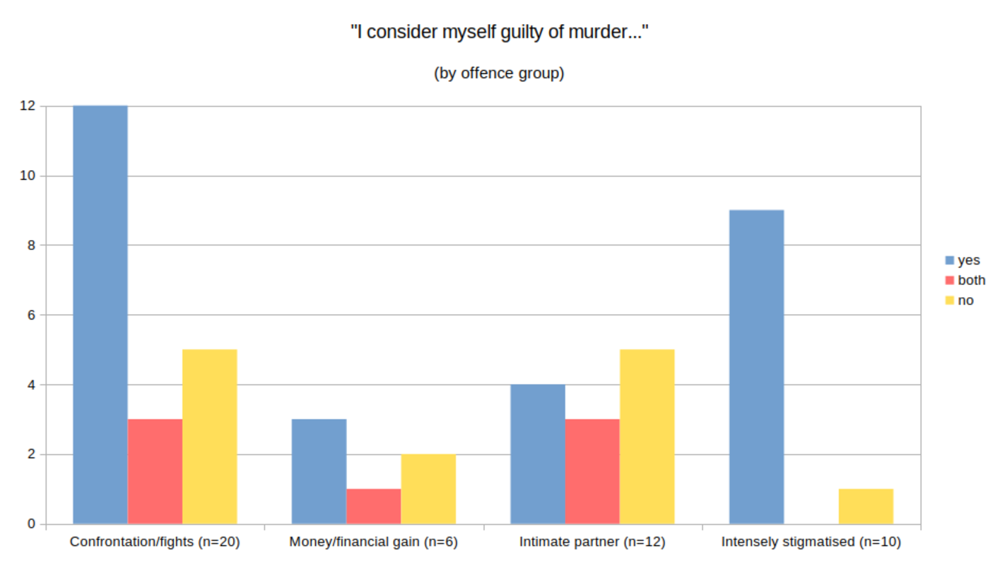

  > [M]urder is, like many 'social facts', not necessarily easily defined or understood […] Although virtually always a major crime […] most, if not all, societies appear to have a moral hierarchy of murder, both with reference to its victims and its perpetrators. [Even if] all killing is proscribed, particular forms are given harsher punishments than others.
  >
  > @morrallMurderSociety2006 [pp. 43–44]

Both penologists [@herbertTooEasyKeep2019; @creweLifeImprisonmentYoung2020; @irwinLifersSeekingRedemption2009; @leigeyForgottenMenServing2015] and forensic clinicians [@adsheadRecoveryHomicide2015; @ferritoLifeHomicideAccounts2012; @adsheadThereMurdererHere2018] have been struck by ethical reflexivity among those convicted of serious violence, especially murder. Many lifers, it appears, "recognise the moral harm of [their] actions and build a new life in response" [@herbertTooEasyKeep2019, p. 13]. Some have also linked this with the passage of time during a long sentence [@creweLifeImprisonmentYoung2020], and others have theorised a more *general* acceptance that blame was deserved, and punishment legitimate:

  > …[w]hen an offender acknowledges responsibility, they are accepting of their offender identity [though] they may also need to redefine and 'discover' a new identity.
  >
  > @ferritoLifeHomicideAccounts2012 [p. 328]

These recent findings are somewhat at odds with findings from homicide research (discussed further in @sec-4-empirical-typologies) that, despite the seriousness of the crime, those convicted tend to minimise and contextualise blame.

This chapter examines the space between the two. Its argument is that recent research has overplayed how consistent the ethical consequences of murder are for those held accountable. It makes the argument through comparisons: I subdivide the sample by murder type (using existing legal and empirical evidence to generate the subdivisions), and then describe how participants in these subdivisions were affected by the conviction and sanction. Where @creweLifeImprisonmentYoung2020 [p. 137] found that a "great majority" of their sample expressed "deep and ongoing remorse about […] their actions", I note *patterned variation* in how participants negotiated with censure, and *not* consistent expressions of remorse.[^4.14]

## Disaggregating a diverse offence {#sec-4-ways-differentiate-murders}

To ground the analysis, the next two subsections address censure: what generates it, who receives it, and what they are typically censured *for*. One reviews how *the law* constructs the 'seriousness' of murders; the second reviews *empirical* evidence on the people typically associated with specific murder types.

### 'Seriousness' in sentencing law {#sec-4-seriousness-sentencing-law}

Schedule 21 of the 2003 Criminal Justice Act [@ukparliamentCriminalJusticeAct2003, sec. 321] specifies how the 'seriousness' of murders is to be converted into the penalty of imprisonment. Its impact on retributive severity has been noted [e.g. @creweLifeImprisonmentYoung2020 chap. 1; @icevlpMakingSenseSentencing2022, 19-23; @mitchellExploringMandatoryLife2012 chap. 3] but, though penalties grew, the mitigating and aggravating factors influencing a determination of 'seriousness' were mostly unchanged.[^4.9] They can be classified (barring a few outliers) into four loose groups, summarised by @tbl-4.1:

+--------------------+-----------------------+----------------------+
| Factor             | Aggravation examples  | Mitigation examples  |
|                    |                       |                      |
|                    |                       |                      |
+:===================+:======================+:=====================+
| The offender's     | 1.  Murders "done for | 1.  Offender         |
| motives and        |     gain" (§3(2)(c))  |     intended to      |
| intentions in the  | 2.  Murders motivated |     cause serious    |
| wider 'homicide    |     by hostility to   |     harm, not to     |
| situation'         |     victim's race,    |     kill (§10(a))    |
|                    |     religion, gender  | 2.  Offender         |
|                    |     identity,         |     believed the     |
|                    |     disability or     |     killing was an   |
|                    |     sexual            |     act of mercy     |
|                    |     orientation       |     (§10(f))         |
|                    |     (§§3(2)(g,h))     |                      |
+--------------------+-----------------------+----------------------+
| The victim's       | 1.  Victim was        | 1.  Offender acted   |
| identity and       |     abducted          |     "to any extent   |
| conduct, usually in|     (§§2(2)(a,b))     |     in self-defence" |
| relation to        | 2.  Victim performing |     (§10(e))         |
| vulnerability and  |     a public service  | 2.  Offender was     |
| power disparities  |     (§§2(2)(c),       |     provoked in      |
| with the offender  |     3(2)(a), 9(f))    |     specified ways   |
|                    | 3.  Offender abused a |     which fall short |
|                    |     position of trust |     of a legal       |
|                    |     (§9(d))           |     defence to       |
|                    |                       |     murder(§10(d))   |
+--------------------+-----------------------+----------------------+
| The nature of the  | 1.  Murder of two or  | 1.  Offender         |
| violence used      |     more persons      |     intended to      |
| (e.g. cruel,       |     (§3(2)(f))        |     cause serious    |
| gratuitous,        | 2.  Substantial       |     bodily harm not  |
| premeditated, or   |     premeditation or  |     to kill, or      |
| excessive, esp. if |     planning          |     believed the     |
| victim(s) suffer   |     (§§2(2)(a), 9(a)) |     killing was an   |
| intensely)         | 3.  Destruction or    |     act of mercy     |
|                    |     dismemberment of  |     (§§10(a,f))      |
|                    |     the body (§9(g))  |                      |
|                    | 4.  Murders involving |                      |
|                    |     "sexual or        |                      |
|                    |     sadistic conduct" |                      |
|                    |     (§3(2)(e))        |                      |
+--------------------+-----------------------+----------------------+
| Weapon use         | 1.  Firearms or       | None                 |
|                    |     explosives used   |                      |
|                    |     (§3(2)(b))        |                      |
|                    | 2.  Knife taken to    |                      |
|                    |     the scene with    |                      |
|                    |     intention that it |                      |
|                    |     be available as a |                      |
|                    |     weapon (§4(2))    |                      |
+--------------------+-----------------------+----------------------+

: Factors determining the 'seriousness' of murder in sentencing law[^4.11] {#tbl-4.1 tbl-colwidths="[18,41,41]"}

Several points emerge from @tbl-4.1. First, 'seriousness' relies in part on inferences about intent (see rows 1 and 3). As philosophers have argued [e.g. @anscombeIntention2000; @cobbTheoriesResponsibilitySocial1994; @schwenkler2019anscombe] intent is a complex matter: socially constructed, and thus liable to be perceived differently by the law and by individuals. There is potential for assessments of culpability and 'seriousness' to diverge.

Second, 'seriousness' also depends on the identity and actions of victims (row 2). Empirical studies [e.g. @luckenbillCriminalHomicideSituated1977; @mietheRethinkingHomicideExploring2004; @wolfgangPatternsCriminalHomicide2016] find that victims, in some forms of homicide, may be "direct, positive precipitator[s] in the crime" [@wolfgangVictimPrecipitatedCriminal1958, p. 2]. Later scholars [e.g. @timmerIdeologyVictimPrecipitation1984] increasingly rejected the victim-blaming implicit in this finding, without dispelling the underlying impression that some homicide victims are more 'ideal' [i.e. weaker, smaller, and attacked by a 'big, bad' offender---see @christieIdealVictim1986]; whereas others are active participants in a conflict leading to their demise. It is notable, therefore, that most of the aggravating and mitigating factors relating to victims in Schedule 21 position the offender as more powerful and the victim as weaker. There is aggravation if this is so, but no mitigation if (for instance) the victim provoked the offender, or if the offender acted in fear (rather than in self-defence).

The basis of 'seriousness' as seen in rows 3 and 4 of @tbl-4.1 is more objective, resting on (for example) whether someone carried a knife or what violence they used. Yet the 'excessiveness' or 'cruelty' of violence (for example) is a matter for interpretation, especially where people act under deranging influences such as extreme emotion, mental illness, or substance abuse. Moreover, aggravations based on weapon use (row 4) are arguably deterrent more than retributive, in that they 'make an example' of the offender, whose reasons for acting as they did are treated as irrelevant. While unquestionably illegal and dangerous, carrying a weapon might appear rational under some constrained circumstances, such as when people are engaged in activities like drug dealing, or when they perceive a risk of violence against them and do not trust that it will be prevented. The point is not to justify weapon-carrying, but to point out that its ordinariness and fathomability are highly contingent on context.

To sum up: censure in Schedule 21 derives largely from an observer's inferences, suppositions, and cultural beliefs in applying the aggravating and mitigating factors; that is, on their beliefs about what could have been 'going on' in a homicide situation. The law discards or ignores information which participants in it might consider essential to a fair evaluation. The result is to open space in which blame may be disputed.

Because the law does not make clear and consistent distinctions between cases, it is to empirical typologies that we must turn for the classification to be applied in this analysis.

### 'Murder types' in empirical typologies {#sec-4-empirical-typologies}

As Chapter [-@sec-2-homicide-murder-empirical-categories] showed, the incidence of murder is patterned on other variables. Murder typologies do not agree on how to classify homicide events [@skottDisaggregatingHomicideChanging2019, p. 4], and take diverse approaches to the task.[^4.20] Most typically, typologies

  > …emplo[y] rudimentary categories such as age, sex and ethnicity of victims and offenders as well as geographic locations where homicides occurred. While such information is essential for comparing rates of homicide, it is basically a list of attributes […] [which does not] examine more closely what happens in murder events and why they might have occurred.
  >
  > @dobashMaleMaleMurder2020 [p. 26]

Classifications based on 'murder events' (or 'homicide situations') offer a more useful basis for the analytical comparisons attempted here. They classify using data on participants *and* *an account*---a sequential causal narrative of the offence. One, by Russell and Rebecca Dobash [-@dobashWhenMenMurder2015; -@dobashMaleMaleMurder2020], was developed from case records and interview data in a British sample of 866 cases. It takes the victim's gender as the most fundamental structuring variable, then subdivides cases by features of the 'murder event'. Only major categories from the original set are used to subdivide cases in this chapter---subtypes were ignored, along with major categories not represented in the present sample. Thus the present sample is subdivided into four 'murder types' for analytical purposes: first, confrontation/fight murders; second, money/financial gain murders; third, intimate partner murders; and fourth, intensely stigmatised murders. The final item comes not from the Dobashes' original classification, but gathers three of theirs and adds another they do not cover, as follows:

  * sexual murders of women [-@dobashWhenMenMurder2015, pt. II];
  * murders of victims aged over sixty-five, whether
    * women [-@dobashWhenMenMurder2015, pt. III]; or
    * men [-@dobashMaleMaleMurder2020, chap. 6]; and
  * murders of infants.

The following paragraphs sketch the main features of four 'murder types' in turn.

#### Confrontation/fight murders {#sec-4-confrontation-fight}

*'Confrontation/fight' murders* [@dobashMaleMaleMurder2020, 39] are "linked to disputes involving the personal character and identity of perpetrators who […] view fighting as a means of obtaining respect and/or enhancing their reputation." Often, the violence involved is performative: finding it intolerable to let a perceived slight pass unavenged, those involved imagine violence to be retaliatory, even when the slight is trivial. Confrontation murders commonly occur in public places, with multiple perpetrators, witnesses, and bystanders. They can appear sudden and spontaneous, but the antecedent disputes need not be: offenders and victims are acquainted in around three-fifths of cases. In the Dobashes' sample, those convicted are young (average age 27), tend to be working-class, are unemployed, or work in unskilled manual occupations.[^4.15]

#### Money/financial gain murders {#sec-4-money}

*Financial gain murders*, meanwhile, share some features in common with those in the 'confrontation' group: working-class, unemployed principals, averaging age 27, who tend not to act alone (67% of cases) [-@dobashMaleMaleMurder2020, 75-77]. They are more often committed against strangers [-@dobashMaleMaleMurder2020, 102], but otherwise, the underlying relationships and situations are heterogeneous. The Dobashes [-@dobashMaleMaleMurder2020, chap. 3] and others [e.g. @mietheExploringSocialContext1999] caution against a sharp division between 'instrumental' and 'emotional' violence, one making confrontation murders 'expressive' while financial gain murders are 'calculated'. Instead, they argue, heightened emotional and physiological states are common to both, though the motivation to obtain "money, resources or commodities" and the higher degree of preparation [with weapons brought to the scene in 90% of cases---see @dobashMaleMaleMurder2020, 75-77] can make financial gain murders appear more deliberate, and hence more culpable.

#### Intimate partner murders {#sec-4-intimate-partner}

*Intimate partner murders* are analytically and aetiologically distinct from the previous two. Victims can include female partners, but sometimes also their children, family members, new partners, or friends, cases the Dobashes refer to as 'collateral'. This is a gendered, hidden, and specialised form of violence [-@dobashWhenMenMurder2015, 47-9], typically occurring in private settings such as the home. Though it is often extreme [-@dobashWhenMenMurder2015, 51-57], men who kill women tend not to identify with it, and often deny their capacity for it [-@dobashWhenMenMurder2015, 67]. There is typically a pattern of escalation, with earlier violence against the victim or against previous partners; @dobashWhenMenMurder2015 [p. 39 and, more generally, pp. 40-47] link this to emotions of "possessiveness, jealousy, and infidelity […] These are acts in which men attempt to possess women and 'keep' them and may be followed by acts of revenge when possession, control, and authority are lost." Intimate partner murderers are less likely to have been socially and economically marginal than with other forms of murder, and they are also usually older at conviction---around 40, on average [-@dobashWhenMenMurder2015, 40].

#### Intensely stigmatised murders {#sec-4-intensely-stigmatised}

Finally, three further murder types present in this sample and described by the Dobashes are grouped together as *intensely stigmatised murders*. Across the Dobashes' underlying categories, those responsible are typically young, highly socially marginal men, often acquainted with their victims but not close to them. Troubles at school, early alcohol abuse, early-onset offending, early experiences of institutionalisation, and (in some cases) physical and/or sexual abuse or neglect commonly featured in their histories [-@dobashWhenMenMurder2015, 153-186, 221-41]. Usually unemployed as adults, many misused alcohol, or drugs, were persistent offenders, and had no (or a violent) history with former partners. These offences were almost always committed alone in the victim's home or a secluded public location. In prison, these men were highly likely to be shunned by others, and to be assessed as dangerous by prison staff, and commonly denied either the murder, a sexual offence relating to it, or both [-@dobashWhenMenMurder2015, 172-182, 235-237].

## Index offences in the sample {#sec-4-index-offences-sample}

Having described the categories used to structure the analysis, the chapter now describes the sample in these terms.

:::: {#fig-4.1 .column-body-outset}

::: {#fig-4.1a}

+------------------+--------------+------------+--------------+----------------+
| Murder type      | Participants | Age at     | Tariff       | Time served    |
|                  |              | conviction |(median, yrs.)|(median, yrs.)  |
|                  |              | (avg.)     |              |                |
+:=================+:============:+:==========:+:============:+:==============:+
| Confrontation/   |              |            |              |                |
| fight            | 20           | 28         | 15.5         | 10             |
+------------------+--------------+------------+--------------+----------------+
| Intimate         |              |            |              |                |
| partner          | 12           | 41         | 19.5         | 7              |
+------------------+--------------+------------+--------------+----------------+
| Money/financial  |              |            |              |                |
| gain             | 6            | 27         | 19           | 11.5           |
+------------------+--------------+------------+--------------+----------------+
| Intensely        |              |            |              |                |
| stigmatised      | 10           | 24         | 16           | 19.5           |
+------------------+--------------+------------+--------------+----------------+
| All              | 48           | 30         | 17           | 10.5           |
+------------------+--------------+------------+--------------+----------------+

The sample by offence type and sentence characteristics

:::

::: {#fig-4.1b layout-align="center"}

Self-evaluated guilt, by offence type

:::

Descriptive statistics on the sample and their index offences

::::

It shows descriptive statistics on their ages and sentences ([-@fig-4.1a]), and their evaluations of their own guilt ([-@fig-4.1b]),[^4.21] both subdivided by offence type. It is noteworthy that neither unambiguous expressions of guilt nor more severe sentences were evenly distributed, with the 'intimate partner' group serving the heaviest sentences, and the 'intensely stigmatised' group most likely to admit their guilt.

### Confrontation murders {#sec-4-index-offences-confrontation-fight-murders}

Twenty participants (42% of the present sample) were in prison for 'confrontation/fight' murders. Eleven (55% of the group) were convicted with one or more co-defendants. All their victim(s) were male. Ethnically, they were heterogeneous: thirteen were White, nine were of Black or Mixed, and one of Asian, ethnicities. With very few exceptions, they fitted the Dobashes' characterisation of this group: most were young when convicted (median age 27) and unemployed or intermittently employed.  Many were accustomed to violence: twelve had served previous prison sentences, and six had at least two prior violence convictions. Two had previously faced homicide charges, though with neither previously convicted of murder. These were, then, mostly men willing to use violence and who saw in it a means to resolve disputes. Thirteen (or 65%) unequivocally admitted murder. Of the others, three equivocated, and five denied guilt, of which three were technical and two were strong claims of innocence.[^4.4]

#### Slights, provocations, and co-offending {#sec-4-index-offences-confrontation-fight-murders-slights-provocations-co-offending}

In accounts of the offence among this group, the victim often appeared as an active participant. Interviewees nearly all suggested that retaliation against a slight was justifiable in the abstract, even if they admitted with hindsight that a lethal outcome was excessive. The slights they described varied, but gradations of status and hierarchies of worth were in the background of most:

  > [Speaking rhetorically to his victim] I don't BELIEVE you've done that to me.[^4.27] That's what… That's the truth, isn't it? People don't hit me. It doesn't happen, in my world.
  >
  > Robert (Swaleside, fifties, early)

Heightened emotions---especially anger---were a common theme. Gary's shifts of tense in the following quote, and his slippage from first to third person, personified his anger as a force overwhelming his faculties of self-control:

  > I don't know how we end up fighting, but somehow I must grab the knife […] And I stabbed him [several dozen] times[^4.19] […] all I can remember now, in my head, *it kept saying*—my anger—"don't let him get away with it" […] For some reason, *it could not let it drop* […] Red mist, they call it.
  >
  > Gary (Swaleside, fifties, early)

William's offence escalated around a drug debt he owed to his victim, but their relationship was multifaceted. His account of it vividly suggested fear, an emotion which, like anger, was prominent in these accounts:

  > I genuinely felt it was either me or him […] No matter what the judge said, I know. I know what happened […] I'd understand manslaughter, but […] [I wish the court could have seen] [w]hat kind of a person he was. How intimidating he was, and how… how I, personally, felt… and how I could be intimidated and… so, how I was scared, how scared I can be […] And how much of a horrible person he is. Or was.
  >
  > William (Swaleside, forties, early)

Other narratives echoed William's "me or him", suggesting contingency in who survived and who died. Victim and perpetrator appeared morally interchangeable, prompting frustration for participants who felt wrongly blamed as aggressors:

  > *Some people I interview tell me, "When I started the sentence I knew I had to change," or, "I knew I wanted to change," or something. It doesn't sound like that's your--*
  >
  > [angrily] Change from WHAT? Listen, I was in my house, mate […] You get what I'm saying? He came to my house. He was threatening me. It happened at the front of my doorstep. [If] they'd given me manslaughter, then maybe.
  >
  > Courtney (Swaleside, forties, late)

Anger or fear; provocation or intimidation; the presence of strong emotion diluted feelings of responsibility. So, too, could the involvement of multiple co-defendants:

  > From [more than five] assailants in the CCTV footage, the police only identified and charged [some].[^4.18] [They were all] acquitted except him […] [Today] he would choose to plead guilty to manslaughter to get out of prison sooner, but he was not guilty of murder because he hadn't stabbed anyone. Said the police "got away with doing whatever they wanted".
  >
  > Yakubu (Swaleside, thirties, early), from notes

These were not *denials* of responsibility, exactly: as noted in @sec-4-index-offences-sample, nearly two-thirds of the group expressed unequivocal guilt when asked a yes/no question. It was more that their narratives spread blame: by sharing it with the victim, or with co-defendants. Expressions of regret were not uncommon, but usually centred on parties other than the victim, particularly family members (of both participants and the victim).

As Courtney (quoted above) said most directly, even when they admitted they had taken life, this group did not always feel obligated to change; enduring the punishment seemed enough. Correspondingly, when they acknowledged that they *had* changed in prison (as was inevitable considering the spans of time involved), they seldom attributed this to the sentence, but used terms like 'growing up' or 'maturing'. Some were ambivalent about sentence progression, lest projects of self-preservation and survival be mistaken for an admission of guilt, or co-opted by the prison as evidence of its reformative success:

  > I ain't changed who I am. You understand what I'm saying? So, you ain't rehabilitating shit […]
  >
  > *Is that what you meant when you said it felt odd to get your C-cat?*
  >
  > Yeah, yeah, yeah. It pissed me off because, obviously, it's a great thing to have. But it's, "hold on, does people really think I'm doing this fucking bird?"[^4.22] […] Like, I'm not TRYING… I'm not HAPPY to get a C-cat […]
  >
  > *You don't want a pat on the back, you mean?*
  >
  > Yeah. Why am I happy about a C-cat? I shouldn't even be in jail.
  >
  > Reuben (Swaleside, thirties, mid)

This subsection has reviewed how slights, provocations and co-offending---all of which are common in confrontation murders---affected feelings of responsibility. These men tended to accept they had lost control of themselves, but did not necessarily accept that this was their responsibility, rather than someone else's. The next subsection briefly examines one kind of confrontation/fight offence which produced deeper feelings of remorse.

#### Acquaintance with the victim: friends, acquaintances and strangers {#sec-4-index-offences-confrontation-fight-murders-acquaintance-victim}

Some participants convicted of confrontation/fight murders had killed someone they either cared about, or recognised they ought to have done. Expressions of remorse and regret *centred on the victim* were more the norm here. It was evident that such acts could be judged harshly in prison:

  > [My friend] said, "He was your best mate, Bill. How could you kill your best mate?" […] He was deliberately making me realise what I'd done […]  I needed somebody to say, "Fucking hell, Billy, that was fucking bad, that"---to actually put it in context.
  >
  > Billy (Swaleside, forties, late)

With known victims, there was also greater awareness of *who else* had been harmed, via ripple effects:

  > I've just took away their brother, their uncle, their… well, not their son, the parents are gone, but do you know what I'm saying? […] I wouldn't tell them [in court] what he done [to provoke me] because, come on, that's not fair, is it? So, I said, "I'm not saying anything," just to show a bit of respect […] He weren't a stranger, he was someone I grew up with.
  >
  > Ron (Leyhill, fifties, post-tariff)

  > My daughter, my youngest daughter, and my mate's daughter---the [mate] who I killed---they was out shopping that day […] They were best friends […] [My family] had to move house, the kids move school, everything.
  >
  > Terry (Swaleside, fifties, mid)

Thus grief and guilt magnified one another, and tightened censure's grip. Participants had harmed real, concrete people, rather than simply transgressing abstract legal/moral principles. 

#### Ethical work---attitudes to confrontation {#sec-4-index-offences-confrontation-fight-murders-ethical-work}

  Those who had killed friends aside, men convicted of Confrontation/fight murders expressed regrets centring not on their victims, but on the damage to themselves and their loved ones caused by their propensity for violence. Since prison life abounded with provocations, slights, and fear, and also with opportunities for reflection, there was scope for them to reconsider how these stimuli---which were also those that produced the offence---affected them.

Thus, despite feeling a dilute form of responsibility, many of these men described shifts in their attitudes to violence. A kind of relational strategising drove this process. It involved neither a profound shift in moral attitudes, nor a reorientation towards interdependence, but instead a more calculating, self-distanced mode of being in the world, best characterised by self-control and the practical wisdom of 'choosing battles'. 

To describe this shift in greater detail: some early-sentence prisoners described provocations as something to be courted. Establishing a reputation for violence offered power, of sorts: to intimidate others, and to extract concessions from Swaleside, a prison trying to reduce violence rates. For Levi, prison life reproduced the moral logic of street violence; reputation was a means to an end. Thus in his case, ethical work involved acculturating himself to segregation, which from his vantage point seemed the only (and a very short-term) consequence of prison violence:

  > I can get a move [off the wing if I want one]: I can go on the wing, right now, knock out a screw and get moved off the wing [kisses his teeth]. There's no difference. I ain't getting no extra days… Block's my second home.[^4.7]
  >
  > Levi (Swaleside, twenties, very early)

Participants later in the sentence, however, mostly understood the 'power of the pen' [@crewePrisonerSocietyPower2009]. They cared to keep a clean record more than Levi did, and some were also fearful of prison violence. For them, provocations and confrontations were to be avoided at any cost:

  > [Anything I do outside of my cell, I do] just to get some money, so I can have vapes and treats […] [My cell is] my rock. It's the one place where I can relax, where I don't have to think about anything […] The door's shut, there's going to be no aggro, no trouble on the wing, nobody messing me around.
  >
  > Billy (Swaleside, forties, late)

Others handled provocations not through disengagement, but via judicious engagement. Understanding one's own limits and social dynamics on the wing became the ethical priority. Many participants described themselves as astute judges of character, and prison as the whetstone on which this faculty was honed:

  > I'm observant now, more than I've ever been […] I suppose I'm just watching everyone. Thinking, oh, he's being a bit of a prat today. You know, over an orange, or over a Penguin or something stupid. People getting stabbed for it.
  >
  > Gary (Swaleside, fifties, early)

Minor debts served as a test of relationships and of one's own reactivity, with several men describing borrowing and lending as a *deliberate* test of character:

  > It's who you let in. So obviously, I give people one chance […] I will borrow you a bag of rice and then if you don't pay it back then I would be like, aight, cool. I'm not even gonna run you down for that rice, but I'm not gonna borrow you rice again […] I'll give you one chance.
  >
  > Reuben (Swaleside, thirties, mid)

A bag of rice was self-evidently worth less than sentence time added through being classified as risky prison violence. Iterated, such insights could produce deeper transformations: shifting attitudes to the importance of 'face', 'reputation', and provocation itself. An ethics initially responsive to incentives, which dealt in cost-benefit calculations, sometimes provoked further-reaching examinations of the beliefs underlying participants' emotionality. This was real change, but did not necessarily involve "deep remorse" centred on harms done to the victim. It could foster a sense of autonomy and self-respect, won through growing self-control and (perhaps) self-mastery. It was telling that many in this group were particularly committed to their health, following strict regimens of physical training, and habitual routines building self-discipline and self-esteem.

  > About half six… get up, tidy my bed up, the usual stuff […] These are like rituals I do every morning. If I don't get up and drag myself out of bed and I don't do the tidy, I know that depression's kicking in […] Then I come out, go to the gym, train as hard as I can […]
  >
  > *What does it mean to you, the gym?*
  >
  > Oh, it's everything. That's my medication, that's what keeps me… […] [When] I come to prison I was fucking… […] I'll have to show you a picture, I was a big fat fucker. I was always slim and athletic as a boy, but in my twenties [I got] lazy, with drinking and eating and whatnot. Since I come to prison I've trained practically every day.
  >
  > Tony (Swaleside, thirties, mid), from notes

#### Summary---confrontation/fight murders {#sec-4-index-offences-confrontation-fight-murders-summary}

To summarise: men convicted of Confrontation/Fight murders typically entered prison seeing violence as normal and rational, if also context-specific. They were used to it. Some sought opportunities to demonstrate what happened to anyone who 'mugged them off'; others were fearful of victimisation by others, and sought pre-emption. Most, though, identified with violence to some extent, and did not find it difficult to think of themselves as (formerly) violent men. Most also admitted at least some involvement in causing someone else's death. But their offences, often not committed alone, felt less blameworthy than the hefty 'murder' tag often implied.[^4.28]

In prison, few had relinquished the general feeling that they had been *provoked*. Nonetheless, unless they maintained innocence, or were very early in the sentence, they were not unregretful, and their thinking about the costs and benefits of violence had shifted. They 'turned around' or 'turned away' from their past actions—consistent with repentance as defined by @bottomsPenalCensureRepentance2019 [pp. 129-136]—but were unrepentant in the 'deep' sense advanced by @duffPunishmentCommunicationCommunity2003, which involves a broad, heartfelt commitment to projects of reform and reconciliation. They commonly expressed feelings of regret and remorse, but only for those who had killed someone they cared about were these centred closely on the victim. 

In most cases, then, these men responded to a message of deterrence, not to one demanding reform. In prison, they increasingly tried to avoid provocation by keeping their emotions at arm's length. This was not easy, but as an environment, Swaleside at least afforded many situations to test their resolve. Ethical change centred on beliefs about provocation, the value of reputation and 'respect', and the costs and benefits of violence. It did not necessarily result in a far-reaching recognition of human interdependency, nor in profound moral realignment.

### Financial gain murders{#sec-4-index-offences-financial-gain-murders}

Six men (13% of the sample) were convicted of financial gain murders. Their victims included one woman and six men. Like the Confrontation/Fight group, their median age at conviction was twenty-seven. Two maintained a technical claim of innocence;[^4.13] one equivocated; three admitted guilt. Four had prior convictions, and three of these were serving at least their third prison sentence. Their median tariff was 19 years. None of these men had acted alone. In most cases, co-defendants been part of the underlying conspiracy (to rob or burgle), but had usually not been charged with murder.

#### Panic and (mis)calculation {#sec-4-index-offences-financial-gain-murders-panic-miscalculation}

Again, the emotional content of offence narratives in this group was striking. Most spoke in ways not suggesting 'calculation' or 'instrumental' thinking, but intense agitation: neither shame nor possessiveness nor jealousy nor anger (as with other groups), but panic, whether prompted by the offence situation itself, or some wider circumstance. Commonly, they had lost control of situations they believed they could handle:

  > As soon as they were in the house he remembers thinking, "I'm miles out of my depth here". [The victim] started screaming to raise the alarm. He panicked, and [tried to silence them] […] He learned later that [they] had died […] He never meant harm, but said, "that's not the point, is it?" […] He found the tariff shocking but accepted it quickly: "right from the day" of the offence he knew […] it was wrong, and he'd pay a heavy price.
  >
  > Liam (Swaleside, forties, mid), from notes

Ebo, similarly, had not expected the target of a robbery to resist:

  > I got a knife in my hand… the guy… He was sixteen stone, I must have been about ten stone, eleven stone… I'm not saying I'm a kid but I'm a young… a teenager… fighting a sixteen-stone man […] But I'm not saying… I'm not trying to say… I mean, I know I shouldn't even have been there… I don't know… I didn't know… how to put across that my intentions were not to harm. I didn't know how to do it then. I still probably don't know. I probably still wouldn't know how to explain about… There's no way I can put it across to them.
  >
  > Ebo (Swaleside, twenties, mid)

Ebo's hesitations were revealing. His difficulty in "putting across" his lack of malign intent recognised that, on some level, the effort was futile: he "shouldn't even have been there". As both he and Liam recognised (Liam more explicitly), a fatal outcome rendered intentions moot: they had not been "carrying out any respectable project" and the people they were robbing "could not possibly be blamed for being" where they were [@christieIdealVictim1986, 19]. They were 'ideal victims', meaning that explanations (like Ebo's) which centred on "victim-precipitation" [@wolfgangVictimPrecipitatedCriminal1958] rebounded immediately on the narrator. Panic shifted responsibility---from one's deliberate actions to one's uncontrolled reactions. It made the offence appear less willed, and more a consequence of unwilled internal states.

In other accounts, things had still ‘got out of hand’. However, not panic, but more powerful forces beyond the individual's control, were presented as having narrowed the scope for ethical choice. These forces could be internal---the insatiability of addiction, in one example---or external, as in the following case:

  > [Co-defendant] phoned him and said they owed [a six-figure sum] to the [organised crime financiers of their illegal activities]. They demanded repayment the following week. Threats were made: their creditors let it be known they knew where Frank's family lived.
  >
  > Frank (Swaleside, forties, post-tariff), from notes

This account suggested that Frank's capacity to "act otherwise" had already passed [see @bottomsDesistanceSocialBonds2006, 259-60]. Situating his 'loss of control' temporally further from the murder, however, pushed Frank into a different kind of reflection: on his capacity for premeditation. Knowing he would be recognised by the victims of the robbery, Frank's ability to *actively suppress* his own moral emotions had become, years later, the detail which troubled him the most:

  > I shot them in cold blood. That's not nice, but it's the truth. The only way you can do something like that is to dehumanise the person, see them as an object you need to move out of your way. Otherwise you won't do it […] I thought about it in the car, all the way there […] I didn't want to do it. I knew it was wrong. And I did it anyway. It took me years—years—to face up to it.
  >
  > Frank (Swaleside, forties, post-tariff)

Like the confrontation group, these men pointed to the actions of others, or to relevant features of the surrounding context, to explain their violence. But it did not 'work' to share blame with the victims, because the implicit claim was paradoxical: the narrator had *come prepared to use violence*, but had not *intended harm*. Events had spun out of control, but these men recognised that this offered no justification: the wider situation was of their making.

In one case where the victim was less 'ideal', a theme of moral interchangeability was present, more reminiscent of the 'him-or-me' accounts described in @sec-4-index-offences-confrontation-fight-murders-slights-provocations-co-offending:

  > All I wanted her [a risk assessor] to understand was that this guy was… You know, was the threat credible? […] The deceased had a firearm on him […] It's not like man's making up porkies. These guys was armed. We was armed. […] None of us didn't have any qualms about shooting the other person. So it could have been easily him sitting here interviewing with you today […] Even though I was a bad person, the way that she was making it look… like, just, we went out just to kill this guy, do you understand? That wasn't the case.
  >
  > Leon (Swaleside, forties, mid)

Leon's demand was that his offence be seen in context: conventional morality and the law offered no guidance in a 'him-or-me' situation. The risk assessor had challenged Leon's insistence on this point, suggesting that he was presenting himself as a vigilante hero, and thereby minimising blame and evading responsibility. For Leon, this missed the point: *no one* emerged with credit from his account of the offence; both he *and* his victim were "bad people", and his job was to make the best of having survived.

Generally, this group struggled to justify an unjustifiable situation, but wanted to describe the few, stark, choices they had perceived at the time. The killing was not the defining ethical moment in their accounts; it was a consequence of long-prior decisions---to become involved in crime, to use drugs, and so on. Only Frank, who had deliberately and calculatedly suppressed his moral emotions, described more intense feelings of remorse, suggesting that he saw the causes of his violence as internal, not external.

#### Moral difference and role-taking {#sec-4-index-offences-financial-gain-murders-moral-difference-role-taking}

No participant in this group had acted alone. Thus, as with the confrontation/fight group, the involvement of multiple actors was again significant, though it could intensify or lessen blame, depending on the circumstances. In two cases, official records made clear that a co-defendant had struck the fatal blow. These interviewees did not feel responsible:

  > I never intended to kill him, and I didn't kill him, so I don't lose any sleep over it. It's a tragedy and I'm sorry that he's died, but that was out of my control.
  >
  > Dalton (Leyhill, thirties, mid)

Dalton, lacking previous convictions, found it difficult to rationalise the sentence as a form of cosmic justice for past misdeeds, as other joint enterprise defendants have done [@hulleyMakingSenseJoint2019]. Nixon's lengthier record of previous convictions offered more to work with in this respect, and his view of the sentence was more akin to cases described by Hulley et al., in which secondary parties constructed narratives in which they deserved punishment for *something*, even if not for the index offence, and by doing so made more sense of their predicament:

  > There's a thing with me called swings and roundabouts. I'm doing this bird, and in the past, I've done a lot of stuff that I got away with, so this makes up for it […] Like, sort of, balancing the books, yes? […] [and then] I come out and live my life.
  >
  > Nixon (Swaleside, forties, post-tariff)

Secondary parties, then, accepted no more than secondary roles, though sometimes invoked karma to make sense of their position. The other four men admitted guilt in the murder (one equivocally), but recognised that the lesser convictions handed down to co-defendants had been aggravated by the murder. Some felt responsible, and expressed guilt relating to the severity of sanctions received by *others*:

  > He basically had nothing to do with it […] with the planning […] He wasn't active […] So in the robbery, he was just watching. He didn't think what happened would happen.
  >
  > Frank (Swaleside, forties, post-tariff)

  > One of my co-d[efendant]s, he was the lookout man. He had… not to say he had nothing to do with it, but he didn't know nothing […] I feel it's a bit harsh. He got manslaughter and conspiracy to rob. My actions shouldn't have led him to be convicted to a manslaughter.
  >
  > Ebo (Swaleside, twenties, mid)

With this group, then, unlike with the Confrontation/fight group, co-offending did not *necessarily* spread blame. It *did* lead, naturally, to moral comparisons, some centring on questions of desert and procedural justice, and some on roles in the homicide event. But expressions of remorse or regret centred, as with the Confrontation/Fight group, on how the sanction had impacted them and their loved ones.

#### Ethical work---taking responsibility while rejecting judgement {#sec-4-index-offences-financial-gain-murders-ethical-work}

  > A good person isn't made in here; a good person arrives here, and they either stay good, or they don't.
  >
  > Dalton (Leyhill, thirties, mid)

For Nixon and Dalton, secondary parties who denied guilt, life was on hold. Ethical development occurred elsewhere; prison could only make you worse or (at best) impose an ethical stasis. Ethical work in these circumstances consisted in surviving, and resisting taint. In keeping with this preoccupation, both were fluent in their contempt for certain categories of prisoner:

  > It's draining being around all these fucking nonces[^4.17] […] having these fucking dirty bastards staring at you […] They're ready to go and put a note in the box, or say something: [contemptuously, in a wheedling tone] "His music was a bit too loud. He didn't say hello to me."
  >
  > Dalton (Leyhill, thirties, mid)

An instructive contrast was evident with the other four in this group, who admitted guilt. They took a more sanguine view of moral status, while also preserving the view that prison was not a place for 'real' ethical life:

  > We're all just people. We're all in prison […] No one's better than anyone else […] I mean, some… I know some people have done worse things than others, I get that. But… I'm not here […] [to take] on board all everyone's done and all that […] I'm not interested. They're not my family, they're not even my… I mean… like… They're not even real friends, they're just friends because I'm here.
  >
  > Liam (Swaleside, forties, mid)

These men wore the 'murder' label pragmatically, feeling responsible for the offence but rejecting outside judgement by people who did not understand its circumstances. Such moral fault as they diagnosed in themselves centred less on the offence and more in the lifestyles which culminated in it. These men were not *eager* to perform the identity of 'reformed characters'; but they were strongly responsive to the incentive structures of the sentence, complying and engaging pragmatically:

  > You need to wake up and smell the coffee, innit? I'm doing life, and the chances of me getting out before my tariff is slim to zero, innit? So obviously, *I need to do what's best for me*, to progress and go home at the earliest opportunity. So if that means if I need to do seven courses, I'm going to try and get to do these courses, if I need to buckle up on behaviour, I'm going to do whatever I need to do to get to go home to my family, innit? *Eyes on the prize*, innit? That's the most important thing.
  >
  > Leon (Swaleside, forties, mid)

To aim for a 'prize' necessitates playing along, even if one would ideally prefer not to be in the game at all. Dalton and Nixon could not do so authentically. Leon, who could, avoided seeing his sentence as an irretrievable loss by 'gleaning' [@irwinFelon1987] from it. He and some others in this group were very interested in education and knowledge, pursued for intrinsic reasons and not mainly because it was expected to lead to employment or work opportunities:

  > *What did you get from doing your degree?*
  >
  > It kind of opened up my eyes a little bit that I had been… let down by society, in that if I had been given the opportunities as a youth, then… my life might have been turned out different. That I actually could have, you know, become something other than what I had become […] Obviously, you don't really know what you can achieve until you […] set your goals high.
  >
  > Leon (Swaleside, forties, mid)

#### Summary---money/financial gain murders {#sec-4-index-offences-financial-gain-murders-summary}

No financial gain murder in the present sample was committed alone, and the roles played by participants were important to their ethical meaning. Those who were secondary parties to joint enterprise murders, like those who maintained innocence, found it hardest to think of the sentence as being in any way meaningful. Nixon had constructed a 'cosmic justice' narrative; Dalton had not; and both characterised the prison as a parallel, meaningless world: a non-place in which to live non-life while passing non-time [@ievinsPrisonSpaceNonlife2024]. Other participants recognised that their offences had been wrong. They struggled to varying degrees with the idea that their intentions (which most characterised as more benign than 'murder') no longer mattered after someone had died. They suggested they had lost control, or miscalculated. The defining ethical moment—when it seemed they could have done differently—was often long gone by the time of the offence. They blamed neither the victims nor provocation, instead describing morally compromised circumstances, and outcomes they had not foreseen. Ethical work involved pragmatically taking what one could from the wreckage, while rejecting imposed identities.

### Intimate partner murders {#sec-4-index-offences-intimate-partner-murders}

Twelve participants (25% of the sample) were in prison for intimate partner murders. Only three cases featured co-defendants, only one of whom was party to the violence (rather than the related charge of 'assisting an offender'). Nine of their victims were adult women, all either partners or ex-partners; the other three were adult male associates of current or ex-partners. This was, by far, the oldest group at conviction: the median age was forty-one, ranging from sixteen to sixty. Ethnically, eight of the twelve were White; three were Asian; and one declined to describe his ethnicity. They admitted guilt less than other groups, just four (33%) doing so unequivocally, with three (25%) equivocating, three (25%) making strong claims, and two (17%) technical claims of innocence. They had the longest minimum terms of any group, at a median of 19.5 years. Yet all twelve were also serving their first prison sentence. Six had previous convictions, most dating to the 1980s or earlier. Two related to earlier relationship troubles; two were fines imposed in the 1970s for contact sexual offences certain to have been handled more severely today. Accordingly, although they did not think of themselves in this way, some had histories of controlling behaviour and/or violence towards women.

Possessiveness and control showed up less in their accounts of their relationships, and more in their curation of their own narratives. They implicated victims in the offence, and minimised their own responsibility, more consistently than other groups. Sometimes, this was straightforwardly victim-blaming. Others situated the offence in emotional dysfunction, as if the relationship, not the victim, had been to blame for what happened. What was clear, throughout, was that publicly 'wearing' the offence was very difficult: there were fewer moral discourses within which claims of provocation would 'work'.

#### Locating responsibility in intimate partner murders 'proper' {#sec-4-index-offences-intimate-partner-murders-locating-responsibility-proper}

Without co-defendants, sharing blame around was difficult, and involved a choice: to deny involvement entirely; to blame the victim; or to accept responsibility. Much of how the group reflected on their offences should be understood in this context.

Two participants maintained strong claims of innocence. Like those in every group who made such claims, they went to great lengths in narrating and questioning the case against them (as if to relitigate it). By contrast, questions dealing with moral obligations were answered tersely. There was, simply, nothing to discuss:

  > *Do you perceive any kind of moral judgement or message coming from the conviction?*
  >
  > Never.
  >
  > Olivier (Swaleside, sixties, very early)

Olivier would be very old by tariff expiry. He saw the post-release period as worthless, and perceived no reason to compromise on his stance, implying that suicide was a preferable choice:

  > I would have more chance of being dead than alive [by the parole eligibility date]. So no, I'm here by choice [to win my appeal]. I think I would have done myself in without it.
  >
  > Olivier (Swaleside, sixties, very early)

Ian, who had been in prison for far longer, but also had more potential post-prison years ahead, saw more reason to compromise. This entailed finding past forms of behaviour he did consider morally faulty, and working these around a narrative still premised on the claim of innocence:

  > [I realised that] even though I was innocent, there are always aspects of your life that you can't be proud of. For you to then apply for the [offending behaviour] course shows your enthusiasm […] Instead of getting the hump [about participating], you're making a conscious effort, and I think you get a better response.
  >
  > Ian (Leyhill, fifties, post-tariff)

Thus Ian, while continuing to deny any responsibility for his ex-partner's death, admitted past infidelities and parlayed this admission into a reform narrative, addressing the risks officials associated with the murder. Others claimed technical innocence, usually by reference to self-defence:

  > There was no intent to harm my wife. Never ever. She is aggressive, she stab me once before [when we argued] […] I was scared, I was blackout, I don't know what happened, it's just a dream.
  >
  > Aftab (Swaleside, thirties, early)

Thus even where guilt was admitted unequivocally, narratives of intimate partner murders often questioned blame more subtly. The extract above and others like it usually culminated very long narratives, the effect of which was to present their partners as conniving, manipulative, spiteful, or unfaithful, and thus to implicate them in some way. Finances were particularly commonly presented as a 'trigger':

  > Probation did not understand some offences are "true one-offs". His wife, a "nymphomaniac", was constantly having extramarital affairs. Despite these troubles he […] "loved [her] to the end" and "she was only dead because she tried to steal the house" from him.
  >
  > Emlyn (Leyhill, seventies, post-tariff), from notes

  > I didn't go there with any intention to harm a single hair on her head. I went to find out why she took the business from me. And that's what I wanted to find out. But unfortunately, what happened happened.
  >
  > Alan (Swaleside, fifties, very early)

In some respects, these exculpatory implications echoed those in the confrontation/fight group. However, as with the financial gain group, there appeared to be few narrative templates available which excused their violence, this time in the domestic context; intimate partner murders, in prison as in wider culture, seemed particularly blameworthy. This might have been the reason the accounts quoted above deflected blame by constructing their victim as a threat to their life, limb, and livelihood. Self-defence, more than provocation, offered moral cover against censure, to the extent that the claim was credible.

Only a few participants in the group threaded this needle by explaining the offence *without* suggesting that their victims were to blame. They narrated the relationship as a kind of 'toxic dyad' which brought out the worst in both parties. What also stood out was the emotional connection these men continued to cultivate with the victim's memory. In some sense, the relationship lived on:

  > It's an offence against her, her family, but also my family, and God […] [Murder] is a massive sin, you know? It's one of the gravest sins that you can commit in Islam […] *If you've sinned against an individual, you've got to earn their forgiveness*. Now, I can't go up to her and say, "sorry", but in bettering myself […] all the character flaws I had […] if I improve all of that, then maybe somehow [my wife] will find a way to forgive me.
  >
  > Rafiq (Swaleside, thirties, early)

Paradoxically, Rafiq felt that he could only expiate his 'sin' by obtaining his late wife's forgiveness. Feelings of this kind perhaps reflected a 'disenfranchised' form of grief [@dokaDisenfranchisedGrief1999]: one unlikely to attract recognition, support, or sympathy from others, and thus harder to process. Grant, too, maintained a close relationship with his late wife's memory. When we started the second interview, he checked the recorder was running and then said he wanted to 'set the record straight', having described at length in the first what had become a dysfunctional and very unhappy marriage:

  > I met Elena[^4.29] when I was [age]. Didn't get married till I was [age]. So that's [quite a few] years, right? She was lovely. Alright? [voice cracking] And that's why I still love her today. Alright? I'm not stupid. I wouldn't have married her if… [pause] Things changed… Alright? So I just want to put the record straight. I'm not saying it was always like it turned out… She was lovely. And that's… [crying]
  >
  > *I'm sorry… [pause] if I kind of gave the impression I thought something else.*
  >
  > No, no, no, no. It's just that I thought about it last night and I thought to myself… in talking about how it went wrong… I've come across… I don't want to slag her off, that's all.
  >
  > Grant (Leyhill, fifties, late)

Across the intimate partner group, there were three broad stances regarding blame. One (denial) was straightforward. A second [formal guilt with 'implicatory denial'--- see @cohenGovernmentResponsesHuman1996, 522], accepted responsibility but narrated the offence so as to lessen blame. A third stance, moral guilt, accepted responsibility but situated it in a context of tragic (and mutual) dysfunction.

#### Locating responsibility in 'collateral' intimate partner murders{#sec-4-index-offences-intimate-partner-murders-locating-responsibility-collateral}

It was suggested, in describing the confrontation/fight and money/financial gain groups, that the victim/offender relationship could alter the moral and emotional ramifications of the offence. Contrasting intimate partner murders 'proper' with 'collateral' offences underlines this point. Compared to those who had killed their partners---especially where those relationships had lasted many years---those with 'collateral' offences seemingly encountered less difficulty in explaining their violence, and their accounts could seem glib by comparison. For example, in one case, the claim was that the offence was done in a noble cause:

  > I killed that guy because I was in love with her. Not out of jealousy [but] to save her […] The best outcome, for all of this—forget me, you know?—is for her to go and flourish and be as good as she can possibly be. That would be, you know, the best outcome. Because then *my job is complete, the mission is a success*.
  >
  > Matt (Swaleside, fifties, very early)

Others treated their guilt as a private matter. Having not harmed someone within their family, they were under less pressure to acknowledge harms beyond their immediate circles of concern:

  > To this day he can't really understand his motives. He talked about having spent his life solving problems, and how perhaps he saw [the victim] as a problem to be solved […] He hasn't had "opportunities to discuss it", and feels the "reaction of men" has been "vindictive and unsympathetic", while that of God has been "love and forgiveness". It was "a major thing" to have taken life in this way; and yet he has maintained innocence from the start.
  >
  > Gerald (Swaleside, seventies, mid), from notes

These instances demonstrate how important are both the 'depth' of the relationships ended by the offence, and the cultural 'templates' at hand to narrate it.

#### Ethical work---compartmentalising and controlling the narrative {#sec-4-index-offences-intimate-partner-murders-ethical-work}

For those convicted of intimate partner murders, ethical work resembled a kind of compartmentalisation. How they saw their offences was well captured by Emlyn's words (quoted in @sec-4-index-offences-intimate-partner-murders-locating-responsibility-proper): "true one-offs". The murder was an aberration: something out of character, and discontinuous with the self:

  > I've always been well-behaved, I don't get into fights, I've never been violent except for my crime.
  >
  > Timothy (Swaleside, twenties, very early), from notes

It followed that they also felt less obligated to become (and to be seen to become) *formerly* violent men. Indeed, most set little store by 'reformed' or 'rehabilitated' status as a marker of moral worth. Instead, they emphasised that they were *already* morally worthy: other prisoners, not them, needed major reformative change:

  > All the charity work I've done on the outside for various people… you know, with regards to [my business], all the things I've done to help other people and stuff. And in seeing that, there's an opportunity here to be a Listener […] Well, that's something where *I can still continue to help people* […] [But] *so many people are trying to do it for all the wrong reasons*.
  >
  > Alan (Swaleside, fifties, very early)

The sense of themselves as morally worthy people perhaps also explained a marked tendency towards censoriousness [@mathiesenDefencesWeakSociological2012] regarding the prison's failures to perform its rehabilitative function with those who really needed it:

  > It's a nonsense, the whole system. There's no rehabilitative improvement, really. And above all, it seems to me that self-control is one of the fundamental aims of rehabilitation. Set in a context, a framework of standards… so they recognise the standards and they're trying to aim for those standards.
  >
  > Gerald (Swaleside, seventies, mid)

Some members of this group---including Gerald---identified participation in the research with an opportunity to contribute to a conversation about prison reform. They were drawn to prisoner consultation initiatives, and were fluent and assiduous users of the 'rehabilitative culture' terminology in vogue with prison managers at the time [see @mannWhatRehabilitativePrison2018]: 'residents' not 'prisoners', 'rooms' not 'cells', and so on. Subtly, this signalled their moral alignment with 'the system', in contrast with the many other participants who scorned this language.

Only Grant and Rafiq, who admitted moral (not formal) responsibility and saw their offences as *culminations*, not *aberrations*, fully accepted that *the conviction itself* rendered the demand for ethical self-change a legitimate one. They spoke sincerely about change, but this did not mean they accepted wholesale the psychological theories of domestic violence causation promoted by OBPs. Rafiq, in making sense of his offence, preferred a tragic language of distress, remorse, and emotional dysfunction over one of 'abuse' and 'violence'. Nevertheless, he and Grant felt obligated to engage with official terminology, prompting ambivalence:

  > They will throw those words like "abusive"---that's a very strong word […] To me […] [it's] where you're going out of your way to abuse this person, whether it be physically or verbally. That was never my intention, *that was never me*. And maybe that's why I felt bad […] *because I did become that person* […] "Minimisation", "justification", "denial", "excuse", "not taking responsibility", "shifting the blame". Those are key words that prison psychologists, facilitators use. It's hard. *I can see where they're coming from, but also not having my side acknowledged, it's painful*.
  >
  > Rafiq (Swaleside, thirties, early)

The 'pain' was that of being defined from outside. Rafiq's emphasis on his good intentions rhymed with similar protestations across the sample, and were a way of disowning the act. Nonetheless, he admitted having "become that person", only later discovering a language of emotional dysfunction which helped him explain how. In relinquishing control of the narrative, he and Grant were unusual in the intimate partner group as a whole; they accepted what Rafiq (elsewhere in the interview) called "kind of a new moral compass". However, his words also suggested feelings of objectification, and a desire for moral recognition, having undergone the painful task of performing 'narrative labour' [@warrAlwaysGottaBe2020]. Grant, similarly, had demanded recognition in an interaction with a risk assessor, by asserting his ethical worth, and insisting that the assessor reciprocate by taking responsibility for his own faults:

  > He said that he was a great believer in fate. And he said it wouldn't have mattered who I married, he believes I would have killed them. Now […] all he knows is what I did. He doesn't know the background […] So he's just going on the records. Which I understand he's got to do. That's his job, I understand that, I'm not knocking that. But his personal thoughts and his personal beliefs about fate, I think he should have kept to himself […] I said to him […] "the courses that I've done […] about changing my beliefs, adapting them, dropping my beliefs completely…" I said, "isn't it about time you looked at your beliefs?" And he went silent. He just did not know what to say. Because I think he felt that maybe I was right.
  >
  > Grant (Leyhill, fifties, late)

A few men in the post-tariff stage of the sentence, or who were earlier in the sentence but expected a low quality of life after release, were much less concerned to develop a repentant performance. They questioned what they would gain by admitting responsibility. Demands for accountability were characterised as a kind of assault, not as something which could yield a better selfhood:

  > I used to feel bad about what happened. And a lot of these [i.e. prison staff, clinicians, providers of treatment], *they tried to drive me into depression, almost*, over [my offence]. "You must feel bad. You must fucking have remorse […] You're such a bad person." They ain't said that, but it's kind of that mentality […] They do go, "well, you haven't got any remorse." [And I reply,] "I used to have. And you bashed it out of me. I used to care. I don't give a fuck any more."
  >
  > Chris (Swaleside, sixties, post-tariff)

Chris drew attention to something important: that to fully accept blame—to take responsibility without explanation or context and incorporate a wrong into one's identity—is to be in others' hands, and to conform to their expectations. To accept blame generated an expectation of reciprocity: that there would be some moral recognition for the major step of doing so. Chris, having been denied parole repeatedly, doubted that this would ever happen.

#### Summary---intimate partner murders {#sec-4-index-offences-intimate-partner-murders-summary}

The intimate partner group were more diverse in their backgrounds than those in other groups, and had been convicted older. Their biographies snagged on the offence: in other domains, many had lived highly conventional lives, and most denied earlier involvement in violence or other crime; indeed, their moral attitudes to both were explicitly condemnatory. Prison life, meanwhile, sequestered them away from the kinds of relationships which had produced the index offence, amidst men they saw as far 'worse'. Against this backdrop, their own violence felt incongruous and unreal, and taking responsibility coherently felt difficult, since it was so discrediting of broader feelings of worth and identity.

The controlling, coercive dynamics said by the Dobashes [-@dobashWhenMenMurder2015] to drive intimate partner murders were largely absent from their stories, though my view was undoubtedly impeded by the one-sided accounts I heard. What was striking, instead, in terms of 'dynamics of control', was the control many of these men wanted *over their stories*. Those in the confrontation/fight and money/financial gain groups were more content to be thought of as violent, or as regretfully and formerly violent. The intimate partner group, by contrast, often appeared to be in a kind of denial, characterising their victims (or, less commonly, their relationships) as having been so dysfunctional as to push even a level-headed, conventional, reasonable man over the edge. Their accounts certainly conveyed desperation and overwhelm in domestic conflict, but also often strayed into victim-blaming.

### Intensely stigmatised murders {#sec-4-index-offences-intensely-stigmatised-murders}

Ten members of the sample (21%) were imprisoned for intensely stigmatised murders. Four had killed adult women, in circumstances recorded officially as involving a sexual motive. Four had attacked elderly people, including five women (whom, in two cases, they also raped) and two men. Finally, two had been convicted of killing infants.[^4.5] All charged and tried alone, with no co-defendants, two were of Black ethnicity while the other eight were White. They were the youngest group by average age at conviction, with a median of twenty-five and a range from seventeen to thirty-eight. Nine admitted murder unequivocally, and only one made a (strong) claim of innocence.[^4.1] True to the Dobashes' account, most of these men had been highly marginal: unemployed, and with adverse early experiences common. Seven reported physical or emotional abuse or neglect by one or both parents; five had witnessed violence in the home; four had experienced sexual abuse in the home and elsewhere; five had been taken into local authority care and/or lived in custodial institutions in childhood. Four had no prior convictions and were serving their first prison sentence, but six had served at least one (and four at least two) previous custodial sentences, for offences ranging from theft to (in one case) rape.

The 'intense stigma' label is applied here because of the status of their offences in prison and wider culture.[^4.23] Nine of the ten admitted guilt unequivocally, and yet four (more than in any other group) declined to describe the offence at all in the interview.[^4.24] This, perhaps, hinted at an awareness that what they had done might seem 'unfathomable'. However, some, mostly those who had confronted the dismal legacy of their childhoods while in long-term therapeutic units, spoke with a qualified positivity about their prison experiences; relief, at having tamed the after-effects of early trauma, was evident. Although this group accepted responsibility more than any other, many perceived that prison authorities tended to view them cautiously, as 'damaged goods': stigmatised, vulnerable, dangerous, and neither autonomous nor responsible. This grated with some.

#### Dissociation and responsibility {#sec-4-index-offences-intensely-stigmatised-murders-dissociation-responsibility}

Though this group readily accepted their guilt, these offences remained difficult to contemplate, and to describe or explain. Accounts of the offence in interviews were often matter-of-fact, emotionally detached, unelaborated, and described with a coldness which nonetheless seemed somehow protective:

  > I went upstairs […] I opened this room, she was in there, but she was asleep […] So I've […] opened the thingy, and she must have heard me […] She was starting to scream. I said, "listen, you don't have to scream, innit." So I punched her […] [and then] I raped her. And then I ended up strangling her.
  >
  > Jeff (Leyhill, fifties, post-tariff)

Dissociation and detachment related to the offence were sometimes described explicitly:

  > He remembers thinking he was going to [kill] her but felt as if he was outside his body […] [and] "far from myself" […] [He had] no sense at the time that what he was doing was right or wrong and didn't pause to reflect […] [but] simply "acted on what came into my mind" and "went with the flow". He didn't feel angry with her, but distant, cold, and detached. It was only when police later questioned him that it sank in: it was "impossible to explain".
  >
  > Derek (Leyhill, fifties, post-tariff), from notes

The words at the end of this extract, a direct quote, are highly significant. Actions that are "impossible to explain" are also deeply isolating. Like all stigma [@goffmanStigmaNotesManagement2022], they discredit the subject. When these men described the early sentence stages, they often referred to extended periods of self-seclusion, in which the impossibility of accounting for the offence cut them off from the world:

  > It was, "oh fuck, oh fuck, what have I done", sort of thing. I was in complete denial, complete and utter denial […] I was in denial for, what, three years? Just point blank, "nah, it weren't me" […] Looking back now it's mainly because I was so deeply ashamed of what I did.
  >
  > Adam (Swaleside, twenties, mid)

Social exile was often reinforced by condemnation from others; fear of other prisoners was often evident, and was a cause of self-seclusion for some:

  > [HMP X] was "a living nightmare": he received beatings from officers and other prisoners. Members of his family sold stories about him to the press, then cut him off.
  >
  > Derek (Leyhill, fifties, post-tariff), from notes

  > [I transferred to another prison] but there is no video camera [on the wings] there, so basically within two days I was behind my door with people threatening my life […] and I spent half a year behind my door with no access to really anything. There were times when for ten days I could not get out for shower and phone calls or anything.
  >
  > Janusz (Swaleside, thirties, mid)

In most cases, then, dissociation or denial had been the *public* stance, but these men felt deep shame *in private*, of a kind which felt impossible to reckon with because it was so hard to offer an account which was both truthful and morally coherent.

#### Ethical work---finding explanations {#sec-4-index-offences-intensely-stigmatised-murders-ethical-work}

Coming to terms with the offence entailed finding ways to turn private shame into public responsibility. It did not necessarily neutralise or deflect internal feelings of shame centred on the offence:

  > It's pretty brutal. I mean, I still get upset about it, but I've managed to sort of… Not forgive myself, exactly, but move on, to be practical and pragmatic about where I was then, and where I am now. Yeah. But it's something I'll have to live with for the rest of my life […] I deserve to be in prison.
  >
  > Daniel (Leyhill, fifties, late)

The impossibility of explanation was most evident when participants preferred not to describe the crime at all. They could (and did) revisit factors which had played a part, including violent and sexual victimisation, substance misuse, or mental illness. But they stopped short at the offence itself. Jeremiah, who had previously been accustomed to violence among his (male) peers, said that nothing had prepared him for the psychological impact of murdering a woman in her home using extreme forms of violence which had greatly aggravated his sentence:

  > Before, there were times when I felt really angry, that I felt like, yeah, I could actually have hurt someone… But like… the person that I killed… you know, the way… you know… I killed them… and stuff like that… Like, I didn't think that… you know, you know… that would have happened as well […] I felt like, you know… Just like… I kind of lost myself […] Or maybe like, I felt like, you know, I lost part of myself […] after I committed that crime.
  >
  > Jeremiah (Leyhill, thirties, post-tariff)

The notion of 'losing part of oneself' captures the sense of psychological and personal disintegration caused by trying to incorporate an intensely stigmatised act into one's story. Yet, to not do so risked allowing self-seclusion to congeal into permanent exile. Most of these men, eventually, recognised what Nicholas expressed most clearly: that there was a frontier, beyond which dissociation became fantasy, and withdrawal became detachment from reality:

  > At that beginning stage it was easier [to] place myself in a chain of thoughts […] where what had happened never really happened […] eventually it [got] to an extent *where you find yourself too far gone* […] I was living in the past, okay? And living outside [the prison], but it was not the life that I had lived […] I was kind of re-living my life but with… you know, making up a different kind of history for it.
  >
  > Nicholas (Leyhill, thirties, post-tariff)

What made explanation difficult for men in this position was not *that* they had killed someone, but rather a combination of *who* they had killed, and the cruelty or indecency legible from the *how* and the *why*. This was most evident with offences recorded as involving a sexual motive, which, more even than the killing, could seem the unfathomable detail. Only three of the six participants with offences of this kind readily admitted the sexual element, and one other had changed his stance:

  > I denied the rape. To me, to me… All right, taking somebody's life is bad, yeah. But, but… raping an old lady, to me, it's not acceptable. And I thought that… that was… that was worse. So I denied that for years, and I just said, "I admit the murder".
  >
  > Jeff (Leyhill, fifties, post-tariff)

Owning up to a sexual motive was extremely difficult, both for internal and external reasons. Even in treatment settings, such disclosures could bring lasting repercussions:

  > Ever since I have done that [i.e. disclosed], there are […] prisoners who are aware of it and it's been passed on year by year to different establishments […] it rebounds in the prison wherever you go and then it follows you through word of mouth […] [People think:] "that guy has got no standards and no morals, he'll do whatever he wants" […] *You can start believing that you're a bad person from what they say. It can taint your thoughts and ruin your mental state*.
  >
  > Derek (Leyhill, fifties, post-tariff)

Derek's words recall the finding that highly stigmatised offences 'stain' those responsible with a sticky, persistent taint [@ievinsStainsImprisonmentMoral2023]. 'Stained' people are impugned with not moral but *ontological* deficiency;[^4.16] the conviction "sets [them] apart, pollutes [them]", feels "impossible to escape", and is "indelible and communicative" [@ievinsStainsImprisonmentMoral2023, 43ff]. Offences in the confrontation and financial gain groups were often more 'serious' by the crude metric of tariff length, but intense stigma was its own burden.

A couple of men, however, both with experiences of long-term therapeutic intervention, accounted for the offence more fluently and with fewer signs of continuing dissociation. Therapy, it seemed, had bridged the gap between early trauma and subsequent violence. In telling their stories, they seemed less preoccupied by how others perceived them:

  > *Have there been people during your sentence you have looked up to or admired?*
  >
  > [24-second pause] No. Not in prison, no. I have sat there and thought, "Oh, I wish I was like you." I used to do that a lot […] But then after […] therapy it was all about me. It was all about accepting me for who I was, and it was about that journey being my journey, not other people's journeys. So---*although this sounds a little bit selfish*---it was about me from that point onwards.
  >
  > Nicholas (Leyhill, thirties, post-tariff)

Nicholas's suggestion---that self-possession might be perceived as "selfish"---was significant, drawing attention to limits on where these more fluent offence narratives could *go*. Therapy, to be sure, relieved some kinds of pain, and these men certainly found relief from shame in this. It could not, however, enact a deeper form of moral repair, something Harry regretted:

  > [I] found out [through an] impact statement the perceptions of the [victim's] family… that they perceived me as someone who's not taken responsibility […] That troubled me greatly because whilst I can appreciate their grief it seems to me that that letter that I wrote, […] in fact it [must have] never reached the family. Because part of that letter was to impart to them how much sorrow and regret I have, how much how much pain I'm experiencing, because---*that's selfish*---but I didn't […] want them to think I didn't have any remorse […] I feel sad […] for them because I didn't want them to think I've wasted my time in custody.
  >
  > Harry (Leyhill, fifties, post-tariff)

Having come to terms with shame, men who authentically took responsibility for intensely stigmatised murders wanted to assert a kind of dignity. Others, in preferring to keep them safely ostracised, continued to deny them this:

  > You get moral judgements all the time, even from cons every day. They're all, "nonces this," and, "nonces that," and "nonces this." And I think, "You've still got trouble in your soul. You've not come to terms with who you are, what you're doing. You're blaming everybody else. Just get on with your own shit." […]
  >
  > *[…] Are you open with people you associate with about what you're in for?*
  >
  > Yes. A lot of people don't like that, either […] They resent your inner strength, for some reason.
  >
  > Fred (Leyhill, fifties, post-tariff)

Thus far, we have seen that men with intensely stigmatised offences felt shame, and found it difficult to account for the full gravity of their actions. Those who had experienced intensive long-term intervention fared best in this respect.

#### Explanation, progression, and 'ethical loneliness' {#sec-4-index-offences-intensely-stigmatised-murders-explanation-progression-ethical-loneliness}

The situation described above was a double-bind: those who 'went deep' in explaining their offences arrived at answers nobody wanted to hear. Therapeutic discourse could appear to shift them from one form of isolation into another: from dissociated seclusion, into what (they worried) might seem an inappropriate self-absorption, or even solipsism.

As a whole, the intensely stigmatised group skewed heavily towards the later and post-tariff sentence stages.[^4.25] Many were disappointed or disillusioned, because after repeated parole knockbacks they perceived that taking responsibility had yielded them no reward:

  > Surely, they can see when enough is enough? […] I vent a lot because I'm very frustrated […] I'm ready to go. I want to get on and live my life and settle down. Maybe meet somebody, make some new friends. Re-establish ties with my family and do the things I like to do.
  >
  > Fred (Leyhill, fifties, post-tariff)

  > If I had my parole and they said, "We would like you to do another course", I will tell whoever it is on the parole board they can shove it up their fucking arse. That is it. They have had me for [over twenty years]. I have done everything they wanted me to do and more. If they want me to do more courses to prove it to them, then they can all fuck off, they can all jump off a cliff.
  >
  > Tom (Swaleside, fifties, post-tariff)

Fred and Tom questioned, in effect, the implicit dialectic underpinning retribution, with its emphasis on responsibility: that there will be a two-way moral dialogue; that penance or repentance or self-reform is appropriate; and that punishment will one day end [see, e.g., @bottomsPenalCensureRepentance2019; @murphyRepentanceMercyCommunicative2011; @tasioulasPunishmentRepentance2006; @tasioulasRepentanceLiberalState2007]. Instead, what they found at the end of this road was further indeterminacy, hemmed by the unpredictable demands of 'soft power'. This was 'ethical loneliness',[^4.2] because it showed signs of having lost "trust in the world". Gone was

  > …the certainty that by reason of written or unwritten social contracts the other person will spare me—or, more precisely stated, that he will respect my physical, and with it also my metaphysical, being.
  >
  > Jean Améry (1964), quoted in @staufferEthicalLonelinessInjustice2015 [p. 16]

The closing summary of this section unpacks this idea further.

#### Summary---intensely stigmatised murders {#sec-4-index-offences-intensely-stigmatised-murders-summary}

The philosopher J.L. Austin's seminal treatment of excuses has inspired several strands in the anthropology of ethics [e.g. @dasOrdinaryEthics2012; @keaneFreedomReflexivitySheer2014; @sidnellOrdinaryEthicsEveryday2010]. Austin's insight was that, in ordinary language, *the giving of excuses is central to the construction of responsibility*:

  > I do not exactly evade responsibility when I plead clumsiness or tactlessness, nor, often, when I plead that I only did it unwillingly or reluctantly, and still less if I plead that I had in the circumstances no choice: here I was constrained and have an excuse (or justification), yet may accept responsibility.
  > 
  > @austinPleaExcusesPresidential1956 [p. 7]

Put simply, excuses delineate "what we should say when" (ibid.). Hence, they also refer to culturally resonant explanations which others are liable to accept as being coherent, morally responsible accounts of action.

To parse this differently: people *must* offer intelligible excuses, if they are to establish socially that their actions are governed by reason---or, 'responsible'. Excuses refer to ordinary discourses of moral responsibility, for example the widespread belief that violence in self-defence is less, or not, blameworthy. However, some acts are inexcusable (or unfathomable): they are *inherently* discrediting, so far removed from ordinary moral experience that everyday language cannot coherently explain them, necessitating specialist discourses such as psychotherapy to develop a more convoluted account of responsibility.

Without intelligible excuses, it is difficult to establish that one is governed by reason. Instead, one may appear *unfree*: not fully responsible, not a moral agent, with actions that are *caused*, not *reasonable*. This is not a theoretically rigorous claim about causation---*what actually causes* human action---but rather one about the social construction of responsibility, and about how cultural preconditions prepare the ground for expressions of remorse. Actions which are *caused*---for example, as the distant consequences of profound childhood suffering---may be harder for others to perceive as ethical.

The result is lasting mistrust. Men in this group admitted their guilt, and took responsibility for intensely stigmatised murders. But they often gave the impression that it was not the taking of life, but the taking of life *in culturally indefensible circumstances*, which stained them. Not being able to explain left them exposed. Offences against a vulnerable person (e.g. an infant, someone elderly), or against someone they appeared to have *used*, generated taint.

Yet most of these men had themselves *been used*, earlier in life: serially, sustainedly, and often when highly vulnerable. That earlier abuse had mostly gone unpunished, and while none of them used it directly to mount a defence of their violence, it had obviously shaped their development. Some expected that their willingness to shoulder blame and responsibility would earn them moral recognition from risk assessors. But it did not. Most were assessed as highly risky, and their situation resembled 'ethical loneliness'---suffering compounded because it goes unacknowledged.

  > Sometimes perpetrators are also victims. Sometimes context makes a mockery of our ideas about criminal responsibility. And sometimes our assumptions about both hide our own responsibilities from us.
  >
  > @staufferEthicalLonelinessInjustice2015 [p. 157]

Where they took responsibility, they received little credit, and some faced dire consequences for truthful, responsible disclosures. This appeared, in part, to be because their offences were of a sort others simply preferred not to hear explained.

## Discussion---nuancing accounts of the offence in studies of long-term imprisonment {#sec-4-discussion-nuancing-accounts-offence}

An interest in the offence is relatively new to prison research. Recent studies find that during long sentences, shock and denial yield to responsibility. Some [e.g. @irwinLifersSeekingRedemption2009; @leigeyForgottenMenServing2015; @liemLifeImprisonmentReentry2016] have differentiated between offences of different kinds, in the form of *ad hoc* descriptive overviews, but they have not usually linked this variability to distinctive ethical responses. Others [e.g. @appletonLifeLifeImprisonment2010; @herbertTooEasyKeep2019; @crewePrisonerSocietyPower2009; @creweLifeImprisonmentYoung2020] have taken a more direct interest in ethical development, but without systematically distinguishing index offences. Both sets of findings underplay the substantial variations---in offences, and in ethics---which are discussed here.

These studies have often been written by scholars explicitly disquieted by penal excess. Many, more or less explicitly, oppose the representation of long-term prisoners as a uniformly dangerous and unrepentant group. But claims on such matters should be stated (and substantiated) precisely, if they are to make a compelling case for penal moderation. This chapter has used an empirical murder classification to analyse ethical responses in a British lifer sample, and nuances earlier theorisations of how the offence features in ethical reflection. It makes two main findings, aummarised and discussed below.

### Reviewing ethical responses to the offence {#sec-4-discussion-reviewing-ethical-responses}

Participants differed in the circumstances of their offences, and in their readiness to admit guilt. Across all four groups described here, some individuals maintained innocence. They typically resisted 'narrative labour' [@warrAlwaysGottaBe2020] and the idea of ethical obligation, but some identified 'risks' pragmatically so as to progress. Others (in every group) took varying degrees of responsibility, with differing views on whether what they had done was 'really' murder, and on obligations flowing from that.

These views varied by group. The confrontation/fight and money/financial gain groups typically felt regret, not remorse. They often saw their offences as having been reasonable, given their then beliefs about violence and interpersonal respect. Their emphasis on provocation, and the group nature of these offences, often seemed to deflect or minimise blame. But for many, imprisonment *had* prompted re-evaluation, often through repeated exposure to in-prison provocations which they readily understood as offence-paralleling situations.[^4.3] Eventually, meeting provocation with violence came to seem like a waste of life: the consequences were not worth incurring. Ethical narratives among these groups emphasised change and the need to avoid returning to custody, but did not typically delve deeply into the foundations of selfhood. 

The intimate partner group felt regret, and sometimes remorse, with the latter more common in 'proper' than in 'collateral' cases. Claims to ethical worth rested on continuities with the pre-prison self, but also seemed tenuous because the prison setting was ill-matched to their sense of themselves as 'respectable' men. Without usually identifying longer patterns of harmful behaviour, they insisted on their *existing* moral status; in accounting for the murder, they referred to the pathologies of the victim or the relationship, not usually the self. This perhaps underestimated the expectations of risk assessors and parole boards for 'insight' [@dykeHowParoleBoard2020; @greeneYouReStill2021; @paratoreInsightLifeCrimes2016; @shammasPerilsParoleHearings2019].

Finally, the intensely stigmatised group struggled to account for their offences. Most described a stunned disbelief and self-alienation, reinforced by external messages of disgust and contamination. Extremely aware of these, some remained silent, some recounted the offence with a detachment suggestive of an enduring and toxic shame, and only a few narrated it more fluently. Fluent, coherent accounts of the offence mostly centred on how major adversity had formed their characters in early life. The resulting depth of biographical detail meant that some worried about appearing 'selfish'---too self-involved, and too insensitive---when they offered these accounts. Beyond the therapeutic setting, few detected much recognition for how what they had suffered might have shaped their capacity for unfathomable acts. The offence, instead, seemed to render moot a lifetime's experience of injustice.

Four factors explained *within-group variations* in how 'serious' participants perceived their own offences to be. First, attitudes relating to 'ideal victimhood' [@christieIdealVictim1986] softened blame, where the victim seemed an active participant in the murder situation. This was especially obvious with confrontation murders, where scripts were available to contextualise violence and attempt justifications. Claims of provocation were harder to sustain in money/financial gain cases, because situations like (for example) an armed robbery were a poor fit for the 'equal combatants' template.

Second, some participants understood themselves and the victim to have been morally interchangeable. This reduced the burden of becoming a murderer, and was again most common in confrontation cases. One or two individuals from the intimate partner group also made similar claims, alleging self-defence or emotional conflicts with their partner. These claims were impossible to verify, but even if not literally true, at least indicated the participant's unease in situations of emotional intimacy.

Third, relationality: guilt was heavier when victims were valued, or when the ties with them involved normative obligation. Some individuals, in both the intimate partner group and the confrontation group, bucked the general tendency towards minimisation and contextualisation, by accepting a 'deeper' form of blame founded on their esteem for their victims. Conversely, those who had less of a history with their victims often expressed remorse and regret, but did so in relation to the harms dealt by punishment, and not principally those dealt by the offence.

Finally, premeditated, excessive, or sexual violence all added weight to the offence, most evidently in the intimate partner and intensely stigmatised groups, but also to some extent with those responsible for financial gain murders. Participants across all four groups hinted at some of the trauma associated with killing someone, but greater extremes of violence seemed particularly difficult to contemplate, since the questions they posed of the self were so unnerving.

### Qualifying the ethics of the offence {#sec-4-discussion-qualifying-ethics-offence}

Most participants (thirty of forty-eight, or 63%) unequivocally admitted murder. Their regrets did not always centre on the victim or the offence, nor always translate into remorse. However, in contrast with earlier studies, neither a consistent attitude to the offence nor a consistent ethical approach to obligations arising from it were evident here. True, some participants attained a growing 'recognition of interdependency' and wished to contribute to the prison, family, and wider communities [see @herbertTooEasyKeep2019, 25-8]; but others kept their feelings about their offences more to themselves, withdrew somewhat from prison social life, and followed more private practices of penance; and others still continued to insist, angrily, upon their innocence.

This variability is inconsistent with what @irwinLifersSeekingRedemption2009 [p. 66] described as an ineluctable 'awakening', in which most lifers eventually "fully appreciate[d] that there ha[d] been something fundamentally wrong with their former behaviour" and that it was "their actions [which] brought them to this disastrous end". Dramatic journeys of this kind were present in the sample, but had been produced partly by guilt and partly by the intensity and nature of penal intervention (see [Chapter 6](./6_risk-and-self-governance.qmd)). Ethical change was neither even, nor monolithic.

This chapter therefore challenges the view that personal change is centrally driven by reflections on the offence: the connections were variable, and often indirect. It would be a mistake to say that these men *did not undergo* ethical change simply because not all of them reflected deeply on the offence, or felt remorseful about it. The overall picture, then, went somewhat against earlier research. But it was also incongruent with the tabloid stereotype of the unrepentant lag, cocking a snook at society's disapproval. On the contrary: more participants than not identified themselves as men guilty of murder. But they also wanted recognition for the fact that their actions belonged in a certain context, and that they had sometimes acted under constraint and with imperfect self-knowledge. Simple wellbeing required them to preserve a certain self-regard:

  > Like other human beings, most offenders want to see themselves as 'good' people who have made mistakes, or been provoked into doing wrong.
  >
  > @adsheadSafetyNumbersGroup2015 [p. 8]

If this need for self-respect seemed inappropriately self-centred, given their offences, this was because they had been *punished by the state*, not *held accountable by those they had harmed*. Formally, they had been sanctioned for breaking the law forbidding murder, not for harming and wronging *real people*. Victims were no longer able to speak for themselves, and few in the sample had encountered the living persons bereaved by their actions, outside the highly ritualised and formal court setting;[^4.26] doubtless, they might have preferred not to. Some participants, granted, *had* arrived at a more remorseful selfhood, especially where there was some prior emotional connection with the victim. But this was a haphazard outcome, not one the prison pursued as a matter of policy. They were not *pushed* to see the offence in terms of specific private harms, but were instead held accountable for abstract *public* harms.[^4.6]

Seen in this light, the 'tough on crime' claim---that in punishing murderers, the state acts in victims' interests---rings hollow, at least to my ears. Unless a participant's victim was someone who mattered to them, or whose death harmed other people they cared about, very few men dwelled (as Terry had, for example) on the families and relationships sundered by their actions, or described (concretely, as Grant and Rafiq did), what others had lost through their actions.

What the life sentence demanded of participants, then, was that they become willing to perform a reformed selfhood, and to mould this performance to official expectations. As [Chapter 6](./6_risk-and-self-governance.qmd) shows, it offered varying degrees of support, but mostly without explicitly demanding accountability for the specific acts which generated the sentence to begin with. Participants' understandable reluctance to engage in these deeper forms of reflection---and the official disinclination to insist on them---are both well described by restorative justice practitioner Danielle @seredWeReckonViolence2019 [p. loc. 30.3%], in her excoriating critique of US imprisonment:

  > [W]hat is required in acknowledging the impact of our actions can be harder—even scarier—than prison. It is not more violent, not more demeaning, not more debilitating to one's future. It does not expose people to greater degradation or pain. But it does require […] the one thing prison almost never does: facing the people whose lives they've changed, as a full human being who is responsible for the pain of others […] Most often the experience of violence includes the responsible party being indifferent to, appearing indifferent to, or even taking pleasure in the pain they cause […] [But in situations of true accountability] the truth that is told […] is not the technical truth of what happened, but rather the moral truth---that the responsible party had no right to hurt the other person, that the harmed party was undeserving of that pain, and that the pain was the responsible party's choice and therefore their fault. And if it was their fault, it was not the harmed party's fault.

## References {.unnumbered}

[^4.1]: Convicted by majority verdict after a retrial, he insisted that his child had died naturally. Sudden infant deaths are difficult to investigate, murder convictions often rest on complex and contested medical evidence, and some in the past have produced major miscarriages of justice [@foxPolicePracticeCases2019].

[^4.2]: The term and definition come from Jill @staufferEthicalLonelinessInjustice2015, based on the writings of Jean Améry.

[^4.3]: This was perhaps particularly evident because of Swaleside's reputation as a 'street' prison, in which social life more closely replicated pre-prison norms for these than for other groups. I owe this insight to a perceptive question from Professor Helen Johnston of Hull University, following a paper I presented on an early attempt at the arguments in this chapter [@jarmanPenalTheoryPersonal2021].

[^4.4]: A 'technical' claim of innocence denotes admissions of involvement in the 'murder event' without an admission of guilt; a 'strong' claim denotes the claim not to have been involved at all.

[^4.5]: To avoid doubt: neither was recorded as having any sexual motive, and both were prosecuted for causing death by shaking.

[^4.6]: Chapters [6](./6_risk-and-self-governance.qmd) and [7](./7_conclusions.qmd) develop this idea further.

[^4.7]: i.e. Swaleside's segregation unit.

[^4.9]: Originally part of the 2003 Criminal Justice Act, its subsequent amendments have been codified, with other sentencing law, into the 2020 Act. Further detail on how these provisions developed can be found in @sec-apx-a.

[^4.11]: The evolution of these sentencing provisions is summarised more fully in @sec-apx-a. Entries in table refer to Schedule 21 [@ukparliamentSentencingAct2020, sec. 322].

[^4.13]: Both were secondary parties in joint enterprise cases, convicted for not foreseeing what others involved in the originating offence would do.

[^4.14]: "Remorse" is understood here to mean intense regrets centred on those most directly harmed. In the remainder of the chapter, the following distinction is made between 'remorse' and 'regret'. @warrCrimeRegret2016 [p. 232] defines 'regret' as an unpleasant emotion prompted by the divergent outcomes of "a chosen versus an unchosen option". For @dewijzeTragicRemorseAnguishDirty2005 [p. 459], its constitutive thought is, "how much better it would be if it had been otherwise". Remorse, by contrast, for @warrCrimeRegret2016 [pp. 234] denotes an intense species of regret occasioned by "hurting a living being (not excluding oneself)"; for @dewijzeTragicRemorseAnguishDirty2005 [p. 460], it is constitutive of the thought, "I ought not to have acted in that wrongful way". The key distinction therefore relates to feelings moral responsibility for wrongdoing, and not merely to outcomes one would have preferred to avoid. This chapter will sometimes refer to the *objects* of remorse and regret, meaning to what or whom these emotions attach.

[^4.15]: The Dobashes treat murders associated with other criminality (e.g. drug dealing) separately, in a separate category, 'money/financial gain', while acknowledging that they are often like confrontation murders. See @sec-4-index-offences-financial-gain-murders.

[^4.16]: I owe the useful wording of this distinction to Scambler [-@scamblerSociologyShameBlame2019, 25-27].

[^4.17]: 'Nonce': sex offender (highly derogatory).

[^4.18]: Specific details obfuscated for anonymity.

[^4.19]: Specific details obfuscated for anonymity.

[^4.20]: @mietheRethinkingHomicideExploring2004 [chap. 2] offer a helpful discussion of the methodological difficulties of classification.

[^4.21]: The demographic information sheet used in interviews (see Appendix [-@sec-apx-b]) included the question, "do you consider yourself to be guilty of murder?", offering only 'yes' and 'no' tick boxes. I invited interviewees who hesitated over this question to tick both boxes if they preferred, taking this to indicate equivocation.

[^4.22]: "Doing bird": serving the sentence.

[^4.23]: It is worth acknowledging here a distinction between the two men convicted of infant murders and the rest of the group, relating to their backgrounds. Put simply, they were less marginal, and less profoundly marked by the egregious actions of adults in their early lives. What they had in common, however, and what unites the group as a whole, was their awareness of 'stain' [@ievinsStainsImprisonmentMoral2023] relating to the conviction.

[^4.24]: Three of these four consented to my reading their prison records; in the other case I searched online and found details (see Chapter [-@sec-3-documents], which also reflects briefly on why some of these men may have found it so difficult to describe what they had done).

[^4.25]: This was largely because most of them were interviewed at Leyhill.

[^4.26]: Those with experience of some victim awareness interventions were a partial exception.

[^4.27]: A note on the typographic conventions used for quotes: where participants words are *italicised*, this represents emphasis I have added. Where their words are IN CAPITALS this represents emphasis in the original audio. In quotes which report dialogue between me and the interviewee, my words are italicised, but as entire lines/paragraphs.

[^4.28]: Those who denied guilt usually did so either because they were secondary parties in joint enterprise cases, or because they admitted involvement but felt that morally relevant circumstances had not been considered.

[^4.29]: Name changed.
