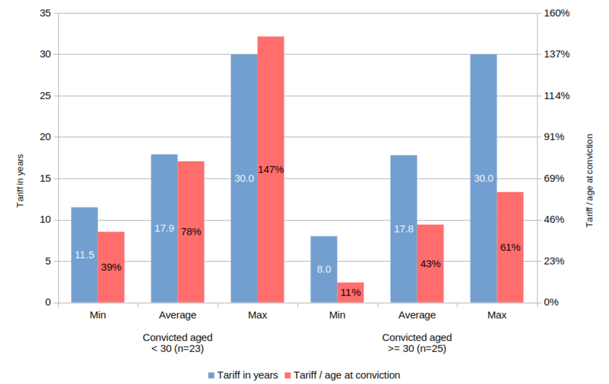
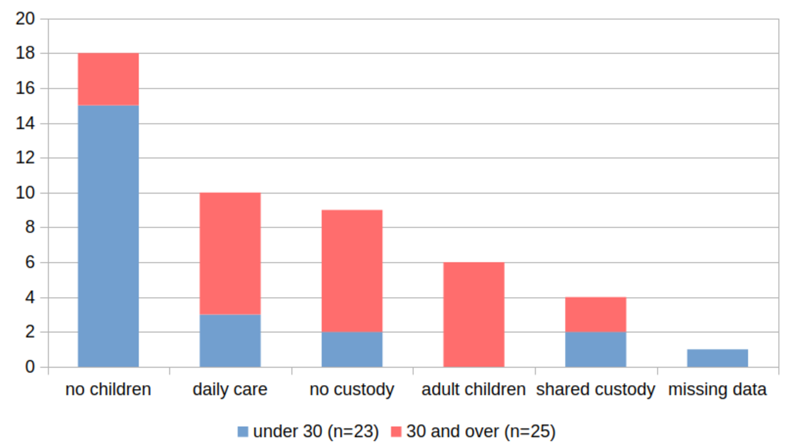
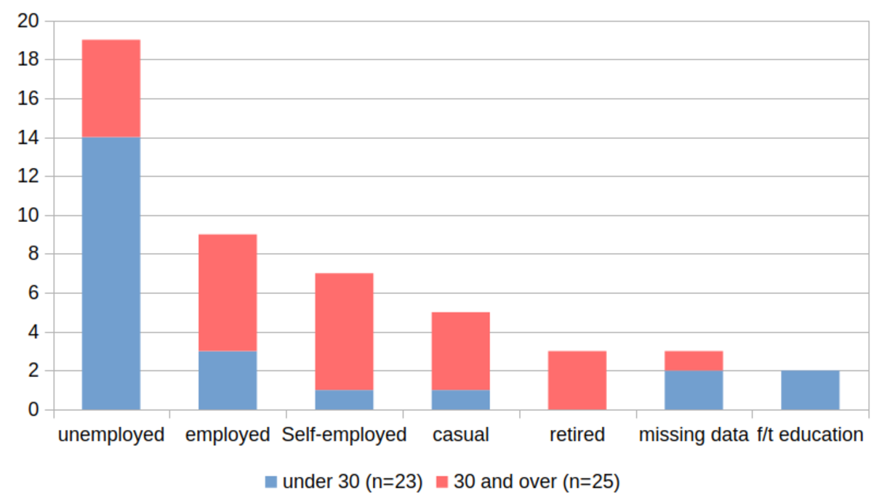

This chapter reports on how life imprisonment imposed at different points in the life course poses varying existential questions. It accounts for the differing forms of ethical selfhood which can appear as a result, developing and nuancing previous findings about the sentence's 'life-warping' [@creweLifeImprisonmentYoung2020, p. 324] effects.

The sentence is life-warping in that it ruptures relationships, patterns of habitual activity, relations of care, and reflexive and developmental situations. Recent research has theorised a process whereby lifers, faced with this gradual confiscation of social identity, recognise that prison is where they now live, find areas of their situation they can control, identify responsibilities arising from their predicament, and begin to construct new forms of agency and selfhood *within prison* [@creweLifeImprisonmentYoung2020]. These shifts resemble a kind of narrative reconstruction: detached from previous lifeways, they 'let go' of the past.

While well-supported by empirical data, this theorisation of adaptation was developed from age-restricted (or undifferentiated) samples. Its applicability across the life course is unclear. Some changes attributable to prison maturation—such as increases in self-control—are also associated with 'ordinary' maturation [@rocqueLostConceptRe2015]. There is a potential conflation of concepts here, and a more context-specific and precise description of cases would help to clarify developmental trajectories.

This chapter presents an analysis of how lifers convicted at different ages thought about the life sentence's place in their life courses. It shows that the life sentence disrupted different ethical projects and relationships of care for those aged under and over thirty when convicted. The chapter notes evidence for different ethical 'ground projects' [@mattinglyMoralLaboratoriesFamily2014] among prisoners convicted when older and younger. Throughout, attention is focused on experiences of family and working life, with family life particularly central. The chapter attempts to specify the normative patterns of obligation and identity 'ruptured' by the conviction. By doing so, it identifies what forms of ethical selfhood were *denied* by the conviction and the sentence. The chapter closes with a discussion of what these findings add to the existing literature on adaptation.

## Conceptual foundations {#sec-5-conceptual-foundations}

### What is 'the life course'? {#sec-5-what-life-course}

The 'life course perspective' in the social sciences coalesced around the observation that socio-economic roles relating to family and work, and associated habitual activities, are patterned by chronological age. So too are cultural norms about the kind of pasts, presents and futures a person might imagine at various stages in their lives. On this basis, differences between individuals reflect not merely their personal characteristics, but also the social activities and relationships distinctive to their genders, ages and socioeconomic backgrounds [@mayerNewDirectionsLife2009].

There is not *one* life course. Those of given generations are stratified by wealth, and distinctive to historical periods. In 'WEIRD' (Western, Educated, Industrialised, Rich and Democratic) societies [see @henrichWEIRDestPeopleWorld2020; also @haidtRighteousMindWhy2013, chap. 5], the notion that there ever was one 'normative' life course reflected the institutional stability of the post-WW2 West. As family forms later became more plural, working life less stable, and risks intensified for those at the social margins, the unity of 'the life course' has fractured. Nevertheless, the major finding of life course sociology—that there are 'typical' ages associated with family and career structure and that these reflect the socio-economic and historical conditions into which people are born—remain compelling [@mayerNewDirectionsLife2009].

### What is 'maturity'? {#sec-5-what-maturity}

If there are typical stages in a life course, then there will be corresponding markers of transition. 'Maturity' is a state attained during the transition from childhood into adulthood [@kazemianPositiveGrowthRedemption2019; @priorMaturityYoungAdults2011], and 'maturation' is the process of attaining it. Historically, its lower age boundary has been mobile [@ariesCenturiesChildhood1996; @cunninghamChildrenChildhoodWestern2005]. It is both a general and a domain-specific concept, read from a range of personal and social markers, including social roles, civic/citizenship roles, psychosocial personality traits, self-identity, and neurological and cognitive developments [@rocqueLostConceptRe2015].

Crucially for current purposes, imprisonment disrupts many social markers of maturity---for example, social and care roles such as parenthood, economic activities such as waged labour, or citizenship roles such as taxation or the franchise. This deprivation of adult roles and responsibilities is morally communicative, a central feature of the prison experience [see @sykesSocietyCaptivesStudy2007]. To be censured through imprisonment is, in part, to lose moral recognition, which, with a life sentence, is restored only partially, gradually, and with caveats.

## Dividing the sample by age at conviction {#sec-5-dividing-sample-age-conviction}

Fundamentally, the analysis which follows compares how participants who were *already* more (or less) 'mature' on admission to prison thought about their sentences. The central analytical contrast is therefore between participants convicted over, and under, the median age at conviction for the whole sample (30). This section unpacks how the patterning of social relationships and habitual activity by age—that is, the life-course variability introduced in @sec-5-what-life-course—was evident in the sample. It introduces three major contrasts, which are shown in @fig-5.1.

The first relates to sentence severity. At conviction, participants ranged in age between sixteen and over sixty-five.[^5.1]. @fig-5.1a represents the tariffs of those convicted over and under thirty; it plots them both plainly, and in relation to the life course.[^5.19] Neither group was sentenced more severely, in the simple sense of possessing longer tariffs: the averages for both groups were identical to within a rounding error, while the minimums (8/11 years) and maximums (30/30 years) were also similar. However, the contrast to note relates to the *subjective* burden of prison time. Life sentences have different 'pain quotients' [see @odonnellPrisonersSolitudeTime2014, 200-205], not only because lifers convicted when older will, on average, spend more of their remaining lifespan in prison; but also because those convicted when younger face unimaginable (because not yet lived) spans of prison time. For those convicted younger, tariffs averaged 78% of their lifetimes to date (minimum 39%, maximum 147%); for those convicted older, by contrast, tariffs averaged 43% of their lifetimes to date (minimum 11%, maximum 61%).[^5.6]

:::: {#fig-5.1 .column-body-outset}

::: {#fig-5.1a layout-align="center"}

Sentence severity

:::

::: {#fig-5.1b layout-align="center"}

Family circumstances

:::

::: {#fig-5.1c layout-align="center"}

Employment circumstances

:::

Key contrasts between sample members convicted below and above the median age at conviction

::::

Age at conviction is important not only because of its relationship to the pain experienced *during* the sentence, but because of associated patterns in life *beyond* prison time, both beforehand and afterwards. @sec-5-what-life-course noted that family and work relationships are patterned on chronological age. This is evident in Figures [-@fig-5.1b] and [-@fig-5.1c], which contrast the family and work circumstances of sample members aged over and under the median age at conviction. [-@fig-5.1b] shows that the younger group were much less likely to have had children: only seven (30%) did, with roughly equal numbers among these having daily custody, shared custody, or no custody.[^5.2] Contrastingly, twenty-two of twenty-five participants in the older group (88%) were fathers at conviction, again with a range of cohabiting and non-cohabiting arrangements.[^5.7] Varied family circumstances entail varied normative obligations relating to care, which imprisonment disrupts in varied ways.

A similar picture emerges from @fig-5.1c, which shows employment status at conviction. Fourteen of twenty-three men in the younger group (61%) had been unemployed;[^5.3] two more (9%), convicted as children, had been in full-time education. The remainder were in lawful, albeit usually precarious and unremunerative, work. By contrast, twenty of twenty-five men in the older group (80%) had been employed,[^5.4] in occupations ranging from degree-educated, regulated professions to unskilled casual labour. Several, in fact, had employed others. Three more (12%) had retired and were living off private pensions;[^5.5] they, and several others, owned property. They were, in short, far likelier to have participated in the mainstream economy. It would follow that their ethical outlooks would be likelier to align with its norms, and certainly, *no one* in the older group said they had been making a living through crime, whereas many in the younger group did.

Thus the sentences imposed on both groups were broadly comparable, but what they had ruptured was not. Participants convicted younger were loosely integrated with mainstream society and the lawful economy, were single and/or childless, and few could sustain any strong claim to the conventional markers of maturity. Participants convicted older had nearly all raised children, had been integrated with mainstream social and economic life; and had in some sense mostly been mature men at conviction. Though some described lonely, troubled, or miserable lives leading up to the offence, this was not their entire adult story, and it was often narrated as a slide downwards from earlier, happier, times.

The following sections explore this core contrast qualitatively. They are structured, like this section, around the two groups: first, those convicted before the median age at conviction (30); and second, those convicted afterwards. The analysis explores differences centred on two main themes: parenthood and work. Each is further subdivided into subthemes.

## Participants convicted aged under thirty {#sec-5-participants-convicted-under-30}

In the younger-when-convicted half of this sample, we might expect to see consistent accounts of breakage, discontinuity, "acceptance […], agency and resignation" [@creweSwimmingTideAdapting2017, 530]. In fact, however, the maturation evident here was more qualified. Themes of rupture and breakage were indeed dominant in roughly two-thirds of cases. However, among the rest, it was clear that *a few* saw themselves as having been well on the way to 'mature' adulthood before the offence, and they were less willing to accept that the sentence had erased their past achievements and characters.

The following sections set out this finding by considering a) the family, and b) the economic circumstances of participants convicted before age thirty.

### Family relationships {#sec-5-participants-convicted-under-30-family}

As noted in @sec-5-dividing-sample-age-conviction, participants convicted younger were less likely to have had children. Fifteen were not fathers. They came from varied domestic contexts: some were homeless, others lived with friends, some cohabited with partners, and two, still children, were living with one or both parents. These men had not been 'mature', in the sense that they were living amid the ethical obligations (e.g. caring, financial) associated with parenthood. Because of this, the relationships which mattered to them most as the sentence went on were those with their birth families. As will become clear, the term 'rupture' was not entirely apt to describe how the sentence affected these relationships.

#### Support from birth families {#sec-5-participants-convicted-under-30-birth-family}

A major difficulty participants aged under thirty often associated with the conviction was that of explaining their actions to their families. Many converged on the word 'shock' to describe the effects of their arrest, conviction, and sentencing:

  > Everyone was shocked. Everyone, everyone was shocked. Because, obviously, from my family's perspective, they'd only seen one side of me. The big brother, the brother who takes care of everything, the uncle who takes us out every day, the friend who's always there, who's dependable—if you need his advice, he's there. So that's what everyone saw. The guy who never hurt a fly, kind of thing.
  >
  > Rafiq (Swaleside, thirties, early)

  > They were shocked, man. I'll say they were shocked […] Obviously they knew I was not a bad kid, but […] I haven't heard this from them, but what they heard at the trial, I could tell it upset them.
  >
  > Ebo (Swaleside, twenties, mid)

These words gesture to two prominent features of relationships with families which had remained strong. First, a sense that the offence must have led loved ones to question their character, despite (in these cases) offering unstinting support. Second, a certain sense of obligation: to acknowledge---to 'own'---aspects of their characters they had previously preferred to disown. What Ebo's parents "heard at the trial" related to a robbery conspiracy, culminating in murder; Rafiq, meanwhile, suggested that he had preferred to conceal the emotional immoderation most evident in his turbulent marriage. 'Owning' these and other discrediting aspects of the self could be shaming, provoking intense self-awareness and the fear of rejection:

  > They were supportive, very supportive, yeah, and they still are. But at the start the reason I didn't admit I did it was fear.
  >
  > *Did it feel as though their support was conditional on you saying you were innocent?*
  >
  > It did at the time, yeah […] I thought if I admit to this, that's it. But it was completely the opposite.
  >
  > Adam (Swaleside, twenties, mid)

At the outset, Adam had insisted upon his innocence. His admission of guilt had a surprising outcome: it showed the relationship's true premise to be not his innocence, but his parents' unconditional love. This is to say, it *deepened* the relationship, and sustained a self-respect he had, for a while, lost. In a few other cases, it was clear that family members endorsed blame-deflecting narratives of the kind discussed in [Chapter 4](./4_becoming-a-murderer.qmd). However, most pushed participants to accept the legal consequences of their actions, even when they harboured doubts about the full extent of their culpability:

  > I didn't want to go to the police station. But my dad and his lawyer basically talked me round and basically I've agreed and they've taken me to the police station and I've turned myself in.
  >
  > Simeon (Swaleside, twenties, late)

Strikingly, only one of these men described this as if it had harmed the relationship (rather than deepening it):

  > I didn't know what to do […] it's like I was a baby again, a little boy, and what does a little boy do, when they're in trouble, he goes to his mum […] Fucking stupid decision […] she started crying, and […] she's, "Oh, Lord, God, Jesus Christ, Dalton has killed somebody. Fuck, what are we gonna do?" All that kind of shit […] Next thing she's grabbing the phone, I'm like, "yo, what are you doing?" […] "Son, you've killed somebody, we have to do the right thing." I'm like, "Do the right thing? […] what the fuck? Are you trying to call police on me?" […] I'm thinking, black people in this country, what police do to us […] and you're gonna call them on your own son?
  >
  > Dalton (Leyhill, thirties, mid)

Between other participants and their birth families, however, it was more common for relations to deepen and strengthen.

Family support facilitated an understanding of the offence as 'a mistake'. Legally, mistakes are hard to define, but relate to "an actual real belief, whether explicitly formulated or not, which can be proven at the time it is acted on to be correct or incorrect, true or false" [@sheehanWhatMistake2000, p. 565]. Strictly, the definition was hard to apply here: participants' accounts of the decision to kill did not usually conjure a picture of anyone involved acting on "actual real beliefs", but instead rashly, emotionally, intoxicatedly, uncontrolledly, or some combination of these. However, family support helped set these 'immature' traits in context, situating them in a longer narrative. Rashness, uncontrolled emotion, poor judgement, pride, intoxication could all be attributed to factors in the individual's longer biography, neutralising the threat they posed by making the self appear 'bad'.

These were relationships 'ruptured', but not obliterated, by the conviction. A *negotiated continuity of selfhood* was possible. To think of the offence as 'a mistake' by characterising it as the act of an immature person cushioned the full force of censure and of labelling; but came at the price of an admission of bad judgement *to someone they cared about* The price of the admission was an implicit commitment to *do better*. 'Mistakenness' cushioned the impact of censure, but entailed a certain moral deference to those who provided the cushion, something Dalton was unique in being unable to accept. More usually, men who were younger at conviction found it easier to describe the sentence  as a learning experience, and did so under the influence of their families. This was so even if their private views about their culpability diverged from the official account---which many did.

Given a supportive family, then, and no major caring obligations thwarted by the conviction, at least some constructive ethical work was possible. It consisted in trying to become a better, more mature adult in future, a moral obligation which (they implied) might eventually have arisen even had the offence never happened. As Warren (Leyhill, thirties, late) stated that "if I could take it back, I'd still do the jail", suggesting a recognition of incompleteness, of immaturity, which would have disclosed itself within his family setting regardless of the offence.

The continuity of care coming from his family, and the link they provided to his biographical history, meant that his rupture from an imagined future was not total. Indeed, another common feature here was that many expressed a strong reciprocal loyalty to parents, often in the form of a determination to repay familial support, or to live up to parents' perceived values (such as a commitment to hard work):

  > Having a job. Doing normal things […] What people take for granted, like coming back from a hard day's work, and stuff like that. People take that for granted and people moan at that, but that's what I want to do when I get out. I want to go out and work and provide for myself. I don't want to get out and do the whole benefits thing.
  >
  > Adam (Swaleside, thirties, mid)

A view of the offence as a 'mistake' also clearly placed its ethical implications in the domain of moral, and not ontological, deficit [@scamblerSociologyShameBlame2019]. The former is remediable; the latter is 'staining' [@ievinsStainsImprisonmentMoral2023]. Situating guilt in moral deficit, or in immaturity, helped participants to look ahead, rather than behind:

  > Obviously, I feel ashamed. Obviously. It shouldn't have happened *but it's not going to stop me from doing certain things or wanting to do certain things* and stuff like that […] I just really… just want to be a better person […] It's not easy […] I'm not going to say, "well I shouldn't have been in jail" or "I don't deserve it" […]  It's just… It's happening now. I'll get on with it.
  >
  > Ebo (Swaleside, twenties, mid)

Thus far, I have suggested that participants in the younger-when-convicted subgroup who retained birth family support often used narratives of personal development and maturation to make sense of their predicament. They emphasised youth, immaturity, or poor judgement. But doing so involved admitting a moral deficit, and hence also an obligation to hold themselves accountable for future improvements. Families typically expected—and facilitated—this process, by softening the impact of censure and leavening it with narrative elements which facilitated explanation.

The analysis now turns to two small subgroups whose relationships with family differed from those described in this section. For one, relationships with family members had *already* grown distant (or ceased) before the offence. The other, despite their relative youth at conviction, already had children. How they characterised the sentence differed: the first subgroup emphasised their individualism and resilience as 'men alone'; and the second were only too conscious that the sentence was disrupting their role as fathers, and hence also that it was *blocking* the unfolding of family life.

#### The life sentence without the anchor of family support {#sec-5-participants-convicted-under-30-no-family}

Six participants had little or no contact with their birth families. They did not always give explicit reasons for this, but based on the wider interview materials I formed the impression that they included the impact of the offence itself, parental abuse or neglect in childhood, or (more simply) geographical and relational distance, for foreign national participants far from their home countries. In most cases, too, temporal distance overlapped with these other factors: five of the six were in the late or post-tariff stages of the sentence.

The effect was to make these men accountable, but *on terms they decided for themselves*, rather than *through negotiation with family*. Dalton's case was described in @sec-5-participants-convicted-under-30-birth-family. Having initially experienced his mother's insistence that he take responsibility for the offence as a betrayal, he had come to think of his lack of family ties as an advantage:

  > People will be like, "Oh, I'm down, man. I've just had a visit. My family is going on holiday, and I'm stuck here. My people have just gone […] I wish I could've gone with them." None of those things affect me.
  >
  > Dalton (Leyhill, thirties, mid)

Men like Dalton came to reframe their independence and lack of accountability as an advantage, even a virtue. Where family members did not soften or moderate censure, participants felt less obligated to take it on board. Under these circumstances, attitudes to the conviction were less pressured to change: though perhaps the courts had disapproved of their actions, it did not follow that any deeper, more authoritative norms had been infringed, nor that personal change was called for. Nixon, in describing his frustration with the parole process, used an analogy which vividly illustrated the transactional form of retributivism he understood to be the purpose of punishment:

  > Right, see in prison, if I took something from you and I owed you a tenner and I couldn't pay you and you came and punched me in my face, I wouldn't do anything […] If I've owed you, taken something and then I've been a cunt and said I'll give it to you and I didn't give it to you and you give me a slap, I deserve it. *But once you slap me, what I owe you is done and dusted. […] That slap has taken what I owed you*.
  >
  > Nixon (Swaleside, forties, post-tariff)

It was not that attitudes about the offence *could not* shift in these circumstances, but that they did so more haphazardly, sometimes through encounters with an exemplary figure, who coaxed out participants' feelings of responsibility, while also (as families tended to do) emphasising their enduring ethical potential. Frank described one such encounter:

  > Well, there was a time when I used to say, "oh, I killed him, so what?" But that was bravado […] Father Michael,[^5.9] he helped me with that […] [he said,] "don't walk into the future and be ashamed of it. You can't change it. So don't be ashamed. But… do the better thing in the future. Do the right thing in the future. And don't do the right thing when something big occurs. Just look for the small things, and try to do right in them at all times."
  >
  > Frank (Swaleside, forties, post-tariff)

Anthropologist Joel @robbinsWhereWorldAre2018 [pp. 179-180] argues that human beings encounter moral values in the world through 'exemplars': people or institutions who "solicit a special kind of attention" by embodying an abstract value (e.g. forgiveness, persistence, integrity) credibly enough to inspire emulation. This, in effect, was what family members did, by loving participants even when they felt guilty or ashamed, and supporting them knowing what they had done. For those who lacked family support, by contrast, exemplars were fewer and farther between. Prison experiences felt more accusatory, and an attitude of defensive unease was ill-suited to risk-taking and ethical change.[^5.10] It militated against expressions of accountability.

#### The pains of parenthood {#sec-5-participants-convicted-under-30-pains-parenthood}

Raising children is, normatively speaking, a signifier of maturity, in part because it entails obligations to provide (not receive) care. As desistance scholars [e.g. @bersaniDesistanceOffendingTwentyFirst2018; @meekPossibleSelvesYoung2011; @schinkelHookChangeShaky2015; @schinkelRethinkingTurningPoints2019; @weaverOffendingDesistanceImportance2016] have long recognised, parenthood and marriage bring changes in day-to-day habitual activity, and thus also the potential for changes in the kind of person someone aspires to be. That said, not all parents live out the associated obligations successfully: relationships break down, families become estranged, or there are simply competing priorities and claims on their time.

Seven men in the group---the second subgroup departing from the younger-when-convicted norm---had become fathers by the time they were convicted. One was in the early stage of his sentence, one in mid-sentence, and the rest either late or post-tariff. What was striking in these cases was how thwarted they felt, ethically, by being in prison. It was as though a 'real' ethical life was impossible, because imprisonment prevented them from performing obligations which were central to their sense of who they were, and which---because these were 'ground projects' [@mattinglyMoralLaboratoriesFamily2014]---they were unable to relinquish.

Of course, in some ways the frustration this engendered was unremarkable: nearly all participants, like nearly all long-term prisoners [e.g., @creweGenderedPainsLife2017; @flanaganPainsLongtermImprisonment1980; @hulleyReexaminingProblemsLongterm2016; @richardsExperienceLongTermImprisonment1978] said they missed people outside prison. However, these pains had a particular intensity in relation to children, the more so the younger they were. Yakubu, who shared custody of two very young children when he was arrested, pointed to the immediacy and intensity of their needs—and his inability to meet them—as the 'tough part' of his prison experience:

  > If you got young kids and you're always there [on the phone…] You're always trying to talk to them… They want to see you. They're starting to cry so they want Daddy. That's the tough part.
  >
  > Yakubu (Swaleside, thirties, early)

These difficulties were *specific to the disruption of care*; these were pains specifically associated with thwarted caregiving:

  > I was taking care of him because my wife was very tired and usually one of us was sleeping downstairs with him because he was crying a lot at night.
  >
  > Janusz (Swaleside, thirties, mid)

Daily involvement in care-giving activities had often produced the self-identity of a (sometimes-nascent) 'family man'. It was central to whom these men felt themselves to have been at conviction. For those missing their children, imprisonment did not seem like an opportunity to make the best of a bad situation: it simply *was* the bad situation. It thwarted their most important commitments, and raised the thought that the labels associated with the offence sullied them as fathers:

  > [When people] talk about that… [puffs out his chest, affects a swaggering posture] "oh, yeah, I was in this jail, and yeah, yeah, do you remember this, yeah?" Nah, nah, nah, nah, nah… that's DEAD. That's LONG.[^5.11] Or trying to say how they've changed, got better… I'm not proud of being in jail! This is EMBARRASSING! I've got KIDS! The only thing I want is to prove to my kids is that their dad didn't do this crime […] Even though my kids know… But I just want them to really know… Like officially, with the appeal.
  >
  > Reuben (Swaleside, thirties, mid)

The challenge expressed here was to reconcile the identities of a life-sentenced prisoner, and a caring, loving father. Reuben found doing so doubly difficult because he maintained innocence. Even for those who admitted their offences, prison life persisted in obstructing their capacity to perform the ethical obligations of parenthood.

There were, nevertheless, contrasts within this subgroup. For some men, the identity of a 'family man' had not 'bedded in'. Jeremiah, who had never met his son, wanted badly to get to know him, but accepted that his conviction and sentence had been entirely deserved. Because he had not been caring for his son daily, they had not thwarted his ethical practices to anything like the same extent. His relationship with his son offered *future* potential, not a lost past or a thwarted present:

  > If I lost, like, you know… my son or something… before I even got time to kind of build a relationship with him… that would be terrible, you know what I mean?
  >
  > Jeremiah (Leyhill, thirties, post-tariff)

Here, the significant contrast lay in attitudes to the offence. Jeremiah (unlike Reuben or Yakubu) accepted that his less-than-ideal relationship with his son was his responsibility. He said that his wish to build the relationship drove his attempts to use the sentence for his own betterment; this contrasted sharply with Reuben's characterisation of the sentence as "an embarrassment", despite his innocence. When Jeremiah was convicted, there had been no existing ethical practices associated with fatherhood. Rather than thwarting his ethical practices, the sentence could motivate him to develop new ones.

<!-- Kai was in a similar situation:

  > Me and his mum had a bad relationship. I came to prison. We was talking at this point, even though I had another partner. She let me see [him] up until he was four […] She then met someone else, had a kid with him, shut me and my whole family out [his] life […] It's been so long. I'm essentially a stranger. And I now have to wait until I get out before I can reapply to see [him] again […] His mum still has the same opinion of me. She still thinks I'm the man I was when I was outside […] Like, she thinks I'm obsessed with her. She thinks that's the reason I keep fighting to see my [him], to have this control over her. She's fucking deluded, mate.
  >
  > Kai (Leyhill, 30s, late)

He felt more thwarted in his commitment to be a father than Jeremiah, but this was because he had had some contact in the early stages of the sentence. He blamed his son's mother—not the prison, and not himself—for not being able to be a good father. -->

The experiences of this subgroup demonstrate how parenthood can produce ethical change, placing obligations before the self, and 'asking' whether it can live up to them. It was not that these men saw themselves, always, as perfect fathers before the conviction; they did not. But imprisonment thwarted their work on the relationships they wanted the most, even more so when they had been caring for young children at conviction. Attitudes to the offence were an important moderator here, affecting *who they held responsible* for this situation; but regardless of its effects, being prevented from caring for children made it more difficult to focus ethical attention on the self---because the self had already come to experience its obligations to others, and to view these as self-constitutive.

### Work and economic participation {#sec-5-participants-convicted-under-30-work}

As noted in @sec-5-dividing-sample-age-conviction, most of those who were convicted younger (fourteen of twenty-three or 61%) had been unemployed at the time of their offence. Of the remaining nine, just three had been in steady employment, one had been self-employed, one had been doing casual work, and two were still at school.[^5.12] Their average age at conviction was 22.7 years, with a range from 16 to 29. This group of twenty-three was also more likely to be from minority ethnicities than their older-at-conviction counterparts: twelve (52%) were of Black or Mixed ethnicity, and eleven (48%) were White. They differed clearly by site: those held at Leyhill were nearly all white British men born in the 1960s and early 1970s; and those held at Swaleside were mostly Black British men born from the late 1970s onwards. The group hardly talked about work or career achievements, which for most had not been positive experiences, nor about educational experiences, which for most involved leaving (or being excluded from) school young, with few or no qualifications.

Highlighting these themes, and contrasting them in @sec-5-participants-convicted-over-30-work with the older-at-conviction half of the sample, helps to emphasise that the pain within indeterminate sentences is not merely a question of time *within* prison, but also of time *before and after* prison. That is, pain is experienced from specific subjective/biographical standpoints, and these are influenced by age. Men convicted young *all* described their lives before prison as though they had *a difficult past to overcome*. Those with shorter tariffs, for whom release while relatively young still seemed possible, expected work to play a part in their futures, and their ground projects were anchored in this possibility. By contrast, those with longer tariffs, or whose tariffs had long since passed, spoke of themselves as relics of a lost industrial world, in which the possibility of working as they wished to with their hands was receding, and in which work was merely a way of paying the bills.

The following subsections elucidate these points.

#### The aspiration to work{#sec-participants-convicted-under-30-work-aspiration}

Participants with shorter tariffs, who expected to be released in their thirties or forties, tended to describe work as something they were actively using the sentence to prepare for. Many sought out manual work in prison, expecting to find similar opportunities after release:

  > I've done most of my time [working] in carpentry shops […] It's good, it makes you think. It passes the time really fast […] I like that type of stuff […] It's a sense of achievement when it's finished as well […] Plus I did construction work beforehand, so I can take it on with me again [after release].
  >
  > Warren (Leyhill, thirties, late)

An idea of oneself as someone who 'works with his hands' shaped educational choices, too. Taylor, having listed the many qualifications he had gained in prison, later said he was 'not into' education. I sought clarification:

  > *Can I ask… because you said, "I'm not going to do education, I don't do courses"… But [you've just described many qualifications]. And you've mentioned others.*
  > 
  > In [HMP X], as well. I did manufacturing, operations, and warehousing storage as well.
  > 
  > *Right. So these are all things that--*
  > 
  > Benefit me.
  > 
  > *Mmm, that's what I was thinking… but […] they also sort of line up with how you see yourself, if that makes sense? Like, you might not do, I don't know, an Open University degree.*
  > 
  > No, that's not who I am.
  >
  > Taylor (Leyhill, forties, late)

Taylor's intention of getting straight into a job after release was a major component in his 'desired self' [@paternosterDesistanceFearedSelf2009], and he favoured applied and vocational over abstract and educational topics. He and others understood a committed attitude to work---the selfhood of a 'grafter'---as a marker of maturity. Similar attitudes were expressed, even where the work itself was less credibly rehabilitative:

  > Wing cleaning is something that I like doing because I'm my own boss. I don't have somebody breathing down the back of my neck. I'm left to get on with it […] They don't pester me. They know, when I get up and everybody's gone to work[shops], that's when I work.
  >
  > Adam (Swaleside, twenties, mid)

The point here is, again, to underline how participants convicted younger constructed narratives which imagined *a better future*, and attempted to find resources enabling them to pursue it. Warren, Adam, and Taylor, however, had all received shorter tariffs of fifteen years or less. All would reach parole eligibility in their early forties, at the latest.

#### The burden of work {#sec-5-participants-convicted-under-30-work-burden}

Something different was evident among participants convicted before thirty, but whose tariffs exceeded twenty years. They would be at least in their late forties by tariff expiry. Not yet within a decade of release, their attitudes to the world of legitimate work and the lawful economy were less positive. What had mattered before the conviction---the key virtues---had been entrepreneurialism, acumen, and hustle. They were practised through both lawful and unlawful activities:

  > He left school and did [a course] in college, then went on to university […] He did this mainly to please his mum […] [but the course he chose] also left him time to work in a gym (which he liked but didn't pay well), and to hustle, dealing drugs […] [Hustling] brought in around £1.2k a day. He was able to buy cars and things he wanted—he mentioned once spending £5k on a jacket.
  >
  > Yakubu (Swaleside, thirties, early), from notes

The work they had engaged in (which, as Yakubu's case shows, was not *all* illegal or actively dangerous) was nevertheless often precarious and (if lawful) unremunerative. Crime was often described as a question of opportunity: lawfully, there were "no opportunities" for "people like me" (Leon) to get on and make money:

  > Where we come from and that, like, a high goal is not being fucking sent to prison, let alone being killed. That's it, that's your goals, innit, that and making large amounts of money. You don't really have, like, goals of, you know, owning property […] having a family and moving out the community and bettering yourself, innit […] [It was only later I] opened up my eyes that my life could have been different.
  >
  > Leon (Swaleside, forties, mid)

Often serving the sentence for confrontation or financial gain offences, many of these men with longer tariffs had been involved in illegal activities relating to drug-trading. Their tariffs were lengthy because of weapon use or imputed motive, and many, though they regretted the offence, perceived their social and economic exclusion to have been born in structural racism.[^5.13] Put simply, they felt responsible for *what they had done*, but not for *who they were*. They were also less persuaded that waged work could provide the foundation of an ethical life after imprisonment, in part because there would be less time in which to work. Lawful work (skilled or not) was seen as a route to persistent marginality, and at best a means of making ends meet; their ethical work consisted not in acculturating themselves to the norms of hard graft, but in imagining how to make money without it:

  > I read quite a lot—about business ideas, plans for the future. Right now I am reading something about how the stock market works. I want to understand that so I can make my money work for me in the future, to look after my family after how they've looked after me in here.
  >
  > Mark (Swaleside, thirties, post-tariff), from notes

Ethically, there were strands of continuity here: business acumen and entrepreneurialism were still the key virtues, but they imagined practising them along lawful lines.

<!-- For others, moving away from the person they had been involved finding *new* values, and devaluing the materialism they had found important in the past. Wistful and bemused reflections on the amounts of money they had gained and lost were common here:

  > I bought my first car two years before I came to jail […] which was an M3 BMW convertible. I paid, like… I think it was just over 24 and a half grand—cash—and I crashed it on the way back from London. Just left it there […] Like, legitimately, I'm not even supposed to be able to drive, you know what I'm saying? So what am I even doing with this car?
  >
  > Levi (Swaleside, twenties, very early)

Levi seemed only to be beginning to reflect on whether his life had been "normal". For his counterparts at Swaleside whose backgrounds were similar but who had served more time, the rewards associated with what Leon called 'the life' were transient, and over the long run, negligible. Aspects of 'the life', in particular its lucrativeness and the opportunities for conspicuous consumption it brought, were remembered fondly. But from prison, its futurelessness loomed large. Paradoxically, prison made it easier to look to the longer-term future:

  > My life was a mess. I was always in trouble with the police […] I used to just fly out and make a low profile for a bit and then come back. I was always having to look over my shoulder, and paranoid if I wasn't armed, couldn't go anywhere, like, in a public place […] So yeah, it was just like, yeah, it was fucked, basically […] People like to glamorise that kind of lifestyle […] [but] they know nothing about it […] They might see you in a nice flash car and a nice watch and a nice bird and that, and they'll be like, "okay, yeah, that's the life". Nah, that's not the life, not all of it. Cos you're going to fucking have to lose your mate. And see your mate's mum crying. You've got to go bury your mates. And you can't fucking go out the fucking house. You know, these fucking gangsters are after you, trying to kill you. And you know, either you or them. That's not… that's fucking no way to be living your life.
  >
  > Leon (Swaleside, forties, mid) -->

Thus narratives of maturity were sometimes tied to work, and sometimes not. Men in this second group, who expected work to be burdensome, also characterised themselves as having matured in prison. But they were reluctant to identify with the unremunerative, precarious work on offer in prison, and anticipated after release. The demands of work were there to transcend, not internalise. Instead of saying they were "their own boss" in prison jobs, these men were often censoriously critical of the skills, certifications, and training on offer to them, perceiving not dignity through toil but low expectations, and resenting the lowered status it implied:

  > Have you been to the packing workshop?[^5.24]
  >
  > *Yes.*
  >
  > What are [prisoners] learning from that? That same room that they've got it in, you could do an electric workshop, you could do mechanics, you could do bricklaying, you could do plumbing… You could do things in there that are going to give these guys skills  […] [But instead] I've been here six, seven years now. I could've learnt something. I've learnt nothing.
  >
  > Ebo (Swaleside, twenties, mid)

#### The ghost of work {#sec-5-participants-convicted-under-30-work-ghost}

A handful of participants, most at Leyhill, had been convicted under thirty, but were now well over-tariff, and into a cycle of parole knockbacks. Most were serving time for intensely stigmatised offences. Ethically, work haunted them: they espoused the working-class masculinity they had absorbed in the deindustrialising Britain of the 1970s and 1980s, but knew that these kinds of jobs had vanished. They expressed hopelessness and victimisation, as though Thatcherism, not the murder conviction, had broken their lives:

  > The factories in Britain was closing, the coal mines gone, the steelworks, the fishing industry […] [I] passed all the tests […] Then I went to do my final exam for [job] and was told we don't want you anymore, […] try applying in a year or two. It was crushing for me […] And that's just before I went to borstal.
  >
  > Fred (Leyhill, fifties, post-tariff)

  > I got a job down in the pit, as a miner. My dad got me that job […] [But] then, I started not going to work then, because I was, like, drinking a lot […] I was drinking a lot and getting in trouble. And then… I think I was about seventeen or eighteen… I went to borstal.
  >
  > Jeff (Leyhill, fifties, post-tariff)

As these two quotes suggest, comparisons to family members, who offered exemplars of the lives they might have been leading had things not gone off track, were common:

  > *Who do you admire?*
  >
  > […] My uncle […] We're close in age. Back when I left school, me and him worked together at [company] […] And since I got locked up, he set up his own business […] He's settled. Which he never was […] What I admire is the fact that he's set up his own business. He's doing well. He's got married, he's settled down. He's got a good life. 
  >
  > Frank (Swaleside, forties, post-tariff)

In these cases, aspirations were sometimes expressed towards manual work, but there was more of an air of defeat than was evident among those in @sec-participants-convicted-under-30-work-aspiration, for whom release felt more tangible. Some of these men---Fred and Frank, for instance---had chronic health conditions, and were increasingly aware that their bodies might not endure the kinds of work they aspired to. Complex and restrictive licence conditions also sometimes required the disclosure of stigmatised offences which undermined a traditional masculinity. Put simply: where work was aspired to, but felt intangible, identification with the work of the past was more likely.

### Summary {#sec-5-participants-convicted-under-30-summary}

When men under thirty were convicted, support from birth families played a crucial role. It helped realign ethical selfhood, by reaffirming the value of existing relations of care, and moderating the most destructive messages of censure. It sent participants a message about enduring moral worth, which came rarely and haphazardly from the prison.[^5.25]

This, perhaps, was where the present sample most closely evinced the kind of maturation-as-personal-growth that Steve @herbertTooEasyKeep2019 [p. 19] has described in a sample of US lifers. His participants, in coming to terms with their sentences, recognised "that they were not isolated individuals but instead were situated in interdependent relations with others", and came to "see themselves not as social atoms but as members of social groups". Here, maturation along these lines appeared to be preconditioned by family support and a certain level of humility or submission towards the conviction and sentence.

Without some moderation of censure, attitudes to the offence tended to harden, usually among those whose families were already distant, or became unable to support them given their feelings about the offence. For such men, the sentence appeared as a kind of transaction, trading penal for criminal harm. It carried no authoritative moral message about the necessity of change, and the kind of social atomisation Herbert and others link to the early sentence stages deepened, rather than yielding to a desire for interdependency. 

Another exception to the pattern of maturation and a growing desire for interdependence was fathers who had cared regularly for children before prison. They struggled with separation, and with missing their children's development. The sentence could not be narrated as an opportunity to mature, but thwarted the maturity they had already tasted. On the other hand, participants whose relationship with their children did not involve daily care longed for a future relationship with them.

Attitudes to work also offered evidence that the painfulness of the sentence ebbed and flowed according to participants' specific ethical outlooks, as well as the nature of their sentences. Some began with the view that work was a surefire route to marginality, something to be avoided through entrepreneurialism and acumen. They retained this attitude, but imagined themselves practising it lawfully. Others saw work as a dignifying and ethically valuable activity, and actively prepared to engage in it after release. But where this possibility receded owing to age, health, and repeated parole denials, they began to be haunted by, rather than inspired by, work.

## Participants convicted aged thirty and over {#sec-5-participants-convicted-over-30}

On the whole, participants who were older at conviction suffered neither the dissociations from former selfhood nor the highly expressive emotional crises which recent research has seen as part and parcel of the adaptation process among those convicted when younger [@creweSwimmingTideAdapting2017; @creweLifeImprisonmentYoung2020; @hulleyReexaminingProblemsLongterm2016; @wrightSuppressionDenialSublimation2017]. They 'settled in' to the sentence, and apparently struggled less to do so, than their younger counterparts. Instead of trying to move into a new kind of selfhood, many seemed content to remain the person they were. They were certainly not delighted to be in prison, nor in agreement with every detail of the conviction. However, they set aside such feelings more quickly, and complied more readily.

This section interrogates interview data for clues about why this was. It suggests that imported life experiences are part of the explanation. Conviction later in life produced different 'ruptures' than with younger counterparts. Maturity was more lastingly and concretely instantiated in career achievements and family relationships, most importantly children [cf. @crawleyOlderMenPrison2005, 348-9; @crawleyThereLifeImprisonment2006, 68-71]. These men viewed past family and working relationships selectively, treating them as a resource and as a marker of ethical status, rather than finding the effort uniformly painful and deciding to relinquish past identity as a result. Correspondingly, their attitudes towards the future, and to the good that might feasibly be salvaged from the sentence, also differed.

### Family relationships {#sec-5-participants-convicted-over-30-family}

Twenty-two of the twenty-five men in the older-when-convicted group—88%—were fathers when they were convicted.[^5.14] Six had children already in adulthood; seven had been living with partners and caring daily for children; two shared custody with a former partner; and seven had children but no custody at all. All these subgroups could claim (though not all in the same way, or equally plausibly) to have performed one of the normative duties associated with maturity: parenthood.

#### Losing the parental role as a loss of self {#sec-5-participants-convicted-over-30-loss-parental-role}

Just as younger men missed their children, so too did older men:

  > The start was, you know, bumpy […] Imagine you love someone… love your children so much, and they stop from you see your children. Obviously, you gonna frustrate. I mean, you're gonna be stressed. Because I love my children. Everybody loves his children.
  >
  > (Saeed, Swaleside, forties, early)

Separation brought bitter regrets, detaching these men from a well-established part of themselves. But though these pains and regrets were like those of fathers convicted younger, they were also more tempered by feelings about the offence. Whereas most of those convicted younger had killed other men in confrontation murders (many of them joint enterprise cases), men convicted over thirty were far likelier to have been convicted of intimate partner murders. As [Chapter 4](./4_becoming-a-murderer.qmd) showed, they had mostly offended alone, and tended also to have few or no prior convictions. These convictions deeply disrupted their sense of themselves as family men, and the older group more often blamed themselves for their regrets.

It is worth acknowledging that participants *at any age* who maintained a strong claim of innocence could not admit such thoughts. They saw restrictions on family contact (including with children) not simply as *unnecessary*, but also as illegitimately punitive. Such feelings often flooded their descriptions of interactions with the prison:

  >  [They made] contact with my family more difficult […] And they would for example keep lying to me about the contact with my son, [saying] that the social services are refusing it […] when I found out [later] that the social services had nothing against it. And […] then they would not let me send out [application forms and appeals] and they would keep lying that [they] had gone missing.
  >
  > Janusz (Swaleside, thirties, mid)

Sometimes, however, obstacles to family contact lay elsewhere: not with the prison, but with ex-partners. In such cases, the loss of contact was *painful*, but it did not tend to be blamed on the prison:

  > Well, I don't see my eldest lot because of this [i.e. the conviction]. It's… I'm gutted […] But if they don't want to see me [voice breaks, crying] then they don't want to see me.
  >
  > Terry (Swaleside, sixties, mid)

For Terry, the pain of being cut off by some family members rebounded on the self; it was not imposed by the prison and hence was not part of what Lori @sextonPenalSubjectivitiesDeveloping2015 terms his 'penal consciousness'; not *part of the punishment*. For those with older children, also, social and geographical distance were less insurmountable obstacles to meaningful contact than for the younger-when-convicted fathers; older children were more capable of adapting to contact mediated by telephone. Such brief, episodic interactions could be preferable to the more confronting forms of intimacy associated with visits:

  > My eldest had a grandson […] I did let her come up then, when she had the baby […] My mum says, "you should let them, you should let them." And I always just say, "I just want them to get on with their life. I'm here." […] I justified it to myself, saying… if I lived in Australia, then that would be the way it was […] And just because I live in prison, and I'm only a few hundred miles away […] I just don't want them coming to these places, you know? They had nothing to do with this. It was nothing to do with them. Why make them?
  >
  > Liam (Swaleside, forties, mid)

In a few cases, participants' sense of themselves as fathers had *strengthened*, part of a wider shift in their ethical narratives. These reorientations usually presented deprivations—of material goods, or financial autonomy, say—as a blessing in disguise. By subtracting choices, they suggested, imprisonment made good choices easier. Saeed, for instance, contrasted his attitudes to money before and after prison in the following two quotes. The second hinted, subtly, that he was now both a better provider than before the conviction, and a happier man:

  > I got like two, three grand in my pocket all the time […] Do you understand? And I was thinking, "Yeah, I'm a bad boy" […] I start paying bills. Everybody's going McDonald's […] Paying drink for everybody. Buy coke for everybody. Buy weed for everybody. Girls. Three, four girls with me all the time.
  
  > I was cooking food for those three [other prisoners]. They was giving me money and that money I was sending to my kids. That was HELPING me, you know I mean? *Because I used to be so arrogant!* […] These three send me money and *now I give money to my kids*. I was SO HAPPY! […] My sister-in-law ask me a question, she said, "What you doing inside? What you selling there?" And I said, "I not sell anything, I save up!" She said, "Who is this man I am talking to? Let me talk to Saeed!"
  >
  > Saeed (Swaleside, forties, early)

In such cases, fatherhood was unmistakably still a ground project—but with the proviso that whoever was caring for their children needed to play along for the story to 'work'. Some had gone through lengthy battles with the prison over risk assessments which had initially blocked contact with children; or they had adapted to letters and the telephone. Either way, fatherhood remained something without which they would find it difficult to go on:

  > If I couldn't see my family […] If I didn't have nothing to go home to… I don't think I'd be mucking about here. I would have left this place a while ago…[^5.15] It's only my family […] What's the use of wasting your life in here?
  >
  > Terry (Swaleside, sixties, mid)

Some fathers, however, looked back on family life with clearer regret. They assessed the loss of family contact more holistically than men convicted younger, often understanding themselves to have let their children down. Liam—one of the few in this group with more than one previous prison sentence—regretted not having turned into a different man, and a better father, before it was too late:

  > I just knew I could make money […] get money to buy drugs […] That was what mattered, yeah. That was my life […] It was wrong, honestly. Especially when I'd had kids. Do you know what I mean? Really wrong. Like, even if I was running around like an idiot when I was sixteen, seventeen, as soon as I had kids, I… That should have opened my eyes.
  >
  > Liam (Swaleside, forties, mid)

William, meanwhile, felt lasting shame about relapsing into heroin addiction in prison, seeing this (and not his conviction), as his most salient failure:

  > My mum and my daughter… I want them to be proud of me. But it hurts to think… yeah… why would they? How could that ever happen? I mean, I know they love me. I just let them down so badly […] how could I do that to them, how could I… How could I [start using] again? […] I often think they'd be better off without me […] Say… with my daughter […] any faults that she has, I'd feel is my failure as a father, really…
  >
  > William (Swaleside, forties, early)

In other cases, the offence itself fatally undermined family-man identities. Describing his marriage, Grant said that "my wife and I were happy, or so I thought". He equivocated because any narrative rooted in his family life had somehow to incorporate an incongruous ending: Grant had killed his wife. Even many years later, he and others like him clearly still found it extremely difficult to 'move on'. Days from a parole hearing at which prison staff were recommending his release, Grant said his only source of hope was that his children might one day choose to make contact:[^5.16]

  > I was going through the Salvation Army, they can do a search on your children […] And I chose not to because, like I say… okay, not knowing is not nice… but I […] go to bed at night-time and I just hope I'm going to get a letter tomorrow morning. I can't write to them. I don't know where they are. You know, I don't know where they are living [crying] […] I mean… God forbid that they go through a bad time and they think, oh, shit, I wish Dad was here, yeah? I don't want them to do that. *I don't want them to need me*, you know? But it's that two per cent hope. 
  >
  > Grant (Leyhill, fifties, late)

Thus, past identity lingered, even for those who acknowledged that the conviction had exploded it. Grant expressed the impossible bind of both identifying with his children, while feeling unworthy of them ("I don't want them to need me").

Even offences which did not touch so directly on the family could produce comparable results. For his family, Daniel's offence against a vulnerable (but unrelated) victim had been a bombshell. The resulting consternation terminated all his family relationships, save that with his parents:

  > My sister has never spoken to me since, and we were quite close […] Mum and Dad were with me all the way through. They never wavered, not once.
  >
  > *What about your wife and your kids?*
  >
  > No. Mum came up on a visit with the divorce papers. I signed them no contest. The agreement was, if there's anything significant, Mum would relay that information […] If [my kids] want to contact me when they're over eighteen, they can […] I'm always hopeful, every day, but I kind of accept the consequences of my actions. When Mum died […] my sister went to the cremation and I went to the interment of her ashes so we wouldn't cross. She arranged all of that with them because she still doesn't want any form of contact.
  >
  > Daniel (Leyhill, fifties, late)

This subsection has shown how participants convicted after thirty often had children whose lives they had been deeply and prolongedly involved in. Having established these relationships and come to identify with them fully, they found it just as painful as younger men did to lose contact, but found it harder to shift towards a focus on the future. Guilt over the offence (which was more likely to have involved violence against a partner) often bore directly on the sense of themselves as caring, loving husbands and fathers. But feelings towards their children tied them to the past. Some lived in a kind of relational limbo: unable to move on, but also unwilling to risk a conclusive break. By contrast, where the offence had not impinged on their identity in this way and where partners or carers were cooperative, a few men did their best to parent from within prison.

#### Participants with older and estranged children {#sec-5-participants-convicted-over-30-older-estranged-children}

Something different was evident with a subgroup of men whose children were adults already, or (in a few cases) estranged before the conviction. In total, thirteen men were in this position.  Seven had children but no custody (or no contact at all); six had children who were already adults by the time of their offence. The common factor was non-involvement in caring obligations at conviction, which did not form part of their habitual, day-to-day identity.

Some men who had lost contact with their children were aggrieved by their estrangement. They blamed former partners, not the prison, with a sense of generalised victimisation that marked numerous relationships they described:

  > [That's] how poisonous [my ex-wife] was towards me, that she'd get the kids to say something […] I had words with [my daughter] on the phone and she told me, she said, "we used you, dad, we used you just to get what we wanted […] Now there's nothing left, we don't want to know you anymore, now fuck off." Now, when your own daughter says that! […] *[You know, there's] a connection there, [my wife] and [my kids] were very, very similar, you know?* Take, take, take… grab as much as I can and then they're off. And *it's what [my victim] done as well*.
  >
  > Alan (Swaleside, fifties, very early)

Most, however, made nowhere near as much mention of their estranged children: these relationships were long gone. Ron's daughter would have reached adulthood while he was in prison, but he had split from her mother many years before the conviction, and he described a conscious decision to let go, and 'swim with the tide' [@creweSwimmingTideAdapting2017]. Unlike Alan, he managed any feelings of rejection brought up by this situation, and did not ruminate. Hence, he also expressed no blame. His words made clear that his daughter's transition to maturity marked an explicit shift in his obligations towards her, and hence also in the painfulness of estrangement:

  > As you go further along, obviously, things go, don't they?
  >
  > *Feelings, kind of, dissipate, you mean?*
  >
  > It doesn't come up, so you get into it [i.e. the sentence] […] *You start thinking about life again—your own life—don't you*? See, I've given up on my daughter now. She's an adult, I've given up on that one, trying to contact her, so that's gone […] You're here now. You start thinking about progressing, don't you? Getting somewhere to live, getting a job, starting again, but afresh.
  >
  > Ron (Leyhill, fifties, post-tariff)

Something similar was true where children were not estranged, but had been adults when participants were convicted. These fathers emphasised their *achievements* as parents: their children were now successful adults in their own right:

  > I'm in touch with them, well, Amelia, every week, really… Oliver not quite so much […] Oliver was […] chief executive of [a large organisation][^5.18] […] And so he's a very well-balanced man […] Amelia and her husband bought into a business and they […] also have lectured in Bristol University.
  >
  > Gerald (Swaleside, seventies, mid)

  > I'm very pleased with the way it's worked out because my daughter had a good education. She's got a good job. And she's now married with [children] of her own. And [my son] is the same, he's got a good job. Really good job. And so I'm ever so pleased the way things have worked out.
  >
  > Alf (Leyhill, eighties, late)

<!-- The texture of these relationships varied, and in a few cases they appeared more distant than imprisoned fathers cared to acknowledge; Matt described his son's 'dream life' before adding:

  > I'm like, "Mate, come on. Everything that's good in your life, yeah, is a direct influence from me. So at least come and bloody see me, it's been [several] years!" But again, you know… he's got a young family. Busy job. I see how it is.
  >
  > Matt (Swaleside, fifties, very early) -->

Because it was possible to see their caring role as parents as being, in some sense, complete, the destruction of normative caring obligations was a far less recurrent theme in these interviews. Adult children were often fulfilling caregiving obligations of their own. If contact were less frequent than these imprisoned grandfathers might have liked, this could be explained away: it was attributable  to their children's *own* virtues as parents, something which subtly pointed to the interviewee's own success as a father:

  > I feel I don't see them as much as I'd like to, of course, but they [i.e. his children] have their own lives to do, their own families to bring up. And I see [them] once a year.
  >
  > Gerald (Swaleside, 70s, mid)

It was not that separation from family was not painful; far from it. Often, the lack of contact with grandchildren prompted regret:

  > [It takes them] three and a half hours to get here […]  So by the time they get back, you know, it could be ten hours, twelve hours […] In [local prison] I did every single family visit, I never miss one. Here […] I do not have a single family visit since I'm here.
  >
  > Olivier (Swaleside, sixties, very early)

The result was that many of these men, particularly those who were very old and not in contact with their children, could seem extremely lonely. Emlyn said he had two cousins, both a decade or so older than him; if they died before he was released then he would have no one left:

  > He spoke about a parole hearing when he was asked about empathy, sympathy and remorse; he said he started crying when talking about the grandchildren he was never going to meet.
  >
  > Emlyn (Leyhill, seventies, post-tariff), from interview notes

Nevertheless, even in these cases, children were often discussed as a marker of worth. Adult children also took greater responsibility for their imprisoned fathers as they entered old age---another life course transition, and demonstrating that not all relationships were obliterated by the life sentence.

  > Oliver is arranging accommodation of a property in [city] […] there will be a flat… two flats, one which could be let as an income […] It's not what I would have chosen to do, but I'm not in a position to just tell [him] that no, I don't want that, thank you very much. You know, they're doing their best for me.
  >
  > Gerald (Swaleside, seventies, mid)[^5.26]

  > The house is let […] Bringing in quite a lot of money […] I shall try and live with [my daughter] for a little while […] Until I can get some sort of accommodation […] Because the rental for the house is a high rental.
  >
  > Alf (Leyhill, eighties, late)

The underlying point is this: that obligations affecting those with adult children differed from those affecting men with no children, which differed again from whose habitual patterns of care for young children had been ended by the sentence. Having cared for children was a marker of normative status; their attainment of adulthood suggested that family life and the obligations of fatherhood were, in some sense, fulfilled.

### Work and economic participation {#sec-5-participants-convicted-over-30-work}

As well as being older, this group as a whole were ethnically far more homogeneous than their younger counterparts: twenty (80%) were white, and four (16%) of Asian ethnicity.[^5.27] Only one in the latter group (Nasim) dwelled on overt experiences of racial discrimination during the interview (in striking contrast to younger Swaleside men, who referred to them often); and while two other Asian participants had occupied highly marginal status as recent migrants to Britain, racism and structural discrimination still did not feature prominently in their accounts of life before prison. This is not to suggest they were unaffected by inequality, but to emphasise that they did not attribute their marginality to factors beyond their control (such as race or ethnicity).

In general, across the whole older-at-conviction group, experiences of work had been more positive, and there appeared to be greater acceptance of the basic premise that hard work and being seen to 'play by the rules' would secure better outcomes, including in prison. As noted in @sec-5-dividing-sample-age-conviction, the twenty-five men convicted when 30 and over were also *far* more likely to have been active in the lawful economy. Only five (20%) reported unemployment at the time of the offence. Few were living by crime, and few had long criminal records: most were serving their first prison sentence (fourteen or 56%, with five or 20% having previously served one sentence of a year or less). Among the six who had served two or more, only two appeared to have been prolific and persistent in their offending so as to suggest that they lived from the proceeds.[^5.20] The other four, however, had acquired multiple convictions early in life, desisted for many years, and then received the current sentence.

#### Age, status, and distancing {#sec-5-participants-convicted-over-30-work-age-status-distancing}

Significantly, these men did not typically think of themselves as 'criminals', a term they reserved for younger prisoners whom they saw as immature and lacking in self-control, and from whom they tended to distance themselves. The incongruity here was striking, given their own convictions and the setting. But they made these evaluations anyway, and expressed something close to disdain for these younger men:

  > I'm quite long in the tooth, and I've been about quite a bit myself […] But to see sometimes what goes on in… […] Look at last week, for instance, look at all the cells were searched.[^5.21] Look at how many weapons and how many phones they found… You'd never find anything like that in my cell. And that's why they don't bother searching me. I've had so many people say, would you hide this, I'll give you fifty quid… I ain't interested in your money […] I don't want it. I want nothing to do with it because *I'm not interested in that type of person*.
  >
  > Alan (Swaleside, fifties, very early)

Intolerant attitudes towards other prisoners sometimes shaded into prejudice and scorn. The underlying impulse, however, was consistent. It was to distance the speaker from behaviour he saw as beneath him:

  > You get idiots that push in on dinner queues and stuff […] [and] my mate was getting wound up—I said… "Look, it's just evolution." […] I said, "you know, you don't see animals queueing for their food." [laughs] And then we just laughed about it… Because look at it, yeah, because half of the people that are pushing in, they're all the coloured guys, you know?
  >
  > Matt (Swaleside, fifties, very early)

Comments of this kind invariably positioned the speaker as more experienced and of superior status. Some made their point more softly, as when Terry qualified the blanket incomprehension he had just expressed towards younger men by extending a quasi-paternal tolerance:

  > There's a kid here… […] he's adopted me, like he calls me his adopted dad… […] Just what I'll do to my kid, I'll do to him […] [laughs] If he's playing up, I'll tell him he's playing up and he's an idiot and he should wind his neck in a bit.
  >
  > Terry (Swaleside, sixties, mid)

#### Prison work as an ethical practice{#sec-5-participants-convicted-over-30-work-marker-ethical-alignment}

With or without moral distancing of this kind, men in this group often linked their compliance in prison to their identities as working men. Put simply, they seemed to say that because they had a work record, they were better able to adapt to what prisons expected from them. As [Chapter 6](./6_risk-and-self-governance.qmd) explores further, compliance with expectations (especially at Swaleside) consisted largely in showing interpersonal respect for staff, staying out of trouble, participating in required interventions if asked, and not 'pushing ahead' in various administrative and literal queues. In this sense, Matt's reference above to turn-taking norms was significant, even if the underlying racial prejudice was not. His willingness to keep a low profile conformed to expectations. He appeared not only to have adapted more easily, but also found himself more normatively aligned than most with the prison's broad aims.

An attitude succinctly summarised as 'buckle down and don't cause trouble' was not difficult for these men to sustain, given their life and work histories. Their past lives had imparted a degree of resilience, and an ability to improvise and make the best of bad situations, which made some aspects of prison life less demanding:

  > You know, it's almost like everything I've ever experienced has kind of set me up for doing well in here. You know, because I can see situations before they arise, you know, because of life experience, you know? […] I'd love to be able to share the vibe with everybody and make them realise that they're missing a trick.
  >
  > Matt (Swaleside, fifties, very early)

Experience left them better able to navigate the challenges of day-to-day life in prison, compared with men who entered prison younger and had to build character using only the experiential materials available there. Many mentioned their respect for staff, and it was clear that rubbing along with officers could secure other perks and advantages:

  > I definitely admired some of those chaps [i.e. officers]. Because we conferred, we talked to them […] Oh, what was his name? […] Ever such a nice man. A Senior Officer, and he got me into [a highly trusted job] […] You're only allowed to hold [it] for three months […] because there's not enough work. And he came to me, Mr Whatever-his-name-was… and he said, "Alf", he said, […] "Where would you like to move to?" And I said, "well, I quite enjoyed being on [another trusted and responsible job]. And off he went on the telephone, came back about ten minutes later and he said, Alf, you can go on [that job] provided you come back to us afterwards […] That's how well we got on!
  >
  > Alf (Leyhill, eighties, late)

More self-aware participants could see that their affinities with staff helped them navigate the regime more easily than younger prisoners:

  > I'm very good at manipulating… No, hang on a minute, that's the wrong word… I'm very polite, I tend to get what I want…  But that's not through manipulating, that's through being… If you're polite, people dislike you less, and it's less hassle.
  >
  > *It greases the wheels?*
  >
  > Exactly right […] I'm not blatantly manipulative… I do it through being nice to them […] That's how I got a job paying thirty-five quid a week, too. That's pretty good, considering.
  >
  > Robert (Swaleside, fifties, early)

Prized jobs, such as 'red band' roles involving freer movement, or mentoring and orderly roles supporting staff, made prison feel less oppressive. Men convicted older were often in such roles, though they needed them less from a rehabilitative perspective; their self-control, moderation, and willingness to get on with the job were already in place, and were valued by staff. These were not qualities these men had to work hard towards, and their involvement in these jobs did not preclude more self-serving motivations:

  > So I'm wondering around [inaudible]… It's a lovely job! […] I get to walk around the prison, I get to go and see a mate, have a cup of tea, I get to talk to the girls as I go past, you know? Got a little red pass, makes you a little bit special, can go and sit in the library, get my DVDs out all day… Cracking! Cracking job!
  >
  > Matt (Swaleside, fifties, very early)

In some cases, prison jobs were recast as a means for self-preservation, even where specific goals were being impeded:

  > It's getting the money to rent, that's my biggest thing […] That's why I'm so annoyed about [not getting ROTL to work outside the prison.] [^5.22]
  >
  > *So what do you do?*
  > 
  > I work on the grounds up there […] 
  >
  > *What do you like about it?*
  > 
  > Being out in the fresh air, isn't it? […] I use it as exercise too. So I sweat, and everything. You know the football pitch? I mow it by hand. I don't have to, there's a ride-on, but I'd rather do it by hand, pushing it along […] It keeps me fit […] *I don't do it for the prison, I do it for me.* Obviously, I do it for the prison, but that's not my first thing. It's for me.
  >
  > Ron (Leyhill, fifties, post-tariff)

The point advanced in this section is about normative alignment: between behaviours the prison incentivised, and behaviours *already* in the habitual repertoire of men who entered prison later in life. Pre-prison experience helped them adjust to the sentence, but also hardened them against the idea that it would improve character. Rather than helping them work towards a better future, it posited a kind of game, in which past experiences (especially in work) conferred advantage. Many, significantly, explicitly linked their ability to adapt in prison to habits they had acquired before prison:

  > [strongly emphasising every syllable] I AB-SO-LUTE-LY LOVE MY JOB. […] It's therapeutic. Very therapeutic. […] If you look at my work report that [my boss] gave for my latest OASys report, it says in there that I'm very conscientious and I always, always want to do a good job […] *That's just the person I always was.*
  >
  > Alan (Swaleside, fifties, very early)

Such qualities—a work ethic, a willingness to submit to the demands of the prison regime and not (as Robert put it) to 'fight these bars when you will never win'—eased adaptation. It also reinforced the view that they were 'better'---or, at least, more aligned with institutional norms---than many younger prisoners.

#### Having nothing to 'work towards' {#sec-5-participants-convicted-over-30-nothing-work-towards}

Not coincidentally, and especially at Swaleside, between a half and two-thirds of participants convicted over thirty had possessed wealth and social status before prison. They saw themselves as fundamentally decent, non-criminal people, notwithstanding the murder conviction.[^5.28] Most acknowledged they were responsible for taking life, but unless they had undermined their self-worth by killing someone who really mattered to them, this translated into few obligations beyond 'taking their medicine'—that is, enduring the punishment. Gerald put this pointedly, when he asked what he could 'work towards':

  > I was never wilful, never rebellious. I might have been naïve. I always thought well of people generally. I was following the rules generally. I brought up a very good family. I had a very good job. You know, a respectful [sic] job […] There's nowhere I can really go [in prison], to be honest with you […] I do a good job. I do my work. Where can I go?
  > 
  > Gerald (Swaleside, seventies, mid)

If these men had trouble in prison, then, it was not with the fundamental expectation to buckle down, work, and comply with the regime, because they accepted this readily and their existing behavioural repertoires facilitated compliance. There was none of the acting out or emotional volatility of men convicted younger. Prison time was easier to imagine, too, because it could be compared with spans of time already experienced. Their difficulties were instead with accepting the lost esteem and status that went with the sentence:

  > The [work]shop is extremely well-equipped, I'll give it that. It could be a professional outfit on the out […] But [the work's] too basic. It's what I was doing thirty-odd years ago. Longer, even. *I don't find it hard now, like I did*. Getting instructed by people… that's hard, because… I've been my own boss now for many years. Now, I have to respect a boss […] I've had a couple of issues with the [instructors]. *But I've dropped all that now.*
  >
  > Robert (Swaleside, fifties, early)

Gerald expressed similar feelings about dismissal from a prison job he had valued because it reinforced his sense of professional status:

  > *Tell me about your work, now.*
  > 
  > Well, I've fallen from a great height […] [Previously,] I worked in [workshop], which is almost the highest paid job in the establishment […] I was sat in front of a computer all day in an office with […] four or five others. Controlled the thing from the point of view… as I was one of the main inputs […] collating all the requirements […] But there was a lot of pilfering, it was appalling… And so we all got chopped.
  >
  > Gerald (Swaleside, seventies, mid)

What is evident in these two quotes is discomfort. Far from wanting to transcend or surpass who they had been before prison, these men were *proud*. It irked them to be lumped in with other prisoners, but expressing this in prison did them no good.

### Summary {#sec-5-participants-convicted-over-30-summary}

Men convicted later in life often understood themselves to have possessed social and economic status before imprisonment, through work and family life. They experienced pain at losing it, but also adapted more easily because of maturity already attained. They saw themselves as good men *despite* the conviction. Their former selfhood was a *resource*. It informed their view of who they *really* were, and sharpened their resentment at being confused with 'real' criminals. But it went *unrecognised*.

There were exceptions: those who had been convicted older but for whom life before prison appeared to have been so dismal (or whose offences undermined their former identity so profoundly) that the sentence came almost as a kind of relief. In such cases, following lives blighted by abuse, trauma or addiction, basic emotional wellbeing was a significant achievement, but did not appear to be the means to something else. If anything, life after prison summoned a kind of anticipatory nostalgia:

  > *It sounds like the TC[^5.17] was kind of…*
  > 
  > It's my saviour.
  > 
  > *Your saviour?*
  > 
  > What I want to do when I get out, I want to get my daughter to write me a letter to [the prison where I did TC] and ask them if I can go and visit them for the day. And take my daughter. She can drive me, and […] they can see how I've progressed.
  >
  > Phil (Leyhill, fifties, late)

Phil's stance, however, was unusual. Men convicted older mostly understood that their best opportunities for social and economic status had been before prison. If the sentence was a game, and if they played it with a certain head-start, there was still no sense in which their present circumstances compared favourably with those they had experienced before, and hence their identities were backward-looking. Those with property or financial means to rely on after release did not expect to leave prison as 'reformed characters', but they would at least experience a cushioned fall.

## Discussion---maturation before and during a life sentence {#sec-5-discussion-maturation-before-during-life-sentence}

This chapter began by noting that recent theorisations of adaptation to imprisonment were developed from samples convicted when still young. This is not the first study to ask how people make sense of imprisonment *within a longer lifespan*. For example, there is now a large body of research into how older people's experiences of imprisonment are distinctive [e.g. @adayOlderPrisonersExperiences2016; @avieliWastedLivesAging2020; @avieliSensePurposeOlder2021; @crawleyThereLifeImprisonment2006; @hayesSocialCustodialNeeds2013; @leigeyGrayPainsImprisonment2022; @oharaLinksDepressiveSymptoms2016]. It finds, among other things, that they are particularly prone to depression and a sense of hopelessness; that imprisonment imposed late in life can be an especially catastrophic rupture to one's sense of self; but conversely also that some older prisoners successfully parlay their long life experience into a set of adaptations facilitating better experiences of custody.

However, it approaches the analysis in a way which—to my knowledge—is new: a systematic comparison of how people narrate the rupture of a life sentence if they are sentenced at different ages. The analysis has been complex and qualified, partly because its structuring variable—age at conviction—is only an indirect marker of maturity, and itself a loose and multidimensional concept. It is not straightforwardly possible to say that someone was or was not 'mature' at conviction. But it is possible to say, based on their later telling, whether with hindsight they believed themselves to have been immature, or to have needed to develop their characters.

Ethical re-evaluation is the essence of many other recent studies, which have focused on how prisoners re-imagine the self and re-orient it towards a different future, including by re-narrating past actions. They have characterised these re-narrations using various theoretical terminology: quests for 'redemption' [@irwinLifersSeekingRedemption2009; @kazemianPositiveGrowthRedemption2019]; ways to 'make sense of the changing self' [@creweLifeImprisonmentYoung2020, 266-277]; or struggles to ensure that 'one moment in their life didn't define them' [@herbertTooEasyKeep2019, chap. 4]. Such characterisations mostly emphasise that *successful* adaptation to long-term imprisonment involves findings ways to *let go* of past identity, the better to reconcile oneself to an altered future. This chapter has redrawn the theoretical picture, in two ways. First, it posited a novel theorisation of adaptation, by contrasting adaptations based on age at conviction. Second, it offers new lines of inquiry about why, in the words of @creweLifeImprisonmentYoung2020 [277], not all prisoners in this sample "reflected on, and found meaning in, their experiences" in prison.

### Different forms of adaptation among those convicted younger and older {#sec-5-discussion-adaptation-by-age}

The novel theorisation of adaptation draws on contrasts between people convicted with more of their lives already lived, or more yet to live. Participants convicted under thirty, though they found it hard to adapt to imprisonment in the first place, shifted eventually towards a re-evaluation of their past lives. For some, the reasons were straightforward: shame, regret, or remorse about the conviction itself. They were more likely to have killed someone they did not know. Thus the harms to victims and victims' families were less vivid and less real, and those to their own loved ones more so.[^5.23] If their families were supportive, the most striking re-evaluation was in these relationships, producing a renewed and powerful sense of reciprocal obligation towards natal families and the ethical values they exemplified. This *was* ethical change, but around a core of *continuity*, which the subject often experienced as a kind of return to "the real me". Contrastingly, participants without supportive families, or whose families were geographically distant, were not anchored to anything like this notion; they were more ethically autonomous, and could (and did) simply tell their story however they wanted.

Narrative rupture---discontinuities of identity---were more evident among younger-when-convicted participants who could not fully accept the conviction: because they maintained innocence, for example, or because it thwarted nascent relationships with very young or unborn children. Although some retained support from natal families, they typically deeply resented the sentence as an *obstacle* between them and the selfhood they wished to occupy. This pain was not easily circumnavigated by narratives emphasising just deserts or the need for growth, and the ethical work they wanted to perform was beyond their control, *because it lay in relationships*---a classic 'outside problem' (see @sec-2-problems-coping-adaptation). Or they wished to overturn the murder conviction itself, a ground project for which means and ends were again beyond the prison. All of this was quite intractable.

As a result, those convicted younger with children, or with unresolved feelings about the conviction, found it far harder to adapt. Like victims of wrongful conviction [see @groundsUnderstandingEffectsWrongful2005], they experienced the rupture from their former lives as a permanent, unwarranted and inescapable trauma: something impossible reconcile oneself to. Only release from prison could offer a 'return to the real me', but it would do so having robbed the 'real me' of years of development in the relationships which mattered most. Their deepest ethical commitments were irreconcilable with the realities and definitions the conviction and sentence imposed. For these men (who were, nevertheless, mostly coping in prison, in the minimal sense of managing and containing their distress without self-destructive or self-harming behaviour) ethical progress was resistance: *against the grain*, *in name only*, *communicative of innocence*. These were high bars, considering the immutable practical effects of the sentence.

By contrast, participants who *did* consider themselves to be 'mature' at conviction had a more settled sense of their own identity and their selfhood, before the time of their offence. Convicted after thirty, and with quite different backgrounds to those convicted younger, they were less willing to narrate their sentences in terms of maturation and amelioration. They favoured instead a framing of their story which asserted the *past*, not the future, as the site of their best potential, worth, achievements, and status. Although nearly all had children, their approach to this biographical fact sometimes differed from that of men who were convicted younger. Nearly all regretted the conviction and its impact on family life, but they were also far less inclined to bemoan it or dwell on its illegitimacies than younger counterparts. One reason was that they were more likely to have killed (and to admit to having killed) someone they knew. Some continued to experience grief for their victim, no less real for having been self-inflicted; often, their offences were highly stigmatised in prisoner culture. They often reversed subcultural moral hierarchies, distancing themselves from 'real' criminals, who in turn often reciprocated with contemptuous epithets such as 'wife-killer' and 'rapist'.

Nonetheless, men convicted in maturity generally appeared to *accept* the basic facts of punishment, and were less resistant to their classification as a 'murderer'. In fact, they directed evaluative attention elsewhere, emphasising their own worth and status, pointing to their past financial or educational or career achievements, emphasising their achievements as fathers, or (most commonly of all) contrasting themselves favourably with other prisoners. It must be acknowledged that these attempts to establish conventional status could have been motivated by the wish to present themselves favourably to an interviewer 'from Cambridge' whose values they might have sought to appeal to. Notwithstanding, my impression was that their wish to distance themselves from peers would have been present without me. It was reflected in the fact that so many of them had worked their way into favourable prison jobs, removing themselves from the 'mix' of prison subculture as far as they could. 

### New lines of inquiry about 'finding meaning' in prison {#sec-5-discussion-lines-inquiry-finding-meaning-prison}

The discussion in @sec-5-discussion-adaptation-by-age indicates a second area of significance for these findings, and a line of inquiry for future research. If ethics is inherently connected with biographical narrative, as anthropologists, most notably Cheryl Mattingly [-@mattinglyHealingDramasClinical1998; -@mattinglyTwoVirtueEthics2012; -@mattinglyMoralSelvesMoral2013; -@mattinglyMoralLaboratoriesFamily2014] insist, then this divide in how people adapt to and make sense of life during a life sentence is significant. Murder sentences in England & Wales are indeterminate and lifelong; they also now involve unprecedented periods of prison time. They disrupt lives, restore freedoms only conditionally and uncertainly, and cause lifers to think very deliberately about how not to fall foul of licence conditions and be recalled to prison [@rennieTightnessAutonomyRelease2022]. Such thinking causes some to severely dial back their ambitions and aspirations, in conformity with the very limited restoration of status on offer.

Lifers in this study who were convicted young and made the experience meaningful did so by seeing it as an opportunity to mature. Their maturity was context-specific: its ambitions were prison-bound, not connected to specific plans to pursue  careers or to start families after release. Few described such plans, instead waving away my questions about the future with prison truisms such as that wanting things could only bring disappointment. True, this was because so many were a long way from their tariff date (with planning of this kind representing a fantastical indulgence). Partly, it was because so many were so far over-tariff, vehement in their attitudes to the parole process, and thus similarly inclined to associate planning with certain disappointment.

But planning what to do with maturity was also lacking because the materials for more ambitious ethical thinking—for making something out of maturation, rather than it becoming an end in itself—were sparsely available and difficult to access. Only two men among the twenty-three convicted under thirty had managed to begin or complete degrees in prison. As we shall see in the next chapter, their sentence plans generally envisaged little for their post-prison futures beyond bare existence: minimum-wage employment opportunities and the avoidance of recall. The finding that younger men here (as in other samples) adapted by focusing on their futures needs to be understood in this limited context. It represents a systemic insistence on meek compliance, and a transfer of responsibility for anything more onto prisoners themselves. These men yearned (as have other samples) for interdependency, redemption and moral recognition, and many were very seriously concerned with changing themselves. But they did so largely without receiving the recognition they hoped for, and largely with the underlying understanding that this support, too, might only come from their immediate loved ones.

Meanwhile, those who were convicted older found it harder to make the sentence meaningful. If they did, it was generally so because it had relieved a burden (of a life lived in traumatised misery, for example), or because interventions had helped them come to terms with the harms and wrongs they had done. Some said they were happier or mentally healthier than at any time before, and *looked forward* to life after prison, albeit while acknowledging that their days of starting families or pursuing career success were now behind them. And those with property or wealth expected, if released, to be able to live out their last years at home: a literal return to past identity. But more struggled to imagine a life that was meaningful after prison, at least one that would compare to what they had had before. It was to their past lives—often now distant—that they looked for markers of their status.

Both lines of inquiry—relating to the importation of biographical factors relevant to prison adaptation, and relating to the foreseeability of different futures after release from prison—offer fruitful avenues for future research on life imprisonment.

## References {.unnumbered}

[^5.1]: Maximum age obfuscated to protect anonymity.

[^5.2]: The children two men reported they had 'no custody' of before prison were in fact still *in utero* when they were arrested.

[^5.3]: This label masked diverse activity, some of it unlawful and highly lucrative, but the group is coherent in contrast with men convicted older, most of whom had worked lawfully for many years.

[^5.4]: Two of these were living off lawfully acquired wealth.

[^5.5]: In one other case, data was missing.

[^5.6]: Of course, sentences averaging nearly 18 years will *all* pose adaptive challenges. The point here is not to suggest the sentence will be 'easy' for the second group, but to distinguish a sentence which detaches a person from a lengthy past, from one which detaches them from a lengthy future.

[^5.7]: The families described in this section were all heterosexual families; I did not ask interviewees directly about their sexuality, but it was clear from the first biographical interview that most of the sample were heterosexual (or wanted me to think so).

[^5.9]: An Anglican priest and anti-apartheid activist maimed in an assassination attempt by the South African government, who went on to preach a ministry of reconciliation, in prisons and elsewhere [see @lapsleyRedeemingMyJourney2012].

[^5.10]: Prison regimes might conceivably produce more or fewer such encounters with virtue, as well as predictably more and less desirable outcomes [see @autyExploringRelationshipPrison2020; @lieblingAreHopePossibility2019; @lieblingSuicideDistressQuality2016].

[^5.11]: 'Long': a lot of effort, not worth the effort.

[^5.12]: Data was missing in two cases, both men who declined to give a first, life-history interview.

[^5.13]: In this younger-when-convicted half of the sample, all participants who were not White were of Black British, Black Caribbean, Black African, or Mixed ethnicity.

[^5.14]: The *expectation* of parenthood was even more widespread: of the three non-fathers convicted after their thirtieth birthdays, two were married and believed they might one day have children. Barring the other non-parent convicted after the age of thirty (whose offence came in early adulthood but who was a fugitive for some years before his arrest), this meant that *everyone* in the sample aged over 30 at conviction either had children already, or expected to.

[^5.15]: I understood this to refer to thoughts of suicide.

[^5.16]: His proposed licence conditions stipulated he could initiate contact only with permission.

[^5.17]: Therapeutic Community.

[^5.18]: Names and places changed.

[^5.19]: Minimums, maximums and averages are shown separately for participants convicted either side of age thirty. Tariffs are plotted both as absolutes in years (blue bars, left-hand Y-axis) and as a proportion of age at conviction (red bars, right-hand Y-axis).

[^5.20]: Both had dozens of convictions for property offences, such as frauds and burglaries.

[^5.21]: A reference to a three-day lockdown with targeted searches during the fieldwork at Swaleside; see Chapter [-@sec-3-swaleside-culture-regime-climate].

[^5.22]: Prisoners at Leyhill who worked on ROTL (day release) in 'real world' jobs could earn the national minimum wage (with deductions) and save towards their release. However, the necessary permissions (from the prison's risk board) were (anecdotally) hard to come by.

[^5.23]: The point here is not that participants did not *care about* unknown victims, or that they always played down the seriousness of the offence; but rather, that their victims were somewhat *abstract*: present only episodically and not as actually existing people, and usually in highly ritualised contexts (such as court).

[^5.24]: A workshop at Swaleside where prisoners spent all day performing menial and unskilled packing and assembly tasks.

[^5.25]: See [Chapter 6](./6_risk-and-self-governance.qmd) for further discussion of how risk-reducing interventions sometimes offered such messages.

[^5.26]: Names changed.

[^5.27]: One more man in this group declined to describe his ethnicity, and objected to being defined by it. His was recorded as 'missing',

[^5.28]: Men at Leyhill had a different offence profile overall, and had been subject to more intensive intervention; hence they might have experienced more negative moral sentiments about their offences than at Swaleside, which was relatively uncommunicative.
