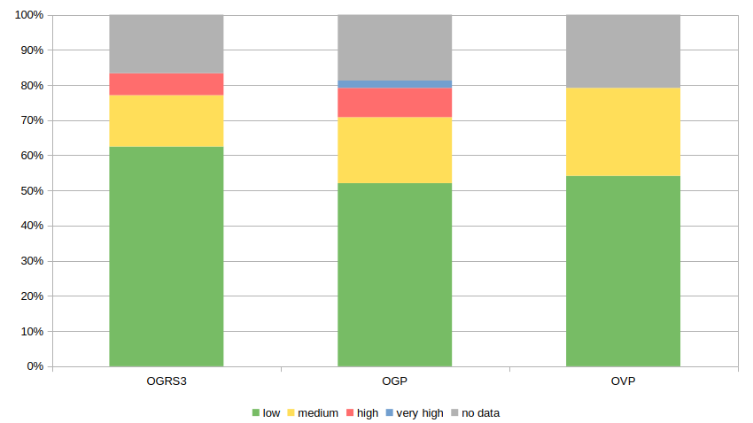
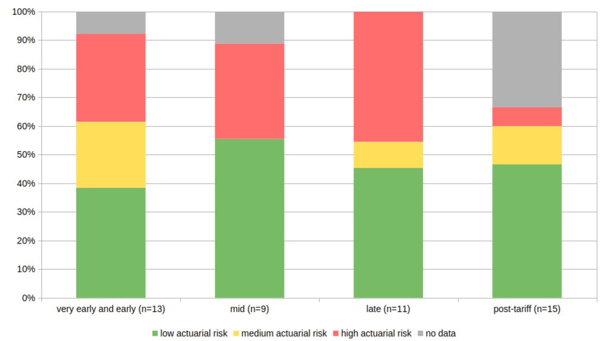
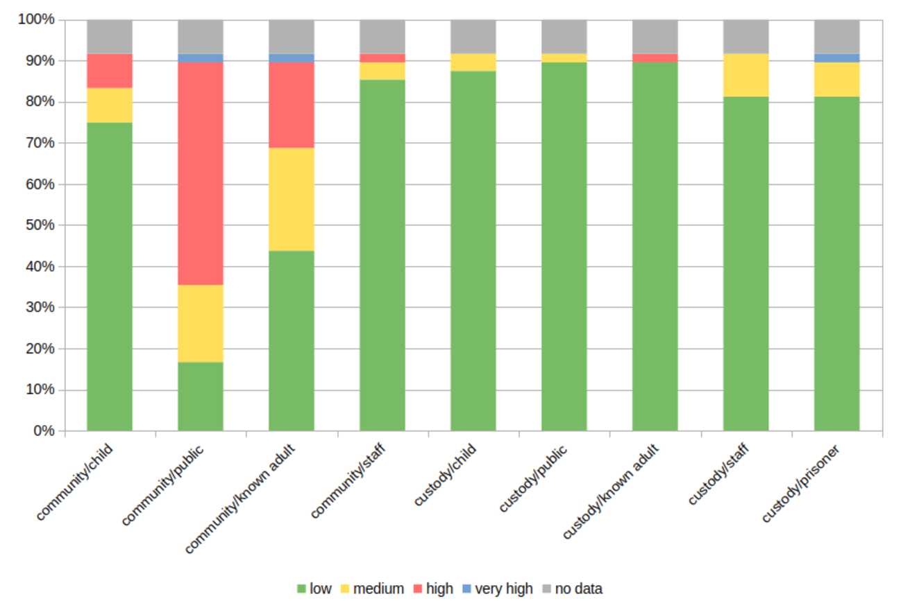
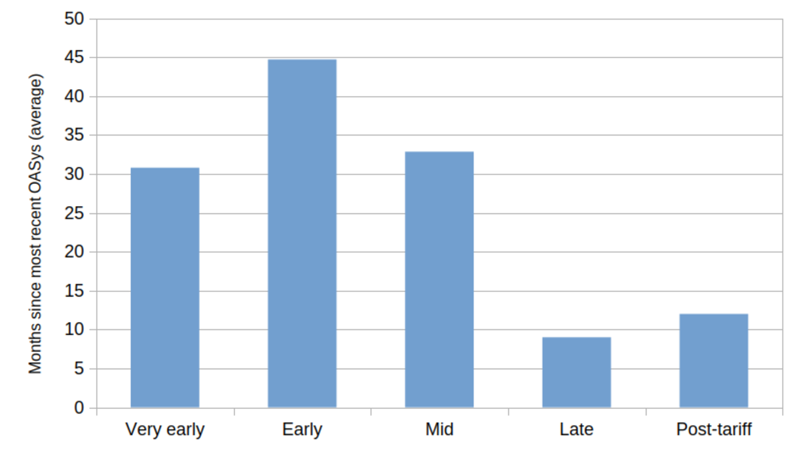

  > Increasingly, prisoners are no longer objects of punishment, but made instead into potential subjects of self-change, thus creating prisons characterized by what Crewe has called 'neo-paternalism'. The feeling of 'tightness' [is] connected to the perceived need to self-govern, take responsibility and show credible change and growth.
  >
  > @ugelvikPainsCrimmigrationImprisonment2018 [p. 1028], referencing Crewe [-@crewePrisonerSocietyPower2009; -@creweDepthWeightTightness2011]

Punishment enforces twin obligations, backing each with the threat of coercion. One is retrospective: to confront culpability. The other is reformative: to take responsibility for future conduct. They are not entirely separable, but whereas Chapters [4](./4_becoming-a-murderer.qmd) and [5](./5_life-and-the-life-sentence.qmd) examined participants' approach to the first obligation, this chapter focuses more squarely on the second: their attitudes to official attempts to induce self-governance, largely through the medium of 'risk', the central organising concept in the prison's moral communication.

The finding that risk governance is entangling and painful, particularly for indeterminately-sentenced prisoners, is perhaps most associated with the work of Ben @creweDepthWeightTightness2011. In this sample, however, the pains of being tightly 'harnessed' by the prison were not uniformly evident. This was partly because risk-related expectations—the *content* of moral communication—differed between the two sites. It was also because moral messages were *heard differently*, too: some participants saw risk-reducing intervention as a legitimate attempt to offer them needed help, while others found it illegitimate and oppressive, resenting interference in their attempts to prepare for future life.

This chapter explores the contrast, by four steps. First, I set out key concepts used in the empirical analysis. Second, I sketch a descriptive 'risk profile' for the sample. Third, I describe the characteristic styles of moral communication evident at Swaleside and Leyhill, and exemplify the guidance (if any) they offered on risk. I characterise Swaleside as generally 'loose' and 'neglectful' (albeit with pockets of 'laxity' and 'tightness'); and Leyhill as extremely 'tight', unexpectedly so for many participants. Finally, I develop this into an analysis of adaptation styles, identifying four 'ethical responses' to risk governance evident in the sample. A closing discussion suggests that whether prisoners find risk governance painful or not may often be a consequence of imported factors in their personal history, including the offence. This finding adds nuance to existing accounts, which tend not to differentiate systematically between how prisoners with distinct characteristics respond to risk-based forms of rehabilitative intervention.

## Conceptualising experiences of risk intervention {#sec-6-conceptual-frame}

The empirical analysis in this chapter borrows conceptual terminology from two main sources. @tbl-6.2 summarises them.

One is Ben Crewe's influential 'tightness' framework [see, variously, -@creweDepthWeightTightness2011; -@creweBellyPenalBeast2015; -@creweTightnessRecognitionPenal2021]. It suggests that indeterminate sentences are distinctively punitive because they entangle prisoners in risk-management structures, which demand compliance and self-governance, but are also hard to understand and comply with. The conceptualisation has recently been revised to reflect new findings [@creweTightnessRecognitionPenal2021; @ievinsAuthoritarianExclusionLaissezfaire2021]: relating, first, to the differing demands made by different penal regimes, and the varied support offered to help prisoners meet these demands; and, second, to the observation that not all intervention is unwelcome. Often, @creweTightnessRecognitionPenal2021 [65] argue, prisoners welcome "supportive rather than coercive" interventions which "engage with [their] full personhood rather than trapping [them] in the amber of the past". The reformulated framework distinguishes between the forms of 'grip' exerted by risk-reducing interventions in different penal circumstances. @tbl-6.2a summarises its key terms.

A second conceptual touchstone comes from Fergus @mcneillHelpingHoldingHurting2009, in a discussion of how supervisees experience probation supervision [see also @mcneillHelpingHoldingHurting2018], which links the pain/supportiveness question to notions of dignity and moral recognition. For McNeill, supervisees might feel *helped*, *held*, or *hurt* by supervision. To feel *helped* is to believe that, despite the status loss which inheres in punishment, one's own needs are nevertheless recognised as meriting support. To feel *hurt*, conversely, is to believe that one's needs are unrecognised: that punishment is only demotion. To be *held* is an ambivalent and intermediate position: constraints and demotions are frustrating, but tolerable to the extent that they are recognised to serve some legitimate wider purpose. The experience of being *held* may be prolonged, but is also temporary: that is, it depends on a tangible notion that *after* punishment, 'moral rehabilitation' [@mcneillFourFormsOffender2012] might occur. @tbl-6.2b summarises the key contrasts.

:::: {#tbl-6.2 .column-body-outset}

::: {#tbl-6.2a}

+--------------------------+----------------------------------------+
|                          | Demands made                           |
|                          +-------------------+--------------------+
|                          | Less              | More               |
+:==============+:========:+:=================:+:==================:+
| **Assistance  | **More** | Supportive        | Tight, firm        |
| offered**     |          |                   |                    |
|               +----------+-------------------+--------------------+
|               | **Less** | Loose, neglectful | Lax, inconsistent, |
|               |          |                   |      deficient     |
+---------------+----------+-------------------+--------------------+

Conceptualising the demands made and support offered by risk governance[^6.28]

:::

::: {#tbl-6.2b}

+-------------+--------------------------------------------------+
| Term        | Description                                      |
+=============+==================================================+
| **Helping** | * Supportive style of communication by supervisor|
|             |   (regardless of content)                        |
|             | * Supervisees feel seen/liked for who they might |
|             |   become (not merely for who they are or were)   |
|             | * Supervisees are guided towards an outcome they |
|             |   cannot (yet?) attain (or perceive?)            |
+-------------+--------------------------------------------------+
| **Holding** | * Supervision understood as “quasi-parental      |
|             |   guardianship”                                  |
|             | * Being 'held' for protection (of others, of/    |
|             |   from oneself)                                  |
|             | * Surveillance and constraint understood as means|
|             |   to an end, not ends in themselves              |
|             | * There is scope for trust to be restored        |
+-------------+--------------------------------------------------+
| **Hurting** | * Surveillance and constraint feel as if they    |
|             |   are exercised with malign intent               |
|             | * Supervision feels undeserved, unnecessary,     |
|             |   excessive, condescending, illegitimate, or     |
|             |   incompatible with other desired outcomes       |
|             | * Supervisors' behaviour is inconsistent with    |
|             |   quasi-guardianship or 'helping', appears       |
|             |   to ignore (not merely deprioritise) the        |
|             |   supervisee's best interests                    |
+-------------+--------------------------------------------------+

Ways of experiencing penal supervision[^6.8]

:::

Conceptualisations used in the chapter

::::

<!-- Nicholas's description of therapy in prison exemplified the contrasts made in @tbl-6.3 and @tbl-6.2, and is worth quoting at length. He indicated that whether one's treatment 'helps' or 'hurts' is at least partly perceived in relation to *time*:

  > The first year in therapy was okay, it was good. I was settled. I was learning about things. After the first year, that's when it really went downwards because that's when you went into harder work […] It really becomes hard.
  >
  > *Why 'hard',*
  >
  > Because […] there's *no way of hiding* from who you are or what was going on for you. *You feel really, really bad* about that, but, because you have that understanding and that knowledge at the same time, you also feel good, because I know, *whilst I'm feeling bad, it's doing good*. Do you know what I mean?
  >
  > *I think so---what good it is doing?*
  >
  > *Because you're changing and you're identifying who you are*. You're identifying what made you the person you'd become when you committed the offence […] That's going to leave you feeling like shit—excuse my language. It really leaves you feeling bad about yourself and about who you are.
  >
  > Nicholas (Leyhill, thirties, post-tariff), emphases added -->

 In this framing, risk-reducing intervention might be 'hurtful', in the sense that it pushes for confrontation with the individual's capacity for harm. But crucially, it might also feel like being 'held', if the subject believes the end is worthwhile. Conversely, to quote @mcneillHelpingHoldingHurting2009 [p. 10], if being 'held' fails to “bring about change”, then those who are held may conclude that their captivity aims for nothing more than the “contain[ment of] trouble”.

<!-- ### The institutions of 'offender management' {#sec-6-institutions-offender-management}

Before attempting an overview of the 'risk' in the sample, this section briefly reviews how the operationalisation of risk has developed over the last two decades or so.

The underlying institutions date from the early 2000s. Their original catchphrase, “end-to-end offender management”, captures the ambition, confidence, and fiscal firepower of penal policy at the time. What @lieblingPrisonsNewPenology2012 labelled 'managerialism-plus' had a strong sense of moral purpose:

  > [T]he introduction of management tools for measurement, monitoring, improved administration and accountability […] [aimed to turn] the liberal intentions of senior professionals into reality […] techniques of management control were overtly welded to better standards for prisoners and to greater control and encouragement of staff.
  >
  > @bennettPrisonManagement2020 [p. 9]

The ambition to use custody for positive outcomes was allied with a major expansion of indeterminate and extended sentences, with delayed or expedited release used to incentivise engagement with evidence-based offending behaviour interventions. Though 'tight' in their aspirations, these reforms were also pressurised by continuous prison population growth, so that risk assessment also became the means by which to allocate resource-intensive supervisory, rehabilitative, or incapacitative interventions according to assessed risk and cost-effectiveness [see @bontaAdultOffenderAssessment2016]. Generally, life- and long-sentenced prisoners (a largely compliant population who will be in prison for many years anyway) are often a lower priority for intervention than those shorter-sentenced counterparts whose release from prison would come sooner [@kazemianImperativeInclusionLong2015].

More importantly for progression and release decisions, though, assessing risk is not straightforward. Violence prediction at the individual level is inherently imprecise [@bottomsReflectionsRenaissanceDangerousness1977; @tonrySentencingPredictionOld2019; @vanginnekenUseRiskAssessment2019] and there is an inherently high rate of 'false positives' (people deemed to be risky who are not, in fact, likely to reoffend seriously after release). Combined with tariff inflation, and the hardening of pathways towards release, the result has been:

  > …the growing use of prison as a place of containment and [the] undermin[ing of] efforts to build a stronger strategic focus on the community infrastructure needed to support the desistance process in the long-term.
  >
  > @guineyMarginalGainsDiminishing2019 [p. 149]

Put simply, 'managerialism-plus' has become 'managerialism-minus' [@lieblingPrisonsNewPenology2012]. Rehabilitative interventions were reorganised as an increasingly specialised psychological service targeted/rationed at high-risk and urgent need. Long-sentenced prisoners lost access to the 'maps' which formerly helped navigate the sentence. Many, because of indeterminacy and complex risk classification, were denied the wherewithal to progress: a demoralising experience, and for some, a hope-killer [@harrisAlwaysWalkingEggshells2020]. Help was increasingly difficult to access and rehabilitation and progression arrangements have increasingly been 'responsibilised', Where 'end-to-end offender management' once set out to use custody to bring about positive change, its more austere, responsibilised version brought the focus back onto prisoners: could they demonstrate that they *deserved* to experience the benefits of intervention [@armstrongRiskRightsRehabilitation2020]? -->

## Assessed risk in the sample {#sec-6-assessed-risk-sample}

This section summarises risk in the sample using an overview of different classificatory systems described in prison records. It shows how as a whole, the sample were believed to pose few risks of harm to others in custody, but that considerable uncertainties were prompted by the prospect of their release.

The Offender Assessment System (hereinafter, OASys) calculates actuarial risk scores for all lifers. @fig-6.1 summarises them, subdivided by assessment methodology ([-@fig-6.1a]) and sentence stage ([-@fig-6.1b]). Between half and two-thirds of participants posed a 'low' risk of reconviction. None posed a 'high' risk of reconviction for violence, and those assessed as 'low' or 'medium' risk outnumbered the remainder (which included missing data) by at least two to one.[^6.24] It is not evident from @fig-6.1b that risk was lower among those later in the sentence: higher risk scores were evenly distributed across sentence stages, except in post-tariff, where missing data made it hard to discern a pattern.

:::: {#fig-6.1 .column-body-outset}

::: {#fig-6.1a layout-align="center"}

Actuarial risk by assessment method

:::

::: {#fig-6.1b layout-align="center"}

Actuarial risk by sentence stage

:::

::: {#fig-6.1c layout-align="center"}

Custodial and Community RoSH classifications by type

:::

Risk assessments for the sample[^6.25]

::::

Lifers in the sample had also been the subjects of Risk of Serious Harm (RoSH) assessments. Generated using a structured professional judgement (SPJ) methodology, the RoSH is more open to the assessor's bias, but is also more responsive than the purely actuarial scores to dynamic risk factors. Its risk levels are more like categorical than continuous variables, in that they represent qualitative categories, though all RoSH assessments start from an actuarially-derived reference score.

@fig-6.1c summarises the sample's RoSH classifications. Two main points should be noted. As the rightmost five bars show, over 80% had been assessed as posing a 'low' risk of seriously harming anyone in custody; only one individual had a 'high' or 'very high' assessment for any custodial group. These 'low' custodial RoSH scores are noteworthy given Swaleside's reputation for violence, which lifers in the sample were not typically expected to participate in.

By contrast, the leftmost four bars of @fig-6.1c describe community risk. Around half the sample were assessed at the 'medium', 'high' or 'very high' levels for RoSH to 'known adults', and more than 70% fell into these bands for RoSH to 'the public'. Far fewer were expected to pose a risk of serious harm to children or staff, but those risks again exceeded those foreseen in custody.

### Summary {#sec-6-risk-summary}

What can be drawn together is only a crude sketch, which a random sample and a more methodical analysis would improve. At least, though, it is notable that staff expected *over half* of the sample to pose a 'high' risk of serious harm after release; but *over half* were forecast *by actuarial methods* to be at a 'low' risk of reconviction for violence. To draw out the implications: 'high-risk' status was assigned more because harm might be 'serious', than because there was a high statistical probability of it occurring.

The next section begins to explore risk communication at both prisons, by describing how they communicated with prisoners, and what they were like as morally communicative environments.

## Swaleside and Leyhill as morally communicative environments {#sec-6-swaleside-leyhill-morally-communicative-environments}

Offender management in custody, as described in the relevant policy framework, aims to "co-ordinate and sequence an individual's journey through custody and post-release”. Its “primary purpose” is to “motivate [prisoners] and provide them with opportunities to change their lives and promote rehabilitation”. Staff are to work collaboratively with prisoners on a sentence plan “which is monitored, implemented, reviewed at points of significant change in circumstance from reception to the end of licence and post-sentence supervision” . Prisons should foster a 'rehabilitative culture': harmonious, collaborative, resource-efficient, minimally painful, and “reducing reoffending, protecting the public and preventing victims by changing lives" [all quotes from @ministryofjusticeManageCustodialSentence2018, pp. 5-6].

The impression formed by these quotes is that the sentence plan and the activities it prescribes are an explicit moral code describing 'pro-social' conduct. Though its demands may be neo-paternal and 'tight', it offers 'institutional hope' [@seedsHopeLifeSentence2022], by implying that conduct aligned with its prescriptions will result, eventually, in moral and judicial rehabilitation. In fact, however, offender management communicated with participants in wildly inconsistent ways. This section describes how.

### Swaleside—'loose', 'lax', or tight? {#sec-6-swaleside-morally-communicative-environment}

As @sec-3-swaleside suggested, Swaleside's OMU was struggling to implement offender management policies in line with policy. Casework backlogs were common, and the OASys (a key building block of the sentence plan) was often out-of-date. @fig-6.4 plots the average time elapsed since Swaleside participants' most recent OASys assessment, subdivided by sentence stage. Only those in the late and post-tariff stages were being reviewed at less than two-yearly intervals,[^6.6] reflecting the prioritisation of high-risk and urgent cases described by the Inspectorate (see Chapter [-@sec-2-day-day-communication]).

::: {#fig-6.4 layout-align="center"}

Average months since most recent OASys for the Swaleside sample, by sentence stage (n=25)[^6.27]

:::

The result for many was confusion over how life sentences worked. One man expressed the belief that he was serving a determinate sentence, and that his parole eligibility date was a determinate release date. Many others were uncertain whether they *had* a sentence plan, or were certain they did not. This was not 'tightness', in the form of an "all-encompassing and invasive” power operating “closely and anonymously” and leaving prisoners with “the sense of not knowing which way to move, for fear of getting things wrong" [@creweDepthWeightTightness2011, p. 522]. Instead, its demands were few, half-hearted, and tenuously connected with risk and the offence.

#### Swaleside's moral communication through documents {#sec-6-swaleside-morally-communicative-lax}

According to policy, *all* prisoners should have a sentence plan, listing recommendations intended to promote their progression [@ministryofjusticeManageCustodialSentence2018]. Yet of the 29 RC1 forms I reviewed at Swaleside, only four (all prepared for men in the late or post-tariff stages) listed specific 'sentence plan recommendations'.[^6.29] The lists were short, vague, and sometimes seemed condescending, containing instructions such as "make constructive use of time", "demonstrate appropriate behaviour", and "understand likely consequences of offending". They were targets calling for cooperation, not agency.
<!-- The following list (quoted verbatim and in full) was representative:

  > * Make constructive use of time
  > * Complete holistic assessment to identify treatment pathway
  > * Demonstrate appropriate behaviour during sentence
  > * Increased understanding of likely consequence for self or others of offending -->

For the 25 RC1 forms which lacked 'specific' objectives such as these, the main explicit demands concerned 'risk reduction work'. They, again, demanded vague and passive compliance, not agency. They also focused mostly on offending behaviour courses. The following is a typical example, quoted verbatim and in full. It is broadly representative of forms a) lacking sentence plan recommendations, written for b) participants not in the late and post-tariff phases, who had c) not yet 'done their courses':

  > * Risk reducing work completed
  >   * No completed RR work
  > * Outstanding RR work
  >   * Offending Behaviour - Appropriate accredited intervention programmes
  >     * Resolve, if suitable
  >     * TSP
  >     * Kaizen if suitable
  >     * Engagement with the Psychology team (ongoing)
  >     * Engagement with the prison regime. Maintaining Enhanced status. Positive use of time. No adjudications or behaviour warnings.

Noteworthy here is the use of conditional (“if suitable”) and negative (“no adjudications or behaviour warnings”) objectives. 'Success' in attaining them entails no more than acquiescence to the basic routines of prison life, and engagement with programmes when the time comes.

Where the subject of the form *had* 'done his courses', the list was, if anything, even briefer. The following example is broadly representative of forms a) lacking sentence plan recommendations, which had been b) prepared for men not in the late and post-tariff phases, who c) *had* 'done their courses':

  > * Risk reducing work completed
  >   * [list of completed courses obfuscated for anonymity]
  > * Outstanding RR work
  >   * ETE[^6.20] (ongoing)
  >   * Resolve (unsuitable)
  >   * Pro-social modelling, gain enhanced status and use time constructively, remain adjudication free

None of the quoted objectives is SMART (i.e. specific, measurable, achievable, realistic, and time-bound), as the policy requires; moreover, none of them list required actions supporting each objective in order of priority [@nationaloffendermanagementservicePSI1920142015a, para. 2.7].

These documents, for many participants and for years at a time, represented the only form of contact with the OMU about risk. They communicated little, and were detached from a meaningful assessment of day-to-day conduct. Many participants could not see any relevance between them and progression decisions. Grant, looking back to his time at Swaleside, put this crisply:

  > I just used to dutifully fill it in, put my little bit on there, post it back, and I'd get knocked back.[^6.1] The reason given is because my OASys isn't up to date […] No fault of my own, it's just that they haven't done their job. I thought, “okay, fair enough, they're busy”, you know? So the next one come through, I done it again… I've done about four or five… […] I was filling these bloody forms in and sending them back. I got another one, the OASys still wasn't done, thought, “oh, fucking bollocks to that”, threw it in the bin. That's when I got my C-cat! [laughs] 
  >
  > Grant (Leyhill, fifties, late)

The key point here relates to Swaleside's moral communication. It demanded 'risk reduction', but did little to give these demands substance, or to link them with outcomes prisoners themselves found worth pursuing. It communicated broadly and vaguely, inviting but not expecting a response. Active participation by prisoners in the review process—another explicit policy expectation—appeared rare, and Grant was unusual in reporting having made such a response. Of the 29 RC1 forms I read at Swaleside, only one included written representations. These (paraphrased to protect anonymity) are worth reproducing in full:

  > What can I say? Last year, this form said you haven't seen a change in me, but the person who wrote that has only met me in passing. I don't see OMU staff though I make requests. If I take drugs or get in a fight you'll take an interest and see a change, but I'm not ticking your boxes for the sake of it. I have changed: I help other prisoners with life skills, I'm self-controlled, calm, and I stay out of trouble.
  >
  > Gary (Swaleside, fifties, early)

Of course, policies and RC1 forms represent aspirations, not manuals. Nevertheless, Gary's reference to 'box-ticking' was significant, reflecting an impression that the OMU was interested only in changes fitting a template, not in changes prisoners might consider important. Also significant was that participants who (like Gary) accepted their guilt were often (like Gary) *resentful* of the OMU's distance and lack of interest in them. They *accepted* the demand that they ought to change, but perceived indifference towards their efforts to do so.

The RC1 summarised one further form of explicit moral communication: positive and negative staff entries in P-NOMIS during the previous 12 months,<!-- [^6.9] --> reflecting conduct that staff wished to take the trouble to record formally, or which required censure. Almost without exception, positive comments related to compliance: courtesies to staff, facilitating the smooth functioning of the prison, or representing Swaleside positively to outsiders. The following items, selected from three separate RC1s, are representative:

  > * compliant and polite while uncuffed on escort
  > * worked additional hours
  > * always very helpful and polite to staff
  > * helped me greatly by meeting with the family of [name] who recently died
  > * always polite to staff and if asked to do something never says no or complains
  > * alerting staff to an offender who was found unresponsive in his cell
  > * active role in wing spring clean and engaged in plenty of banter

Only the first item in this list directly indicates anything about the prisoner's capacity to manage his risk, and then only in a very specific situation. Correspondingly, negative entries (which were much more numerous) mostly related to obstructions of official control over prison life. Discourtesy to staff, incidents of non-compliance, specific rule breaches (such as failed drug tests), and adverse adjudications were all common themes, and usually recorded without context.

A vague sense of pro-sociality lies beneath the positive entries. Doubtless the praise and appreciation expressed were genuine, and many negative entries recorded similarly undesirable behaviour. But the point to note here relates, again, to communication and 'tightness'. Neither Swaleside's OMU nor its uniformed staff were communicating 'tight' demands in relation to risk, and the overall impression is one of low, undemanding expectations. It was *extremely* unusual for case notes to record achievements participants themselves rated as personally important, even when these reflected major changes of lifestyle or when (as in Gary's case above) they tried to positively influence others:

  > Prisoners seem to give you more kudos than the staff and the establishment […] Like, they're quick to slap you down for the least little thing […] [but] I checked, and [my Open University degree] wasn't even on my NOMIS […] They take no account [of] it.
  >
  > Leon (Swaleside, forties, mid)

Summing up, it is helpful to think of these encounters—between individual lifers and their documents—as ethical interactions. Particularly in interpersonal contexts, but also between persons and institutions, anthropologists have shown interaction to be:

  > …in itself a moral and ethical domain. When persons interact they necessarily and unavoidably assess whether they are being heard, ignored, disattended, and so on. Is this person really listening to me? Paying attention to me? And, in so doing, acknowledging me as a worthwhile person who merits such attention?
  >
  > @sidnellOrdinaryEthicsEveryday2010 [pp. 124-5]

Swaleside's implementation of the offender management framework was distant, unresponsive, and inattentive. It made vague demands, and rewarded compliance unpredictably. Many participants understood risk to be the prison's (not their) concern. They often accepted the idea that their offence meant they ought to change; but in the face of disregard they looked elsewhere for ethical validation.

This was, then, the overall style of communication at Swaleside. The following sections consider how three different prisoner groups perceived it, differentiating them by how they understood Swaleside's distinctive way of communicating with them.

#### Perceiving 'looseness' or 'neglect' {#sec-6-swaleside-morally-communicative-loose}

How prisoners at Swaleside *perceived* the prison's communication depended largely on their sentence stage and prior custodial experiences, especially whether *Swaleside alone* had shaped their 'penal consciousness' [@sextonPenalSubjectivitiesDeveloping2015], or whether they could compare it with other prisons. Two subgroups perceived the prison's treatment of them to be 'loose' (in the conceptual terminology unpacked in @sec-6-conceptual-frame).

For one subgroup, held in the early stages of the sentence and usually having come directly to Swaleside from a remand prison, the prison's communication felt 'loose', in the sense set out in @sec-6-conceptual-frame. They felt the prison proffered little assistance, but also that it was making few demands:

  > I don't know what my sentence plan is […] I just get my recat paper [i.e. the RC1] every year and they tell me you ain't done no courses. I ain't got a clue what I've got to do […] [T]hey just leave you to it.
  >
  > Yakubu (Swaleside, twenties, early)

Some described this treatment as "neglectful" (Ebo)---a suggestive term, pointing to a more powerful party's failure to fulfil obligations:

  > [I hate how] they are so blasé about it […]  My probation came to me and said, “I've only got your pre-sentence report." I've been in jail TEN YEARS. How is the only thing you've got on me my pre-sentence report? I've done so much […] to better myself, to get myself in a good position. They turn around and say to me, “Oh, well, I don't really know what you've been up to.”
  >
  > Ebo (Swaleside, twenties, mid)

Ebo's complaint was not *that* the OMU made moral demands, but *how*: vaguely and without interest in his response. Swaleside's laxity felt to him like a failure of reciprocity [a psychological foundation of the capacity for ethical behaviour—see @keaneEthicalLifeIts2016, p. 39-58]. Ebo (and others) felt that working to improve oneself ought to attract recognition. These criticisms tended to focus not on staff but on 'the system', or the state. Its failures fell short of outright abandonment,[^6.14] but by withholding moral recognition and a map to restoration, it communicated indifference and disregard, weakening its claim to the moral standing to deliver censure. The subgroup to which Ebo and Yakubu belonged—mostly, men from London, convicted young, now in early or mid-sentence in their twenties and thirties, and resident at Swaleside for at least a few years—felt ignored. For those later in the sentence, the resulting frustration metastasised into a kind of sullen cynicism, and refusal to engage:

<!-- Such attitudes did not always indicate of hostility towards staff *per se*:

  > The government don't show these officers enough respect or love or appreciation, at all […] Obviously there's loads of stuff that they are meant to be doing… like, when people come from dispersal—they're the ones that know everything about prison—when they come, they're like, “oh, you know you're supposed to be getting this”, and you know, “they're supposed to be doing this”, and da da da da da. But I can understand—they ain't getting paid enough […] to be running around doing all this stuff for you.
  >
  > Reuben (Swaleside, thirties, mid) -->

  > This jail here, this jail is a dumping ground. They don't care about you, you're just here, you're paying their wages. Do you think they really care? […]
  >
  > *So any priorities [OMU staff] might say they've got for you…*
  >
  > [Angrily] They haven't GOT any priorities. This jail—any jail—they blow smoke up your arse.[^6.15]
  >
  > Nixon (Swaleside, forties, post-tariff)

  <!-- > [The system is] releasing some prisoners who will, who are risk of serious harm and will reoffend. It's letting them out. It's only letting them out because they're telling you what you want to hear. And it's also keeping people in prison who could be released safely, but are not being released because they're not telling the system what it wants to hear, or because of the stresses and strains of being in prison, they're breaking minor rules.
  >
  > Nasim (Swaleside, forties, post-tariff) -->

It seemed to them that the prison expected little more than a performance:

  > You know what I noticed? When you get sentenced, they want you to spaz out—20,000 nickings, fighting, kicking off, phones, drugs. They WANT to see that. Then the last 5, 6, 7 years of your sentence, now you change, get Enhanced for a few years. You go get your mandatory piss test; you pass it. You know what I'm saying? They're thinking, “Oh yes, we've seen a change now”.
  >
  > Courtney (Swaleside, forties, late)

A second analytical subgroup who perceived 'looseness' in Swaleside's communication with them comprised men convicted when older. Their assessed risk was typically lower, and they had either been found unsuitable for offending behaviour programmes, or had completed them willingly only to find the prison's grip on them relaxing. As with those who bemoaned the prison's 'neglect', there was an underlying desire: to be recognised as ethical individuals, not as the representatives of impersonal, risk-bearing groups. But they, too, found that the OMU communicated few explicit demands and made few attempts to discipline their subjectivity. Its prime demands were obedience and compliance:

  > *Does it feel like they make demands on you?*
  >
  > It's just the courses I get told to do. […] And then they come back: "he's not eligible for it." And then it's, “Terry keeps himself to himself, he's polite”. And all that.
  >
  > *So what really matters to them?*
  >
  > Don't go out there messing around the system and playing up.
  >
  > Terry (Swaleside, fifties, mid)

  > I have nothing more to do, I've completed my sentence plan. […] My latest sentence plan basically just says stay Enhanced, keep working, and follow what they call the pro-social model. That's it.
  >
  > *What do you think they mean by that?*
  >
  > Just be a good boy […] The OMU system is not set up to recognise anything more.
  >
  > Rafiq (Swaleside, thirties, early)

Not everyone at Swaleside perceived the prison to be 'loose'; two subgroups perceived matters differently.

#### Perceiving 'laxity' {#sec-6-swaleside-morally-communicative-laxity}

The first was the handful of men for whom Swaleside represented a progressive move. During many years in maximum-security prisons, they had encountered clearer, higher expectations, and (more importantly) intrusive, even oppressive staff supervision. Such conditions were paradigmatically 'tight'; progressing from them required an intense, unyielding commitment to play the game in one's own interests:

  > A decision comes: either you lock off the past, you decide you're gonna move forward, and you do your courses and work for your own future, or you don't. You can stay in prison and be a wanker, or you can lock off and get out.
  >
  > Mark (Swaleside, thirties, post-tariff), from interview notes

As we saw, lifers who had *only* spent time at Swaleside tended to believe that risk management was a kind of charade, unrelated to their actual sentence progression. This was far from true for those with past experience of cat-A conditions:

  > Obviously my last sentence plan at [category-A prison], they set me goals. I've achieved most if not all of those […] So *they need to set me some new ones* […] It's like, “stay out of trouble, continue education”, yeah? *That's kind of vague*. […] *I do believe I need a bit more structure*.
  >
  > Leon (Swaleside, forties, mid)

Former cat-A prisoners at Swaleside were typically also well-informed about national policy, and some used complaints to force their own case management into line with policy. They also took care to curate, manage and correct information in their files, a striking habit evident only among this group:

  > My last OASys was in [category-A prison] because they only do it every three years here, which is bollocks. Now, eventually I'm going to move on somewhere else. Who's going to put all that into my OASys, all the good stuff I've done on this wing? It's going to get lost. Obviously, there'll be bits and pieces on NOMIS, but there won't be no reports done. I'll get to another jail and they'll talk about, "what did you do off the plan?" *No one in that jail's going to know what I did unless I tell them*.
  >
  > Tony (Swaleside, thirties, mid), from notes

It was not simply experience of category-A status which mattered here, but more generally, experience of the 'crunch points' associated with recategorisation and progression. Life sentences are now so long that periods of 'dead time' may be unavoidable, but 'crunch points' are periods of intensified scrutiny. Those at Swaleside who understood this had either downgraded from category-A, or been knocked back for progressive onwards moves, because past incidents on file had complicated their progression in unforeseen ways. A 'crunch point' increased their awareness of the pervasiveness and reach of risk assessment---the 'power of the pen' [@creweSoftPowerPrison2011]. Those who had spent most of the sentence at Swaleside appeared more unaware of this. Crunch points—when risk was sharply in focus—were exacting and demanding, unsettling the feeling of 'neglect' which prevailed at other times, and rendering the prison's indifference hitherto both less benign and more damaging, in hindsight. Former category-A prisoners understood that not just compliance, but a formal record consistent with a narrative of reform, were preconditions of progression. To them, Swaleside felt not 'loose' but 'lax' [@creweTightnessRecognitionPenal2021]. It made demands, but those with experience of 'tighter' conditions understood only too well how vaguely and unhelpfully they were communicated.

#### Perceiving 'tightness' {#sec-6-swaleside-morally-communicative-tightness}

A second subgroup who experienced something other than 'looseness' at Swaleside were receiving treatment in the PIPE unit. Often having been recategorised as category-C prisoners, but still held at Swaleside, they usually had sustained experience of other prisons and earlier 'crunch points', and many were in the PIPE specifically to 'catch up' with risk-focused sentence plan objectives. They, like the former cat-A men, were accustomed to being gripped 'tightly'. However, the additional clinical resources in the PIPE meant their *current* experience was of a close—and supportive—style of communication:

  > My clinician said, "all those were just feelings you brushed off because you did not understand them”. She made me look at them all. But not just, “there they are, now move past it.” It was, “Look at them.” And you look at them through a pair of glasses, then through binoculars and a magnifying glass […] Bloody hell… She was so good. So, so good.
  >
  > Tom (Swaleside, fifties, post-tariff)

Even in the PIPE, though, there was a sense of diminishing returns. *Too much* intervention could tip over into outright resentment:

  > I eventually got to this fucking place and then they come to see me. And then I said, "well, how long am I going to be there?" "Twelve months." Yay, twelve months, alright!
  >
  > *When was that?*
  >
  > Three years ago! Well, a bit more […] They said I don't have any remorse. But I don't give a fuck any more […] I mean, I've… I used to feel bad about what happened […] They tried to… drive me into depression, almost… […] And then they go, “well, you haven't got any remorse”. I used to have, but you bashed it out of me. I used to care. I don't give a fuck any more.
  >
  > Chris (Swaleside, sixties, post-tariff)

### Leyhill—'tight', demanding, and entangling {#sec-6-leyhill-morally-communicative-environment}

Where Swaleside communicated a morally minimal indifference (comply, keep out of trouble, but otherwise do as you like), Leyhill *intensified* supervision and conveyed distrust. 

  > This place is scared of its own shadow.
  >
  > Fred (Leyhill, fifties, post-tariff)
  
Leyhill's treatment of risk entailed a very different style of communication.  Participants arrived expecting something close to 'moral rehabilitation' [@mcneillFourFormsOffender2012]: restoration to a more trusted, less dishonoured form of subjectivity. Yet in being labelled as 'risky' and subjected to supervision, they perceived renewed condescension and stigma. Lacking Swaleside's situational security controls and suite of interventions, Leyhill's resettlement function involved a structured, cautious restoration of trust, backed with careful monitoring. The prison 'responsibilised' participants, and its individualised behavioural expectations far exceeded Swaleside's in specificity and scope.

However, there was a profound ambivalence about risk there. Any one of a number of several explanations could explain the widespread compliance of prisoners there. Which explanation was 'true' was difficult to interpret. Compliance might signal genuine reform; or that a prisoner was 'gaming' the system; or that he was concealing risky behaviour; or that offence-relevant situations which might bring risk into focus were absent.[^6.19] Mistrust was therefore institutionalised at Leyhill, because it was so hard to know whom to trust.

As a result, the move to Leyhill did not long retain the impression of being a 'progressive' one towards freedom. Several recent arrivals expressed surprise at how they felt there:

  > …he expected it to be "less like a prison" […] the OMU “would still make your life pretty difficult if they don't take a shine to you”
  >
  > Jeremiah (Leyhill, thirties, post-tariff), from notes

Many participants believed the prevalence of sexual offence convictions at Leyhill was the key issue driving this caution. Among the evidence they offered was the lack of good-quality ROTL work opportunities:

  > There's no [outside] work here, It's all bollocks […] It's not like other D-cats. I can understand why, because of the clientele, but no, it's not helped with me.
  >
  > Ron (Leyhill, fifties, post-tariff)

Leyhill therefore felt not only 'tight', but also staining [@ievinsStainsImprisonmentMoral2023]. Stricter risk controls prolonged and reinforced a message of lowered status. For participants who *did* have sexual convictions, life there resembled a kind of non-life or undeath [@ievinsPrisonSpaceNonlife2024], offering existence but not space in which to pursue what really mattered:

  > It's Groundhog Day […] guys [here] that know each other, every time we pass each other, we go, "Unnnnggghhhhh!" [miming a lifeless demeanour] Zombieland—it's Zombieland! Because there's nothing to look forward to here, nothing. […] I've got friends that […] actually fucking dread [day releases] and the rigmarole they've got to go through, and the mistrust they endure when they come back […] They go, “it's more hassle than it's worth.”
  >
  > Fred (Leyhill, fifties, post-tariff)

The mention of 'mistrust' here points to a significant gap: between the *expectations* and the *realities* of resettlement and preparation for release. In policy, the purpose of ROTL is clear: to test compliance with licence conditions, and thereby to gauge risk. Prisoners, however, were impatient to make up for lost time, and to put gains during the sentence to effective use:

  > I've gained an education. Like, better qualifications. I didn't have anything when I came inside […] You know, I want to do good. I want to, you know, complete things. Don't want to start something and not finish it […] Like, work and stuff… […] Yeah. So, like, [release] just opens up, like, so much possibilities.
  >
  > Jeremiah (Leyhill, thirties, post-tariff)

#### Leyhill's moral communication through documents {#sec-6-leyhill-morally-communicative-tight}

The risk documents reviewed at Leyhill—principally, Enhanced Behaviour Monitoring (EBM) assessments[^6.18] and ROTL risk assessments—corroborated the impression that conditions 'tightened' upon arrival there. It is impossible, for reasons of space and anonymity, to quote these records at length. But an indication of how differently risk was constructed at Leyhill than at Swaleside can be seen in @tbl-6.1. It presents a composite of two participants' records, paraphrased and intermingled (to obfuscate identity) as though they described one person. Both participants' actuarial risk scores were "low", and their RoSH assessments were "low", except for "high" risks of harm to the public:

::: {#tbl-6.1}

+:------------+:----------------------------------------------------------------+
| Behavioural | 1. Evidence of rumination or resentment, e.g.:                  |
| indicators  |    * Can't let go of things said to him                         |
| of risk     |    * Perception of unfair treatment compared to others          |
| elevation   |    * Belief of being ignored or rejected                        |
|             | 2. Poor management of emotions, e.g.:                           |
|             |    * Self-isolation                                             |
|             |    * Skipping work                                              |
|             |    * Does not seek advice from appropriate staff                |
|             |    * Attention-seeking                                          |
|             | 3. Lack of open engagement with staff, e.g.:                    |
|             |    * Self-isolation                                             |
|             |    * Not talking about problems                                 |
|             |    * Not engaging                                               |
|             |    * Perceives rejection or exclusion                           |
|             | 4. Indicates a negative self-image                              |
|             |    * Believes others are favoured over him                      |
|             |    * Sees himself as unloved or unwanted                        |
|             |    * Expectations too high                                      |
|             |    * Sets impossible deadlines, punishes himself for not meeting|
|             |      them                                                       |
+-------------+-----------------------------------------------------------------+
| Behavioural | 1. Manages unhelpful thinking:                                  |
| indicators  |    * Such as:                                                   |
| of risk     |      * Challenges own distortions                               |
| reduction   |      * Stops his train of thought                               |
|             |      * Seeks distraction                                        |
|             |    * Can express emotions if unhappy                            |
|             |    * Can manage vengeful impulses                               |
|             | 2. Manages distress by:                                         |
|             |    * Uses the coping skills learned previously                  |
|             |    * Discusses emotions with others                             |
|             |    * Solves problems using consequential thinking and assertive |
|             |      communication                                              |
|             | 3. Positive relationships with staff:                           |
|             |    * Discusses emotions and thoughts                            |
|             |    * Explores problems and notes his progress                   |
|             | 4. Friendships and positive relationships                       |
|             |    * Without attention-seeking                                  |
|             |    * Or engaging in friendship for positive feedback            |
|             | 5. Develops a positive self-image                               |
|             |    * Seeks help when needed                                     |
|             |    * Recognises his strengths                                   |
|             |    * Can see his own progress                                   |
|             | 6. Develops realistic plans for the future                      |
|             |    * Foresees problems and finds ways to  overcome them         |
+-------------+-----------------------------------------------------------------+

Typical risk elevation and risk reduction indicators in documents reviewed at Leyhill

:::

The examples in @tbl-6.1 focus mostly on emotional self-management. With other records, the underlying structure was the same, but the behaviours they classified as encouraging or concerning differed. Substance misuse, perceived misogyny, or personality traits such as 'argumentativeness', along with many others, were all associated with variable risk. Also noteworthy is the importance given to positive relationships with staff, who are presumed to be able and willing to offer time for support and guidance. Staff are presumably also given some discretion about what constitutes “helpful” or “unhelpful” thinking, or “appropriate" problem-solving. Participants are placed in a relationship of quasi-dependency on them, who are to be relied on for advice, guidance, and (presumably) identification of further needs.

Just as for former category-A prisoners at Swaleside, then, the transition to open conditions represented an ethical 'crunch point'. The removal of situational controls brought new risks into focus, specifically those associated with the resettlement process. Risk assessors approached their task with a renewed caution, and the transition entailed an unexpected element of prescriptiveness in the risk controls applied to participants, some of whom expected them to be relaxed. The freedoms of the open environment, anticipated by some as the forerunner of restored trust and greater moral recognition, therefore in fact signalled conditionality, surveillance, and constraint. Leyhill felt to them much closer to 'tightness' as originally described by @creweDepthWeightTightness2011, than to the 'looseness' or 'laxity' identified here with Swaleside.

#### Differing attitudes to 'tight' constraints{#sec-6-leyhill-morally-communicative-different-attitudes-tightness}

Although cross-sectional data can only offer pointers, it is not implausible to think of crunch points—i.e. periods of 'tight' high expectations—acting as a kind of sorting mechanism. Some participants at Leyhill had spent prolonged periods in 'looser' and 'laxer' prisons. Left comparatively free to dream about the future and develop their own plans and expectations, many had developed ground projects and ethical practices featuring redemptive, optimistic narratives familiar from desistance research. Dalton's aim was to make a living from music. But as he put it:

  > They're saying, "Yes, but what is the achievable goal?” I'm saying, “Well, that is achievable. How do you think there are artists? Because they set out to achieve it, and they've achieved it. It's not achievable if I don't try to achieve it.” They're like, “Yes, but […] it's not going to look realistic […] What else could you put?" I'm saying, “How do you know I can't do that? Don't tell me what I can and can't do.”
  >
  > Dalton (Leyhill, thirties, mid)

For some, then, 'tight' risk management smothered ambition and imposed alienating lifestyles of minimal risk and minimal reward. Some found this difficult to accept, pushing back and laying claim to bigger ambitions:

  > I have got an [offer of work with a professional firm] on an unpaid basis. […] I would sooner do that than work in a placement where I am making low-end money, but no personal progression going on. Whereas, if I went and worked with [them] my CV starts to build and I start networking […] I am not automatically barred […]  I have looked into it […] I have had the paperwork sent through […] But it is [outside the travel radius] [so the prison said no].
  >
  > Dario (Leyhill, forties, late)

Those harbouring ambitions of this kind had generally been relatively young at conviction, and expected to be released during their thirties and forties. Older men, or those so far over-tariff that they had learned not to hope, found 'tight' risk management more of an irritant than a kind of thwarting. Most said they wanted little more than a simple life after prison:

  > They want to put me in a hostel on home leaves to watch me, but they're not going to see anything. Just an old man going to church and reading the newspaper.
  >
  > Emlyn (Leyhill, seventies, post-tariff), from notes

  > I mean, obviously, I'm going to have to go where I'm told to go, basically. Earn some money—I don't mind how. Get a German Shepherd dog. Take it for walks. That's all, really.
  >
  > Grant (Leyhill, sixties, late)

The contrast here was between younger men who wanted to transcend their sentence, and saw risk conditions as an obstacle, and those who wanted simply to enjoy life within constraints. Similarly, those who had internalised the view of themselves as damaged and dangerous described patiently continuing in their ground projects of disciplinary self-monitoring:

  > At the time of my oral hearing we were requesting release or open conditions. I am glad I didn't get my release now. Even more so now I am here, and I am gaining that experience to what it is like outside and how that affects me as a person.
  >
  > Nicholas (Leyhill, thirties, late)

The difference here—between those at Leyhill who were frustrated by 'tight' controls and those who were not—tended to relate to the moral status of the offence for each individual, or to their position in the life course. Either variable could make the risk controls appear reasonable or absurd.

The remainder of the chapter sets out a typology of individual ethical responses to risk management. First, however, I briefly summarise this section on how the two prisons communicated morally with participants.

### Summary---moral communication across the two sites

Moral communication at Swaleside used a language of risk, but substantive demands were few: be available for prescribed interventions, reproduce prison order, and engage constructively with staff. Prisoners who complied, made few demands, and challenged officers infrequently were left alone; those who did not were written up. Few could see how this might generate negative consequences later, when 'crunch points' arose in relation to their progression, but some—chiefly former category-A prisoners—did, and sought to work on their records as a consequence. Leyhill, by contrast, used a 'tighter' application of power than Swaleside. Some there felt entangled, perceiving a thwarting of plans their record of compliance had earned them the right to pursue. Others largely accepted, and sometimes even found benefit in, the 'tight' measures of risk management they were subject to.

Understood via a synthesis of evidence considered in this section, moral communication at the two prisons can be described in relation to the overriding concerns of the respective OMUs: to reduce and contain threats to prison safety (Swaleside) and to gauge and manage threats to public safety (Leyhill). These are neatly characterised as 'correctional risk' and 'community risk' by @kazemianImperativeInclusionLong2015 [p. 363], who note that LTPs “do not necessarily pose a significant threat to either”, and suggest that politicians and the public are more typically concerned by the latter.

The contrast is critical here, too. Most participants at both sites, like most lifers in general, were 'easy keepers' [@herbertTooEasyKeep2019] compared to shorter-term and more volatile populations. Containment, not transformation, was a feasible and logical response to their risk, with sentence lengths putting disciplinary 'crunch points' many years in the future. This was most evident at Swaleside, which intervened parsimoniously, making few, and mostly formulaic, demands. Some prisoners perceived 'looseness' in this (i.e. few demands, little support), others 'laxity' (i.e. high demands, low support). At Leyhill (and among some late-sentence and post-tariff prisoners at Swaleside), the potential drawbacks of this distant, vague communication became apparent. Since the *real* determinants of sentence progression seemed beyond their control, many of the sample followed moral codes *not* linked to risk, but to their own understanding of the offence and their personhood. But shifts in official thinking, from managing 'correctional' risk to assessing 'community' risk, brought with them different and far 'tighter' forms of governance. Many participants found this perplexing, following many years in which they had been allowed to think that remaining 'easy to keep' was enough to progress.

These insights, crucially, arise from being able to consider the issue through two kinds of evidence. Mona @lynchPenalArtifactsMining2015 [p. 277], describing research on a 1990s US parole office, noted that documents sought "to keep track of and manage” parolees, not “transform them”. In this study, as in Lynch's work, the key analytical contrasts are between documentary and interview data, but the contrast between sites also points to moral communication which varied in style, intensity, and individualisation depending on prison type and function.

Why did 'loose' or 'lax' conditions feel comfortable to some, while others found them neglectful, absurd or complacent? Why did 'tight' conditions fit some participants comfortably, even as they chafed or entangled others? These questions—relating to the perception of risk governance, and the ethical stances taken up by individuals in relation to its demands—are taken up in the next section.

## Four ethical responses to risk governance {#sec-6-ethical-responses-risk-governance}

This section typologises four ethical stances towards risk management, characterising each in terms of whether participants felt 'helped', 'held', or 'hurt' by it. The focus is on how participants appropriated the demands of penal power. I sketch four styles of engagement with the sentence plan, differentiated by how they articulated feelings about the offence, the intervention, and the future, as follows:

  * Prisoners who '**resisted the tide**', for whom:
     * the sentence persecuted them, as innocent men
     * risk interventions offered nothing but 'hurt'
     * ethical self-care managed the resulting pain and frustration
  * Prisoners who '**trod water**', for whom:
     * the length of the sentence was its most salient aspect, with progression temporally distant
     * risk interventions, expected to be 'hurtful', were best delayed
     * ethical self-care consisted in putting off its demands and making the most of 'dead time'
  * Prisoners who '**drifted**', for whom:
     * the sentence communicated censure they chose not to accept, and dangled incentives which did not interest them
     * risk interventions neither 'helped' nor 'hurt', and could be safely ignored
     * ethical self-care consisted in marking out and pursuing private, and often metaphysical, accounts of 'the good'
  * Prisoners who '**swam onwards**', for whom:
     * the sentence felt legitimate, and hope felt credible
     * risk interventions could be 'helpful' or 'hurtful', but were at least yielding progression
     * ethical self-care consisted in harnessing their purposes to those of the sentence

### 'Resisting the tide' {#sec-6-resisting}

With few exceptions, those who 'resisted the tide' also maintained innocence. Resistance to blame entailed resistance to classification as a dangerous person who ought to change:

  > So they said that Nasim's past and current convictions are evidence of a lack of respect for society and the law […] And this is all nonsense because there's no evidence in this conviction [for me having] a lack of respect for society and law.
  >
  > Nasim (Swaleside, forties, post-tariff)

Descriptions of risk management among those who 'resisted the tide' conveyed little, beyond a sense of being 'done to' by hostile, uncaring structures:

  > They decided that I should do TSP, because I don't have any previous […] They also suggested that I should do Victim Awareness and Healthy Relationships. There's no arguing with them  […] I've told them that they are basing this on OASys that's full of mistakes […] but they said, “Well, we don't have anything else to go on so we'll use that and we don't care.”
  >
  > Janusz (Swaleside, thirties, mid)

Claims of innocence rendered the prison's methods intrusive and coercive. Janusz's resentment was particularly strong (“if I don't, I won't be released”), and he was aggrieved by the prison's indifference to dialogue (“there's no arguing with them”). Constraints imposed to manage risk were 'hurtful'; the idea that they might be 'helpful' was alien to the sense these he and others had, that they were *already* ethical beings:

  > This is where I'm trying to say to them, "Look, what do you want me to change?" […] You can't change a violent or bad person by leaving them in this environment.
  >
  > Courtney (Swaleside, forties, late)

<!-- 'Resisting the tide' usually went with the feeling of being silenced, of having claims of innocence ignored:

  > Someone should actually come to you and say, "Listen, you've been here four, five years, six years, you haven't done no courses." But they just leave you to it.
  >
  > *Okay. But you said that because of your innocence, you wouldn't do courses. So why does it matter if they leave you to it?*
  >
  > They don't know WHY I'm not doing courses. So, ain't no one come to me and said, "WHY are you not doing courses?" […] No one approaches you and asks questions.
  >
  > *Is it that they're not interested?*
  >
  > No, they don't give a fuck.
  >
  > Yakubu (Swaleside, twenties, early) -->

Attitudes to the offence, then, were centrally implicated in how participants responded to demands for change. Attitudes to the future could also affect engagement with the sentence plan. This was stark with older participants, who were nonplussed by the prison's interventions to manage risk, since they usually expected to be very old by the time of their release:

  > I can't understand why [if] you don't do the course you can't be released. You are still the same person either way. If I knew I had to do twenty years…[^6.12] Pffffff… I don't think I would bother to do it, you know. What would be the point?  […] Easier to have done myself in.
  >
  > Olivier (Swaleside, sixties, very early)

  > A governor here on a risk board said it was going to be on my licence that I could never get married again. Fine! I'm not at that stage of my life, am I?
  >
  > Emlyn (Leyhill, seventies, post-tariff), from notes

When incentives linked to progression and release had a genuine appeal, attitudes to intervention could shift, and 'resisting the tide' could give way to a kind of strategic bargaining. Ian (whose decision to take responsibility for his risk, but not for murder, was described in @sec-4-index-offences-intimate-partner-murders-locating-responsibility-proper) and Saeed both wanted to rebuild relationships with family members. They found ways to accommodate the prison's demands via a balancing act: compromising on the notion that they ought to change, but not on the claim of innocence. This meant 'wearing' aspects of the selfhood defined by prison records, and working on this in OBPs:

  > I think I'm the only one on the [offending behaviour] course who talked about a different crime, my ABH.
  >
  > Saeed (Swaleside, forties, early)

The subject position of the 'innocent but reformed' lifer was striking. There was no sense of 'redemption' regarding the offence, nor an *internalisation* of risk. However, strong moral codes emphasising gratitude, humility, reciprocity, and interdependence were often evident, and fostered a virtue well-suited to the wider situation: that of making the best of a bad lot.

  > I still… I eating every day. Alhamdulillah, shukr alhamdulillah, praise to God![^6.13] If you go to my cell, I have everything. Milk, cereal, fruit… All fruit. You see my bed. Nice bed. TV. Phone. Alhamdulillah, there's some people that have worse than this life outside!
  >
  > Saeed (Swaleside, forties, early)

Such expressions of gratitude and powerlessness sought to *transcend* 'hurt' and 'help', bypassing the prison's moral code and referencing another. However, they were unusual in the sample, and overall those who 'resisted the tide' were typically angry and resentful.

Men who maintained innocence asserted their ethical status *regardless of the conviction*: they wanted to *preserve* pre-prison selfhood and clear their good names. Ground projects associated with legal appeals were common among those early in the sentence. Among those later in the sentence, when (for many) the quest for vindication was becalmed by procedural or financial constraint, ground projects relating to self-preservation developed, often with an emphasis on preserving health. In all cases, however, the moral demands of risk management and reform were held as far away as possible:

  > I ain't going to lie, yeah… I haven't really tried to understand nothing in prison. Like, I've got assessed for courses […] CALM, ETS, all of them courses […] They say IEP this, and get that form, and this form, and […] I don't want it. I'm not trying to… I'm not trying to take anything in. I'm not trying to act like I understand, I'm not trying to learn about prison […] I'm not trying to soak none of this in.
  >
  > *[…] You're keeping it at arm's length.*
  >
  > Keeping it at arm's length, mate! [laughing] Fuck arm's… if I can get a broom I'll get a broom […] Bargepole, whatever I can… Just keep it at a distance, man.
  >
  > Reuben (Swaleside, thirties, mid)

As Saeed and Ian suggested, though, such adamant denials of culpability could yield to something subtler and more qualified, where desired outcomes might accrue from the effort.

To summarise: 'resisting the tide' meant rejecting demands to reform oneself and manage risk, on the basis that they were unwarranted. The challenge in sustaining this stance was that prison life was entirely structured around legal guilt. Appeals—the only conclusive means by which to avoid 'wearing' the offence—were inaccessible, exhaustible, and beyond control. Thus, staunchly 'resisting the tide' early on could sometimes yield to bargains and accommodations with risk management later on; this subtly modifies the description by @creweSwimmingTideAdapting2017 of 'swimming with the tide' as a form of *offence-related* moral accountability.

### 'Treading water' {#sec-6-treading}

For a second group, the key ethical considerations were tariff length, material conditions and 'outside problems' (see Chapter [-@sec-2-deterioration-adaptation]) such as family relationships. These considerations militated against compliance with the demand to confront the offence and reduce risk, for the time being. 'Resisting the tide' involved *pushing back* against censure; 'treading water' involved no such resistance, but instead delayed self-scrutiny, in favour of ground projects not related to the sentence plan.

Those who followed this path were mostly at Swaleside and in the early and middle reaches of the sentence. Exceptions were found among those who, at either site, were over-tariff with no clear sentence plan objectives, and who were simply waiting for the next parole review:

  > I'm just waiting, ain't I? It's a waiting game […] I thought I'd come in and get a job, go out and work, great, get some money, save up. No. It's a waiting game.
  >
  > Ron (Leyhill, fifties, post-tariff)

'Treading water' was also common with those serving longer-than-average tariffs, or who had been assessed as low-risk. Both conditions increased the anticipated quantity of 'dead' or 'nothing time'. Matt was very early in a multi-decade sentence:

  > *Do you have a sentence plan?*
  >
  > No.
  >
  > *You don't, or you don't know?*
  >
  > No, no, no, no, no. There's no sentence plan. No need.[^6.11] Got waaaaay too long […] I'm going to be a pensioner when I get out. You know, there's no cause to.
  >
  > Matt (Swaleside, fifties, very early)

Low-risk status also implied 'nothing time', because those who had it were often found unsuitable for interventions, for cost-benefit reasons: OBPs might not alter their risk enough. Low-risk status felt 'loose', with 'crunch points' feeling a long way off:

  > *Do you have a sentence plan?*
  >
  > I don't know. […]
  >
  > *When did you definitely last have one?*
  >
  > In 2015.
  >
  > *What was on it?*
  >
  > "Complete TSP. Remain IEP- and adjudication-free. Maintain employment." That was about it […] My risk levels are low across the board. […]
  >
  > *So what does the prison want from you?*
  >
  > I don't know. This place is strange […] They're quite happy to just leave you and let you do your own thing.
  >
  > Adam (Swaleside, twenties, mid)

Adam and many others had drawn the conclusion that little or nothing was expected; that risk assessments carried few consequences and appeared to involve the prison 'talking to itself':

  > All they're getting [i.e. risk assessors] is what these guys [i.e. staff] on the wing, like, put on a sheet. So I'm not sure what 'risk' is supposed to be […] They've got to get to know you, surely?
  >
  > Robert (Swaleside, fifties, early)

They concluded that Swaleside only wanted them to 'keep their heads down'. Where decades of the sentence remained, doing so would be easier and more comfortable in some prisons than others. Many preferred not to be transferred to category-C prisons, believing the cat-C estate to be dangerous, uncontrolled, potentially progression-risking, and a less amenable environment than the LTHSE.

  <!-- > The thought of sharing a cell again absolutely fills me with dread, because I need my own time to cope and manage with my own depression, with my own emotions. And to do a lot of that I need peace and quiet […] I recite a lot of the Qur'an, I pray a lot as well when I'm depressed. If you're banged up with another person, that becomes very difficult.
  >
  > Rafiq (Swaleside, thirties, early)

The common thread here was a perception that surviving the sentence inevitably involved 'treading water' for a period. Some explicitly worried about stagnation: -->

Participants who 'trod water' were willing to work on their risk. They differed from those who 'resisted the tide' in that most accepted at least a qualified kind of guilt. They expected to 'play the game', but not *yet*; or had completed the work recommended for them and had time left over. Some worried explicitly about stagnation, and perceived it to be an unavoidable feature (not a bug) of the sentence, with the following anecdote offering particularly striking support for this idea:

  > When I was at [HMP X], [the Prisons Minister] visited. The staff arranged for him to come in and talk with prisoners and staff. […] I said to him, "Excuse me. Could you answer a question for me please?” He went, “Yes, if I can.” I said, “I am a long-serving prisoner. I have completed all of my courses and I have a long time left to serve. I have managed to get to a C-Cat prison. However […] programmes-wise [the sentence plan] is all completed. Is the government planning […] to put anything in place for the rest of that period […] to prevent us from stagnating?” And he said, “Well, you are just going to have to get on with your time, aren't you? I am sure you have a couple of bodies lying around somewhere." And he walked off.
  >
  > Dario (Leyhill, forties, late)

Thus, 'treading water' was defined not by opposition to the sentence, but by passing time as profitably as possible. It prioritised finding (or retaining access to) 'niches' [@tochLivingPrisonEcology1992], to the extent that they were available, in which pleasure, self-improvement, or the acquisition of new skills was feasible. 'Food boats' [see @earleDigestingMenEthnicity2012, 146-7] were a recurrent theme, as was artistic production:

  > I'm getting the books, I'm starting to read them, and, you know, I can read music! I mean, not very well… I can tell you what the notes are, and where they appear on the guitar neck, you know? And it's just… Just learning, really.
  >
  > Matt (Swaleside, fifties, very early)

These activities all had the goal of consuming time convivially, or of *using* it to develop the self. Others were rooted in well-being and self-care. Gym work was commonly described as a way to pass time, and connected with longer-term objectives of sustaining good health for life post-release. For some, academic study often produced a sense of counterfactual self-exploration, and of working out whom they might have become:

  > [My degree] kind of opened up my eyes a little bit that I had been… let down by society and that if I had been given the opportunities as a youth, then my life might have been turned out different. That I actually could have become something other than what I did.
  >
  > Leon (Swaleside, forties, mid)

<!-- Religious practice was common to at least half of those who were 'treading water'. Some linked its benefits specifically and directly to the challenges of adaptation: accepting that life as it had been lived before was over:

  > The Buddhist teachings and stuff… is that all disharmony comes from clinging, basically. Attachment. And everything… is… Everything is decaying, basically, nothing's permanent. There's no permanence.
  >
  > *“Whatever arises also passes away”.*
  >
  > Exactly. So doing something and then not doing it any more and not having it anymore… mourning after it tends to be what people do, which is where the disharmony comes from. They're pining for something they haven't got any more. And that's why these dickheads [i.e. other prisoners] are suffering […] You got your dinner, your bed and your breakfast taken care of. You can totally concentrate on educating yourself, get […] everything you can from it […] Don't get frustrated when things don't go according to plan […] I say as a joke that this place is alright as long as you don't want anything. Buddhism again, see?
  >
  > Matt (Swaleside, fifties, very early) -->

A few men who 'trod water' were less inward in their focus; their accounts of marking time were more sociable, and the social group, not the self, was object of their ethical work. Some men at Swaleside cited their friendship groups as a reason not to progress too soon; in them, norms of reciprocity and conviviality prevailed, in contrast to the more competitive, mistrustful nature of life on the wings more generally:

  > Get the Xbox out, play FIFA… You can cook, sit down, have a talk with your friends and that […] We watch boxsets and stuff like that, music.
  >
  > Ebo (Swaleside, twenties, mid)

To summarise: men who 'trod water' saw themselves as very much being 'held' by the prison. As Fergus @mcneillHelpingHoldingHurting2009 notes of the term, to be 'held' entails a certain ambivalence. 'Hurtful' aspects of the sentence plan—particularly its demands for accountability and change—were kept distant: they recognised work to be done in relation to risk. But now was not the time. Treading water could involve finding 'niches' [@tochLivingPrisonEcology1992] of comfort and conviviality, or what @irwinFelon1987 called 'gleaning'.

### 'Drifting' {#sec-6-drifting}

A third response to risk-related obligations was to 'drift'. Like 'treading water', it involved no immediate engagement with the sentence plan. But it did not *defer* sentence plan goals, instead *ignoring* them. Found in every sentence stage, around three-quarters of 'drifters' were in either the early or post-tariff stages, with the latter usually *very* far over-tariff. Most also had complex risk profiles and occupied the 'high risk' bands summarised in @fig-6.1c. All except one had been convicted of intensely stigmatised offences. Often cynical and alienated, they saw risk management measures---and not merely the length of the sentence---as obtuse, entangling, and obstructive *by design*. While not denying their guilt, they typically felt that it obstructed what really mattered, and hence was morally thwarting. Out-and-out resistance was futile, and threatened formal progression. Thus, rather than engage with it, many simply followed their own priorities and hoped for the best.

Some complained that rehabilitative provision was not suited to their needs. William made this criticism in relation to a course, which (as he saw it) only scratched the surface of the reasons for his addiction:

  > I'd been to rehab a couple of times [before prison and] I'd already covered everything that they did on the course. And I'm not even too sure that the course really… That it would have given anyone anything. [It was trying to say], perhaps, "think more positive about what you can do instead of drugs" […] but I think it did seem a bit pointless at the time.
  >
  > *This was at [HMP X] , was it?*
  >
  > Yeah. *Where I was happy. And I wasn't using. And I didn't feel I needed [heroin]*. It probably would be more beneficial if I did it now, where I'm depressed, and I've been using.
  >
  > William (Swaleside, forties, early)

Here, the sentence plan 'hurt' by prescribing ill-timed intervention on its own terms. Elsewhere, it 'hurt' by being *too*  constraining. Timothy, whose RoSH assessments classified him as the highest-risk member in the entire sample, complained that "when [prison staff] look at me, they only look at me from the end of a cattle prod" (from interview notes). Applications for jobs and educational opportunities had been vetoed, and contact with some members of his family was forbidden. He resented all of this deeply:

  > *The sentence plan doesn't even reflect what this prison wants from me, not at all.* It's 95% interested in what I did in the past, 5% on how they want me to behave now, and *nothing at all on what I should do in the future*. Why plan the future retrospectively? Why face backwards if you're going forwards?
  >
  > Timothy (Swaleside, twenties, very early), from interview notes

Compliance with the sentence plan, for these men, seemed to offer no amelioration of an intolerable situation. 'Drifters' lacked 'institutional hope' [@seedsHopeLifeSentence2022]; they were 'held' not in the sense of being worked on, but of being pinned down. The moral message they heard was both, "you are risky" and, “you cannot change this”. Interventions felt, perplexingly, legitimate in principle but ineffective in practice. They were hardly worth engaging with:

  > Oh, *courses can only be for good* […] But *I've never been [offered the chance]* […] My fear […] is that they will still want them, whether they think they work or not […] I look at people who've passed, gone on to C-cats […] I'm really appalled at their behavioural tendencies, their lack of control […] there's no rehabilitative factor or improvement, as I see it.
  >
  > Gerald (Swaleside, seventies, mid)

Just under half of 'drifters' were well over-tariff, in every case by more than a decade. They all accepted their guilt, and had all been subject to intensive interventions which some had found meaningful and helpful. But a principle of diminishing returns was evident:

  > I know that there's at least thirty [courses] that I've done […] But […] it just fucking goes in one ear and out the other now.
  >
  > *Do you mean you [no longer] engage with them seriously?*
  >
  > Yeah, exactly.
  >
  > Chris (Swaleside, sixties, post-tariff)

Again, here, a sense of thwartedness is evident: unable to influence the constraints they were under, risk controls 'hurt' these men. They were 'held' in prison but to protect *others from them*, not to secure improvements for themselves. Some were angered that earlier reformative efforts had not resulted in their release. Risk assessments felt like harsh judgements:

  > I hate parole boards. What they do is… they're just digging in the shit that I planted roses in years ago, if you know what I mean. They still want to see shit. And it's gone […] I've even sat on the parole board and said, "you know what, I couldn't give a flying fuck if you let me out or not. I'm free inside. You don't understand that."
  >
  > Fred (Leyhill, fifties, post-tariff)

Fred's words convey exasperation. He, and others like him, feared that their futures would be *permanently* compromised by their pasts, that what they did in prison would make no difference, despite what were often strong internal narratives of remorse and repentance. Risk management measures were 'hurtful', not because these men insisted they had *always been good*, but because they had *become better*, and were not recognised as such:

  > Psychology called me in about three or four years ago […] and said to me, "Can you give me a hypothetical situation where you are likely to reoffend?" I said to her, "Do you possibly think for one minute I entertain [the idea]? That's not going to happen […] I have got absolutely no thought of or intention of ever putting myself in a situation where I am likely to offend. Where on earth are you coming from?" […] That was the end of that interview. I think it lasted two minutes.
  >
  > Derek (Leyhill, fifties, post-tariff)

Disengaging from official accounts of 'the good' meant that many searched for alternatives. Some (like Fred's account of being 'free inside') were metaphysical. Others cultivated forms of goodness beyond the scope of risk assessment, and accessible in the here and now:

  > *What matters to you, if not 'jumping through hoops'?*
  >
  > [Gesturing outside the wing, towards the gardens area] Digging beds over there. And weeding beds over there. And turning compost over there […] [I've been at it for] eighteen months. There was no beds there when I went over there. It was all turf […] I don't go on the classrooms any more […] That's what I'm doing here, is digging. All the time.
  >
  > Chris (Swaleside, sixties, post-tariff)

These ethical projects, and the futures they looked towards, were fundamentally *private*: the wider goods (e.g. public safety, public protection) which risk practitioners sought to secure were seen as intrusive, unjustified, invasions of this privacy:

  > [My licence] says not to have contact with children under the age of sixteen, yes? Well, I'm not in for a charge like that, for children. I never have been. And [yet] that's one of my conditions. Well, they said that last time at the parole board, "Well, he's not in for any offenses against children. So, this should be taken off" […] So [it was,] and obviously now, it's back in this parole dossier, and I'm not happy about it […] I can't see the reason behind it.
  >
  > Jeff (Leyhill, fifties, post-tariff)

The fundamental assertion here was one relating to ethical autonomy: the right to be recognised for the capacity to govern one's own life, rather than being obligated to govern oneself in others' interests:

  > Whatever I do, whether it be getting a smart phone, whether it be having contraband or refusing to do something that officers are telling me, my motives or my reasoning behind it is almost… Like, *there is a method to my madness* […] I think there has always been some sort of ethical thinking to what I'm doing or understandable reasoning why I'm doing something.
  >
  > Simeon (Swaleside, twenties, late)

Yet autonomy like Simeon's often broke rules. Men who 'drifted' were not progressing. They considered themselves capable of (and were more interested in) forming their own ethical projects; when this kind of behaviour came to the prison's attention, it seemed risky and non-compliant.

To summarise: those who 'drifted' followed their own moral 'maps', and behaved autonomously without performing compliance. They wanted changes they had made in prison to wipe clean the stain of the offence, and risk interventions 'hurt' them by refracting them through a lens. They perceived misrecognition in this, and no 'help'. As a result, they mostly followed private conceptions of the good, which failed to pay the requisite lip service to the prison's disciplinary authority. In not consenting to occupy a subordinate ethics, they were usually not, in fact, going where they said they wanted to go, but were instead 'drifting' and hoping for the best.

### 'Swimming onwards' {#sec-6-swimming}

A final response to risk management was to 'swim onwards'. Participants who did were nearly all in the late and post-tariff stages,[^6.2] and most were at Leyhill. Those at Swaleside had arrived recently, having 'come unstuck' following long spells 'treading water' and 'drifting' in maximum-security prisons. *Now*, they believed themselves to be, if not 'on a roll', then at least carrying momentum. They had something to look forward to, and their actions were bringing it within reach:

  > I'd like to think the prison is invested in me. Maybe not on a personal level *per se* […] but I think the system is invested in people that want to help themselves […] I feel, since I've been here especially, they're helping me to get out of the door, pushing me in that direction.
  >
  > Daniel (Leyhill, fifties, late)

Daniel's reference to reciprocation was significant: these men were confident that ethical behaviour (as they understood it) would *both* be good in its own right *and* secure progression. Risk constraints 'held' them in prison, but they were willing to think this 'holding' might benefit them.

Their offences and risk profiles varied. About half had been convicted of confrontation/fight murders, about half intensely stigmatised murders, and one an intimate partner murder. Accordingly, they had experienced many kinds of intervention. What most clearly distinguished them was an acceptance of legal guilt and a tendency to acknowledge a legitimate public interest in risk management, even where it frustrated their own. In short, they treated the offence not simply as a private wrong, but as a public one. This did not entail endorsement of every constraint, but they saw these holistically, within a wider legitimising frame. They complied, rather than resisting or claiming to know better:

  > *When you say you're not really a 'medium' risk, do you mean they're kind of typecasting you?*
  >
  > Yeah. But I understand the reasons why they're doing that.
  >
  > *Right. So you're kind of accepting it?*
  >
  > Of course. Of course. Because their job is to protect the public […] And… if there's a risk, or an increased risk… in other words, if I got into a relationship, then yeah, there's a bloody increased risk. Course there is. And I understand where they're coming from. And I respect that. But it doesn't mean I want to get in a relationship. 'Cos I don't.
  >
  > Grant (Leyhill, fifties, late)

They 'wore' the 'risky' label for practical purposes, whether  they accepted its substantive truth or not. In this, they differed from those who 'trod water' (because they were not waiting to engage but engaging now), and from the 'drifting' and 'resisting' groups (in that they considered risk management measures as having legitimate aims, regardless of how they personally were impacted). This sense of legitimacy helped them not to strain against measures which did not always closely conform to their own understanding of who they were and what they might do.

A few had lengthy experience of intensive therapeutic interventions. For them, the internalisation of risk represented a long tutelage. Their narratives about the offence and about changes undergone in prison seemed to be *both* sincere and endogenous, *and* instrumental and imposed. Engagement with therapy had yielded personally important results: long-awaited progressive moves, for instance, or the relief of unbearable shame through renarration, or a way of handling the flood of highly destructive emotions which characterised the early sentence stages:

  > I was on constant watch[^6.22] cos my head was all messed up. I was a sick man […] The only thing what sorted me out was therapy.
  >
  > Phil (Leyhill, fifties, late)

  > I was at rock bottom for probably about five years. I was fighting back, fighting against everything […] Assaulting staff… I threw an officer down a flight of stairs, tried to bite another one's fingers off. So they put me on the book.[^6.16] […] It sort of carried on […] I knocked a screw out in the showers and we had a big fucking riot. I was in the block for three months. Then I went to [another dispersal prison] and that's where I really started to dig in and accept what I was in prison for, accept the sentence, accept my guilt, accept everything around me.
  >
  > Tony (Swaleside, forties, mid), from notes

Risk interventions relieved travails such as these: not merely an outside imposition calling for an insincere performance, nor a block on progression, they became a 'technology of the self' [@foucaultHistorySexualityVolume1988; see also @faubionAnthropologyEthics2011]. They allowed past behaviour to be rejected, redescribed, and reframed, but without threatening personal disintegration. More intensive interventions tended to offer credence to, and foster narrative support for, the notion that deeply harmful behaviour arose from deep distress. The resulting narratives situated the speaker (and the offence) in a longer story, acknowledging their responsibility (and capacity) for harm, but also drawing attention to past victimisation. This was 'helpful' in that it produced a sense of reward:

  > See, for me it's that understanding and it's that knowledge […] *It's the skills that you need to understand yourself. You can only do that yourself* […] I never knew anything about DSPD.[^6.3] Once I got there and I started to learn about what it was, that's when I wanted to be there. I wanted that change. I wanted to put that effort in […] If you open up and allow yourself to be so red and raw with your emotions, with your thoughts, then you're going to gain out of it.
  >
  > Nicholas (Leyhill, thirties, post-tariff)

This account is particularly illuminating. Prisoners *throughout the entire sample* emphasised their autonomy and agency. So many insisted, "prison doesn't change you, you change yourself", that the phrase felt clichéd. In one sense, Nicholas's attitude was no different from those of participants who 'drifted', 'resisted' or 'trod water', and hence were following their own ethical priorities. What distinguished him, and others in the 'swimming onwards' group, was his acceptance of the basic terms on which risk discourse invited him to narrate his life: by acknowledging the *persistence of risk*, and the *necessity of ongoing constraint*. Nicholas at first “never knew anything about” DSPD, and it is telling that only “once [he] got there" did he find that he “wanted to be there”. What facilitated his willingness to work towards 'transformative risk subjectivity' [@hannah-moffatCriminogenicNeedsTransformative2005] was a more complex narrative of personhood than he had previously been able to offer. It emphasised emotionality and the development of coping skills, and communicated a fundamentally care-laden message: that his distress was worth relieving. His account—which articulated his conviction by reference to his childhood victimisations—was co-produced. It was an artefact of intervention, but one which relieved suffering (in his case, relating to shame).

Other men offered similar tales. Intervention with these care-infused qualities, even when it arrived very late in the sentence, generated reciprocal compliance. Those who felt intense guilt or shame relating to the offence could make peace with what they had done. They ceded a certain degree of narrative autonomy, inhabiting (rather than merely performing) the role of a risky subject. Renarrating an entire life as a prelude to the offence emphasised continuities between past, present, and future, ruling out the possibility that it could have been an aberration. The implication was that, at least at the time, they *could not have done otherwise*, and therefore did not possess 'true' moral autonomy:

  > I think it was inevitable that something was going to eventually happen. [And if] I wasn't caught […] then it is more than likely something else would have happened, and it is more than likely that it would have continued […] How far it would have gone, I don't know […] [but] that behaviour wouldn't have just ended of its own accord.
  >
  > Nicholas (Leyhill, thirties, post-tariff)

  > Facts, realisation, you know? […] What I was like, what I am, who I am, what I'm capable of. They're just basic facts now, and I have to accept that […] I can change myself, I can behave like a different person, I can become a different thing, a different way of thinking about life and that. But it doesn't change the facts.
  >
  > Billy (Swaleside, forties, late)

It followed, of course, that if persistent risk required ongoing management, then the constraints of the life licence---and not merely the penalty phase of the sentence---were legitimate aspects of punishment. One result was that frustrations with risk management—the sense that it *impeded* them or thwarted a 'good life'—were less widespread in this group than in others. Indeed, on some level, risk management was *the precondition* for a good life.

Not all of those who 'swam forwards' had experienced intensive therapeutic interventions. For those who had not, emphasis on childhood abuse and other psychologically damaging factors was less overt, and documents painted them as less psychologically complex and (perhaps) less vulnerable. They received less coaching about risk and how to narrate it, and did not place the offence in a longer-term continuity narrative, emphasising a confused and dangerous selfhood since brought to heel. The common factor, though, was *an acceptance of risk-related constraints*. Fundamentally, they accepted that risk management measures were legitimate, in the abstract if not in every specific case:

  > The courses are there for a reason, aren't they? […] It's so that people, like psychologists, can pick things out that need to be worked on, or things that you're struggling to cope with or not managing to work out.
  >
  > *What have your interactions with Psychology been like?*
  >
  > I've had an assessment and everything like that, and they were perfectly fine […] Two assessments, actually […] It was alright. Well, he wasn't recommending release [the first] time […] there were still red flags. But now […] that's all been taken out of my file, and now they're recommending release.
  >
  > *That doesn't sound like the battle some people describe.*
  >
  > No, it wasn't.
  >
  > Taylor (Leyhill, forties, late)

What was evident here was a certain receptiveness to the moral messages spoken by the prison---a curiosity---even if the messages themselves were not always explicit:

  > My dad always used to say, "You've got two ears and one mouth, try listening twice as much as you speak." […] So I listen to what they're asking of me.
  >
  > *OK. And what is that?*
  >
  > […] Recognise my offence for what it is, deal with the situations that I got myself into that caused my stress levels to go up, learn how to cope with those in future, take things on board, and put them into practice. I just picked it up, is what I mean. It wasn't posted there in black and white. You have to read between the lines. But I picked it out.
  >
  > Daniel (Leyhill, fifties, late)

'Swimming onwards' also typically went with coherent and clear planning, which were easier to form because these men trusted that compliance would be rewarded. Their ethical projects were usually connected with the practicalities of progression and release, accepting the constraints of the licence and of low-status, minimum-wage work as a starting point. There was also a certain realism about ongoing constraints, particularly the requirement for lifelong supervision.
<!-- 
  > I said to one of the supervisors at work, "Where have [we] got other hubs?” and he said, “Everywhere, you'd be surprised […] I said, “Okay, what about [region] ?” and he said, “Well, there's [town] .” And I looked at the AP address near there, and I thought, “Right, that's an A[pproved] P[remises] and potential employment." I started doing some research. There's a little bubble of rental prices in [town] which is brilliant compared to everywhere else. A one-bedroom flat for £450 a month!
  >
  > Daniel (Leyhill, fifties, late)
 -->

  > It won't be real life. Part of me will still be in here, because I'm going to be on life licence until my last breath.
  >
  > *Why is that not 'real life'?*
  >
  > Walking on eggshells, that's what it's going to be. Out there people can just easily pick the phone up and say, "He's threatened me." I'd get armed response at my house for that. I'll get arrested for it and recalled straight away. It's going to take a minimum of two years to get back out […] That's the hard graft, really.
  >
  > Warren (Leyhill, thirties, late)

To summarise: what marked out the 'swimming onwards' group, more than anything else, was their acceptance of their situation; or, put more provocatively, their obedience. Some had learned to characterise their pasts using the psychological terminology which risk assessors would find coherent. Others had made sense of risk practice for themselves, and accepted that, though burdensome, it was not the final arbiter of their moral status. Both subgroups felt they were moving forwards, and tended to accept that resources commensurate with grander visions of their moral and judicial rehabilitation [@burkeReimaginingRehabilitationIndividual2019] were not on offer, at least for now. Their ethical projects consisted in accepting, rationalising, and disciplining themselves to this reality. Since this was, substantively, the form of compliance the prison demanded, they were (and perceived themselves to be) progressing.

## Discussion {#sec-6-discussion}

The notion that indeterminate imprisonment is painful *because* it is 'tight' is now well-established, and this form of power is largely accepted as a distinctive feature of penality in England & Wales (and the UK more broadly). 'Tightness', as originally formulated, describes a 'late-modern' approach to rehabilitation initiated by Labour governments in the 1990s and 2000s, which rewrote the law on murder sentencing, and architected the structures of offender management. It was demanding, prescriptive, exercised "levers of compliance and regulation”, and “turn[ed] the self into a vehicle of power rather than a place of last refuge" [@creweDepthWeightTightness2011, p. 525]. The underlying penal ethics, in their original form, were fundamentally utilitarian:

  > …investment in [risk classification, reduction, and resettlement] initiatives arguably constitutes a further example of […] concern for the communities into which most ex-prisoners must ultimately return and reside, rather than (principally) ex-prisoners themselves […] [rehabilitation] does not tend to be justified with reference to the social problems that play a role in crime causation, nor the harms inflicted on offenders by incarceration, nor indeed the social exclusion they face on release. It is thus a far cry from the rights-based model of offender rehabilitation, which many would wish to revive.
  >
  > @robinsonLatemodernRehabilitationEvolution2008 [p. 432]

With lifers, however, the commitment to a utilitarian, rehabilitative ethics was always qualified. As Chapter [-@sec-4-seriousness-sentencing-law] suggested, 'front door' sentencing is strongly driven by retributive and deterrent logics, which---as the Simms case and others demonstrate---can always resurface via a controversial release decision. If the utilitarian basis of 'tightness' was tenuous to begin with, it has been further attenuated by 'managerialism-minus' [@lieblingPrisonsNewPenology2012], which suppresses demand for costly interventions by rationing them based on risk, and has unquestionably made sentences longer and more complex to navigate at the 'back door'. Put simply, the commitment to offer rehabilitation to lifers was always partial and incomplete. So is the 'restoration' of being released on licence.

Nonetheless, the underlying risk logics associated with 'offender management' continue to shape the processes through which lifers pursue their progression and release. Offender management still professes to transform, not incapacitate; to manage, not punish; to bring prisoners to heel, not dominate them into submission; and to enable or help, not to disable or hurt.

Evidence presented in this chapter highlights the complications and contradictions in this picture. They are a direct consequence of the sheer length of life sentences, and the unavoidable reality that years or decades must increasingly be spent *consuming* time, with little guidance coming from overstretched staff on how. The mismatch between 'time to fill' and 'resources to fill it with' makes the life sentence not uniformly a 'tight' experience, but one in which 'tightness' is intermittent, and associated with administrative 'crunch points'.

This is why some in the sample---most of whom had been gripped more tightly elsewhere---saw Swaleside as a 'dumping ground', in which meaningful behavioural expectations were few, and vague. It is also why many there felt they were being 'warehoused' or 'neglected'. Low custodial risk assessments and extreme tariff lengths could each make interventions inaccessible. In a prison (Swaleside) concerned with order and violence reduction, volatile and disruptive prisoners---not usually lifers---were the priority, so that some participants concluded that to 'tread water' was the best way to spend portions of the sentence. If tight 'grip' over the self was intermittent, then lax and loose periods in the sentence were inevitable, and it made sense to follow one's own projects, at least for a while. Some at Swaleside, lacking the shrewdness of former cat-A prisoners about risk management, and not yet having encountered 'crunch points', came to believe that risk was little more than talk. They saw offender management as a manipulation, and a performance, and responded in kind.

Later in the sentence, the sheer quantity of time in the life sentence acted differently. For post-tariff lifers at Swaleside, it explains the sudden urgency of their casework: with participants facing regular parole cycles, a belatedly 'tight' grip made sense, but often added targets to the sentence plans of men who had reached (or were approaching) their tariffs. At Leyhill, participants had often arrived with grandiose ideas about the future, and expected the relaxation of risk controls to herald greater autonomy. Such ideas soon appeared unrealistic under a renewed 'tight' grip, causing many to complain bitterly: some because sexual offence convictions made them the target of these measures, and others because they blamed 'tightness' on those who possessed such convictions. Widespread delay and a perceived excess of caution communicated to prisoners that their time and their lives were unimportant. This grated badly with some, who found concerns over their risk overblown, or who felt the pull of ethical obligations—most often to elderly parents—which they were impatient to fulfil.

However, at both sites, and especially at Leyhill, there were a few participants who felt more positively, understanding governance through risk to work in their own interests. It *helped*, though it sometimes also *hurt*, and it *did good*, even when it *felt bad*. Many perceived themselves to be moving forwards following periods of stagnation, and (significantly) many had received very intensive forms of intervention promoting and coaching the self-presentations which might secure their progression. More than anything, the experiential distance between higher-security and lower-security conditions generated feelings of legitimacy, though where some men had become 'stuck' again at Leyhill, these feelings slumped again into a sullen thwartedness.

The analysis presented here adds to the 'tightness' framework, taking cues particularly from its more recent and nuanced modifications [e.g. @creweTightnessRecognitionPenal2021; @ievinsPerfectlyIndividualizedConstantly2020; @rennieTightnessAutonomyRelease2022]. It adds depth and texture to the existing finding that psychological power may be exerted in varied ways, not all of which involve equal 'grip' or equivalent demands upon the self. Most originally, the chapter classifies *ethical responses* to risk governance, and characterises these in relation to 'lax', 'loose', 'supportive', or 'tight' uses of penal power. The classification is marked by the peculiarities of the two fieldwork prisons, but it offers a basis for further work. Beyond simply noting *that* some lifers prefer 'tight' intervention while others do not, the chapter sketches *why* this might be, suggesting that it is a function of several individual factors, including offence type, sentence length, and biography.

The sheer length of the life sentence is a significant feature of the analysis, with most participants in the sample understanding that some years of the sentence would be given over to killing time, even if some others might be devoted to 'gleaning' [@irwinFelon1987]. The offence is another significant factor, with some prisoners finding it very difficult to work within the strictures of risk management simply because they were not able to authentically inhabit a selfhood consistent with guilt. Finally, the life course is another significant factor: the main feature distinguishing those who 'drifted' was their sense that the sentence had an uncertain future, and they worked towards more private, inward objectives.

The authors of the epigrammatic quote at the start of this chapter contended, building on the 'tightness' framework, that prisoners are "no longer objects of punishment, but made instead into potential subjects of self-change" [@ugelvikPainsCrimmigrationImprisonment2018, p. 1028]. McNeill's characterisation of the supervision relationship adds a further insight. If becoming a "subject of self-change" yields no reward, then what remains? Certainly, the experience of being an 'object of punishment'; but not in the dominated sense characteristic of 1970s and 1980s imprisonment, which has been superseded. Instead, the 'objectification' in this case relates to being (mis)recognised as something 'bad' and on this basis held (and hurt) to suit others, *regardless of one's efforts to do good*. Most visibly among those who 'drifted', this caused some lifers in the sample to disengage entirely---to "retreat into fantasy and passivity" [@odonnellPrisonersSolitudeTime2014, 237; cf. @crewePrisonerSocietyPower2009, 191-200 on 'retreatists']---with the likely consequence that they would be unlikely to secure their release, and poorly prepared should it come.

## References {.unnumbered .sectionbibliography}

::: {.sectionrefs}
:::

[^6.1]: 'Knockback', an adverse decision.

[^6.2]: All those over-tariff were over by six years or less, compared to the decade or more common in other groups.

[^6.3]: Dangerous and Severe Personality Disorder unit. Now renamed, but still a maximum-security version of the clinical/forensic interventions provided in PIPE units, through the Offender Personality Disorder Pathway. See @skettDevelopmentOffenderPersonality2019 [168-172] for further details.

[^6.6]: This is probably because biennial reviews by the Parole Board commence three years before tariff expiry.

[^6.8]: Summarises @mcneillHelpingHoldingHurting2009 and @mcneillHelpingHoldingHurting2018.

<!-- [^6.9]: P-NOMIS: the (Prison) National Offender Management Information System, a database. -->

[^6.11]: Matt's stance—that there was 'no need' for a sentence plan—contrasts strikingly with the impatience younger men expressed with their lack of progression. This underlines the importance of the future in narrations of the sentence.

[^6.12]: Olivier was referring here to his faith that an appeal would eventually succeed.

[^6.13]: Shukr: “gratitude, thankfulness”; “alhamdulillah”: “all praise is due to Allah”

[^6.14]: In @creweTightnessRecognitionPenal2021, the original referent for the 'loose' descriptor is prisons in Latin America, where states largely allow prison gangs to govern inmate life. Swaleside was not a 'zone of abandonment' in this sense, but was perceived as neglectful because its rehabilitative demands were more earnestly and loudly expressed.

[^6.15]: i.e. they manipulate you using fancy talk/flattery.

[^6.16]: 'The book': category-A; hence, 'on the book': 'placed in category-A', a highly consequential step.

[^6.18]: The EBM assessment is briefly outlined in Chapter 3, and further details are given in the @sec-apx-d.

[^6.19]: For example, there was no easy way to observe whether heterosexual lifers who had killed their partners were exhibiting risky behaviour, since few such relationships were now open to them.

[^6.20]: 'ETE', Education, Training and Employment, an umbrella term for a range of regime activities.

[^6.22]: Suicide prevention watch.

<!-- [^6.23]: 'Strong' in the sense discussed in Chapters [3](./3_methodology.qmd) and [4](./4_becoming-a-murderer.qmd): that they had had no involvement at all in the events which caused another person's death. -->

[^6.24]: 'No data' refers both to men who did not consent to my reviewing their files, and to cases where individual data points were missing. Level descriptors (i.e. low, medium, high, very high) come from prison documents; further information on these and other aspects of risk assessment and documents used in this chapter can be found in @sec-apx-d.

[^6.25]: In @fig-6.1a, 12- and 24-month reconviction scores for the respective assessments are aggregated. In @fig-6.1b, for simplicity, the three actuarial scores (OGRS3, OGP and OVP) are summarised as follows: participants shown as 'high' risk had zero or one 'low' risk classifications; those shown as 'medium' risk had two 'low' scores; and those shown as 'low' risk had three 'low' scores. Further details on the underlying methodology for the assessments shown in @fig-6.1c, and on how to interpret risk bandings, can be found in @sec-apx-d.

[^6.27]: Calculated from RC1 forms provided by the prison. Data missing in five cases.

[^6.28]: Adapted from @creweTightnessRecognitionPenal2021 [p. 61].

[^6.29]: For details of the RC1 form and its purpose, see @sec-apx-d.
