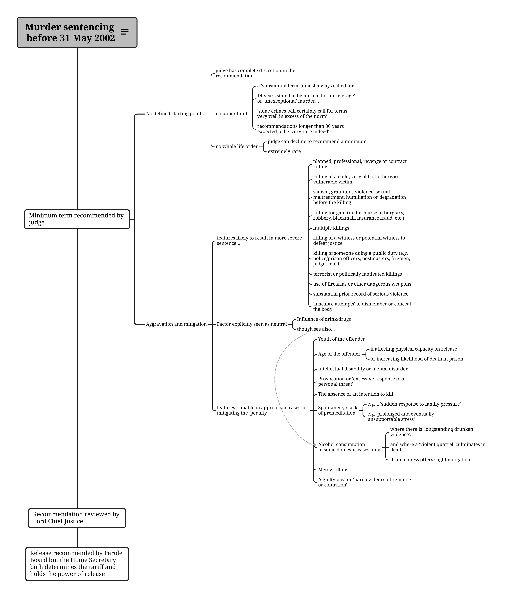
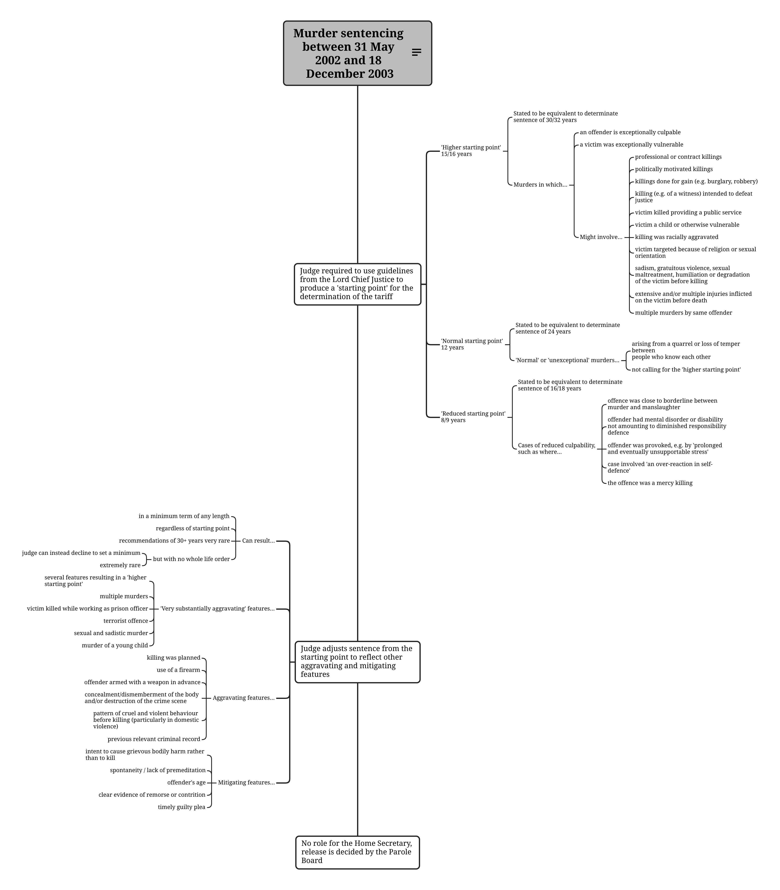
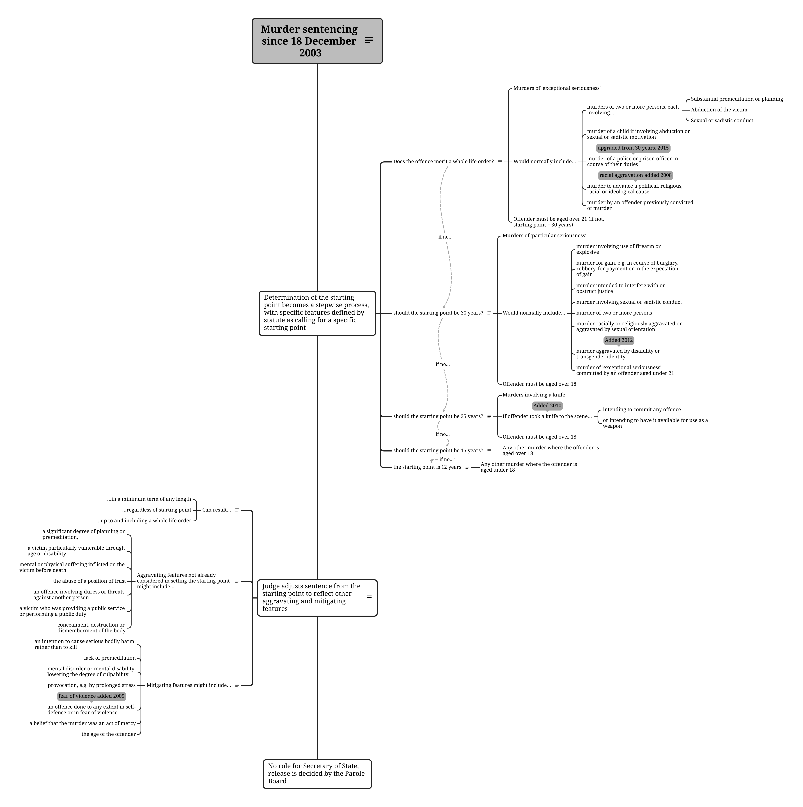

---
keywords:
  - england & wales
  - sentencing law
  - murder sentencing
  - schedule 21
  - mandatory life sentence
  - punishment
identifier-prefix: 'A.'
---

# Changes in murder sentencing since the formalisation of the 'tariff' system {.appendix #sec-apx-a}

Chapters [2](../2_literature-review.qmd) and [4](../4_becoming-a-murderer.qmd) noted that the law on sentencing murders changed from 2003, resulting in a steady and ongoing trend of sentence inflation. However, as [Chapter 4](../4_becoming-a-murderer.qmd) made clear, the underlying approach to determining culpability has remained consistent. That is, although the *penalties* increased, the *kinds of features* which aggravated or mitigated a murder, linking it to penalties of different severity, have remained similar, with some changes (required by equalities legislation) to penalise crimes motivated by hatred, and some to reflect the shrinking range of legal defences available for some kinds of intimate partner murders. This Appendix narrates how the sentencing of murders developed in three stages and summarises the sentencing regimes in effect at different times in three Figures, [-@fig-apx-sentencing-1], [-@fig-apx-sentencing-2], and [-@fig-apx-sentencing-3]. All information about the sentencing practices in effect throughout is taken from @thelawcommissionSentencingLawEngland2015 except where otherwise indicated.

## 1967 to 1983 {.appendix}

When the current life sentence for murder was created in 1967 as a mandatory replacement for the (just abolished) death penalty, the law allowed (but did not require) the Home Secretary to release lifers if the newly-created Parole Board recommended it. There was no formal tariff system, but the Home Secretary was to take advice from two sources: the judiciary, about what length of sentence would achieve the aims of punishment and deterrence in each case; and the Parole Board, about whether the prisoner posed any risk to the public. Under this system, it was possible for lifers to be kept in prison for extremely long periods, but it was not normally done.

## The 'tariff system' used from 1983 to 2002 {.appendix}

The practice of giving explicit 'tariffs' or minimum terms to life-sentenced prisoners was begun by Home Secretary Leon Brittan in 1983. The change aimed to address the concern that life-sentenced prisoners were not serving long enough in prison, and that this was discrediting the justice system. From this time on, declared Brittan, there would be a stated minimum term of imprisonment to satisfy the aims of punishment/deterrence, with the question of risk to the public only being considered after it had expired.

The Home Secretary set the tariff based on recommendations from the trial judge and the Lord Chief Justice. Brittan declared that in most cases, the Home Secretary would follow the judge's recommendations about punishment, and the Parole Board's recommendations about risk. But crucially, he[^A.1] would retain the power to make exceptions and ignore these recommendations. In practice, this almost always meant more severe penalties: extending the tariffs or preventing the release of people who were seen as especially dangerous, or whose release was thought to risk undermining public confidence in the criminal justice system. In reserving this power, Brittan and his successors were effectively retaining a veto over the release of people whose release was unusually risky or politically awkward.

[^A.1]: Every Home Secretary until Theresa May in 2010 was male.

Campaigners and lawyers saw this as a violation of the right to a fair trial: Article 6 of the European Convention on Human Rights guarantees the right to be tried by an impartial tribunal composed of members of the judiciary. Since sentencing appeared to be part of a trial process, and the Home Secretary was a politician and a member of the executive, his power to set lifers' tariffs and direct their release seemed anomalous. From the late 1980s onwards, the Home Secretary's power in this area was gradually eroded by litigation relating to the distinct kinds of life sentence, with the discretionary life sentence among the first to go. One side-effect was that the powers of the Parole Board to direct (rather than recommending) release grew. So did the power of trial judges to set (rather than recommending) a tariff.

## Human rights litigation and challenges to executive discretion over release {.appendix}

These piecemeal legal challenges culminated in 2002 with a House of Lords judgment [@AndersonApplicationSecretary2002a], in which lawyers for Anthony Anderson (who was serving a mandatory life sentence for murder) argued that the Home Secretary's tariff-setting powers were incompatible with the Human Rights Act. The judgment necessitated changes to the law for all new life sentences, as well as the review of all existing life-sentence tariffs by members of  the judiciary.

Before 2002, the judge's power to recommend a sentence had been entirely discretionary. In a statement of good practice issued in 1997 by the Lord Chief Justice, and used now as a guide for judges sentencing non-recent murders committed before 2002 [@thelawcommissionSentencingLawEngland2015, 233-4], several points are noteworthy. First, there were no defined starting points for sentences; a 14-year sentence was stated to be the norm for an 'average' or 'unexceptional' murder, but this was guidance not a strict requirement, and in fact the judge could set the tariff where he or she saw fit, based on the particular circumstances of the case. Second, the guidance suggested examples of the kinds of mitigating and aggravating factors that should be seen as relevant to deciding the culpability of different murders. These aggravating and mitigating factors would normally lead to a heavier or lighter tariff. Third, there was no 'whole life order' by which the judge could direct that the sentenced person should remain in prison for the rest of their life. The judge could, however, choose not to recommend a minimum. Effectively, this would signal to the Home Secretary that a case was so serious that release was entirely in his or her hands; but crucially it did not legislate that a convicted murderer must die in prison to satisfy the punitive requirements of the law. Fourth, the guidelines explicitly stated that there was to be no upper limit - but also said that sentences longer than 30 years were expected to be 'very rare indeed'.

These features of the practice pertaining before 2002 are shown in @fig-apx-sentencing-1. Their key feature was judicial discretion, and an expectation that very long sentences of twenty years or more should be very unusual, though not impossible. Practically, their likelihood was also reduced by the fact that the Home Secretary would be able to give detailed consideration only to unusual or high-profile cases. For most cases, as Brittan indicated, only the judge's recommendation would shape the sentence.

::: {.column-screen-inset}

{#fig-apx-sentencing-1}

:::

## Interim changes from 2002-2003 {.appendix}

For murders committed after May 2002, an interim system was put in place, pending more permanent changes to be legislated by a new Bill, which became the 2003 Criminal Justice Act. As before, this was based on guidance issued by the Lord Chief Justice, but followed a more prescriptive structure. Rather than allowing judges free rein to determine a tariff by thinking about mitigating and aggravating factors in the round, the new system set 'starting points' for murders of differing degrees of seriousness. In setting a starting point, 'seriousness' was defined in relation to the offender's culpability or the victim's vulnerability, with examples given of factors that would usually result in a 'higher' (15/16 years), 'normal' (12 years) or 'lower' (8/9 years) starting point for the tariff. It was then further adjusted upwards or downwards, using mitigating or aggravating factors not already considered by the starting point.

As @fig-apx-sentencing-2 shows, the introduction of 'starting points' lessened judicial discretion somewhat, but still left the judge to adjust the sentence from the starting point. However, the expectation of 12 years as the starting point for a 'normal' murder is not far different from the old guideline's use of 14 years as a 'rule of thumb' for 'ordinary' murders. Moreover, the mitigating and aggravating factors were little changed; there was still no whole-life order; there was still no upper limit to tariffs though the judge could decline to recommend a minimum; and sentences of more than 30 years were still expected by the Lord Chief Justice to be 'very rare indeed' [@thelawcommissionSentencingLawEngland2015, 234].

::: {.column-screen-inset}

{#fig-apx-sentencing-2}
:::

## Schedule 21 and the move towards statutory murder sentencing {.appendix}

The major changes came with the 2003 Criminal Justice Act. Schedule 21 of the Act, which has since been amended and incorporated with all other sentencing law into the 2020 Sentencing Act, remains the law on sentences for murder. It has had the intended effect of drastically increasing the tariffs of lifers sentenced for murder. In a context where government wished to appear 'tough on crime', and where the powers of the Home Secretary to increase exemplary punishments using the discretionary power to set tariffs and order releases, Schedule 21 was a way to ensure that they did not become too lenient.

Some aspects of Schedule 21 were continuous with the previous guidelines: a system of starting points for offences of different degrees of 'seriousness' was the foundation of the new regime. Two things changed. First, the starting points increased in length, drastically. For the most serious offences, the 'whole life order' was introduced. Previously it was *possible* for someone to be kept in prison for the rest of their life to protect the public, if their risk of harming others was believed to justify it; now, it was *mandatory* to imprison them for the rest of their lives if the seriousness of their offence demanded it, regardless of future risk. Just as significantly, the starting point for the most serious murders more or less doubled (from 15/16 years to 30); the starting point for a 'normal' murder went from 12 to 15 years; and that for a murder where the offender was aged under 18 was set at 12 years, previously considered the benchmark for a 'normal' murder committed by an adult. @fig-apx-sentencing-3 shows the changes brought in by Schedule 21, and marks where provisions have since been added by amendment.

::: {.column-screen-inset}

{#fig-apx-sentencing-3}

:::

Because Schedule 21 has the force of statute, there is no discretion for the judge to consider all the facts and set the sentence accordingly. Instead, murders with certain specific features were to be sentenced less flexibly, with fixed starting points and adjustments only from those points. Further amendments have been passed since: for example, in 2008, an amendment set a starting point of 25 years for murders committed by someone who took a knife to the scene of the offence; and in 2015, a whole life order was mandated for murders where the victim was a police or prison officer going about their duties.

The 2003 reforms increased the severity of sentences across the board. For example, in Swaleside lifers sentenced for murder before the 2003 Act had an average tariff of 14.4 years; for those sentenced afterwards it was 19.0 years. Punishments for murder now are as harsh as they have ever been since the death penalty was abolished in 1965.