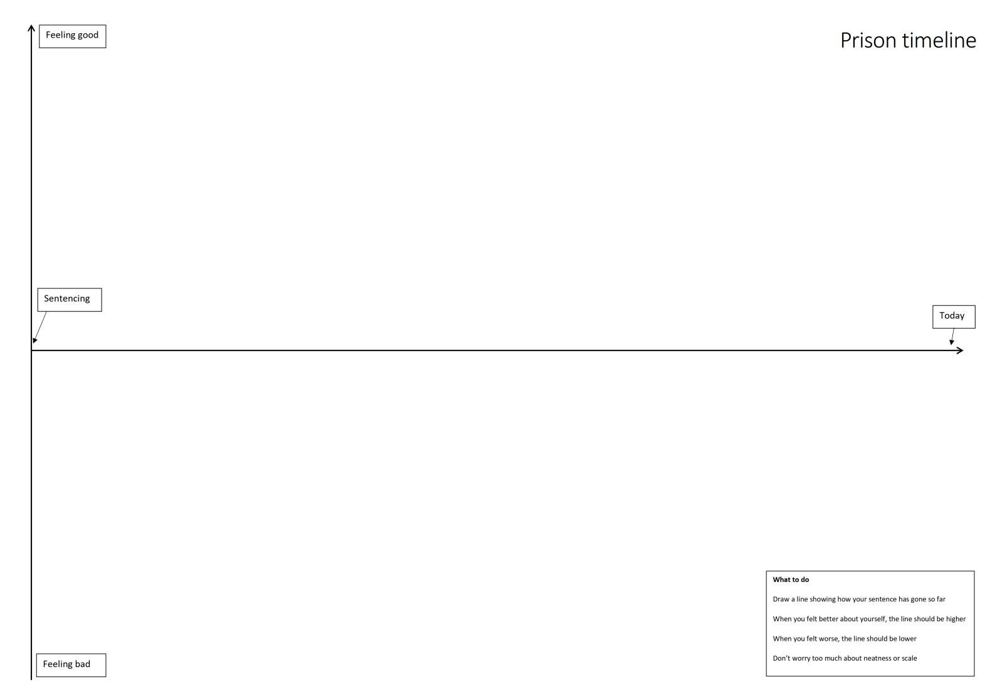
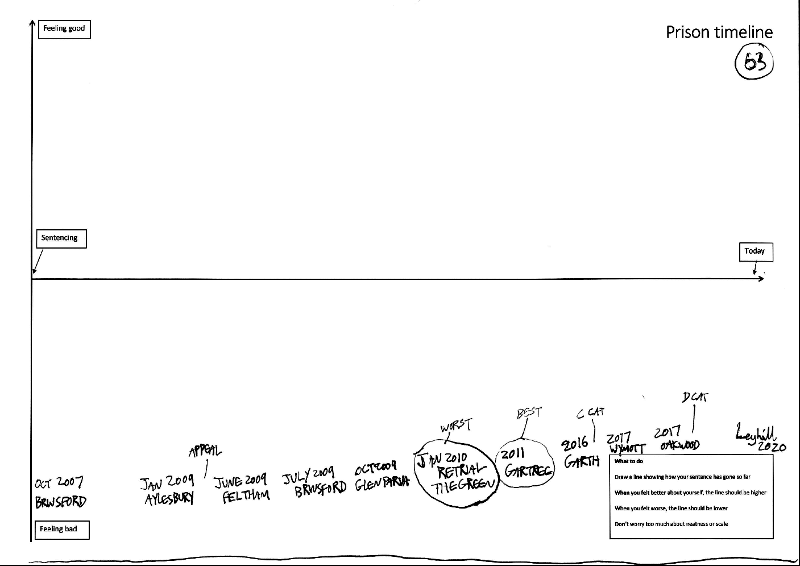
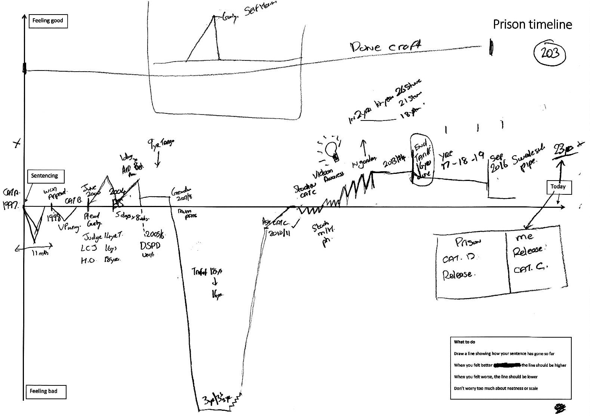

## Prison timelines {#sec-apx-c-prison-timelines .appendix}

The second (prison history) interview commenced by asking participants to use an A3 sheet marked with a set of 'axes', to give a narrative overview of the sentence to date. This was used because the interviews would be participants who had served vastly different periods of time in prison, meaning that a purely narrative interview would not be a good use of time; but I did not want the interview to be purely thematic, and instead sought some means of giving myself an overview of the 'story' of the sentence, and to sensitise myself to issues that might be interesting to probe further, for example periods in notoriously bad prisons, or in intensive risk-reducing interventions such as high-intensity therapeutic units.

The template (@fig-apx-timeline-1), as well as soliciting a chronological account of participants' prison trajectories, also asked them to link the experiences they were describing to descriptions of whether they were 'feeling good' (marked by drawing a line higher up the page), or 'feeling bad' (marked lower down the page). In introducing the exercise at the start of the interview I always drew three examples on the back of the paper to demonstrate the idea, narrating hypothetical examples based on syntheses of other participants' sentence narratives.

{#fig-apx-timeline-1}

The timeline was used very differently by different prisoners. In some cases, it was completed in a matter of seconds, and the idea of marking times that 'felt bad' or 'felt good' was rejected or ignored, as though ridiculous. @fig-apx-timeline-2 shows one such example; here, the participant said that all prison experiences were bad experiences, and simply listed (verbally and in writing) the prisons where he had served his time. In cases such as these, it was as though the participant was resisting the idea that prison time could be meaningful at all, although not all of these 'minimalist' timelines described universally negative experiences: a couple of men, including one who was in the Late stage of the sentence, completed the page similarly quickly and said that they had found the sentence consistently easy, interesting, or even "enjoyable".

{#fig-apx-timeline-2}

In most cases, however, the participants took to the exercise readily, immediately grasping the notion that one's experiences fluctuated in prison, and could be narrated to imbue them with biographical meaning. @fig-apx-timeline-3 is the most 'maximal' of these; the author, a post-tariff man in his fifties at Swaleside who was the first man in the entire PhD who I did the second interview with, spent two and a half hours drawing the line a centimetre or so at a time, and then annotating and explaining it in depth, interspersed with my questions. By the end of this we had barely any time left for the interview schedule, though we had also covered nearly all the topics I had been intending to ask about.

{#fig-apx-timeline-3}

The exercise demonstrated something useful to me, which was that some prisoners were far readier to narrate prison time as meaningful, whereas others were specifically resistant to doing so. Tellingly, nearly all the men who did not want to describe meaningful 'ups and downs' were also those who maintained innocence to some degree. This recalls the finding of @groundsUnderstandingEffectsWrongful2005 that imprisonment experienced as wrongful imposes a highly consequential rupture in biographical meaning.